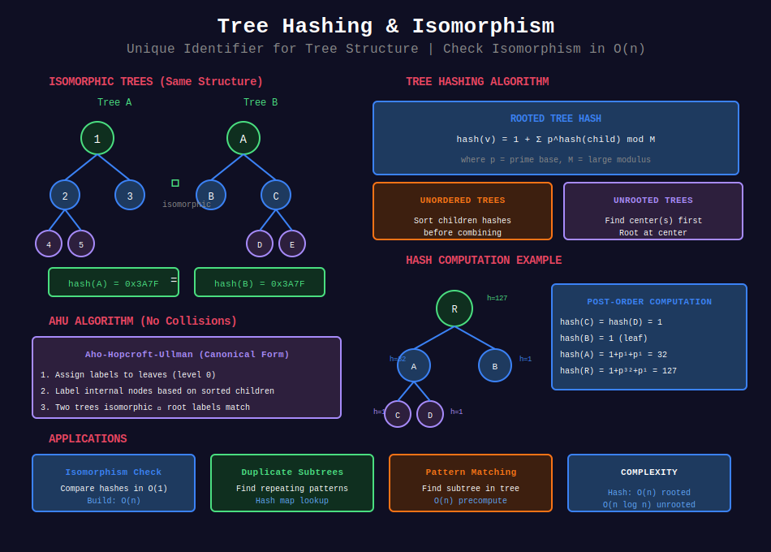

<div align="center">

# 🔐 Tree Hashing & Isomorphism

<p>
  
  
</p>

</div>

---

## 🧭 Navigation

| ⬅️ Previous | 📂 Current | ➡️ Next |
|:------------|:----------:|--------:|
| [← 08. Virtual Trees](../08_virtual_trees/README.md) | **09. Tree Hashing** | [10. Link-Cut Trees →](../10_link_cut_trees/README.md) |

---

## 📊 Visual Overview

<div align="center">

</div>

---

## 📐 Mathematical Foundations

### 1️⃣ Tree Isomorphism

**Isomorphic trees:** Trees with same structure (bijection preserving edges).

**Problem:** Given two trees, check if isomorphic.

**Naive:** $O(n!)$ - try all mappings  
**Hashing:** $O(n)$ - compare hash values

---

### 2️⃣ Tree Hashing

**Tree hash:** Unique identifier for tree structure.

**Properties:**

- **Deterministic:** Same tree → same hash

- **Fast:** $O(n)$ to compute

- **Collision-resistant:** Different trees → (likely) different hashes

**Application:** Quickly check if two trees are isomorphic.

---

### 3️⃣ Rooted Tree Hashing

**For rooted tree:**

```math
\text{hash}(v) = \text{combine}(\text{hash}(\text{child}_1), \text{hash}(\text{child}_2), \ldots)

```

**Common formula:**

```math
\text{hash}(v) = 1 + \sum_{c \in \text{children}(v)} p^{\text{hash}(c)}

```

where $p$ is a large prime.

**Time:** $O(n)$ - post-order DFS

---

### 4️⃣ Unrooted Tree Hashing

**For unrooted tree:** Need consistent root.

**Solution:**
1. Find **center(s)** of tree (1 or 2 nodes)
2. Root at center(s)
3. Compute hash

**Center:** Node minimizing maximum distance to any leaf.

---

### 5️⃣ AHU Algorithm

**Aho, Hopcroft, Ullman algorithm** for tree isomorphism:

1. Assign labels to leaves (level 0)
2. Iteratively label internal nodes based on children
3. Two trees isomorphic iff root labels match

**Time:** $O(n \log n)$ due to sorting

---

### 6️⃣ Subtree Matching

**Problem:** Find all occurrences of pattern tree in larger tree.

**Solution:**
1. Hash all subtrees
2. Hash pattern
3. Find matching hashes

**Time:** $O(n)$ for hashing + $O(n)$ for matching

---

## 💻 Code Implementations

```python
from typing import List, Optional, Tuple
from collections import defaultdict, deque
import hashlib

class TreeNode:
    def __init__(self, val=0, left=None, right=None):
        self.val = val
        self.left = left
        self.right = right

class TreeHashing:
    """
    Tree hashing for isomorphism checking and pattern matching.
    """
    
    def __init__(self, MOD=10**9 + 7, BASE=31):
        self.MOD = MOD
        self.BASE = BASE
    
    def hash_rooted_tree(self, root: Optional[TreeNode]) -> int:
        """
        Hash a rooted binary tree.
        
        Time: O(n), Space: O(h)
        """
        if not root:
            return 0
        
        left_hash = self.hash_rooted_tree(root.left)
        right_hash = self.hash_rooted_tree(root.right)
        
        # Combine hashes: ensure left and right are commutative if order doesn't matter
        # For ordered trees:
        result = (1 + left_hash * self.BASE + right_hash * self.BASE * self.BASE) % self.MOD
        
        return result
    
    def hash_unordered_tree(self, root: Optional[TreeNode]) -> int:
        """
        Hash tree where children order doesn't matter.
        
        Sort children hashes to make order-independent.
        
        Time: O(n log n), Space: O(n)
        """
        if not root:
            return 0
        
        child_hashes = []
        if root.left:
            child_hashes.append(self.hash_unordered_tree(root.left))
        if root.right:
            child_hashes.append(self.hash_unordered_tree(root.right))
        
        # Sort to make order-independent
        child_hashes.sort()
        
        result = 1
        for h in child_hashes:
            result = (result * self.BASE + h) % self.MOD
        
        return result
    
    def are_isomorphic_rooted(self, root1: Optional[TreeNode], 
                             root2: Optional[TreeNode]) -> bool:
        """
        Check if two rooted trees are isomorphic.
        
        Time: O(n), Space: O(h)
        """
        return self.hash_rooted_tree(root1) == self.hash_rooted_tree(root2)

class UnrootedTreeHashing:
    """
    Hashing for general (unrooted) trees.
    """
    
    def __init__(self, n: int, edges: List[List[int]]):
        self.n = n
        self.graph = defaultdict(list)
        for u, v in edges:
            self.graph[u].append(v)
            self.graph[v].append(u)
        
        self.MOD = 10**9 + 7
        self.BASE = 31
    
    def find_center(self) -> List[int]:
        """
        Find center(s) of tree.
        
        Center: node with minimum eccentricity.
        Tree has 1 or 2 centers.
        
        Time: O(n), Space: O(n)
        """
        if self.n == 1:
            return [0]
        
        # Compute degree
        degree = [len(self.graph[i]) for i in range(self.n)]
        leaves = deque([i for i in range(self.n) if degree[i] == 1])
        
        remaining = self.n
        while remaining > 2:
            new_leaves = []
            while leaves:
                leaf = leaves.popleft()
                remaining -= 1
                
                for neighbor in self.graph[leaf]:
                    degree[neighbor] -= 1
                    if degree[neighbor] == 1:
                        new_leaves.append(neighbor)
            
            leaves = deque(new_leaves)
        
        return list(leaves) if leaves else [0]
    
    def hash_subtree(self, u: int, parent: int, memo: dict) -> int:
        """
        Hash subtree rooted at u with parent.
        
        Time: O(n log n) due to sorting, Space: O(n)
        """
        if (u, parent) in memo:
            return memo[(u, parent)]
        
        child_hashes = []
        for v in self.graph[u]:
            if v != parent:
                child_hashes.append(self.hash_subtree(v, u, memo))
        
        # Sort for order-independent hashing
        child_hashes.sort()
        
        result = 1
        for h in child_hashes:
            result = (result * self.BASE + h) % self.MOD
        
        memo[(u, parent)] = result
        return result
    
    def hash_tree(self) -> int:
        """
        Hash the entire unrooted tree.
        
        Uses center as root for consistency.
        
        Time: O(n log n), Space: O(n)
        """
        centers = self.find_center()
        memo = {}
        
        if len(centers) == 1:
            # Single center
            return self.hash_subtree(centers[0], -1, memo)
        else:
            # Two centers: hash both directions and combine
            h1 = self.hash_subtree(centers[0], centers[1], memo)
            h2 = self.hash_subtree(centers[1], centers[0], memo)
            
            # Combine in sorted order for consistency
            return (min(h1, h2) * self.BASE + max(h1, h2)) % self.MOD

def are_trees_isomorphic(n1: int, edges1: List[List[int]], 
                        n2: int, edges2: List[List[int]]) -> bool:
    """
    Check if two unrooted trees are isomorphic.
    
    Time: O(n log n), Space: O(n)
    """
    if n1 != n2:
        return False
    
    h1 = UnrootedTreeHashing(n1, edges1).hash_tree()
    h2 = UnrootedTreeHashing(n2, edges2).hash_tree()
    
    return h1 == h2

class SubtreePatternMatching:
    """
    Find all occurrences of pattern tree in larger tree.
    """
    
    def __init__(self, n: int, edges: List[List[int]]):
        self.n = n
        self.graph = defaultdict(list)
        for u, v in edges:
            self.graph[u].append(v)
            self.graph[v].append(u)
        
        self.MOD = 10**9 + 7
        self.BASE = 31
        self.subtree_hashes = {}
    
    def compute_all_subtree_hashes(self, root: int = 0):
        """
        Precompute hashes of all subtrees.
        
        Time: O(n), Space: O(n)
        """
        def dfs(u: int, parent: int) -> int:
            child_hashes = []
            for v in self.graph[u]:
                if v != parent:
                    child_hashes.append(dfs(v, u))
            
            # Sort for consistency
            child_hashes.sort()
            
            h = 1
            for ch in child_hashes:
                h = (h * self.BASE + ch) % self.MOD
            
            self.subtree_hashes[u] = h
            return h
        
        dfs(root, -1)
    
    def find_pattern(self, pattern_hash: int) -> List[int]:
        """
        Find all nodes whose subtree matches pattern.
        
        Returns list of matching node IDs.
        
        Time: O(n), Space: O(n)
        """
        matches = []
        for node, h in self.subtree_hashes.items():
            if h == pattern_hash:
                matches.append(node)
        return matches

# ============= AHU Algorithm =============

class AHU_TreeIsomorphism:
    """
    Aho-Hopcroft-Ullman algorithm for tree isomorphism.
    
    More robust than hashing (no collisions).
    """
    
    def __init__(self, n: int, edges: List[List[int]]):
        self.n = n
        self.graph = defaultdict(list)
        for u, v in edges:
            self.graph[u].append(v)
            self.graph[v].append(u)
    
    def canonical_form(self) -> str:
        """
        Compute canonical form (unique string representation).
        
        Time: O(n log n), Space: O(n)
        """
        # Find centers
        centers = self._find_centers()
        
        if len(centers) == 1:
            return self._encode_tree(centers[0], -1)
        else:
            # Two centers: pick canonical one
            s1 = self._encode_tree(centers[0], centers[1])
            s2 = self._encode_tree(centers[1], centers[0])
            return min(s1, s2)
    
    def _find_centers(self) -> List[int]:
        """Find tree center(s)."""
        if self.n == 1:
            return [0]
        
        degree = [len(self.graph[i]) for i in range(self.n)]
        leaves = deque([i for i in range(self.n) if degree[i] == 1])
        
        remaining = self.n
        while remaining > 2:
            new_leaves = []
            while leaves:
                leaf = leaves.popleft()
                remaining -= 1
                
                for neighbor in self.graph[leaf]:
                    degree[neighbor] -= 1
                    if degree[neighbor] == 1:
                        new_leaves.append(neighbor)
            
            leaves = deque(new_leaves)
        
        return list(leaves)
    
    def _encode_tree(self, u: int, parent: int) -> str:
        """
        Encode subtree as canonical string.
        
        Uses parentheses notation with sorted children.
        """
        child_encodings = []
        for v in self.graph[u]:
            if v != parent:
                child_encodings.append(self._encode_tree(v, u))
        
        # Sort children encodings
        child_encodings.sort()
        
        return "(" + "".join(child_encodings) + ")"

def check_isomorphic_ahu(n1: int, edges1: List[List[int]], 
                        n2: int, edges2: List[List[int]]) -> bool:
    """
    Check tree isomorphism using AHU algorithm (no collisions).
    
    Time: O(n log n), Space: O(n)
    """
    if n1 != n2:
        return False
    
    ahu1 = AHU_TreeIsomorphism(n1, edges1)
    ahu2 = AHU_TreeIsomorphism(n2, edges2)
    
    return ahu1.canonical_form() == ahu2.canonical_form()

# ============= Example Usage =============

def example_binary_tree_hashing():
    """Example: Hash binary trees"""
    # Tree 1:    1
    #           / \
    #          2   3
    root1 = TreeNode(1, TreeNode(2), TreeNode(3))
    
    # Tree 2:    1
    #           / \
    #          3   2  (different structure due to order)
    root2 = TreeNode(1, TreeNode(3), TreeNode(2))
    
    hasher = TreeHashing()
    
    h1 = hasher.hash_rooted_tree(root1)
    h2 = hasher.hash_rooted_tree(root2)
    
    print(f"Tree 1 hash: {h1}")
    print(f"Tree 2 hash: {h2}")
    print(f"Are they isomorphic (ordered)? {h1 == h2}")
    
    # Unordered hashing
    h1_unordered = hasher.hash_unordered_tree(root1)
    h2_unordered = hasher.hash_unordered_tree(root2)
    
    print(f"\nUnordered hashes:")
    print(f"Tree 1: {h1_unordered}")
    print(f"Tree 2: {h2_unordered}")
    print(f"Are they isomorphic (unordered)? {h1_unordered == h2_unordered}")

def example_general_tree_isomorphism():
    """Example: Check isomorphism of general trees"""
    # Tree 1
    n1 = 5
    edges1 = [[0, 1], [0, 2], [1, 3], [1, 4]]
    
    # Tree 2 (isomorphic)
    n2 = 5
    edges2 = [[0, 1], [0, 2], [2, 3], [2, 4]]
    
    result = are_trees_isomorphic(n1, edges1, n2, edges2)
    print(f"Are trees isomorphic? {result}")

```

---

## 🏆 Related LeetCode Problems

### 🟡 Medium

| # | Problem | Pattern | Time | Space |
|:-:|---------|---------|:----:|:-----:|
| 951 | [Flip Equivalent Binary Trees](https://leetcode.com/problems/flip-equivalent-binary-trees/) | Tree isomorphism | O(n) | O(h) |
| 652 | [Find Duplicate Subtrees](https://leetcode.com/problems/find-duplicate-subtrees/) | Subtree hashing | O(n) | O(n) |

### 🔴 Hard

| # | Problem | Pattern | Time | Space |
|:-:|---------|---------|:----:|:-----:|
| 2458 | [Height of Binary Tree After Subtree Removal](https://leetcode.com/problems/height-of-binary-tree-after-subtree-removal-queries/) | Tree hashing | O(n) | O(n) |

---

## 📊 When to Use Tree Hashing

```
Tree Comparison Problem
     |
     +-- Check if two trees identical
     |   +-- Hash both → Compare in O(1)
     |
     +-- Find duplicate subtrees
     |   +-- Hash all subtrees → Use hash map
     |
     +-- Pattern matching in tree
         +-- Hash pattern → Find matching subtrees

```

---

## 🎯 Key Insights

1. **Tree hash** identifies structure uniquely (probabilistically)
2. **Post-order DFS** computes hash in O(n)
3. **Unrooted trees** need center-based rooting
4. **AHU algorithm** for collision-free isomorphism
5. **Hashing useful** for duplicate detection

---

## 📚 References

| Resource | Link |
|----------|------|
| **Tree Isomorphism** | [Wikipedia](https://en.wikipedia.org/wiki/Tree_isomorphism_problem) |
| **AHU Algorithm** | [Paper](https://dl.acm.org/doi/10.1145/321850.321852) |
| **Tree Hashing** | [CP-Algorithms](https://cp-algorithms.com/) |

---

<div align="center">

**Made with ❤️ by [Gaurav Goswami](https://github.com/Gaurav14cs17)**

</div>

---

## 🧭 Navigation

| ⬅️ Previous | 📂 Current | ➡️ Next |
|:------------|:----------:|--------:|
| [← 08. Virtual Trees](../08_virtual_trees/README.md) | **09. Tree Hashing** | [10. Link-Cut Trees →](../10_link_cut_trees/README.md) |

