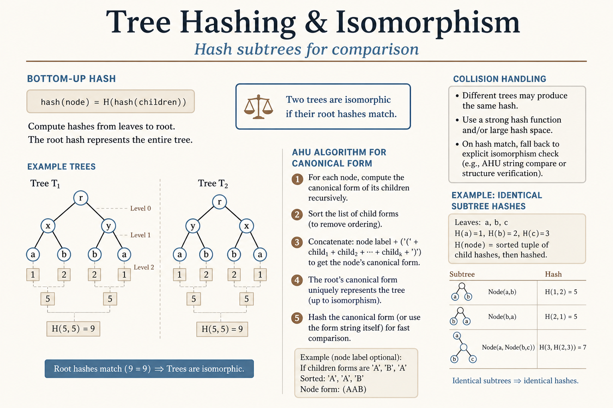
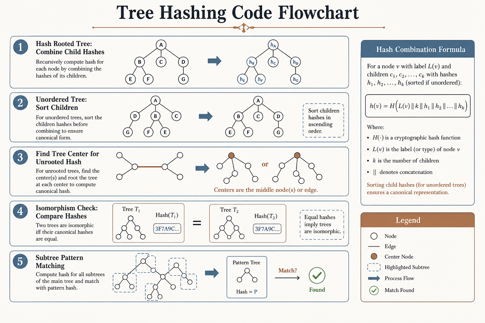
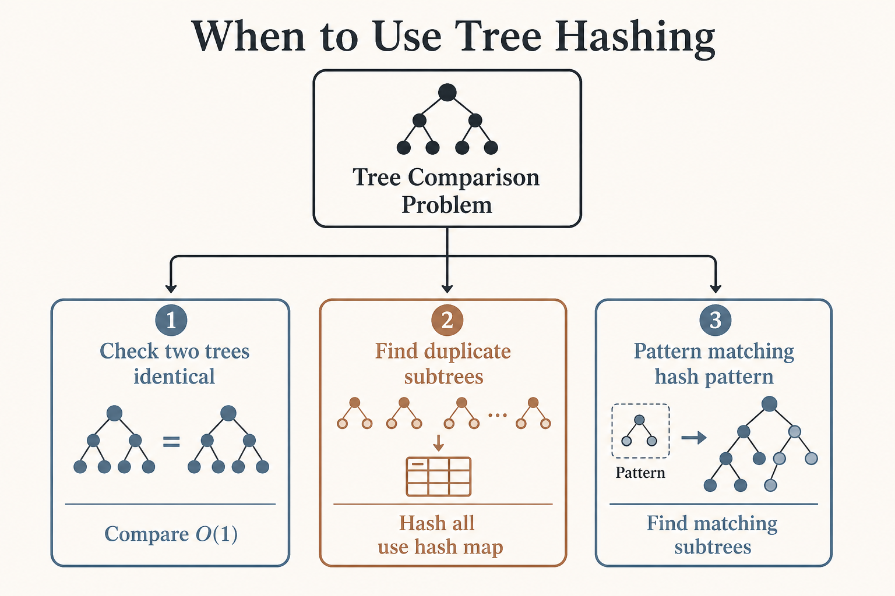

# 🔐 Tree Hashing & Isomorphism

### *Tree Hashing & Isomorphism*

  
  

---

## 📊 Visual Overview

---

## 🎯 At a Glance

| | |
|:---|:---|
| **Difficulty** | Medium to Hard |
| **Problems** | 6+ |

> **How to use this page:** Start with the visual overview, scan **At a Glance**, then work through theory → walkthroughs → code.

---

## 🧭 Navigation

| ⬅️ Previous | 📂 Current | ➡️ Next |
|:------------|:----------:|--------:|
| [← 08. Virtual Trees](../08_virtual_trees/README.md) | **09. Tree Hashing** | [10. Link-Cut Trees →](../10_link_cut_trees/README.md) |

---

## 📐 Mathematical Foundation
### 1️⃣ Tree Isomorphism

**Isomorphic trees:** Trees with same structure (bijection preserving edges).

**Problem:** Given two trees, check if isomorphic.

**Naive:** $O(n!)$ - try all mappings  
**Hashing:** $O(n)$ - compare hash values

---

### 2️⃣ Tree Hashing

**Tree hash:** Unique identifier for tree structure.

**Properties:**

- **Deterministic:** Same tree → same hash

- **Fast:** $O(n)$ to compute

- **Collision-resistant:** Different trees → (likely) different hashes

**Application:** Quickly check if two trees are isomorphic.

---

### 3️⃣ Rooted Tree Hashing

**For rooted tree:**

$$\text{hash}(v) = \text{combine}(\text{hash}(\text{child}_1), \text{hash}(\text{child}_2), \ldots)$$

**Common formula:**

$$\text{hash}(v) = 1 + \sum_{c \in \text{children}(v)} p^{\text{hash}(c)}$$

where $p$ is a large prime.

**Time:** $O(n)$ - post-order DFS

---

### 4️⃣ Unrooted Tree Hashing

**For unrooted tree:** Need consistent root.

**Solution:**

1. Find **center(s)** of tree (1 or 2 nodes)

2. Root at center(s)

3. Compute hash

**Center:** Node minimizing maximum distance to any leaf.

---

### 5️⃣ AHU Algorithm

**Aho, Hopcroft, Ullman algorithm** for tree isomorphism:

1. Assign labels to leaves (level 0)

2. Iteratively label internal nodes based on children

3. Two trees isomorphic iff root labels match

**Time:** $O(n \log n)$ due to sorting

---

### 6️⃣ Subtree Matching

**Problem:** Find all occurrences of pattern tree in larger tree.

**Solution:**

1. Hash all subtrees

2. Hash pattern

3. Find matching hashes

**Time:** $O(n)$ for hashing + $O(n)$ for matching

---

## 💻 Code Implementations

---

## 🏆 Related LeetCode Problems

### 🟡 Medium

| # | Problem | Pattern | Time | Space |
|:-:|---------|---------|:----:|:-----:|
| 951 | [Flip Equivalent Binary Trees](https://leetcode.com/problems/flip-equivalent-binary-trees/) | Tree isomorphism | O(n) | O(h) |
| 652 | [Find Duplicate Subtrees](https://leetcode.com/problems/find-duplicate-subtrees/) | Subtree hashing | O(n) | O(n) |

### 🔴 Hard

| # | Problem | Pattern | Time | Space |
|:-:|---------|---------|:----:|:-----:|
| 2458 | [Height of Binary Tree After Subtree Removal](https://leetcode.com/problems/height-of-binary-tree-after-subtree-removal-queries/) | Tree hashing | O(n) | O(n) |

---

## 📊 When to Use Tree Hashing

---

## 🎯 Key Insights

1. **Tree hash** identifies structure uniquely (probabilistically)

2. **Post-order DFS** computes hash in O(n)

3. **Unrooted trees** need center-based rooting

4. **AHU algorithm** for collision-free isomorphism

5. **Hashing useful** for duplicate detection

---

## 📚 References

| Resource | Link |
|----------|------|
| **Tree Isomorphism** | [Wikipedia](https://en.wikipedia.org/wiki/Tree_isomorphism_problem) |
| **AHU Algorithm** | [Paper](https://dl.acm.org/doi/10.1145/321850.321852) |
| **Tree Hashing** | [CP-Algorithms](https://cp-algorithms.com/) |

---

**Made with ❤️ by [Gaurav Goswami](https://github.com/Gaurav14cs17)**

---
