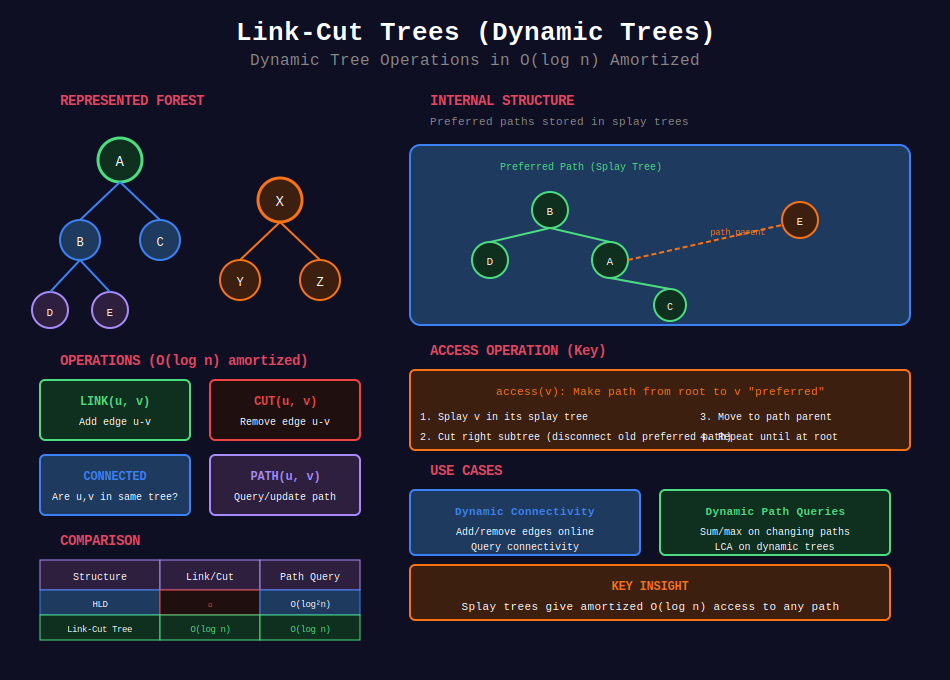

<div align="center">

# 🔗 Link-Cut Trees (Dynamic Trees)

<p>
  
  
</p>

</div>

---

## 🧭 Navigation

| ⬅️ Previous | 📂 Current | ➡️ Next |
|:------------|:----------:|--------:|
| [← 09. Tree Hashing](../09_tree_hashing/README.md) | **10. Link-Cut Trees** | [11. Mo's Algorithm →](../11_mos_algorithm_trees/README.md) |

---

## 📊 Visual Overview

<div align="center">

</div>

---

## 📐 Mathematical Foundations

### 1️⃣ Dynamic Tree Problem

**Static tree:** Fixed structure  
**Dynamic tree:** Can change structure (add/remove edges)

**Operations needed:**
- Link(u, v): Add edge

- Cut(u, v): Remove edge  

- Path queries: Sum, max, min on path

- Update: Change node/edge value

**Naive:** O(n) per operation  
**Link-Cut Tree:** O(log n) amortized

---

### 2️⃣ Link-Cut Tree Structure

**Preferred paths:** Decompose tree into disjoint paths.

**Representation:** Each path stored in a **splay tree**.

**Properties:**
- Each node in exactly one splay tree

- Splay trees form virtual tree

- O(log n) access to any path

---

### 3️⃣ Operations

| Operation | Description | Amortized Time |
|-----------|-------------|:--------------:|
| **MakeRoot(v)** | Make v the root | O(log n) |
| **Link(u, v)** | Add edge u-v | O(log n) |
| **Cut(u, v)** | Remove edge u-v | O(log n) |
| **FindRoot(v)** | Find root of v's tree | O(log n) |
| **Path(u, v)** | Query path from u to v | O(log n) |

---

### 4️⃣ Access Operation

**Access(v):** Bring v to root of its splay tree.

**Steps:**
1. Splay v in its current tree
2. Cut right subtree (becomes separate path)
3. Move up to parent path, repeat

**Key:** Makes path from root to v preferred.

---

### 5️⃣ Applications

| Problem | Without LCT | With LCT |
|---------|:-----------:|:--------:|
| **Dynamic connectivity** | O(n) | O(log n) |
| **Dynamic LCA** | O(n) | O(log n) |
| **Path aggregates** | O(n) | O(log n) |
| **Link/cut queries** | O(n) | O(log n) |

---

### 6️⃣ Comparison with Other Structures

| Structure | Link/Cut | Path Query | Static/Dynamic |
|-----------|:--------:|:----------:|:--------------:|
| **Segment Tree** | ✗ | O(log n) | Static |
| **HLD** | ✗ | O(log² n) | Static |
| **Link-Cut Tree** | O(log n) | O(log n) | **Dynamic** |

---

## 💻 Code Implementations

```python
from typing import Optional

class Node:
    """Node in Link-Cut Tree."""
    
    def __init__(self, key, value=0):
        self.key = key
        self.value = value  # Node value
        self.sum = value    # Aggregate (sum of path)
        
        self.parent: Optional[Node] = None
        self.left: Optional[Node] = None
        self.right: Optional[Node] = None
        
        self.reversed = False  # Lazy reverse flag

class LinkCutTree:
    """
    Link-Cut Tree (Dynamic Tree) implementation.
    
    Supports:
    - Link/cut edges in O(log n) amortized
    - Path queries/updates in O(log n) amortized
    - Dynamic connectivity queries
    """
    
    def __init__(self):
        self.nodes = {}
    
    def make_node(self, key, value=0) -> Node:
        """Create a new node."""
        node = Node(key, value)
        self.nodes[key] = node
        return node
    
    def _is_root(self, node: Node) -> bool:
        """Check if node is root of its splay tree."""
        if not node.parent:
            return True
        return node.parent.left != node and node.parent.right != node
    
    def _push(self, node: Node):
        """Push down lazy flags."""
        if node.reversed:
            # Swap children
            node.left, node.right = node.right, node.left
            
            # Propagate reverse flag
            if node.left:
                node.left.reversed = not node.left.reversed
            if node.right:
                node.right.reversed = not node.right.reversed
            
            node.reversed = False
    
    def _update(self, node: Node):
        """Update aggregate values."""
        node.sum = node.value
        if node.left:
            node.sum += node.left.sum
        if node.right:
            node.sum += node.right.sum
    
    def _rotate(self, node: Node):
        """Rotate node up (zig or zag)."""
        parent = node.parent
        grandparent = parent.parent if parent else None
        
        if parent.left == node:
            # Right rotation
            parent.left = node.right
            if node.right:
                node.right.parent = parent
            node.right = parent
        else:
            # Left rotation
            parent.right = node.left
            if node.left:
                node.left.parent = parent
            node.left = parent
        
        node.parent = grandparent
        parent.parent = node
        
        if grandparent:
            if grandparent.left == parent:
                grandparent.left = node
            elif grandparent.right == parent:
                grandparent.right = node
        
        self._update(parent)
        self._update(node)
    
    def _splay(self, node: Node):
        """Splay node to root of its auxiliary tree."""
        while not self._is_root(node):
            parent = node.parent
            grandparent = parent.parent if parent else None
            
            if self._is_root(parent):
                # Zig step
                self._push(parent)
                self._push(node)
                self._rotate(node)
            else:
                # Zig-zig or zig-zag
                self._push(grandparent)
                self._push(parent)
                self._push(node)
                
                if (grandparent.left == parent) == (parent.left == node):
                    # Zig-zig
                    self._rotate(parent)
                    self._rotate(node)
                else:
                    # Zig-zag
                    self._rotate(node)
                    self._rotate(node)
    
    def _access(self, node: Node):
        """
        Make path from root to node preferred.
        
        Key operation: brings node to root of auxiliary tree.
        """
        self._splay(node)
        node.right = None  # Cut off right subtree
        self._update(node)
        
        while node.parent:
            parent = node.parent
            self._splay(parent)
            parent.right = node
            self._update(parent)
            self._splay(node)
    
    def make_root(self, node: Node):
        """Make node the root of its represented tree."""
        self._access(node)
        node.reversed = not node.reversed
    
    def link(self, u_key, v_key):
        """
        Add edge between u and v.
        
        Precondition: u and v in different trees.
        
        Time: O(log n) amortized
        """
        u = self.nodes[u_key]
        v = self.nodes[v_key]
        
        self.make_root(u)
        u.parent = v
    
    def cut(self, u_key, v_key):
        """
        Remove edge between u and v.
        
        Precondition: edge (u, v) exists.
        
        Time: O(log n) amortized
        """
        u = self.nodes[u_key]
        v = self.nodes[v_key]
        
        self.make_root(u)
        self._access(v)
        
        # v is now root of auxiliary tree, u is leftmost
        if v.left == u and not u.right:
            v.left = None
            u.parent = None
            self._update(v)
    
    def connected(self, u_key, v_key) -> bool:
        """
        Check if u and v are in same tree.
        
        Time: O(log n) amortized
        """
        u = self.nodes[u_key]
        v = self.nodes[v_key]
        
        self._access(u)
        self._access(v)
        
        return u.parent is not None or u == v
    
    def find_root(self, node: Node) -> Node:
        """
        Find root of node's represented tree.
        
        Time: O(log n) amortized
        """
        self._access(node)
        
        # Move to leftmost node
        while node.left:
            self._push(node)
            node = node.left
        
        self._splay(node)
        return node
    
    def path_aggregate(self, u_key, v_key) -> int:
        """
        Query aggregate (sum) on path from u to v.
        
        Time: O(log n) amortized
        """
        u = self.nodes[u_key]
        v = self.nodes[v_key]
        
        self.make_root(u)
        self._access(v)
        
        return v.sum

# ============= Simplified Interface =============

class DynamicTree:
    """
    Simplified interface for Link-Cut Tree.
    
    For dynamic connectivity and path queries.
    """
    
    def __init__(self, n: int, values: list = None):
        """
        Initialize n nodes.
        
        Args:
            n: number of nodes (0 to n-1)
            values: optional initial values
        """
        self.lct = LinkCutTree()
        self.n = n
        
        for i in range(n):
            val = values[i] if values else 0
            self.lct.make_node(i, val)
    
    def link(self, u: int, v: int):
        """Add edge between u and v."""
        self.lct.link(u, v)
    
    def cut(self, u: int, v: int):
        """Remove edge between u and v."""
        self.lct.cut(u, v)
    
    def connected(self, u: int, v: int) -> bool:
        """Check if u and v are connected."""
        return self.lct.connected(u, v)
    
    def path_sum(self, u: int, v: int) -> int:
        """Get sum of values on path from u to v."""
        return self.lct.path_aggregate(u, v)

# ============= Applications =============

def dynamic_connectivity_queries(n: int, operations: list) -> list:
    """
    Handle dynamic connectivity queries.
    
    operations[i] = ('link', u, v) or ('cut', u, v) or ('connected', u, v)
    
    Time: O(q log n) for q operations
    """
    dt = DynamicTree(n)
    results = []
    
    for op in operations:
        if op[0] == 'link':
            dt.link(op[1], op[2])
        elif op[0] == 'cut':
            dt.cut(op[1], op[2])
        elif op[0] == 'connected':
            results.append(dt.connected(op[1], op[2]))
    
    return results

# ============= Example Usage =============

def example_dynamic_tree():
    """Example: Dynamic tree operations"""
    n = 5
    dt = DynamicTree(n, values=[1, 2, 3, 4, 5])
    
    # Build initial tree: 0-1-2, 3-4
    dt.link(0, 1)
    dt.link(1, 2)
    dt.link(3, 4)
    
    print("Initial structure:")
    print(f"  0 and 2 connected? {dt.connected(0, 2)}")  # True
    print(f"  0 and 3 connected? {dt.connected(0, 3)}")  # False
    
    # Link two components
    dt.link(2, 3)
    print("\nAfter linking 2-3:")
    print(f"  0 and 4 connected? {dt.connected(0, 4)}")  # True
    
    # Path query
    print(f"  Path sum 0 to 4: {dt.path_sum(0, 4)}")  # 1+2+3+4+5 = 15
    
    # Cut edge
    dt.cut(1, 2)
    print("\nAfter cutting 1-2:")
    print(f"  0 and 2 connected? {dt.connected(0, 2)}")  # False

```

---

## 🏆 Related LeetCode Problems

### 🔴 Hard

| # | Problem | Pattern | Time | Space |
|:-:|---------|---------|:----:|:-----:|
| 1697 | [Checking Existence of Edge Length Limited Paths](https://leetcode.com/problems/checking-existence-of-edge-length-limited-paths/) | Dynamic connectivity | O(q log n) | O(n) |

---

## 📊 When to Use Link-Cut Trees

```
Dynamic Tree Problem
     |
     +-- Need to add/remove edges? → Link-Cut Tree
     |
     +-- Path queries on changing tree? → Link-Cut Tree
     |
     +-- Dynamic connectivity? → Link-Cut Tree or DSU
     |
     +-- Static tree? → Use simpler structures (HLD, binary lifting)

```

---

## 🎯 Key Insights

1. **Link-Cut Trees** handle dynamic tree topology
2. **O(log n) amortized** for all operations
3. **Based on splay trees** - self-adjusting BSTs
4. **Complex but powerful** - use only when needed
5. **Alternative:** Euler Tour Trees (similar complexity)

---

## 📚 References

| Resource | Link |
|----------|------|
| **Link-Cut Trees** | [Paper by Sleator & Tarjan](https://www.cs.cmu.edu/~sleator/papers/dynamic-trees.pdf) |
| **Tutorial** | [Codeforces](https://codeforces.com/blog/entry/75885) |
| **Visualization** | [UIUC Slides](https://courses.engr.illinois.edu/cs473/sp2020/notes/18-linkcut.pdf) |

---

<div align="center">

**Made with ❤️ by [Gaurav Goswami](https://github.com/Gaurav14cs17)**

</div>

---

## 🧭 Navigation

| ⬅️ Previous | 📂 Current | ➡️ Next |
|:------------|:----------:|--------:|
| [← 09. Tree Hashing](../09_tree_hashing/README.md) | **10. Link-Cut Trees** | [11. Mo's Algorithm →](../11_mos_algorithm_trees/README.md) |

