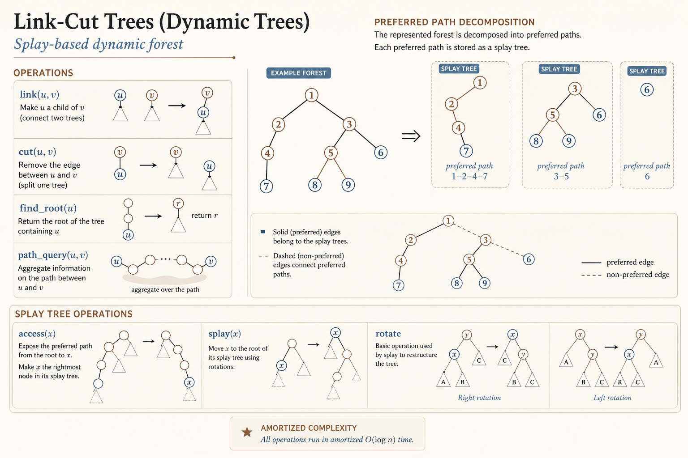
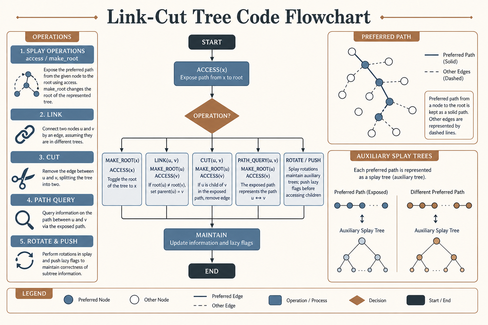
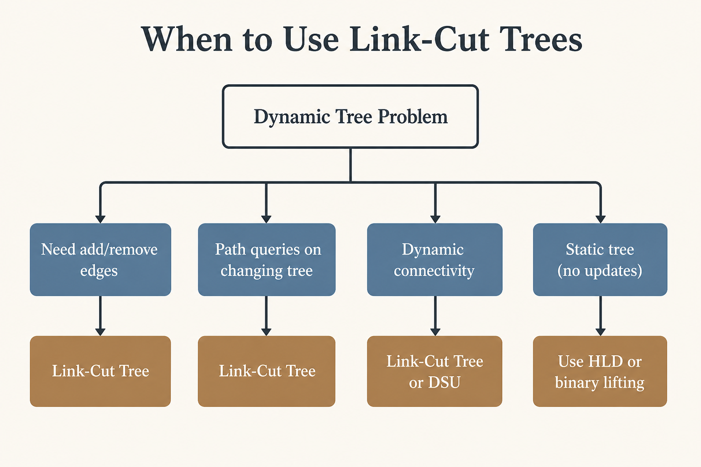

# 🔗 Link-Cut Trees (Dynamic Trees)

### *Link-Cut Trees (Dynamic Trees)*

  
  

---

## 📊 Visual Overview

---

## 🎯 At a Glance

| | |
|:---|:---|
| **Difficulty** | Very Hard |
| **Problems** | 5+ |

{: .highlight }
> **How to use this page:** Start with the visual overview, scan **At a Glance**, then work through theory → walkthroughs → code.

---

## 🧭 Navigation

| ⬅️ Previous | 📂 Current | ➡️ Next |
|:------------|:----------:|--------:|
| [← 09. Tree Hashing](../09_tree_hashing/README.md) | **10. Link-Cut Trees** | [11. Mo's Algorithm →](../11_mos_algorithm_trees/README.md) |

---

## 📐 Mathematical Foundation
### 1️⃣ Dynamic Tree Problem

**Static tree:** Fixed structure  
**Dynamic tree:** Can change structure (add/remove edges)

**Operations needed:**

- Link(u, v): Add edge

- Cut(u, v): Remove edge  

- Path queries: Sum, max, min on path

- Update: Change node/edge value

**Naive:** O(n) per operation  
**Link-Cut Tree:** O(log n) amortized

---

### 2️⃣ Link-Cut Tree Structure

**Preferred paths:** Decompose tree into disjoint paths.

**Representation:** Each path stored in a **splay tree**.

**Properties:**

- Each node in exactly one splay tree

- Splay trees form virtual tree

- O(log n) access to any path

---

### 3️⃣ Operations

| Operation | Description | Amortized Time |
|-----------|-------------|:--------------:|
| **MakeRoot(v)** | Make v the root | O(log n) |
| **Link(u, v)** | Add edge u-v | O(log n) |
| **Cut(u, v)** | Remove edge u-v | O(log n) |
| **FindRoot(v)** | Find root of v's tree | O(log n) |
| **Path(u, v)** | Query path from u to v | O(log n) |

---

### 4️⃣ Access Operation

**Access(v):** Bring v to root of its splay tree.

**Steps:**

1. Splay v in its current tree

2. Cut right subtree (becomes separate path)

3. Move up to parent path, repeat

**Key:** Makes path from root to v preferred.

---

### 5️⃣ Applications

| Problem | Without LCT | With LCT |
|---------|:-----------:|:--------:|
| **Dynamic connectivity** | O(n) | O(log n) |
| **Dynamic LCA** | O(n) | O(log n) |
| **Path aggregates** | O(n) | O(log n) |
| **Link/cut queries** | O(n) | O(log n) |

---

### 6️⃣ Comparison with Other Structures

| Structure | Link/Cut | Path Query | Static/Dynamic |
|-----------|:--------:|:----------:|:--------------:|
| **Segment Tree** | ✗ | O(log n) | Static |
| **HLD** | ✗ | O(log² n) | Static |
| **Link-Cut Tree** | O(log n) | O(log n) | **Dynamic** |

---

## 💻 Code Implementations

---

## 🏆 Related LeetCode Problems

### 🔴 Hard

| # | Problem | Pattern | Time | Space |
|:-:|---------|---------|:----:|:-----:|
| 1697 | [Checking Existence of Edge Length Limited Paths](https://leetcode.com/problems/checking-existence-of-edge-length-limited-paths/) | Dynamic connectivity | O(q log n) | O(n) |

---

## 📊 When to Use Link-Cut Trees

---

## 🎯 Key Insights

1. **Link-Cut Trees** handle dynamic tree topology

2. **O(log n) amortized** for all operations

3. **Based on splay trees** - self-adjusting BSTs

4. **Complex but powerful** - use only when needed

5. **Alternative:** Euler Tour Trees (similar complexity)

---

## 📚 References

| Resource | Link |
|----------|------|
| **Link-Cut Trees** | [Paper by Sleator & Tarjan](https://www.cs.cmu.edu/~sleator/papers/dynamic-trees.pdf) |
| **Tutorial** | [Codeforces](https://codeforces.com/blog/entry/75885) |
| **Visualization** | [UIUC Slides](https://courses.engr.illinois.edu/cs473/sp2020/notes/18-linkcut.pdf) |

---

**Made with ❤️ by [Gaurav Goswami](https://github.com/Gaurav14cs17)**

---
