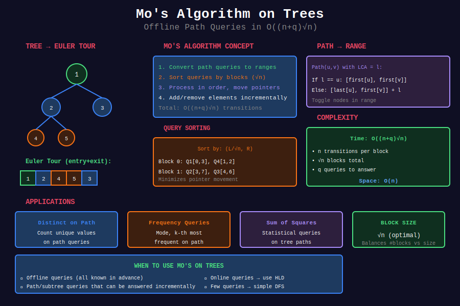

<div align="center">

# 📊 Mo's Algorithm on Trees

<p>
  
  
</p>

</div>

---

## 🧭 Navigation

| ⬅️ Previous | 📂 Current | ➡️ Next |
|:------------|:----------:|--------:|
| [← 10. Link-Cut Trees](../10_link_cut_trees/README.md) | **11. Mo's Algorithm** | [🏠 Home](../README.md) |

---

## 📊 Visual Overview

<div align="center">

</div>

---

## 📐 Mathematical Foundations

### 1️⃣ Mo's Algorithm Review

**Original Mo's Algorithm:** Offline range queries on array.

**Key idea:** Order queries to minimize pointer movement.

**Complexity:** $O((n + q) \sqrt{n})$ for $q$ queries

---

### 2️⃣ Extension to Trees

**Problem:** Answer queries on tree paths.

**Challenge:** Tree paths aren't contiguous in memory.

**Solution:** Flatten tree using Euler tour, then apply Mo's.

---

### 3️⃣ Euler Tour Flattening

**Record each node twice** (entry and exit):

```
DFS: 0 → 1 → 2 → 1 → 0 → 3 → 0
Tour: [0, 1, 2, 1, 0, 3, 0]
```

**Path from $u$ to $v$:**
- Convert to ranges in Euler tour
- Use LCA to split into two ranges

---

### 4️⃣ Path Decomposition

**Path $(u, v)$ with LCA $l$:**
- Range 1: $[\text{first}[u], \text{first}[l]]$
- Range 2: $[\text{first}[l], \text{first}[v]]$

**Combine ranges** to get path coverage.

---

### 5️⃣ Complexity Analysis

**Time:** $O((n + q) \sqrt{n})$
- $O(n)$ preprocessing
- $O(q \sqrt{n})$ for sorted queries
- $O(n \sqrt{n})$ for transitions

**Space:** $O(n)$

---

### 6️⃣ Block Size Selection

**Optimal block size:** $\sqrt{n}$

**Intuition:**
- Too large: many queries per block
- Too small: many blocks to process

---

## 💻 Code Implementations

```python
from typing import List, Tuple
from collections import defaultdict
import math

class MoOnTree:
    """
    Mo's Algorithm on Trees for path queries.
    
    Efficiently handles offline path queries in O((n+q)√n).
    """
    
    def __init__(self, n: int, edges: List[List[int]], root: int = 0):
        """
        Initialize Mo's algorithm for tree.
        
        Args:
            n: number of nodes (0 to n-1)
            edges: list of [u, v] edges
            root: root node
        """
        self.n = n
        self.root = root
        self.BLOCK_SIZE = int(math.sqrt(n)) + 1
        
        # Build adjacency list
        self.graph = defaultdict(list)
        for u, v in edges:
            self.graph[u].append(v)
            self.graph[v].append(u)
        
        # Euler tour
        self.euler = []
        self.first = [0] * n
        self.last = [0] * n
        self.depth = [0] * n
        self.parent = [-1] * n
        
        # LCA preprocessing
        self.LOG = math.ceil(math.log2(n)) + 1
        self.up = [[-1] * self.LOG for _ in range(n)]
        
        self.timer = 0
        
        # Build structures
        self._dfs(root, -1, 0)
        
        # Build binary lifting for LCA
        for k in range(1, self.LOG):
            for v in range(n):
                if self.up[v][k - 1] != -1:
                    self.up[v][k] = self.up[self.up[v][k - 1]][k - 1]
    
    def _dfs(self, u: int, p: int, d: int):
        """DFS to build Euler tour and compute depths."""
        self.parent[u] = p
        self.depth[u] = d
        self.up[u][0] = p
        
        self.first[u] = self.timer
        self.euler.append(u)
        self.timer += 1
        
        for v in self.graph[u]:
            if v != p:
                self._dfs(v, u, d + 1)
                self.euler.append(u)
                self.timer += 1
        
        self.last[u] = self.timer - 1
    
    def lca(self, u: int, v: int) -> int:
        """Find LCA using binary lifting."""
        if self.depth[u] < self.depth[v]:
            u, v = v, u
        
        # Bring to same level
        diff = self.depth[u] - self.depth[v]
        for k in range(self.LOG):
            if (diff >> k) & 1:
                u = self.up[u][k]
        
        if u == v:
            return u
        
        # Binary search
        for k in range(self.LOG - 1, -1, -1):
            if self.up[u][k] != self.up[v][k]:
                u = self.up[u][k]
                v = self.up[v][k]
        
        return self.up[u][0]
    
    def get_path_range(self, u: int, v: int) -> Tuple[int, int, int]:
        """
        Get Euler tour range for path u to v.
        
        Returns (left, right, lca) where:
        - [left, right] covers path
        - lca is LCA of u and v
        """
        if self.first[u] > self.first[v]:
            u, v = v, u
        
        lca_node = self.lca(u, v)
        
        if lca_node == u:
            # u is ancestor of v
            return self.first[u], self.first[v], u
        else:
            # General case
            return self.last[u], self.first[v], lca_node
    
    def process_queries(self, queries: List[Tuple[int, int]], 
                       values: List[int]) -> List[int]:
        """
        Process path queries using Mo's algorithm.
        
        Args:
            queries: list of (u, v) path queries
            values: node values
        
        Returns:
            List of query answers (distinct values on path)
        
        Time: O((n+q)√n), Space: O(n)
        """
        # Convert to range queries with LCA info
        range_queries = []
        for i, (u, v) in enumerate(queries):
            left, right, lca_node = self.get_path_range(u, v)
            range_queries.append((left, right, lca_node, i))
        
        # Sort queries by Mo's order
        range_queries.sort(key=lambda q: (q[0] // self.BLOCK_SIZE, q[1]))
        
        # Process queries
        answers = [0] * len(queries)
        freq = defaultdict(int)
        distinct_count = 0
        visited = [False] * self.n
        
        def add(node: int):
            """Add node to current answer."""
            nonlocal distinct_count
            if visited[node]:
                # Remove
                freq[values[node]] -= 1
                if freq[values[node]] == 0:
                    distinct_count -= 1
                visited[node] = False
            else:
                # Add
                if freq[values[node]] == 0:
                    distinct_count += 1
                freq[values[node]] += 1
                visited[node] = True
        
        curr_l = 0
        curr_r = -1
        
        for left, right, lca_node, query_idx in range_queries:
            # Expand/shrink range
            while curr_r < right:
                curr_r += 1
                add(self.euler[curr_r])
            
            while curr_r > right:
                add(self.euler[curr_r])
                curr_r -= 1
            
            while curr_l < left:
                add(self.euler[curr_l])
                curr_l += 1
            
            while curr_l > left:
                curr_l -= 1
                add(self.euler[curr_l])
            
            # Add LCA if not already in range
            if lca_node != -1:
                add(lca_node)
            
            answers[query_idx] = distinct_count
            
            # Remove LCA for next query
            if lca_node != -1:
                add(lca_node)
        
        return answers


def count_distinct_on_paths(n: int, edges: List[List[int]], 
                           colors: List[int], 
                           queries: List[Tuple[int, int]]) -> List[int]:
    """
    Count distinct colors on each queried path.
    
    Using Mo's algorithm on trees.
    
    Time: O((n+q)√n), Space: O(n)
    """
    mo = MoOnTree(n, edges)
    return mo.process_queries(queries, colors)


# ============= Alternative: Simple Flattening =============

class SimpleMoTree:
    """
    Simplified Mo's on tree using start/end times only.
    
    Works for subtree queries (simpler than path queries).
    """
    
    def __init__(self, n: int, edges: List[List[int]], root: int = 0):
        self.n = n
        self.BLOCK_SIZE = int(math.sqrt(n)) + 1
        
        self.graph = defaultdict(list)
        for u, v in edges:
            self.graph[u].append(v)
            self.graph[v].append(u)
        
        self.start_time = [0] * n
        self.end_time = [0] * n
        self.timer = 0
        
        self._dfs(root, -1)
    
    def _dfs(self, u: int, parent: int):
        """DFS to compute start/end times."""
        self.start_time[u] = self.timer
        self.timer += 1
        
        for v in self.graph[u]:
            if v != parent:
                self._dfs(v, u)
        
        self.end_time[u] = self.timer - 1
    
    def process_subtree_queries(self, queries: List[int], 
                                values: List[int]) -> List[int]:
        """
        Process subtree queries (count distinct in subtree).
        
        Args:
            queries: list of root nodes for subtree queries
            values: node values
        
        Returns:
            List of distinct counts for each subtree
        
        Time: O((n+q)√n), Space: O(n)
        """
        # Convert to range queries
        range_queries = []
        for i, root in enumerate(queries):
            left = self.start_time[root]
            right = self.end_time[root]
            range_queries.append((left, right, i))
        
        # Sort by Mo's order
        range_queries.sort(key=lambda q: (q[0] // self.BLOCK_SIZE, q[1]))
        
        # Process queries
        answers = [0] * len(queries)
        freq = defaultdict(int)
        distinct_count = 0
        
        def add(value: int):
            nonlocal distinct_count
            if freq[value] == 0:
                distinct_count += 1
            freq[value] += 1
        
        def remove(value: int):
            nonlocal distinct_count
            freq[value] -= 1
            if freq[value] == 0:
                distinct_count -= 1
        
        curr_l = 0
        curr_r = -1
        flattened = []
        
        # Flatten tree in DFS order
        def flatten_dfs(u: int, parent: int):
            flattened.append(values[u])
            for v in self.graph[u]:
                if v != parent:
                    flatten_dfs(v, u)
        
        flatten_dfs(0, -1)
        
        for left, right, query_idx in range_queries:
            while curr_r < right:
                curr_r += 1
                add(flattened[curr_r])
            
            while curr_r > right:
                remove(flattened[curr_r])
                curr_r -= 1
            
            while curr_l < left:
                remove(flattened[curr_l])
                curr_l += 1
            
            while curr_l > left:
                curr_l -= 1
                add(flattened[curr_l])
            
            answers[query_idx] = distinct_count
        
        return answers


# ============= Example Usage =============

def example_mo_on_tree():
    """Example: Count distinct colors on paths"""
    n = 7
    edges = [[0, 1], [0, 2], [1, 3], [1, 4], [2, 5], [2, 6]]
    colors = [1, 2, 3, 1, 2, 3, 1]
    
    queries = [
        (3, 5),  # Path from 3 to 5
        (4, 6),  # Path from 4 to 6
        (3, 4),  # Path from 3 to 4
    ]
    
    results = count_distinct_on_paths(n, edges, colors, queries)
    
    print("Distinct colors on paths:")
    for (u, v), count in zip(queries, results):
        print(f"  Path {u} to {v}: {count} distinct colors")
```

---

## 🏆 Related LeetCode Problems

### 🔴 Hard

| # | Problem | Pattern | Time | Space |
|:-:|---------|---------|:----:|:-----:|
| 1157 | [Online Majority Element](https://leetcode.com/problems/online-majority-element-in-subarray/) | Mo's on array | O(n√n) | O(n) |

---

## 📊 When to Use Mo's on Trees

```
Tree Query Problem
     │
     ├── Offline queries? (all known in advance)
     │   └── Many path/subtree queries
     │       └── Can't be decomposed easily
     │           → Mo's Algorithm O((n+q)√n)
     │
     ├── Online queries?
     │   └── Use HLD or other online structures
     │
     └── Few queries?
         └── Simple DFS per query may be better
```

---

## 🎯 Key Insights

1. **Flatten tree** using Euler tour
2. **Convert path queries** to range queries
3. **Sort queries** by Mo's order (block + endpoint)
4. **Process in sorted order** with add/remove pointers
5. **Complexity O((n+q)√n)** - good for many offline queries

---

## 📚 References

| Resource | Link |
|----------|------|
| **Mo's Algorithm** | [CP-Algorithms](https://cp-algorithms.com/data_structures/sqrt_decomposition.html) |
| **Mo's on Trees** | [Codeforces Tutorial](https://codeforces.com/blog/entry/43230) |
| **Blog** | [GeeksforGeeks](https://www.geeksforgeeks.org/mos-algorithm-query-square-root-decomposition/) |

---

<div align="center">

**Made with ❤️ by [Gaurav Goswami](https://github.com/Gaurav14cs17)**

</div>

---

## 🧭 Navigation

| ⬅️ Previous | 📂 Current | ➡️ Next |
|:------------|:----------:|--------:|
| [← 10. Link-Cut Trees](../10_link_cut_trees/README.md) | **11. Mo's Algorithm** | [🏠 Home](../README.md) |

