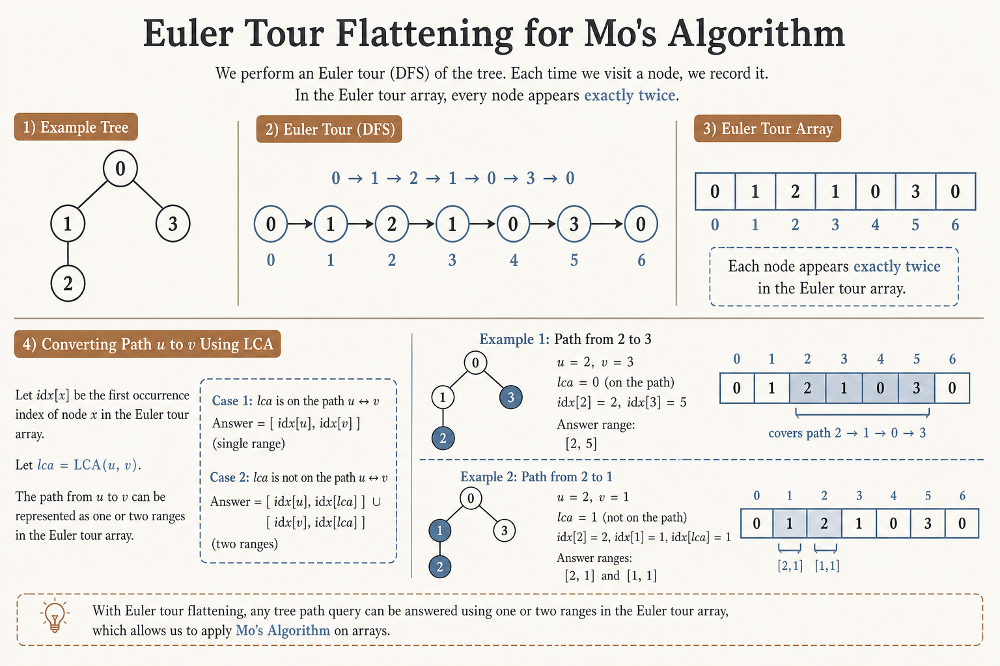
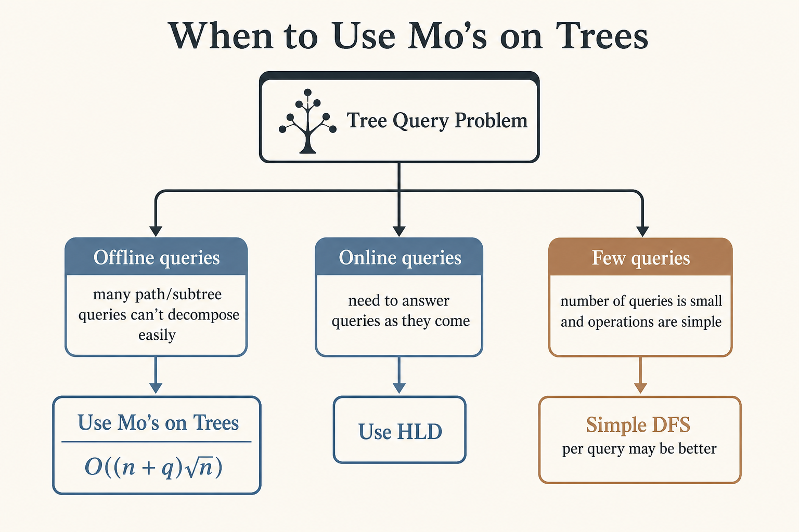

# 📊 Mo's Algorithm on Trees

### *Mo's Algorithm on Trees*

  
  

---

## 📊 Visual Overview

---

## 🎯 At a Glance

| | |
|:---|:---|
| **Difficulty** | Hard |
| **Problems** | 4+ |

{: .highlight }
> **How to use this page:** Start with the visual overview, scan **At a Glance**, then work through theory → walkthroughs → code.

---

## 🧭 Navigation

| ⬅️ Previous | 📂 Current | ➡️ Next |
|:------------|:----------:|--------:|
| [← 10. Link-Cut Trees](../10_link_cut_trees/README.md) | **11. Mo's Algorithm** | [🏠 Home](../README.md) |

---

## 📐 Mathematical Foundation
### 1️⃣ Mo's Algorithm Review

**Original Mo's Algorithm:** Offline range queries on array.

**Key idea:** Order queries to minimize pointer movement.

**Complexity:** $O((n + q) \sqrt{n})$ for $q$ queries

---

### 2️⃣ Extension to Trees

**Problem:** Answer queries on tree paths.

**Challenge:** Tree paths aren't contiguous in memory.

**Solution:** Flatten tree using Euler tour, then apply Mo's.

---

### 3️⃣ Euler Tour Flattening

**Record each node twice** (entry and exit):

**Path from $u$ to $v$:**

- Convert to ranges in Euler tour

- Use LCA to split into two ranges

---

### 4️⃣ Path Decomposition

**Path $(u, v)$ with LCA $l$:**

- Range 1: $[\text{first}[u], \text{first}[l]]$

- Range 2: $[\text{first}[l], \text{first}[v]]$

**Combine ranges** to get path coverage.

---

### 5️⃣ Complexity Analysis

**Time:** $O((n + q) \sqrt{n})$

- $O(n)$ preprocessing

- $O(q \sqrt{n})$ for sorted queries

- $O(n \sqrt{n})$ for transitions

**Space:** $O(n)$

---

### 6️⃣ Block Size Selection

**Optimal block size:** $\sqrt{n}$

**Intuition:**

- Too large: many queries per block

- Too small: many blocks to process

---

## 💻 Code Implementations

---

## 🏆 Related LeetCode Problems

### 🔴 Hard

| # | Problem | Pattern | Time | Space |
|:-:|---------|---------|:----:|:-----:|
| 1157 | [Online Majority Element](https://leetcode.com/problems/online-majority-element-in-subarray/) | Mo's on array | O(n√n) | O(n) |

---

## 📊 When to Use Mo's on Trees

---

## 🎯 Key Insights

1. **Flatten tree** using Euler tour

2. **Convert path queries** to range queries

3. **Sort queries** by Mo's order (block + endpoint)

4. **Process in sorted order** with add/remove pointers

5. **Complexity O((n+q)√n)** - good for many offline queries

---

## 📚 References

| Resource | Link |
|----------|------|
| **Mo's Algorithm** | [CP-Algorithms](https://cp-algorithms.com/data_structures/sqrt_decomposition.html) |
| **Mo's on Trees** | [Codeforces Tutorial](https://codeforces.com/blog/entry/43230) |
| **Blog** | [GeeksforGeeks](https://www.geeksforgeeks.org/mos-algorithm-query-square-root-decomposition/) |

---

**Made with ❤️ by [Gaurav Goswami](https://github.com/Gaurav14cs17)**

---
