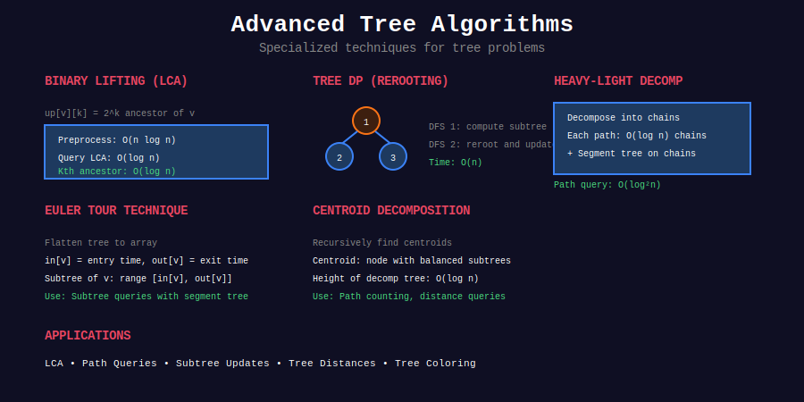

# 🌲 Tree Algorithms

  
  
  

**Advanced tree algorithms and techniques**

[⬅️ Previous: Graph Algorithms](../24_graph_algorithms/README.md) | [🏠 Home](../README.md) | [Next: Sweep Line ➡️](../26_sweep_line/README.md)

---

## 📋 Overview

Comprehensive collection of **advanced tree algorithms** including LCA, Tree DP, HLD, Centroid Decomposition, DSU on Tree, Virtual Trees, Tree Hashing, Link-Cut Trees, and more.

---

## 📂 Subtopics

<table>
<tr>
<td width="25%">

### [01. LCA](./01_lowest_common_ancestor/)
- Binary Lifting
- Euler Tour + RMQ
- Sparse Table
- K-th Ancestor

</td>
<td width="25%">

### [02. Tree DP](./02_tree_dp/)
- Subtree DP
- Rerooting technique
- Multi-state DP
- Path problems

</td>
<td width="25%">

### [03. Construction](./03_tree_construction/)
- Build from traversals
- Serialize/Deserialize
- BST construction

</td>
<td width="25%">

### [04. HLD](./04_heavy_light_decomposition/)
- Heavy-Light Decomposition
- Path queries O(log² n)
- Subtree queries

</td>
</tr>
<tr>
<td width="25%">

### [05. Centroid Decomp](./05_centroid_decomposition/)
- Centroid finding
- Path counting
- Distance queries

</td>
<td width="25%">

### [06. DSU on Tree](./06_dsu_on_tree/)
- Small to Large
- Subtree queries
- Color counting

</td>
<td width="25%">

### [07. Euler Tour](./07_euler_tour/)
- Tree flattening
- Range queries
- Ancestor checking

</td>
<td width="25%">

### [08. Virtual Trees](./08_virtual_trees/)
- Auxiliary trees
- Compress to k nodes
- Steiner tree

</td>
</tr>
<tr>
<td width="33%">

### [09. Tree Hashing](./09_tree_hashing/)
- Tree isomorphism
- AHU algorithm
- Pattern matching

</td>
<td width="33%">

### [10. Link-Cut Trees](./10_link_cut_trees/)
- Dynamic trees
- Link/cut edges
- Path queries O(log n)

</td>
<td width="33%">

### [11. Mo's Algorithm](./11_mos_algorithm_trees/)
- Offline path queries
- O((n+q)√n)
- Euler tour based

</td>
</tr>
</table>

---

## 🏆 Must-Do Problems

### 🟢 Easy
| Problem | Link |
|---------|------|
| Maximum Depth | [LeetCode 104](https://leetcode.com/problems/maximum-depth-of-binary-tree/) |
| Same Tree | [LeetCode 100](https://leetcode.com/problems/same-tree/) |
| Symmetric Tree | [LeetCode 101](https://leetcode.com/problems/symmetric-tree/) |
| Invert Binary Tree | [LeetCode 226](https://leetcode.com/problems/invert-binary-tree/) |
| Path Sum | [LeetCode 112](https://leetcode.com/problems/path-sum/) |

### 🟡 Medium
| Problem | Link |
|---------|------|
| LCA Binary Tree | [LeetCode 236](https://leetcode.com/problems/lowest-common-ancestor-of-a-binary-tree/) |
| Binary Tree Cameras | [LeetCode 968](https://leetcode.com/problems/binary-tree-cameras/) |
| House Robber III | [LeetCode 337](https://leetcode.com/problems/house-robber-iii/) |
| Sum Root to Leaf Numbers | [LeetCode 129](https://leetcode.com/problems/sum-root-to-leaf-numbers/) |
| Path Sum III | [LeetCode 437](https://leetcode.com/problems/path-sum-iii/) |
| Flatten Binary Tree | [LeetCode 114](https://leetcode.com/problems/flatten-binary-tree-to-linked-list/) |
| Binary Tree Right Side | [LeetCode 199](https://leetcode.com/problems/binary-tree-right-side-view/) |

### 🔴 Hard
| Problem | Link |
|---------|------|
| Binary Tree Max Path Sum | [LeetCode 124](https://leetcode.com/problems/binary-tree-maximum-path-sum/) |
| Serialize/Deserialize | [LeetCode 297](https://leetcode.com/problems/serialize-and-deserialize-binary-tree/) |
| Vertical Order Traversal | [LeetCode 987](https://leetcode.com/problems/vertical-order-traversal-of-a-binary-tree/) |
| Count Nodes in Complete Tree | [LeetCode 222](https://leetcode.com/problems/count-complete-tree-nodes/) |

---

[⬅️ Previous: Graph Algorithms](../24_graph_algorithms/README.md) | [🏠 Home](../README.md) | [Next: Sweep Line ➡️](../26_sweep_line/README.md)

