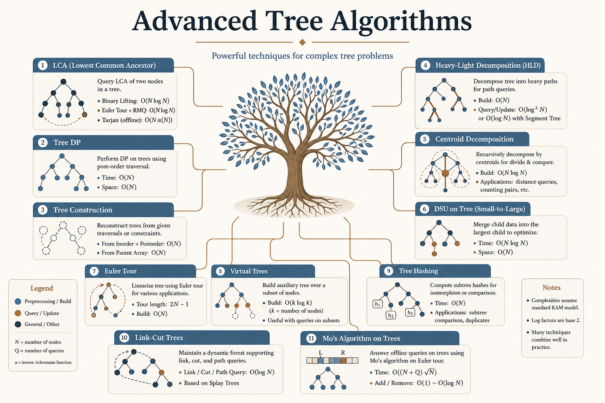

# 🌲 Tree Algorithms

### *Advanced tree algorithms and techniques*

  
  
  

**Advanced tree algorithms and techniques**

[⬅️ Previous: Graph Algorithms](../24_graph_algorithms/README.md) | [🏠 Home](../README.md) | [Next: Sweep Line ➡️](../26_sweep_line/README.md)

---

## 📊 Visual Overview

*Tree Algorithms Overview*

---

## 🎯 At a Glance

| | |
|:---|:---|
| **In one line** | Advanced tree algorithms and techniques |
| **Difficulty** | Medium to Hard |
| **Subtopics** | 11 |
| **Problems** | 70+ |

> **How to use this page:** Start with the visual overview, scan **At a Glance**, then work through theory → walkthroughs → code.

---

## 📂 Subtopics

<table>
<tr>
<td width="25%">

### [01. LCA](./01_lowest_common_ancestor/)

- Binary Lifting

- Euler Tour + RMQ

- Sparse Table

- K-th Ancestor

</td>
<td width="25%">

### [02. Tree DP](./02_tree_dp/)

- Subtree DP

- Rerooting technique

- Multi-state DP

- Path problems

</td>
<td width="25%">

### [03. Construction](./03_tree_construction/)

- Build from traversals

- Serialize/Deserialize

- BST construction

</td>
<td width="25%">

### [04. HLD](./04_heavy_light_decomposition/)

- Heavy-Light Decomposition

- Path queries O(log² n)

- Subtree queries

</td>
</tr>
<tr>
<td width="25%">

### [05. Centroid Decomp](./05_centroid_decomposition/)

- Centroid finding

- Path counting

- Distance queries

</td>
<td width="25%">

### [06. DSU on Tree](./06_dsu_on_tree/)

- Small to Large

- Subtree queries

- Color counting

</td>
<td width="25%">

### [07. Euler Tour](./07_euler_tour/)

- Tree flattening

- Range queries

- Ancestor checking

</td>
<td width="25%">

### [08. Virtual Trees](./08_virtual_trees/)

- Auxiliary trees

- Compress to k nodes

- Steiner tree

</td>
</tr>
<tr>
<td width="33%">

### [09. Tree Hashing](./09_tree_hashing/)

- Tree isomorphism

- AHU algorithm

- Pattern matching

</td>
<td width="33%">

### [10. Link-Cut Trees](./10_link_cut_trees/)

- Dynamic trees

- Link/cut edges

- Path queries O(log n)

</td>
<td width="33%">

### [11. Mo's Algorithm](./11_mos_algorithm_trees/)

- Offline path queries

- O((n+q)√n)

- Euler tour based

</td>
</tr>
</table>

---

## 📋 Overview

Comprehensive collection of **advanced tree algorithms** including LCA, Tree DP, HLD, Centroid Decomposition, DSU on Tree, Virtual Trees, Tree Hashing, Link-Cut Trees, and more.

---

## 🏆 LeetCode Problems

### 🟢 Easy

| # | Problem | Pattern | Time | Space |
|:-:|---------|---------|:----:|:-----:|
| 104 | [Maximum Depth of Binary Tree](https://leetcode.com/problems/maximum-depth-of-binary-tree/) | DFS depth | O(n) | O(h) |
| 100 | [Same Tree](https://leetcode.com/problems/same-tree/) | DFS compare | O(n) | O(h) |
| 101 | [Symmetric Tree](https://leetcode.com/problems/symmetric-tree/) | Mirror DFS | O(n) | O(h) |
| 226 | [Invert Binary Tree](https://leetcode.com/problems/invert-binary-tree/) | DFS swap | O(n) | O(h) |
| 112 | [Path Sum](https://leetcode.com/problems/path-sum/) | Root-to-leaf | O(n) | O(h) |

### 🟡 Medium

| # | Problem | Pattern | Time | Space |
|:-:|---------|---------|:----:|:-----:|
| 236 | [LCA of Binary Tree](https://leetcode.com/problems/lowest-common-ancestor-of-a-binary-tree/) | LCA | O(n) | O(h) |
| 968 | [Binary Tree Cameras](https://leetcode.com/problems/binary-tree-cameras/) | Tree DP | O(n) | O(h) |
| 337 | [House Robber III](https://leetcode.com/problems/house-robber-iii/) | Tree DP | O(n) | O(h) |
| 129 | [Sum Root to Leaf Numbers](https://leetcode.com/problems/sum-root-to-leaf-numbers/) | DFS sum | O(n) | O(h) |
| 437 | [Path Sum III](https://leetcode.com/problems/path-sum-iii/) | Prefix + DFS | O(n) | O(h) |
| 114 | [Flatten Binary Tree](https://leetcode.com/problems/flatten-binary-tree-to-linked-list/) | Morris / stack | O(n) | O(h) |
| 199 | [Binary Tree Right Side View](https://leetcode.com/problems/binary-tree-right-side-view/) | BFS / DFS | O(n) | O(h) |

### 🔴 Hard

| # | Problem | Pattern | Time | Space |
|:-:|---------|---------|:----:|:-----:|
| 124 | [Binary Tree Maximum Path Sum](https://leetcode.com/problems/binary-tree-maximum-path-sum/) | Tree DP | O(n) | O(h) |
| 297 | [Serialize and Deserialize BT](https://leetcode.com/problems/serialize-and-deserialize-binary-tree/) | BFS/DFS | O(n) | O(n) |
| 987 | [Vertical Order Traversal](https://leetcode.com/problems/vertical-order-traversal-of-a-binary-tree/) | BFS + sort | O(n log n) | O(n) |
| 222 | [Count Complete Tree Nodes](https://leetcode.com/problems/count-complete-tree-nodes/) | Binary search | O(log² n) | O(h) |

---

## 📚 References & Learning Resources

### 📖 Core Concepts

| Resource | Description | Link |
|----------|-------------|------|
| **Tree Algorithms** | CP-Algorithms | [Trees](https://cp-algorithms.com/graph/tree_basic.html) |
| **HLD** | GeeksforGeeks | [Heavy-Light](https://www.geeksforgeeks.org/heavy-light-decomposition/) |

### 📝 Practice

| Platform | Focus | Link |
|----------|-------|------|
| **LeetCode** | Tree tag | [Problems](https://leetcode.com/tag/tree/) |

---

[⬅️ Previous: Graph Algorithms](../24_graph_algorithms/README.md) | [🏠 Home](../README.md) | [Next: Sweep Line ➡️](../26_sweep_line/README.md)

