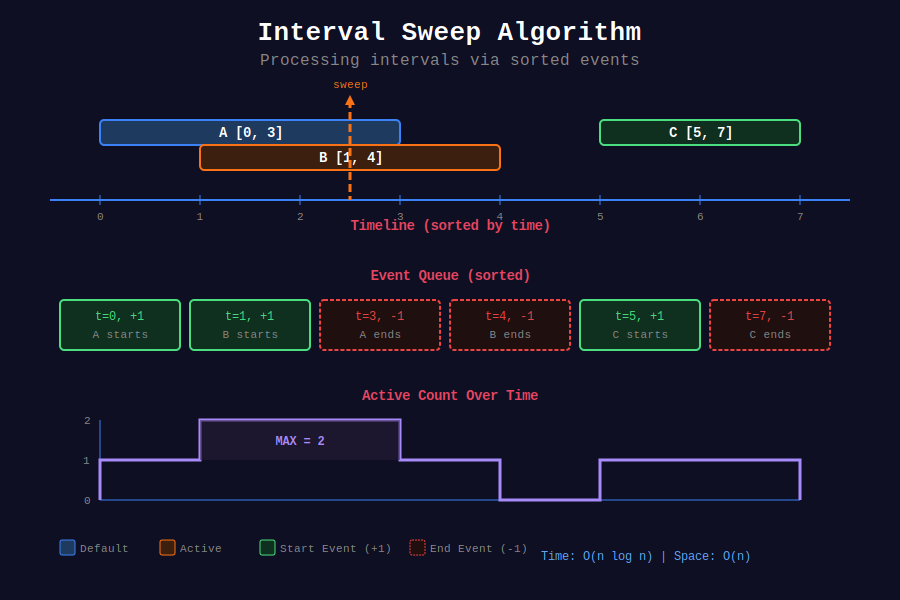

<div align="center">

# 📊 Interval Sweep

<p>
  
  
</p>

</div>

---

## 📊 Visual Overview

<div align="center">
  
</div>

---

## 🧭 Navigation

| ⬅️ Previous | 📂 Current | ➡️ Next |
|:------------|:----------:|--------:|
| [← Sweep Line](../README.md) | **01. Interval Sweep** | [02. Coordinate Compression →](../02_coordinate_compression/README.md) |

---

## 📐 Mathematical Foundations

### 1️⃣ Interval Sweep Definition

**Sweep Line** processes events at critical points (interval boundaries) in sorted order.

**Key Idea:** Convert intervals $I = [s\_i, e\_i]$ to events $(t, \delta)$ where:
- $(s\_i, +1)$ = interval starts
- $(e\_i, -1)$ = interval ends

**Active Count at time $t$:**

```math
\text{active}(t) = \sum_{\substack{i : s_i \leq t < e_i}} 1
```

---

### 2️⃣ Event Processing Theorem

**Theorem:** Processing $n$ intervals requires $O(n \log n)$ time.

**Proof:**
1. Create $2n$ events (start + end for each interval)
2. Sort events: $O(2n \log 2n) = O(n \log n)$
3. Process events linearly: $O(2n) = O(n)$
4. Total: $O(n \log n)$ ∎

**Space:** $O(n)$ for events storage.

---

### 3️⃣ Overlap Detection

**Intervals Overlap:** Two intervals $[a, b]$ and $[c, d]$ overlap iff:

```math
\max(a, c) < \min(b, d)
```

Equivalently:

```math
a < d \land c < b
```

**Proof:**
- Overlap means $\exists t : a \leq t < b \land c \leq t < d$
- This requires $a < d$ (otherwise $a \geq d > t$, contradiction)
- Similarly requires $c < b$ ∎

---

### 4️⃣ Maximum Overlap Problem

**Problem:** Find maximum number of overlapping intervals at any point.

**Algorithm:** Event-based sweep
```
1. For each interval [s, e]:
   - Add event (s, +1)
   - Add event (e, -1)
2. Sort events by time
3. Process events, maintaining active count
4. Return maximum active count
```

**Correctness:** Active count at any time = number of intervals covering that point.

**Time:** $O(n \log n)$  
**Space:** $O(n)$

---

### 5️⃣ Meeting Rooms Theorem

**Theorem:** Minimum conference rooms = maximum number of simultaneous meetings.

**Proof:**
- Let $k$ = max overlap
- At time $t$ where $k$ intervals overlap, need $k$ rooms
- Can't do with $k-1$ rooms (would have conflict at time $t$)
- Can always do with $k$ rooms (assign to first available) ∎

**Algorithm:** Use heap or sweep line to find max overlap.

---

### 6️⃣ Interval Merge Correctness

**Theorem:** Sorted merge produces minimal merged intervals.

**Algorithm:**
```
1. Sort intervals by start time
2. For each interval:
   - If overlaps with last merged: extend
   - Otherwise: add as new merged interval
```

**Invariant:** At step $i$, all intervals $[1, i]$ are minimally merged.

**Proof by induction:**
- Base: First interval is trivially merged
- Step: If interval $i+1$ overlaps last merged, extending is minimal
- If no overlap, must be separate interval ∎

---

### 7️⃣ Range Update with Difference Array

**Difference Array:** For range updates $[l, r] += val$:

```math
\Delta[i] = A[i] - A[i-1]
```

**Update:** $\Delta[l] += val, \Delta[r+1] -= val$

**Reconstruct:** $A[i] = \sum\_{j=0}^{i} \Delta[j]$ (prefix sum)

**Time:** $O(1)$ per update, $O(n)$ to reconstruct  
**Space:** $O(n)$

---

## 💻 Code Implementations

```python
from typing import List, Tuple
import heapq
from collections import defaultdict

# ==================== CORE SWEEP LINE ====================

def meeting_rooms_can_attend(intervals: List[List[int]]) -> bool:
    """
    Determine if person can attend all meetings (no overlaps).
    
    Time: O(n log n), Space: O(1)
    """
    if not intervals:
        return True
    
    # Sort by start time
    intervals.sort(key=lambda x: x[0])
    
    # Check consecutive meetings for overlap
    for i in range(1, len(intervals)):
        if intervals[i][0] < intervals[i-1][1]:
            return False  # Current starts before previous ends
    
    return True

def meeting_rooms_min_required(intervals: List[List[int]]) -> int:
    """
    Minimum conference rooms needed using event sweep.
    
    Time: O(n log n), Space: O(n)
    """
    if not intervals:
        return 0
    
    # Create events: (time, type) where 1=start, -1=end
    events = []
    for start, end in intervals:
        events.append((start, 1))    # Meeting starts
        events.append((end, -1))     # Meeting ends
    
    # Sort by time (end before start if same time)
    events.sort(key=lambda x: (x[0], x[1]))
    
    max_rooms = 0
    current_rooms = 0
    
    for time, event_type in events:
        current_rooms += event_type
        max_rooms = max(max_rooms, current_rooms)
    
    return max_rooms

def meeting_rooms_heap(intervals: List[List[int]]) -> int:
    """
    Minimum conference rooms using heap (tracks end times).
    
    Time: O(n log n), Space: O(n)
    """
    if not intervals:
        return 0
    
    intervals.sort(key=lambda x: x[0])
    
    # Min heap of meeting end times
    heap = []
    
    for start, end in intervals:
        # Remove meetings that have ended
        if heap and heap[0] <= start:
            heapq.heappop(heap)
        
        # Add current meeting's end time
        heapq.heappush(heap, end)
    
    # Heap size = rooms needed
    return len(heap)

# ==================== INTERVAL MERGE ====================

def merge_intervals(intervals: List[List[int]]) -> List[List[int]]:
    """
    Merge all overlapping intervals.
    
    Time: O(n log n), Space: O(n)
    """
    if not intervals:
        return []
    
    intervals.sort(key=lambda x: x[0])
    merged = [intervals[0]]
    
    for start, end in intervals[1:]:
        if start <= merged[-1][1]:  # Overlaps
            merged[-1][1] = max(merged[-1][1], end)
        else:
            merged.append([start, end])
    
    return merged

def insert_interval(intervals: List[List[int]], 
                    new_interval: List[int]) -> List[List[int]]:
    """
    Insert interval and merge if necessary.
    
    Time: O(n), Space: O(n)
    """
    result = []
    i = 0
    n = len(intervals)
    
    # Phase 1: Add intervals before new_interval
    while i < n and intervals[i][1] < new_interval[0]:
        result.append(intervals[i])
        i += 1
    
    # Phase 2: Merge overlapping intervals
    while i < n and intervals[i][0] <= new_interval[1]:
        new_interval[0] = min(new_interval[0], intervals[i][0])
        new_interval[1] = max(new_interval[1], intervals[i][1])
        i += 1
    result.append(new_interval)
    
    # Phase 3: Add remaining intervals
    while i < n:
        result.append(intervals[i])
        i += 1
    
    return result

# ==================== RANGE UPDATES ====================

def car_pooling(trips: List[List[int]], capacity: int) -> bool:
    """
    Check if car with capacity can complete all trips.
    
    Time: O(n log n), Space: O(n)
    """
    # Create events: (location, passenger_change)
    events = []
    for passengers, start, end in trips:
        events.append((start, passengers))
        events.append((end, -passengers))
    
    events.sort()
    
    current_passengers = 0
    for location, change in events:
        current_passengers += change
        if current_passengers > capacity:
            return False
    
    return True

def car_pooling_array(trips: List[List[int]], 
                      capacity: int, 
                      max_location: int = 1001) -> bool:
    """
    Car pooling using difference array.
    
    Time: O(n + max_location), Space: O(max_location)
    """
    passengers = [0] * max_location
    
    # Apply range updates
    for num, start, end in trips:
        passengers[start] += num
        if end < max_location:
            passengers[end] -= num
    
    # Check capacity with prefix sum
    current = 0
    for change in passengers:
        current += change
        if current > capacity:
            return False
    
    return True

def corporate_flight_bookings(bookings: List[List[int]], n: int) -> List[int]:
    """
    Calculate seats booked for each flight using difference array.
    
    Time: O(bookings + n), Space: O(n)
    """
    seats = [0] * (n + 2)  # Extra space for safety
    
    # Apply range updates
    for first, last, seats_booked in bookings:
        seats[first] += seats_booked
        seats[last + 1] -= seats_booked
    
    # Compute prefix sum
    result = []
    current = 0
    for i in range(1, n + 1):
        current += seats[i]
        result.append(current)
    
    return result

# ==================== CALENDAR PROBLEMS ====================

class MyCalendar:
    """
    Calendar allowing booking if no double booking.
    
    Time: O(n) per booking, Space: O(n)
    """
    
    def __init__(self):
        self.bookings = []
    
    def book(self, start: int, end: int) -> bool:
        """Check if [start, end) can be booked."""
        for s, e in self.bookings:
            # Check overlap: start < e and end > s
            if start < e and end > s:
                return False
        
        self.bookings.append((start, end))
        return True

class MyCalendarTwo:
    """
    Calendar allowing at most double booking (no triple).
    
    Time: O(n) per booking, Space: O(n)
    """
    
    def __init__(self):
        self.single = []  # All bookings
        self.double = []  # Overlapping regions
    
    def book(self, start: int, end: int) -> bool:
        # Check if creates triple booking
        for s, e in self.double:
            if start < e and end > s:
                return False
        
        # Add overlaps to double bookings
        for s, e in self.single:
            if start < e and end > s:
                overlap_start = max(start, s)
                overlap_end = min(end, e)
                self.double.append((overlap_start, overlap_end))
        
        self.single.append((start, end))
        return True

class MyCalendarThree:
    """
    Return maximum k such that k events overlap.
    
    Time: O(n²) per booking, Space: O(n)
    """
    
    def __init__(self):
        self.delta = defaultdict(int)
    
    def book(self, start: int, end: int) -> int:
        self.delta[start] += 1
        self.delta[end] -= 1
        
        # Sweep to find max overlap
        max_k = 0
        active = 0
        for time in sorted(self.delta.keys()):
            active += self.delta[time]
            max_k = max(max_k, active)
        
        return max_k

# ==================== EMPLOYEE FREE TIME ====================

class Interval:
    def __init__(self, start: int, end: int):
        self.start = start
        self.end = end

def employee_free_time(schedule: List[List[Interval]]) -> List[Interval]:
    """
    Find common free time for all employees.
    
    Time: O(n log n), Space: O(n)
    """
    # Flatten all intervals
    all_intervals = []
    for employee_schedule in schedule:
        all_intervals.extend(employee_schedule)
    
    # Sort by start time
    all_intervals.sort(key=lambda x: x.start)
    
    # Merge intervals
    merged = [all_intervals[0]]
    for interval in all_intervals[1:]:
        if interval.start <= merged[-1].end:
            merged[-1].end = max(merged[-1].end, interval.end)
        else:
            merged.append(interval)
    
    # Find gaps
    free_time = []
    for i in range(1, len(merged)):
        free_time.append(Interval(merged[i-1].end, merged[i].start))
    
    return free_time

def employee_free_time_heap(schedule: List[List[Interval]]) -> List[Interval]:
    """
    Employee free time using heap (merge k sorted lists).
    
    Time: O(n log k), Space: O(k) where k = number of employees
    """
    heap = []
    for i, employee in enumerate(schedule):
        if employee:
            heapq.heappush(heap, (employee[0].start, i, 0))
    
    result = []
    prev_end = heap[0][0]
    
    while heap:
        start, emp_idx, int_idx = heapq.heappop(heap)
        interval = schedule[emp_idx][int_idx]
        
        # If gap exists
        if interval.start > prev_end:
            result.append(Interval(prev_end, interval.start))
        
        prev_end = max(prev_end, interval.end)
        
        # Add next interval from same employee
        if int_idx + 1 < len(schedule[emp_idx]):
            next_interval = schedule[emp_idx][int_idx + 1]
            heapq.heappush(heap, (next_interval.start, emp_idx, int_idx + 1))
    
    return result
```

---

## 🎯 LeetCode Problems

### 🟢 Easy Problems

| # | Problem | Difficulty | Solution Pattern |
|---|---------|------------|------------------|
| 252 | [Meeting Rooms](https://leetcode.com/problems/meeting-rooms/) | Easy | Sort + check overlaps |

---

### 🟡 Medium Problems

| # | Problem | Difficulty | Solution Pattern |
|---|---------|------------|------------------|
| 253 | [Meeting Rooms II](https://leetcode.com/problems/meeting-rooms-ii/) | Medium | Event sweep / Heap |
| 56 | [Merge Intervals](https://leetcode.com/problems/merge-intervals/) | Medium | Sort + merge |
| 57 | [Insert Interval](https://leetcode.com/problems/insert-interval/) | Medium | Linear merge |
| 1094 | [Car Pooling](https://leetcode.com/problems/car-pooling/) | Medium | Events / Diff array |
| 729 | [My Calendar I](https://leetcode.com/problems/my-calendar-i/) | Medium | Overlap check |
| 731 | [My Calendar II](https://leetcode.com/problems/my-calendar-ii/) | Medium | Track double bookings |
| 1109 | [Corporate Flight Bookings](https://leetcode.com/problems/corporate-flight-bookings/) | Medium | Difference array |

---

### 🔴 Hard Problems

| # | Problem | Difficulty | Solution Pattern |
|---|---------|------------|------------------|
| 732 | [My Calendar III](https://leetcode.com/problems/my-calendar-iii/) | Hard | Sweep line count |
| 759 | [Employee Free Time](https://leetcode.com/problems/employee-free-time/) | Hard | Merge intervals / Heap |

---

## 📊 Complexity Summary

| Operation | Time | Space | Notes |
|-----------|:----:|:-----:|-------|
| Sort events | O(n log n) | O(n) | Dominates complexity |
| Process events | O(n) | O(1) | Linear scan |
| Merge intervals | O(n log n) | O(n) | Sort + merge |
| Range updates | O(1) per update | O(n) | Difference array |
| Reconstruct array | O(n) | O(n) | Prefix sum |
| Heap approach | O(n log k) | O(k) | k = active items |

---

## 💡 Key Insights

1. **Event-based thinking:** Convert intervals to point events
2. **Sort first:** Process events in time order
3. **Track state:** Maintain active count/items during sweep
4. **Difference array:** Efficient for range updates
5. **Overlap formula:** `start1 < end2 && start2 < end1`

---

## 🧭 Navigation

| ⬅️ Previous | 📂 Current | ➡️ Next |
|:------------|:----------:|--------:|
| [← Sweep Line](../README.md) | **01. Interval Sweep** | [02. Coordinate Compression →](../02_coordinate_compression/README.md) |
