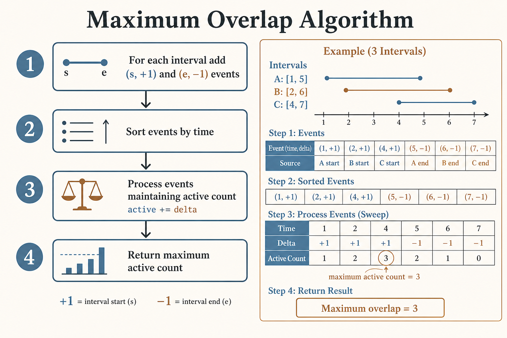
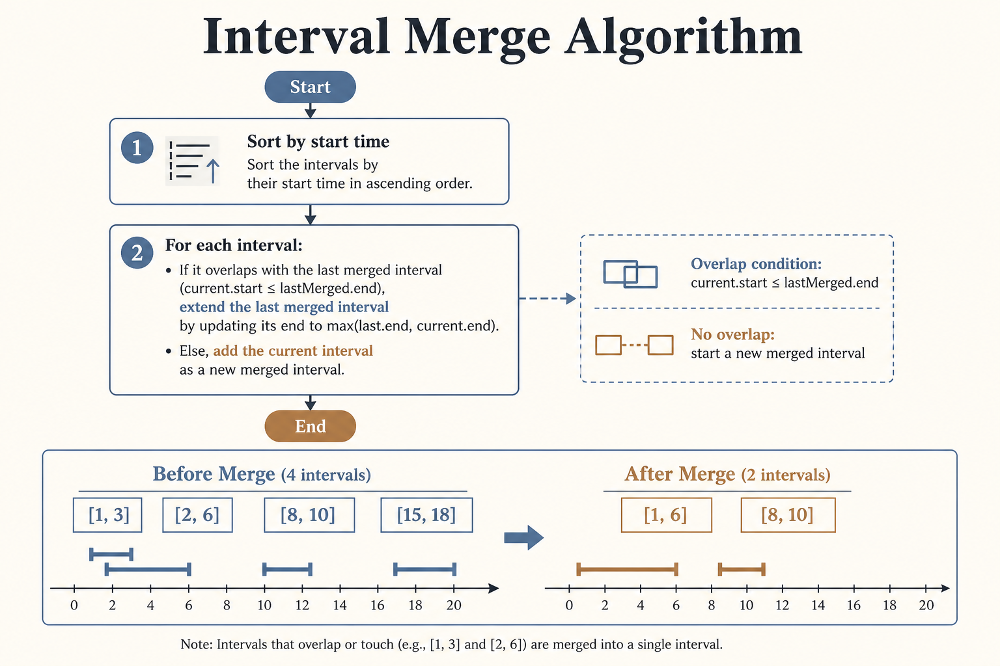
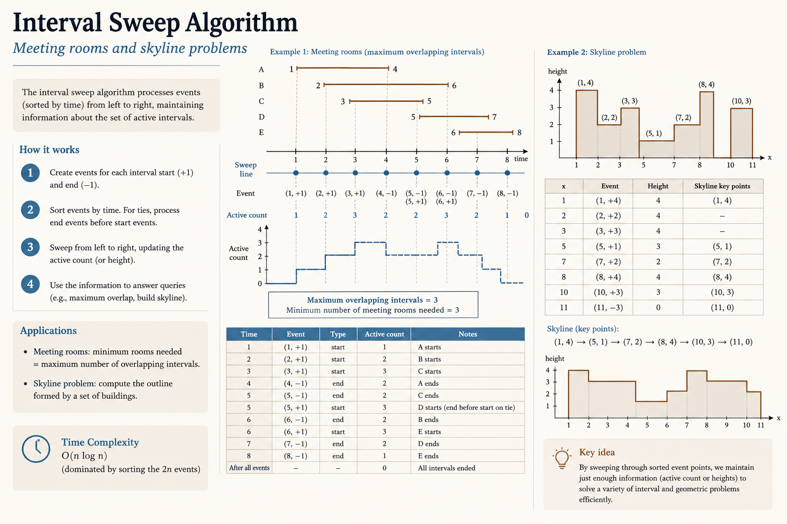
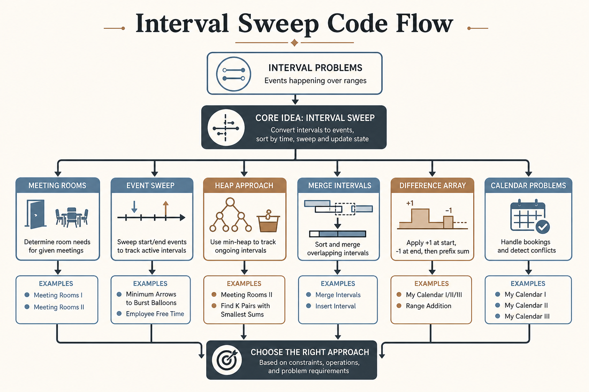

# 📊 Interval Sweep

### *Interval Sweep*

  
  

---

## 🎯 At a Glance

| | |
|:---|:---|
| **Difficulty** | Medium |
| **Problems** | 9 |

> **How to use this page:** Scan **At a Glance**, then work through theory → visuals → code.

---

## 🧭 Navigation

| ⬅️ Previous | 📂 Current | ➡️ Next |
|:------------|:----------:|--------:|
| [← Sweep Line](../README.md) | **01. Interval Sweep** | [02. Coordinate Compression →](../02_coordinate_compression/README.md) |

---

## 📐 Mathematical Foundation
### 1️⃣ Interval Sweep Definition

**Sweep Line** processes events at critical points (interval boundaries) in sorted order.

**Key Idea:** Convert intervals $I = [s_i, e_i]$ to events $(t, \delta)$ where:

- $(s_i, +1)$ = interval starts

- $(e_i, -1)$ = interval ends

**Active Count at time $t$:**

$$\text{active}(t) = \sum_{\substack{i : s_i \leq t < e_i}} 1$$

---

### 2️⃣ Event Processing Theorem

**Theorem:** Processing $n$ intervals requires $O(n \log n)$ time.

**Proof:**

1. Create $2n$ events (start + end for each interval)

2. Sort events: $O(2n \log 2n) = O(n \log n)$

3. Process events linearly: $O(2n) = O(n)$

4. Total: $O(n \log n)$ ∎

**Space:** $O(n)$ for events storage.

---

### 3️⃣ Overlap Detection

**Intervals Overlap:** Two intervals $[a, b]$ and $[c, d]$ overlap iff:

$$\max(a, c) < \min(b, d)$$

Equivalently:

$$a < d \land c < b$$

**Proof:**

- Overlap means $\exists t : a \leq t < b \land c \leq t < d$

- This requires $a < d$ (otherwise $a \geq d > t$, contradiction)

- Similarly requires $c < b$ ∎

---

### 4️⃣ Maximum Overlap Problem

**Problem:** Find maximum number of overlapping intervals at any point.

**Algorithm:** Event-based sweep

**Correctness:** Active count at any time = number of intervals covering that point.

**Time:** $O(n \log n)$  
**Space:** $O(n)$

---

### 5️⃣ Meeting Rooms Theorem

**Theorem:** Minimum conference rooms = maximum number of simultaneous meetings.

**Proof:**

- Let $k$ = max overlap

- At time $t$ where $k$ intervals overlap, need $k$ rooms

- Can't do with $k-1$ rooms (would have conflict at time $t$)

- Can always do with $k$ rooms (assign to first available) ∎

**Algorithm:** Use heap or sweep line to find max overlap.

---

### 6️⃣ Interval Merge Correctness

**Theorem:** Sorted merge produces minimal merged intervals.

**Algorithm:**

**Invariant:** At step $i$, all intervals $[1, i]$ are minimally merged.

**Proof by induction:**

- Base: First interval is trivially merged

- Step: If interval $i+1$ overlaps last merged, extending is minimal

- If no overlap, must be separate interval ∎

---

### 7️⃣ Range Update with Difference Array

**Difference Array:** For range updates $[l, r] += val$:

$$\Delta[i] = A[i] - A[i-1]$$

**Update:** $\Delta[l] += val, \Delta[r+1] -= val$

**Reconstruct:** $A[i] = \sum_{j=0}^{i} \Delta[j]$ (prefix sum)

**Time:** $O(1)$ per update, $O(n)$ to reconstruct  
**Space:** $O(n)$

---

## 📊 Visual Overview

  

---

## 💻 Code Implementations

---

## 🏆 LeetCode Problems

### 🟢 Easy Problems
| # | Problem | Difficulty | Solution Pattern |
|---|---------|------------|------------------|
| 252 | [Meeting Rooms](https://leetcode.com/problems/meeting-rooms/) | Easy | Sort + check overlaps |

---

### 🟡 Medium Problems
| # | Problem | Difficulty | Solution Pattern |
|---|---------|------------|------------------|
| 253 | [Meeting Rooms II](https://leetcode.com/problems/meeting-rooms-ii/) | Medium | Event sweep / Heap |
| 56 | [Merge Intervals](https://leetcode.com/problems/merge-intervals/) | Medium | Sort + merge |
| 57 | [Insert Interval](https://leetcode.com/problems/insert-interval/) | Medium | Linear merge |
| 1094 | [Car Pooling](https://leetcode.com/problems/car-pooling/) | Medium | Events / Diff array |
| 729 | [My Calendar I](https://leetcode.com/problems/my-calendar-i/) | Medium | Overlap check |
| 731 | [My Calendar II](https://leetcode.com/problems/my-calendar-ii/) | Medium | Track double bookings |
| 1109 | [Corporate Flight Bookings](https://leetcode.com/problems/corporate-flight-bookings/) | Medium | Difference array |

---

### 🔴 Hard Problems
| # | Problem | Difficulty | Solution Pattern |
|---|---------|------------|------------------|
| 732 | [My Calendar III](https://leetcode.com/problems/my-calendar-iii/) | Hard | Sweep line count |
| 759 | [Employee Free Time](https://leetcode.com/problems/employee-free-time/) | Hard | Merge intervals / Heap |

---

## 📊 Complexity Summary

| Operation | Time | Space | Notes |
|-----------|:----:|:-----:|-------|
| Sort events | O(n log n) | O(n) | Dominates complexity |
| Process events | O(n) | O(1) | Linear scan |
| Merge intervals | O(n log n) | O(n) | Sort + merge |
| Range updates | O(1) per update | O(n) | Difference array |
| Reconstruct array | O(n) | O(n) | Prefix sum |
| Heap approach | O(n log k) | O(k) | k = active items |

---

## 💡 Key Insights

1. **Event-based thinking:** Convert intervals to point events

2. **Sort first:** Process events in time order

3. **Track state:** Maintain active count/items during sweep

4. **Difference array:** Efficient for range updates

5. **Overlap formula:** `start1 < end2 && start2 < end1`

---

## 📚 References & Learning Resources

### 📖 Core Concepts
| Resource | Description | Link |
|----------|-------------|------|
| **Sweep Line Algorithm** | GeeksforGeeks | [Line Sweep](https://www.geeksforgeeks.org/sweep-line-algorithm/) |
| **Interval Scheduling** | Wikipedia | [Interval scheduling](https://en.wikipedia.org/wiki/Interval_scheduling) |
| **CP-Algorithms** | Sweep line | [Tutorial](https://cp-algorithms.com/geometry/sweep-line.html) |

### 📝 Practice
| Platform | Focus | Link |
|----------|-------|------|
| **LeetCode** | Sorting tag | [Problems](https://leetcode.com/tag/sorting/) |

---
