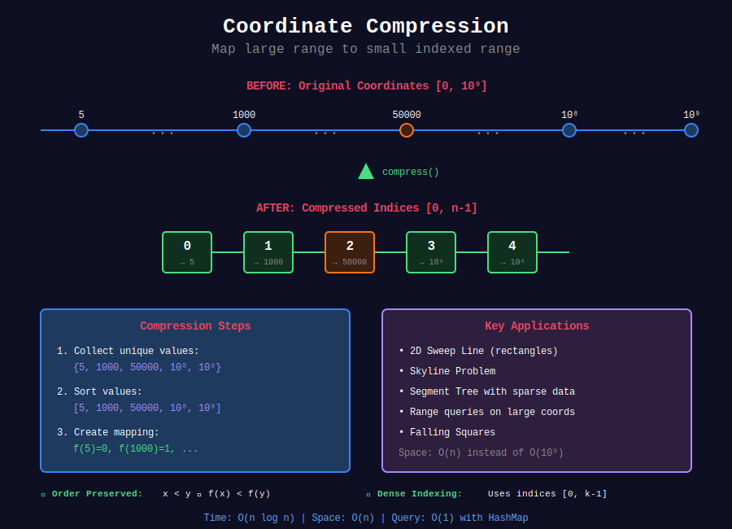

<div align="center">

# 🗜️ Coordinate Compression

<p>
  
  
</p>

</div>

---

## 📊 Visual Overview

<div align="center">
  
</div>

---

## 🧭 Navigation

| ⬅️ Previous | 📂 Current | ➡️ Next |
|:------------|:----------:|--------:|
| [← 01. Interval Sweep](../01_interval_sweep/README.md) | **02. Coordinate Compression** | [Sweep Line →](../README.md) |

---

## 📐 Mathematical Foundations

### 1️⃣ Coordinate Compression Definition

**Problem:** Values span large range $[0, 10^9]$ but only $n$ distinct values used.

**Compression:** Map values to smaller range $[0, n-1]$ while preserving order.

**Mapping Function:**

```math
f: \mathbb{R} \to \{0, 1, \ldots, k-1\}

```

where $k$ = number of distinct coordinates.

**Property:** $f$ is monotonic: $x < y \implies f(x) < f(y)$

---

### 2️⃣ Compression Algorithm

**Steps:**
1. Collect all unique coordinates: $C = \{c\_1, c\_2, \ldots, c\_k\}$
2. Sort coordinates: $c\_1 < c\_2 < \cdots < c\_k$
3. Create mapping: $f(c\_i) = i-1$ for $i = 1, 2, \ldots, k$

**Time Complexity:**
- Collect: $O(n)$
- Sort: $O(k \log k)$ where $k \leq 2n$
- Map: $O(1)$ per query with hash map

**Total:** $O(n \log n)$

---

### 3️⃣ 2D Sweep Line Theorem

**Problem:** Process rectangles in 2D space.

**Strategy:** Sweep on one axis, compress coordinates on other axis.

**Algorithm:**

```
1. Sweep vertical line left to right (x-axis)
2. For each x-position:
   - Maintain active y-intervals
   - Use compressed y-coordinates
3. Calculate contribution of current segment

```

**Complexity:** $O(n^2 \log n)$ with naive y-interval merging  
**Optimized:** $O(n \log n)$ with segment tree

---

### 4️⃣ Skyline Problem

**Given:** $n$ buildings $[(l\_i, r\_i, h\_i)]$  
**Find:** Skyline key points where height changes

**Mathematical Model:**

Height function: $H(x) = \max\_{i: l\_i \leq x < r\_i} h\_i$

**Key Points:** Where $H(x^-) \neq H(x^+)$

**Algorithm:**
1. Create events: $(l\_i, h\_i, \text{start})$ and $(r\_i, h\_i, \text{end})$
2. Sort events by x-coordinate
3. Maintain active heights (max heap)
4. Output $(x, H(x))$ when height changes

**Time:** $O(n \log n)$  
**Space:** $O(n)$

---

### 5️⃣ Rectangle Area Union

**Problem:** Total area covered by $n$ rectangles (with overlaps).

**Formula:**

```math
A = \int_{-\infty}^{\infty} H(x) \, dx

```

where $H(x)$ = total height covered at position $x$.

**Discrete Version:**

```math
A = \sum_{i=1}^{k-1} (x_{i+1} - x_i) \cdot H(x_i)

```

where $x\_1, \ldots, x\_k$ are sorted distinct x-coordinates.

**Algorithm:**
1. Compress x-coordinates
2. For each x-segment $[x\_i, x\_{i+1})$:
   - Find active y-intervals
   - Merge y-intervals to get $H(x\_i)$
   - Add $(x\_{i+1} - x\_i) \cdot H(x\_i)$ to total

**Time:** $O(n^2 \log n)$ with naive merge  
**Optimized:** $O(n \log n)$ with segment tree

---

### 6️⃣ Segment Tree with Lazy Propagation

**For range updates and queries on compressed space:**

**Node stores:**
- Coverage count (how many rectangles cover this range)
- Total length covered in this range

**Update:** Add/remove rectangle (range update)
**Query:** Get total covered length

**Time per operation:** $O(\log n)$

---

### 7️⃣ Active Interval Management

**Problem:** Track which intervals are active at position $x$.

**Data structures:**
1. **Sorted list:** Insert/remove in $O(n)$, merge in $O(n)$
2. **Multiset (TreeMap):** Insert/remove in $O(\log n)$
3. **Segment tree:** Range operations in $O(\log n)$

**Merge overlapping intervals:**

Given sorted intervals $[(s\_1, e\_1), (s\_2, e\_2), \ldots]$:

```
Merged length = sum of non-overlapping portions

```

**Algorithm:**

```python
total = 0
curr_start, curr_end = intervals[0]
for start, end in intervals[1:]:
    if start <= curr_end:
        curr_end = max(curr_end, end)
    else:
        total += curr_end - curr_start
        curr_start, curr_end = start, end
total += curr_end - curr_start

```

---

## 💻 Code Implementations

```python
from typing import List, Tuple
import heapq
from collections import defaultdict
from sortedcontainers import SortedList

# ==================== SKYLINE PROBLEM ====================

def get_skyline(buildings: List[List[int]]) -> List[List[int]]:
    """
    The Skyline Problem - Find skyline formed by buildings.
    
    Time: O(n log n), Space: O(n)
    """
    # Create events: (x, type, height)
    # type: 0 = start (process first), 1 = end
    events = []
    for left, right, height in buildings:
        events.append((left, 0, height))   # Building starts
        events.append((right, 1, height))  # Building ends
    
    # Sort by x, then type (start before end), then height
    events.sort(key=lambda x: (x[0], x[1], -x[2] if x[1] == 0 else x[2]))
    
    result = []
    active_heights = [0]  # Ground level
    height_count = defaultdict(int)
    height_count[0] = 1
    
    for x, event_type, height in events:
        if event_type == 0:  # Start
            height_count[height] += 1
            heapq.heappush(active_heights, -height)  # Max heap
        else:  # End
            height_count[height] -= 1
            if height_count[height] == 0:
                del height_count[height]
        
        # Get current max height (clean up invalid)
        while active_heights and -active_heights[0] not in height_count:
            heapq.heappop(active_heights)
        
        max_height = -active_heights[0] if active_heights else 0
        
        # Add key point if height changed
        if not result or result[-1][1] != max_height:
            result.append([x, max_height])
    
    return result

def get_skyline_sorted(buildings: List[List[int]]) -> List[List[int]]:
    """
    Skyline using SortedList for height management.
    
    Time: O(n log n), Space: O(n)
    """
    events = []
    for left, right, height in buildings:
        events.append((left, -height, 0))   # Start: negative height
        events.append((right, height, 1))   # End: positive height
    
    events.sort()
    
    result = []
    heights = SortedList([0])
    
    for x, h, event_type in events:
        if event_type == 0:  # Start
            heights.add(-h)
        else:  # End
            heights.remove(h)
        
        max_height = heights[-1]
        
        if not result or result[-1][1] != max_height:
            result.append([x, max_height])
    
    return result

# ==================== RECTANGLE AREA ====================

def rectangle_area(rectangles: List[List[int]]) -> int:
    """
    Rectangle Area II - Total area covered by rectangles.
    
    Time: O(n² log n), Space: O(n)
    """
    MOD = 10**9 + 7
    
    # Collect and compress x-coordinates
    xs = sorted(set([x for x1, _, x2, _ in rectangles for x in (x1, x2)]))
    x_to_idx = {x: i for i, x in enumerate(xs)}
    
    # Create events for y-coordinates
    events = []
    for x1, y1, x2, y2 in rectangles:
        events.append((y1, x1, x2, 1))   # Bottom edge
        events.append((y2, x1, x2, -1))  # Top edge
    
    events.sort()
    
    def merge_ranges(ranges: List[Tuple[int, int]]) -> int:
        """Merge overlapping x-ranges and return total length."""
        if not ranges:
            return 0
        ranges.sort()
        total = 0
        start, end = ranges[0]
        for s, e in ranges[1:]:
            if s <= end:
                end = max(end, e)
            else:
                total += end - start
                start, end = s, e
        total += end - start
        return total
    
    area = 0
    prev_y = 0
    active = []
    
    i = 0
    while i < len(events):
        curr_y = events[i][0]
        
        # Calculate area for previous y-segment
        if active and curr_y > prev_y:
            width = merge_ranges(active[:])
            height = curr_y - prev_y
            area = (area + width * height) % MOD
        
        # Process all events at current y
        while i < len(events) and events[i][0] == curr_y:
            _, x1, x2, delta = events[i]
            if delta == 1:
                active.append((x1, x2))
            else:
                active.remove((x1, x2))
            i += 1
        
        prev_y = curr_y
    
    return area

# ==================== MY CALENDAR III ====================

class MyCalendarThree:
    """
    My Calendar III - Maximum k-booking.
    
    Time: O(n²) per booking, Space: O(n)
    """
    
    def __init__(self):
        self.delta = defaultdict(int)
    
    def book(self, start: int, end: int) -> int:
        """Add booking and return max k."""
        self.delta[start] += 1
        self.delta[end] -= 1
        
        # Sweep to find max overlap
        max_k = 0
        active = 0
        for time in sorted(self.delta.keys()):
            active += self.delta[time]
            max_k = max(max_k, active)
        
        return max_k

class MyCalendarThreeOptimized:
    """
    My Calendar III using SortedDict.
    
    Time: O(n log n) per booking, Space: O(n)
    """
    
    def __init__(self):
        from sortedcontainers import SortedDict
        self.timeline = SortedDict()
    
    def book(self, start: int, end: int) -> int:
        self.timeline[start] = self.timeline.get(start, 0) + 1
        self.timeline[end] = self.timeline.get(end, 0) - 1
        
        max_k = 0
        active = 0
        for time in self.timeline:
            active += self.timeline[time]
            max_k = max(max_k, active)
        
        return max_k

# ==================== RANGE MODULE ====================

class RangeModule:
    """
    Range Module - Track ranges with add/query/remove.
    
    Time: O(n) per operation, Space: O(n)
    """
    
    def __init__(self):
        self.intervals = []
    
    def addRange(self, left: int, right: int) -> None:
        """Add range [left, right)."""
        new_intervals = []
        merged = [left, right]
        inserted = False
        
        for start, end in self.intervals:
            if end < merged[0]:
                new_intervals.append([start, end])
            elif start > merged[1]:
                if not inserted:
                    new_intervals.append(merged)
                    inserted = True
                new_intervals.append([start, end])
            else:  # Overlap - merge
                merged[0] = min(merged[0], start)
                merged[1] = max(merged[1], end)
        
        if not inserted:
            new_intervals.append(merged)
        
        self.intervals = new_intervals
    
    def queryRange(self, left: int, right: int) -> bool:
        """Check if [left, right) is fully covered."""
        for start, end in self.intervals:
            if start <= left and right <= end:
                return True
        return False
    
    def removeRange(self, left: int, right: int) -> None:
        """Remove range [left, right)."""
        new_intervals = []
        
        for start, end in self.intervals:
            if end <= left or start >= right:
                # No overlap
                new_intervals.append([start, end])
            else:
                # Overlap - split if needed
                if start < left:
                    new_intervals.append([start, left])
                if end > right:
                    new_intervals.append([right, end])
        
        self.intervals = new_intervals

# ==================== FALLING SQUARES ====================

def falling_squares(positions: List[List[int]]) -> List[int]:
    """
    Falling Squares - Track maximum height as squares fall.
    
    Time: O(n²), Space: O(n)
    """
    result = []
    intervals = []  # [(left, right, height)]
    max_height = 0
    
    for left, side_length in positions:
        right = left + side_length
        
        # Find max height in range [left, right)
        base_height = 0
        for l, r, h in intervals:
            if l < right and left < r:  # Overlap
                base_height = max(base_height, h)
        
        new_height = base_height + side_length
        
        # Update intervals (replace overlapping)
        new_intervals = []
        for l, r, h in intervals:
            if r <= left or l >= right:
                # No overlap
                new_intervals.append((l, r, h))
            else:
                # Split overlapping interval
                if l < left:
                    new_intervals.append((l, left, h))
                if r > right:
                    new_intervals.append((right, r, h))
        
        # Add new square
        new_intervals.append((left, right, new_height))
        intervals = new_intervals
        
        # Update max height
        max_height = max(max_height, new_height)
        result.append(max_height)
    
    return result

def falling_squares_compressed(positions: List[List[int]]) -> List[int]:
    """
    Falling Squares with coordinate compression.
    
    Time: O(n² log n), Space: O(n)
    """
    # Coordinate compression
    coords = set()
    for left, size in positions:
        coords.add(left)
        coords.add(left + size)
    
    sorted_coords = sorted(coords)
    coord_map = {c: i for i, c in enumerate(sorted_coords)}
    n = len(sorted_coords)
    
    # Height array for compressed coordinates
    heights = [0] * n
    result = []
    max_height = 0
    
    for left, size in positions:
        right = left + size
        l_idx = coord_map[left]
        r_idx = coord_map[right]
        
        # Query current height in range
        current_height = max(heights[l_idx:r_idx], default=0)
        new_height = current_height + size
        
        # Update range
        for i in range(l_idx, r_idx):
            heights[i] = new_height
        
        max_height = max(max_height, new_height)
        result.append(max_height)
    
    return result

# ==================== COORDINATE COMPRESSION UTILITY ====================

class CoordinateCompressor:
    """
    Generic coordinate compression utility.
    """
    
    def __init__(self, coords: List[int]):
        """Initialize with list of coordinates."""
        self.sorted_coords = sorted(set(coords))
        self.coord_to_idx = {c: i for i, c in enumerate(self.sorted_coords)}
        self.n = len(self.sorted_coords)
    
    def compress(self, coord: int) -> int:
        """Map coordinate to compressed index."""
        return self.coord_to_idx[coord]
    
    def decompress(self, idx: int) -> int:
        """Map compressed index back to coordinate."""
        return self.sorted_coords[idx]
    
    def range_compress(self, left: int, right: int) -> Tuple[int, int]:
        """Compress a range [left, right)."""
        return self.compress(left), self.compress(right)

# ==================== 2D SWEEP TEMPLATE ====================

def solve_2d_sweep_template(rectangles: List[List[int]]) -> int:
    """
    Template for 2D sweep line problems.
    
    Steps:
    1. Choose axis to sweep (usually x-axis)
    2. Create events for other axis (y-axis)
    3. Compress coordinates if needed
    4. Process events, maintaining active intervals
    """
    # Collect x-coordinates
    xs = sorted(set([x for x1, _, x2, _ in rectangles for x in (x1, x2)]))
    
    # Create y-events for each x-position
    events = []
    for x1, y1, x2, y2 in rectangles:
        events.append((y1, x1, x2, 1))    # Bottom edge
        events.append((y2, x1, x2, -1))   # Top edge
    
    events.sort()
    
    total = 0
    prev_y = 0
    active_x_intervals = []
    
    for y, x1, x2, delta in events:
        # Process previous y-segment
        if active_x_intervals and y > prev_y:
            width = calculate_coverage(active_x_intervals)
            height = y - prev_y
            total += width * height
        
        # Update active intervals
        if delta == 1:
            active_x_intervals.append((x1, x2))
        else:
            active_x_intervals.remove((x1, x2))
        
        prev_y = y
    
    return total

def calculate_coverage(intervals: List[Tuple[int, int]]) -> int:
    """Calculate total coverage of intervals."""
    if not intervals:
        return 0
    
    intervals = sorted(intervals)
    total = 0
    start, end = intervals[0]
    
    for s, e in intervals[1:]:
        if s <= end:
            end = max(end, e)
        else:
            total += end - start
            start, end = s, e
    
    total += end - start
    return total

```

---

## 🎯 LeetCode Problems

### 🔴 Hard Problems

| # | Problem | Difficulty | Solution Pattern |
|---|---------|------------|------------------|
| 218 | [The Skyline Problem](https://leetcode.com/problems/the-skyline-problem/) | Hard | Event sweep + max heap |
| 732 | [My Calendar III](https://leetcode.com/problems/my-calendar-iii/) | Hard | Sweep line count |
| 850 | [Rectangle Area II](https://leetcode.com/problems/rectangle-area-ii/) | Hard | 2D sweep + compression |
| 715 | [Range Module](https://leetcode.com/problems/range-module/) | Hard | Interval management |
| 699 | [Falling Squares](https://leetcode.com/problems/falling-squares/) | Hard | Coordinate compression |

---

## 📊 Complexity Summary

| Algorithm | Time | Space | Use Case |
|-----------|:----:|:-----:|----------|
| Coordinate compression | O(n log n) | O(n) | Large sparse coordinates |
| Skyline | O(n log n) | O(n) | Building heights |
| Rectangle area | O(n² log n) | O(n) | 2D coverage |
| With segment tree | O(n log n) | O(n) | Optimized range ops |
| 2D sweep | O(n² log n) | O(n) | General 2D problems |

---

## 💡 Key Insights

1. **Compression benefits:** Reduces $[0, 10^9]$ to $[0, n-1]$
2. **Order preservation:** Maintains relative ordering of coordinates
3. **2D strategy:** Sweep one axis, compress/process other axis
4. **Event types:** Track start/end of intervals on each axis
5. **Segment tree:** Accelerates range operations on compressed space
6. **Active intervals:** Merge overlapping to calculate coverage

---

## 🧭 Navigation

| ⬅️ Previous | 📂 Current | ➡️ Next |
|:------------|:----------:|--------:|
| [← 01. Interval Sweep](../01_interval_sweep/README.md) | **02. Coordinate Compression** | [Sweep Line →](../README.md) |
