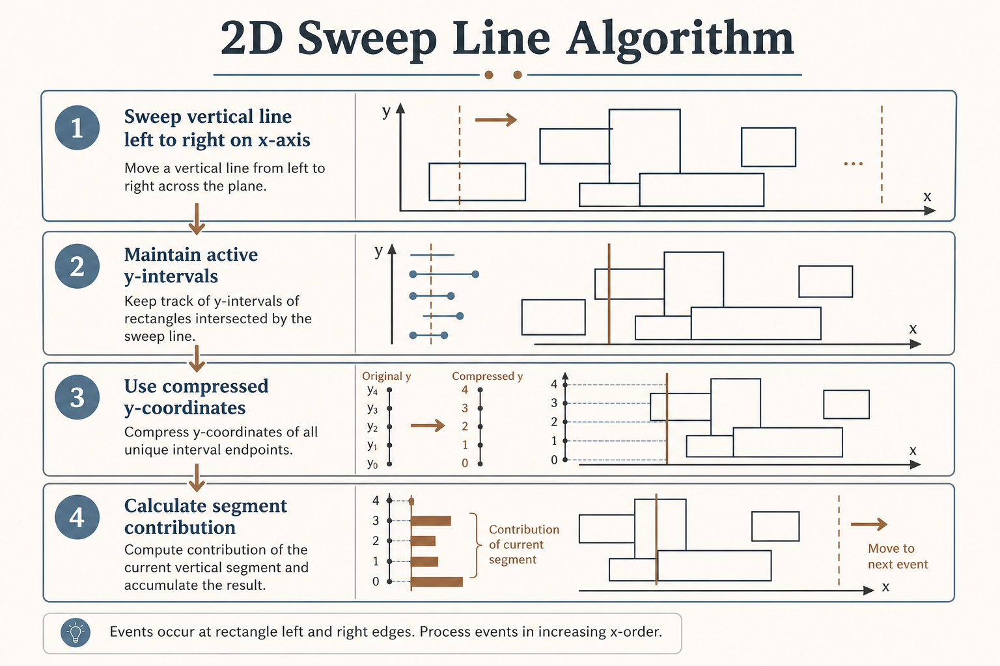
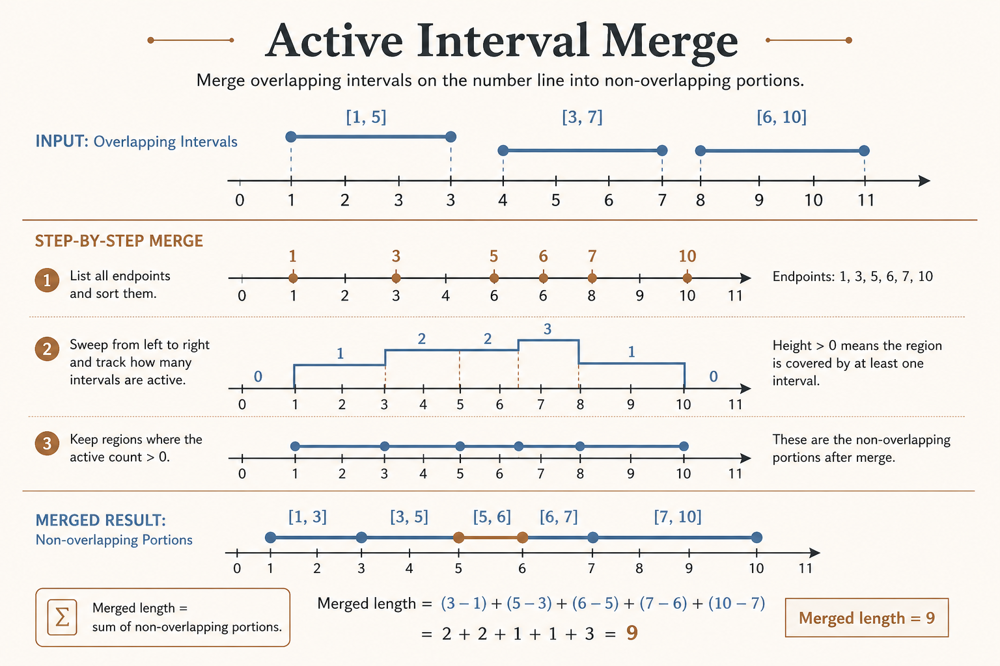
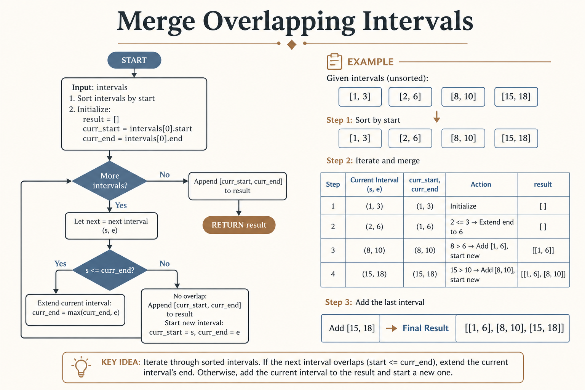
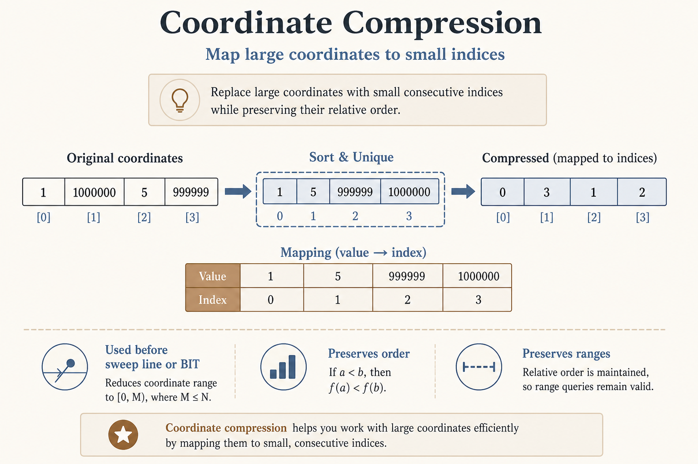
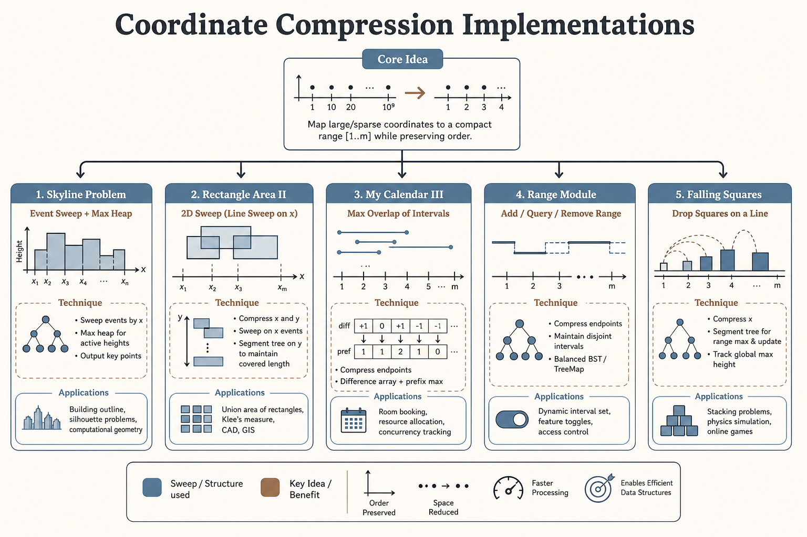

# 🗜️ Coordinate Compression

### *Coordinate Compression*

  
  

---

## 🎯 At a Glance

| | |
|:---|:---|
| **Difficulty** | Hard |
| **Problems** | 5 |

{: .highlight }
> **How to use this page:** Scan **At a Glance**, then work through theory → visuals → code.

---

## 🧭 Navigation

| ⬅️ Previous | 📂 Current | ➡️ Next |
|:------------|:----------:|--------:|
| [← 01. Interval Sweep](../01_interval_sweep/README.md) | **02. Coordinate Compression** | [Sweep Line →](../README.md) |

---

## 📐 Mathematical Foundation
### 1️⃣ Coordinate Compression Definition

**Problem:** Values span large range $[0, 10^9]$ but only $n$ distinct values used.

**Compression:** Map values to smaller range $[0, n-1]$ while preserving order.

**Mapping Function:**

$$f: \mathbb{R} \to \{0, 1, \ldots, k-1\}$$

where $k$ = number of distinct coordinates.

**Property:** $f$ is monotonic: $x < y \implies f(x) < f(y)$

---

### 2️⃣ Compression Algorithm

**Steps:**

1. Collect all unique coordinates: $C = \{c_1, c_2, \ldots, c_k\}$

2. Sort coordinates: $c_1 < c_2 < \cdots < c_k$

3. Create mapping: $f(c_i) = i-1$ for $i = 1, 2, \ldots, k$

**Time Complexity:**

- Collect: $O(n)$

- Sort: $O(k \log k)$ where $k \leq 2n$

- Map: $O(1)$ per query with hash map

**Total:** $O(n \log n)$

---

### 3️⃣ 2D Sweep Line Theorem

**Problem:** Process rectangles in 2D space.

**Strategy:** Sweep on one axis, compress coordinates on other axis.

**Algorithm:**

**Complexity:** $O(n^2 \log n)$ with naive y-interval merging  
**Optimized:** $O(n \log n)$ with segment tree

---

### 4️⃣ Skyline Problem

**Given:** $n$ buildings $[(l_i, r_i, h_i)]$  
**Find:** Skyline key points where height changes

**Mathematical Model:**

Height function: $H(x) = \max_{i: l_i \leq x < r_i} h_i$

**Key Points:** Where $H(x^-) \neq H(x^+)$

**Algorithm:**

1. Create events: $(l_i, h_i, \text{start})$ and $(r_i, h_i, \text{end})$

2. Sort events by x-coordinate

3. Maintain active heights (max heap)

4. Output $(x, H(x))$ when height changes

**Time:** $O(n \log n)$  
**Space:** $O(n)$

---

### 5️⃣ Rectangle Area Union

**Problem:** Total area covered by $n$ rectangles (with overlaps).

**Formula:**

$$A = \int_{-\infty}^{\infty} H(x) \, dx$$

where $H(x)$ = total height covered at position $x$.

**Discrete Version:**

$$A = \sum_{i=1}^{k-1} (x_{i+1} - x_i) \cdot H(x_i)$$

where $x_1, \ldots, x_k$ are sorted distinct x-coordinates.

**Algorithm:**

1. Compress x-coordinates

2. For each x-segment $[x_i, x_{i+1})$:
   - Find active y-intervals
   - Merge y-intervals to get $H(x_i)$
   - Add $(x_{i+1} - x_i) \cdot H(x_i)$ to total

**Time:** $O(n^2 \log n)$ with naive merge  
**Optimized:** $O(n \log n)$ with segment tree

---

### 6️⃣ Segment Tree with Lazy Propagation

**For range updates and queries on compressed space:**

**Node stores:**

- Coverage count (how many rectangles cover this range)

- Total length covered in this range

**Update:** Add/remove rectangle (range update)
**Query:** Get total covered length

**Time per operation:** $O(\log n)$

---

### 7️⃣ Active Interval Management

**Problem:** Track which intervals are active at position $x$.

**Data structures:**

1. **Sorted list:** Insert/remove in $O(n)$, merge in $O(n)$

2. **Multiset (TreeMap):** Insert/remove in $O(\log n)$

3. **Segment tree:** Range operations in $O(\log n)$

**Merge overlapping intervals:**

Given sorted intervals $[(s_1, e_1), (s_2, e_2), \ldots]$:

**Algorithm:**

---

## 📊 Visual Overview

  

---

## 💻 Code Implementations

---

## 🏆 LeetCode Problems

### 🔴 Hard Problems

| # | Problem | Difficulty | Solution Pattern |
|---|---------|------------|------------------|
| 218 | [The Skyline Problem](https://leetcode.com/problems/the-skyline-problem/) | Hard | Event sweep + max heap |
| 732 | [My Calendar III](https://leetcode.com/problems/my-calendar-iii/) | Hard | Sweep line count |
| 850 | [Rectangle Area II](https://leetcode.com/problems/rectangle-area-ii/) | Hard | 2D sweep + compression |
| 715 | [Range Module](https://leetcode.com/problems/range-module/) | Hard | Interval management |
| 699 | [Falling Squares](https://leetcode.com/problems/falling-squares/) | Hard | Coordinate compression |

---

## 📊 Complexity Summary

| Algorithm | Time | Space | Use Case |
|-----------|:----:|:-----:|----------|
| Coordinate compression | O(n log n) | O(n) | Large sparse coordinates |
| Skyline | O(n log n) | O(n) | Building heights |
| Rectangle area | O(n² log n) | O(n) | 2D coverage |
| With segment tree | O(n log n) | O(n) | Optimized range ops |
| 2D sweep | O(n² log n) | O(n) | General 2D problems |

---

## 💡 Key Insights

1. **Compression benefits:** Reduces $[0, 10^9]$ to $[0, n-1]$

2. **Order preservation:** Maintains relative ordering of coordinates

3. **2D strategy:** Sweep one axis, compress/process other axis

4. **Event types:** Track start/end of intervals on each axis

5. **Segment tree:** Accelerates range operations on compressed space

6. **Active intervals:** Merge overlapping to calculate coverage

---

## 📚 References & Learning Resources

### 📖 Core Concepts

| Resource | Description | Link |
|----------|-------------|------|
| **Coordinate Compression** | CP-Algorithms | [Compression](https://cp-algorithms.com/geometry/coordinate-compression.html) |
| **Sweep Line** | GeeksforGeeks | [Line Sweep](https://www.geeksforgeeks.org/sweep-line-algorithm/) |

### 📝 Practice

| Platform | Focus | Link |
|----------|-------|------|
| **LeetCode** | Sorting tag | [Problems](https://leetcode.com/tag/sorting/) |

---
