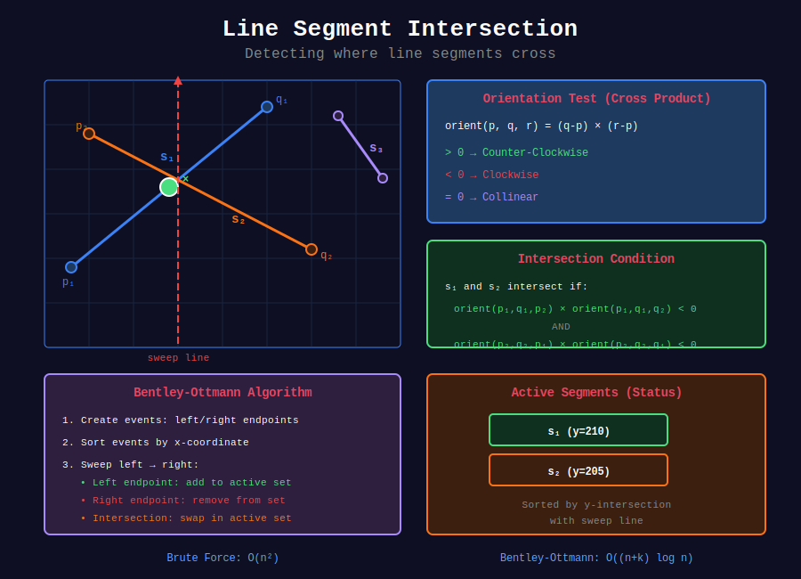

<div align="center">

# 📐 Line Segment Intersection

<p>
  
  
</p>

</div>

---

## 📊 Visual Overview

<div align="center">
  
</div>

---

## 🧭 Navigation

| ⬅️ Previous | 📂 Current | ➡️ Next |
|:------------|:----------:|--------:|
| [← 02. Coordinate Compression](../02_coordinate_compression/README.md) | **03. Line Segment Intersection** | [04. Angular Sweep →](../04_angular_sweep/README.md) |

---

## 📐 Mathematical Foundations

### 1️⃣ Line Segment Intersection Problem

**Given:** $n$ line segments in 2D plane  
**Find:** All pairs of intersecting segments

**Naive:** Check all pairs: $O(n^2)$  
**Sweep Line:** Bentley-Ottmann algorithm: $O((n + k) \log n)$ where $k$ = intersections

---

### 2️⃣ Orientation Test

**Cross Product** determines relative orientation of three points:

```math
\text{orient}(p, q, r) = (q_y - p_y)(r_x - q_x) - (q_x - p_x)(r_y - q_y)

```

**Result:**

- $> 0$: Counter-clockwise turn

- $< 0$: Clockwise turn

- $= 0$: Collinear

**Application:** Segments $\overline{p\_1p\_2}$ and $\overline{q\_1q\_2}$ intersect if orientations differ.

---

### 3️⃣ Segment Intersection Test

**Theorem:** Segments $s\_1 = \overline{p\_1p\_2}$ and $s\_2 = \overline{q\_1q\_2}$ intersect iff:

```math
\text{orient}(p_1, p_2, q_1) \cdot \text{orient}(p_1, p_2, q_2) < 0
\land
\text{orient}(q_1, q_2, p_1) \cdot \text{orient}(q_1, q_2, p_2) < 0

```

**Special case:** Check bounding box overlap for collinear segments.

**Time:** $O(1)$

---

### 4️⃣ Bentley-Ottmann Algorithm

**Idea:** Sweep vertical line left to right, maintain active segments.

**Data Structures:**
1. **Event queue:** Sorted by x-coordinate (endpoints, intersections)
2. **Status structure:** Active segments sorted by y-intersection with sweep line

**Events:**

- **Left endpoint:** Add segment to status

- **Right endpoint:** Remove segment from status

- **Intersection:** Swap segments in status, check new neighbors

**Invariant:** At sweep line position $x$, status contains all segments intersecting $x$, ordered by $y$.

---

### 5️⃣ Complexity Analysis

**Theorem:** Bentley-Ottmann runs in $O((n + k) \log n)$ time.

**Proof:**

- $n$ segments → $2n$ endpoint events

- $k$ intersections → $k$ intersection events

- Each event: $O(\log n)$ operations on status structure

- Total: $O((2n + k) \log n) = O((n + k) \log n)$ ∎

**Space:** $O(n + k)$ for events and status structure.

---

### 6️⃣ Line Intersection Formula

**Given:** Lines $L\_1: y = m\_1x + b\_1$ and $L\_2: y = m\_2x + b\_2$

**Intersection point:**

```math
x = \frac{b_2 - b_1}{m_1 - m_2}, \quad y = m_1x + b_1

```

**For segments in parametric form:**

```math
p(t) = p_1 + t(p_2 - p_1), \quad q(s) = q_1 + s(q_2 - q_1)

```

Solve: $p\_1 + t(p\_2 - p\_1) = q\_1 + s(q\_2 - q\_1)$

**Time:** $O(1)$

---

### 7️⃣ Point on Segment Test

**Check if point $r$ is on segment $\overline{pq}$:**

```math
\text{collinear}(p, q, r) \land \min(p_x, q_x) \leq r_x \leq \max(p_x, q_x)
\land \min(p_y, q_y) \leq r_y \leq \max(p_y, q_y)

```

---

## 💻 Code Implementations

```python
from typing import List, Tuple, Optional
from dataclasses import dataclass
import math

# ==================== GEOMETRIC PRIMITIVES ====================

@dataclass
class Point:
    x: float
    y: float
    
    def __sub__(self, other):
        return Point(self.x - other.x, self.y - other.y)
    
    def __eq__(self, other):
        return abs(self.x - other.x) < 1e-9 and abs(self.y - other.y) < 1e-9

@dataclass
class Segment:
    p1: Point
    p2: Point
    id: int = 0

def cross_product(o: Point, a: Point, b: Point) -> float:
    """
    Cross product of vectors OA and OB.
    
    Returns:
        > 0: Counter-clockwise turn
        < 0: Clockwise turn
        = 0: Collinear
    
    Time: O(1)
    """
    return (a.x - o.x) * (b.y - o.y) - (a.y - o.y) * (b.x - o.x)

def orientation(p: Point, q: Point, r: Point) -> int:
    """
    Find orientation of ordered triplet (p, q, r).
    
    Returns:
        1: Counter-clockwise
        -1: Clockwise
        0: Collinear
    
    Time: O(1)
    """
    val = cross_product(p, q, r)
    if abs(val) < 1e-9:
        return 0
    return 1 if val > 0 else -1

def on_segment(p: Point, q: Point, r: Point) -> bool:
    """
    Check if point q lies on segment pr (assuming collinear).
    
    Time: O(1)
    """
    return (min(p.x, r.x) <= q.x <= max(p.x, r.x) and
            min(p.y, r.y) <= q.y <= max(p.y, r.y))

def segments_intersect(s1: Segment, s2: Segment) -> bool:
    """
    Check if two line segments intersect.
    
    Time: O(1), Space: O(1)
    """
    p1, q1 = s1.p1, s1.p2
    p2, q2 = s2.p1, s2.p2
    
    o1 = orientation(p1, q1, p2)
    o2 = orientation(p1, q1, q2)
    o3 = orientation(p2, q2, p1)
    o4 = orientation(p2, q2, q1)
    
    # General case
    if o1 != o2 and o3 != o4:
        return True
    
    # Special cases: collinear points
    if o1 == 0 and on_segment(p1, p2, q1):
        return True
    if o2 == 0 and on_segment(p1, q2, q1):
        return True
    if o3 == 0 and on_segment(p2, p1, q2):
        return True
    if o4 == 0 and on_segment(p2, q1, q2):
        return True
    
    return False

def line_intersection(s1: Segment, s2: Segment) -> Optional[Point]:
    """
    Find intersection point of two line segments (if exists).
    
    Time: O(1), Space: O(1)
    """
    x1, y1 = s1.p1.x, s1.p1.y
    x2, y2 = s1.p2.x, s1.p2.y
    x3, y3 = s2.p1.x, s2.p1.y
    x4, y4 = s2.p2.x, s2.p2.y
    
    denom = (x1 - x2) * (y3 - y4) - (y1 - y2) * (x3 - x4)
    
    if abs(denom) < 1e-9:
        return None  # Parallel or collinear
    
    t = ((x1 - x3) * (y3 - y4) - (y1 - y3) * (x3 - x4)) / denom
    u = -((x1 - x2) * (y1 - y3) - (y1 - y2) * (x1 - x3)) / denom
    
    if 0 <= t <= 1 and 0 <= u <= 1:
        x = x1 + t * (x2 - x1)
        y = y1 + t * (y2 - y1)
        return Point(x, y)
    
    return None

# ==================== BRUTE FORCE ====================

def find_intersections_brute(segments: List[Segment]) -> List[Tuple[int, int]]:
    """
    Find all pairs of intersecting segments (brute force).
    
    Time: O(n²), Space: O(k) where k = intersections
    """
    intersections = []
    n = len(segments)
    
    for i in range(n):
        for j in range(i + 1, n):
            if segments_intersect(segments[i], segments[j]):
                intersections.append((i, j))
    
    return intersections

# ==================== LEETCODE PROBLEMS ====================

def is_reflect(points: List[List[int]]) -> bool:
    """
    LeetCode 356: Line Reflection
    Check if points can be reflected across a vertical line.
    
    Time: O(n log n), Space: O(n)
    """
    if not points:
        return True
    
    # Find potential reflection line (average of min and max x)
    min_x = min(p[0] for p in points)
    max_x = max(p[0] for p in points)
    line_x = (min_x + max_x) / 2
    
    # For each point, check if reflection exists
    point_set = set(map(tuple, points))
    
    for x, y in points:
        reflected_x = 2 * line_x - x
        if (reflected_x, y) not in point_set:
            return False
    
    return True

def max_points_on_line(points: List[List[int]]) -> int:
    """
    LeetCode 149: Max Points on a Line
    
    Time: O(n²), Space: O(n)
    """
    if len(points) <= 2:
        return len(points)
    
    def gcd(a: int, b: int) -> int:
        while b:
            a, b = b, a % b
        return a
    
    max_count = 0
    
    for i in range(len(points)):
        slopes = {}
        same = 1
        
        for j in range(len(points)):
            if i == j:
                continue
            
            dx = points[j][0] - points[i][0]
            dy = points[j][1] - points[i][1]
            
            if dx == 0 and dy == 0:
                same += 1
                continue
            
            # Normalize slope
            g = gcd(dx, dy)
            slope = (dx // g, dy // g)
            
            # Ensure consistent representation
            if slope[0] < 0:
                slope = (-slope[0], -slope[1])
            elif slope[0] == 0:
                slope = (0, 1 if slope[1] > 0 else -1)
            
            slopes[slope] = slopes.get(slope, 0) + 1
        
        current_max = same
        if slopes:
            current_max += max(slopes.values())
        
        max_count = max(max_count, current_max)
    
    return max_count

def check_straight_line(coordinates: List[List[int]]) -> bool:
    """
    LeetCode 1232: Check If It Is a Straight Line
    
    Time: O(n), Space: O(1)
    """
    if len(coordinates) <= 2:
        return True
    
    # Use cross product to avoid division
    x0, y0 = coordinates[0]
    x1, y1 = coordinates[1]
    
    for i in range(2, len(coordinates)):
        x, y = coordinates[i]
        # Check if (x1-x0, y1-y0) and (x-x0, y-y0) are parallel
        if (x1 - x0) * (y - y0) != (y1 - y0) * (x - x0):
            return False
    
    return True

def min_area_rect(points: List[List[int]]) -> int:
    """
    LeetCode 939: Minimum Area Rectangle
    
    Time: O(n²), Space: O(n)
    """
    point_set = set(map(tuple, points))
    min_area = float('inf')
    
    # Try all pairs of diagonal points
    for i in range(len(points)):
        x1, y1 = points[i]
        for j in range(i + 1, len(points)):
            x2, y2 = points[j]
            
            # Skip if not diagonal (same x or y)
            if x1 == x2 or y1 == y2:
                continue
            
            # Check if other two corners exist
            if (x1, y2) in point_set and (x2, y1) in point_set:
                area = abs(x1 - x2) * abs(y1 - y2)
                min_area = min(min_area, area)
    
    return min_area if min_area != float('inf') else 0

def outer_trees(trees: List[List[int]]) -> List[List[int]]:
    """
    LeetCode 587: Erect the Fence (Convex Hull - Graham Scan)
    
    Time: O(n log n), Space: O(n)
    """
    def cross(o, a, b):
        return (a[0] - o[0]) * (b[1] - o[1]) - (a[1] - o[1]) * (b[0] - o[0])
    
    if len(trees) <= 3:
        return trees
    
    # Sort points
    trees = sorted(set(map(tuple, trees)))
    
    # Build lower hull
    lower = []
    for p in trees:
        while len(lower) >= 2 and cross(lower[-2], lower[-1], p) < 0:
            lower.pop()
        lower.append(p)
    
    # Build upper hull
    upper = []
    for p in reversed(trees):
        while len(upper) >= 2 and cross(upper[-2], upper[-1], p) < 0:
            upper.pop()
        upper.append(p)
    
    # Remove duplicate points
    return list(map(list, set(lower + upper)))

def num_points_inside_circle(points: List[List[int]], 
                              queries: List[List[int]]) -> List[int]:
    """
    LeetCode 1828: Queries on Number of Points Inside a Circle
    
    Time: O(n * q), Space: O(1)
    """
    result = []
    
    for xc, yc, r in queries:
        count = 0
        for x, y in points:
            if (x - xc) ** 2 + (y - yc) ** 2 <= r ** 2:
                count += 1
        result.append(count)
    
    return result

def valid_square(p1: List[int], p2: List[int], 
                 p3: List[int], p4: List[int]) -> bool:
    """
    LeetCode 593: Valid Square
    
    Time: O(1), Space: O(1)
    """
    def dist_sq(a, b):
        return (a[0] - b[0]) ** 2 + (a[1] - b[1]) ** 2
    
    points = [p1, p2, p3, p4]
    dists = []
    
    # Calculate all pairwise distances
    for i in range(4):
        for j in range(i + 1, 4):
            dists.append(dist_sq(points[i], points[j]))
    
    dists.sort()
    
    # Valid square: 4 equal sides + 2 equal diagonals
    return (dists[0] > 0 and 
            dists[0] == dists[1] == dists[2] == dists[3] and
            dists[4] == dists[5] and 
            dists[4] == 2 * dists[0])

```

---

## 🎯 LeetCode Problems

### 🟢 Easy Problems

| # | Problem | Difficulty | Solution Pattern |
|---|---------|------------|------------------|
| 1232 | [Check If Straight Line](https://leetcode.com/problems/check-if-it-is-a-straight-line/) | Easy | Cross product |
| 593 | [Valid Square](https://leetcode.com/problems/valid-square/) | Easy | Distance check |

---

### 🟡 Medium Problems

| # | Problem | Difficulty | Solution Pattern |
|---|---------|------------|------------------|
| 149 | [Max Points on a Line](https://leetcode.com/problems/max-points-on-a-line/) | Medium | Slope counting |
| 939 | [Minimum Area Rectangle](https://leetcode.com/problems/minimum-area-rectangle/) | Medium | Diagonal check |
| 356 | [Line Reflection](https://leetcode.com/problems/line-reflection/) | Medium | Symmetry check |
| 1828 | [Queries on Points Inside Circle](https://leetcode.com/problems/queries-on-number-of-points-inside-a-circle/) | Medium | Distance formula |

---

### 🔴 Hard Problems

| # | Problem | Difficulty | Solution Pattern |
|---|---------|------------|------------------|
| 587 | [Erect the Fence](https://leetcode.com/problems/erect-the-fence/) | Hard | Convex hull (Graham scan) |
| 335 | [Self Crossing](https://leetcode.com/problems/self-crossing/) | Hard | Segment intersection |

---

## 📊 Complexity Summary

| Operation | Time | Space | Notes |
|-----------|:----:|:-----:|-------|
| Orientation test | O(1) | O(1) | Cross product |
| Segment intersection | O(1) | O(1) | 4 orientation tests |
| Line intersection point | O(1) | O(1) | Parametric equations |
| Brute force (n segments) | O(n²) | O(k) | Check all pairs |
| Bentley-Ottmann | O((n+k) log n) | O(n+k) | Optimal for many segments |
| Convex hull | O(n log n) | O(n) | Graham scan |

---

## 💡 Key Insights

1. **Cross product:** Fundamental for orientation tests
2. **Orientation test:** Determines turn direction (CCW/CW/collinear)
3. **General position:** Simplifies algorithms (no degeneracies)
4. **Sweep line:** Reduces dimension, processes events in order
5. **Precision:** Use integer arithmetic or epsilon comparisons
6. **Convex hull:** Related problem using sweep/orientation tests

---

## 🧭 Navigation

| ⬅️ Previous | 📂 Current | ➡️ Next |
|:------------|:----------:|--------:|
| [← 02. Coordinate Compression](../02_coordinate_compression/README.md) | **03. Line Segment Intersection** | [04. Angular Sweep →](../04_angular_sweep/README.md) |

