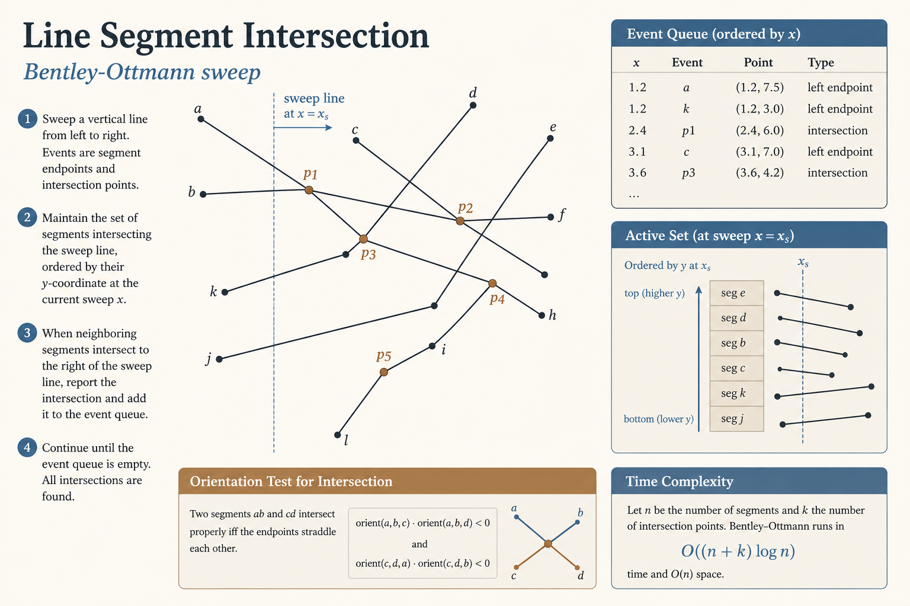
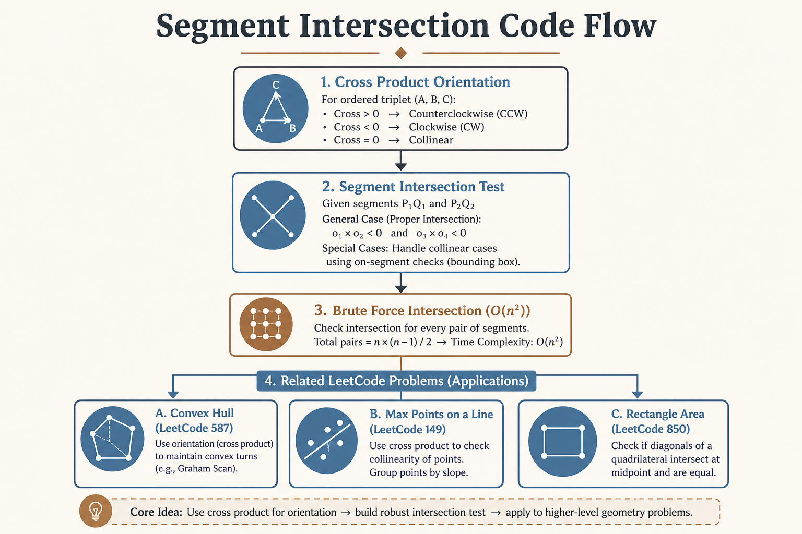

# 📐 Line Segment Intersection

### *Line Segment Intersection*

  
  

---

## 🎯 At a Glance

| | |
|:---|:---|
| **Difficulty** | Hard |
| **Problems** | 8 |

{: .highlight }
> **How to use this page:** Start with the visual overview, scan **At a Glance**, then work through theory → walkthroughs → code.

---

## 🧭 Navigation

| ⬅️ Previous | 📂 Current | ➡️ Next |
|:------------|:----------:|--------:|
| [← 02. Coordinate Compression](../02_coordinate_compression/README.md) | **03. Line Segment Intersection** | [04. Angular Sweep →](../04_angular_sweep/README.md) |

---

## 📐 Mathematical Foundation
### 1️⃣ Line Segment Intersection Problem

**Given:** $n$ line segments in 2D plane  
**Find:** All pairs of intersecting segments

**Naive:** Check all pairs: $O(n^2)$  
**Sweep Line:** Bentley-Ottmann algorithm: $O((n + k) \log n)$ where $k$ = intersections

---

### 2️⃣ Orientation Test

**Cross Product** determines relative orientation of three points:

$$\text{orient}(p, q, r) = (q_y - p_y)(r_x - q_x) - (q_x - p_x)(r_y - q_y)$$

**Result:**

- $> 0$: Counter-clockwise turn

- $< 0$: Clockwise turn

- $= 0$: Collinear

**Application:** Segments $\overline{p_1p_2}$ and $\overline{q_1q_2}$ intersect if orientations differ.

---

### 3️⃣ Segment Intersection Test

**Theorem:** Segments $s_1 = \overline{p_1p_2}$ and $s_2 = \overline{q_1q_2}$ intersect iff:

$$\text{orient}(p_1, p_2, q_1) \cdot \text{orient}(p_1, p_2, q_2) < 0
\land
\text{orient}(q_1, q_2, p_1) \cdot \text{orient}(q_1, q_2, p_2) < 0$$

**Special case:** Check bounding box overlap for collinear segments.

**Time:** $O(1)$

---

### 4️⃣ Bentley-Ottmann Algorithm

**Idea:** Sweep vertical line left to right, maintain active segments.

**Data Structures:**

1. **Event queue:** Sorted by x-coordinate (endpoints, intersections)

2. **Status structure:** Active segments sorted by y-intersection with sweep line

**Events:**

- **Left endpoint:** Add segment to status

- **Right endpoint:** Remove segment from status

- **Intersection:** Swap segments in status, check new neighbors

**Invariant:** At sweep line position $x$, status contains all segments intersecting $x$, ordered by $y$.

---

### 5️⃣ Complexity Analysis

**Theorem:** Bentley-Ottmann runs in $O((n + k) \log n)$ time.

**Proof:**

- $n$ segments → $2n$ endpoint events

- $k$ intersections → $k$ intersection events

- Each event: $O(\log n)$ operations on status structure

- Total: $O((2n + k) \log n) = O((n + k) \log n)$ ∎

**Space:** $O(n + k)$ for events and status structure.

---

### 6️⃣ Line Intersection Formula

**Given:** Lines $L_1: y = m_1x + b_1$ and $L_2: y = m_2x + b_2$

**Intersection point:**

$$x = \frac{b_2 - b_1}{m_1 - m_2}, \quad y = m_1x + b_1$$

**For segments in parametric form:**

$$p(t) = p_1 + t(p_2 - p_1), \quad q(s) = q_1 + s(q_2 - q_1)$$

Solve: $p_1 + t(p_2 - p_1) = q_1 + s(q_2 - q_1)$

**Time:** $O(1)$

---

### 7️⃣ Point on Segment Test

**Check if point $r$ is on segment $\overline{pq}$:**

$$\text{collinear}(p, q, r) \land \min(p_x, q_x) \leq r_x \leq \max(p_x, q_x)
\land \min(p_y, q_y) \leq r_y \leq \max(p_y, q_y)$$

---

## 📊 Visual Overview

  

---

## 💻 Code Implementations

---

## 🏆 LeetCode Problems

### 🟢 Easy Problems

| # | Problem | Difficulty | Solution Pattern |
|---|---------|------------|------------------|
| 1232 | [Check If Straight Line](https://leetcode.com/problems/check-if-it-is-a-straight-line/) | Easy | Cross product |
| 593 | [Valid Square](https://leetcode.com/problems/valid-square/) | Easy | Distance check |

---

### 🟡 Medium Problems

| # | Problem | Difficulty | Solution Pattern |
|---|---------|------------|------------------|
| 149 | [Max Points on a Line](https://leetcode.com/problems/max-points-on-a-line/) | Medium | Slope counting |
| 939 | [Minimum Area Rectangle](https://leetcode.com/problems/minimum-area-rectangle/) | Medium | Diagonal check |
| 356 | [Line Reflection](https://leetcode.com/problems/line-reflection/) | Medium | Symmetry check |
| 1828 | [Queries on Points Inside Circle](https://leetcode.com/problems/queries-on-number-of-points-inside-a-circle/) | Medium | Distance formula |

---

### 🔴 Hard Problems

| # | Problem | Difficulty | Solution Pattern |
|---|---------|------------|------------------|
| 587 | [Erect the Fence](https://leetcode.com/problems/erect-the-fence/) | Hard | Convex hull (Graham scan) |
| 335 | [Self Crossing](https://leetcode.com/problems/self-crossing/) | Hard | Segment intersection |

---

## 📊 Complexity Summary

| Operation | Time | Space | Notes |
|-----------|:----:|:-----:|-------|
| Orientation test | O(1) | O(1) | Cross product |
| Segment intersection | O(1) | O(1) | 4 orientation tests |
| Line intersection point | O(1) | O(1) | Parametric equations |
| Brute force (n segments) | O(n²) | O(k) | Check all pairs |
| Bentley-Ottmann | O((n+k) log n) | O(n+k) | Optimal for many segments |
| Convex hull | O(n log n) | O(n) | Graham scan |

---

## 💡 Key Insights

1. **Cross product:** Fundamental for orientation tests

2. **Orientation test:** Determines turn direction (CCW/CW/collinear)

3. **General position:** Simplifies algorithms (no degeneracies)

4. **Sweep line:** Reduces dimension, processes events in order

5. **Precision:** Use integer arithmetic or epsilon comparisons

6. **Convex hull:** Related problem using sweep/orientation tests

---

## 📚 References & Learning Resources

### 📖 Core Concepts

| Resource | Description | Link |
|----------|-------------|------|
| **Line Segment Intersection** | GeeksforGeeks | [Intersection](https://www.geeksforgeeks.org/check-if-two-given-line-segments-intersect/) |
| **Convex Hull** | Wikipedia | [Convex hull](https://en.wikipedia.org/wiki/Convex_hull) |

### 📝 Practice

| Platform | Focus | Link |
|----------|-------|------|
| **LeetCode** | Geometry tag | [Problems](https://leetcode.com/tag/geometry/) |

---
