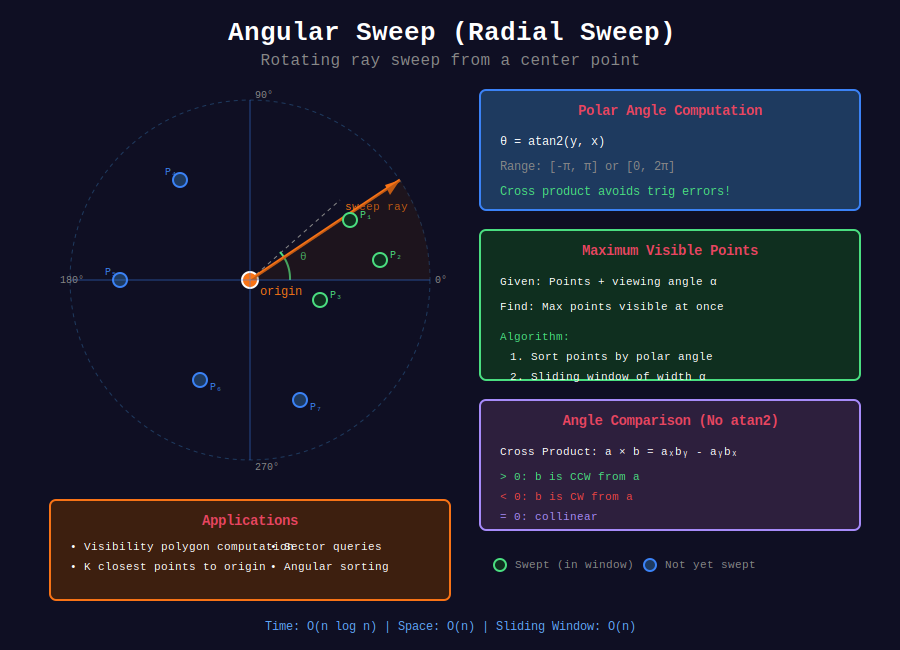

<div align="center">

# 🌀 Angular Sweep (Radial Sweep)

<p>
  
  
</p>

</div>

---

## 📊 Visual Overview

<div align="center">
  
</div>

---

## 🧭 Navigation

| ⬅️ Previous | 📂 Current | ➡️ Next |
|:------------|:----------:|--------:|
| [← 03. Line Segment Intersection](../03_line_segment_intersection/README.md) | **04. Angular Sweep** | [05. Rectangle Problems →](../05_rectangle_problems/README.md) |

---

## 📐 Mathematical Foundations

### 1️⃣ Angular Sweep Definition

**Linear sweep:** Line moves in one direction (left to right)  
**Angular sweep:** Ray rotates around a point (0° to 360°)

**Applications:**

- Visibility problems

- Closest pair from a point

- Angular sorting

- Sector queries

---

### 2️⃣ Polar Angle Computation

**Angle of vector $(x, y)$ from origin:**

$$\theta = \text{atan2}(y, x)$$

**Range:** $[-\pi, \pi]$ or $[0, 2\pi]$

**Properties:**

- atan2 handles all quadrants correctly

- atan2(0, 0) is undefined

- Use cross product for comparison without computing actual angle

---

### 3️⃣ Angle Comparison without atan2

**Compare angles** of vectors $\vec{a}$ and $\vec{b}$ using cross product:

$$\vec{a} \times \vec{b} = a_x b_y - a_y b_x$$

- $> 0$: $\vec{b}$ is counter-clockwise from $\vec{a}$

- $< 0$: $\vec{b}$ is clockwise from $\vec{a}$

- $= 0$: Collinear

**Advantage:** Avoids floating point errors from trigonometric functions.

---

### 4️⃣ Visibility Polygon

**Problem:** Given point $p$ and obstacles, find visible region.

**Algorithm:**

1. Sort all obstacle vertices by angle from $p$

2. Rotate ray from $p$ through all angles

3. Track closest intersection with obstacles

4. Build visibility polygon from visible vertices

**Time:** $O(n \log n)$ where $n$ = total vertices

---

### 5️⃣ K Closest Points

**Problem:** Find $k$ points closest to origin (or any point).

**Angular Sweep Approach:**

1. For each angle $\theta$, ray intersects points at various distances

2. Use sweep to maintain closest $k$ points

3. Can be optimized with proper data structures

**Simpler:** Use heap or quickselect: $O(n)$ average

**Actual heap solution:** $O(n \log k)$

---

### 6️⃣ Sector Query

**Problem:** Count points in sector defined by angles $[\theta_1, \theta_2]$ and radii $[r_1, r_2]$.

**Algorithm:**

1. Sort points by angle

2. Binary search for angular range

3. Filter by radius

**Time:** $O(n \log n)$ preprocessing, $O(\log n + k)$ query

---

## 💻 Code Implementations

```python
from typing import List, Tuple
import math
import heapq
from dataclasses import dataclass

# ==================== ANGULAR UTILITIES ====================

def polar_angle(x: float, y: float) -> float:
    """
    Compute polar angle of point (x, y).
    
    Returns angle in range [-π, π]
    Time: O(1)
    """
    return math.atan2(y, x)

def angle_between_vectors(x1: float, y1: float, 
                          x2: float, y2: float) -> float:
    """
    Angle between two vectors.
    
    Time: O(1)
    """
    return math.atan2(x2, y2) - math.atan2(x1, y1)

def cross_product_sign(x1: float, y1: float, 
                       x2: float, y2: float) -> int:
    """
    Sign of cross product (compare angles without atan2).
    
    Returns:
        > 0: v2 is CCW from v1
        < 0: v2 is CW from v1
        = 0: Collinear
    
    Time: O(1)
    """
    cross = x1 * y2 - y1 * x2
    if abs(cross) < 1e-9:
        return 0
    return 1 if cross > 0 else -1

def sort_by_angle(points: List[Tuple[float, float]], 
                  center: Tuple[float, float] = (0, 0)) -> List[Tuple[float, float]]:
    """
    Sort points by polar angle from center.
    
    Time: O(n log n), Space: O(n)
    """
    cx, cy = center
    
    def angle_key(p):
        return math.atan2(p[1] - cy, p[0] - cx)
    
    return sorted(points, key=angle_key)

# ==================== K CLOSEST POINTS ====================

def k_closest(points: List[List[int]], k: int) -> List[List[int]]:
    """
    LeetCode 973: K Closest Points to Origin
    
    Time: O(n log k), Space: O(k)
    """
    # Max heap of distances (use negative for max heap in Python)
    heap = []
    
    for x, y in points:
        dist = -(x * x + y * y)  # Negative for max heap
        
        if len(heap) < k:
            heapq.heappush(heap, (dist, [x, y]))
        elif dist > heap[0][0]:
            heapq.heapreplace(heap, (dist, [x, y]))
    
    return [point for _, point in heap]

def k_closest_quickselect(points: List[List[int]], k: int) -> List[List[int]]:
    """
    K Closest using Quickselect (average O(n)).
    
    Time: O(n) average, O(n²) worst, Space: O(1)
    """
    def distance(point):
        return point[0] ** 2 + point[1] ** 2
    
    def partition(left, right, pivot_idx):
        pivot_dist = distance(points[pivot_idx])
        points[pivot_idx], points[right] = points[right], points[pivot_idx]
        
        store_idx = left
        for i in range(left, right):
            if distance(points[i]) < pivot_dist:
                points[store_idx], points[i] = points[i], points[store_idx]
                store_idx += 1
        
        points[right], points[store_idx] = points[store_idx], points[right]
        return store_idx
    
    def select(left, right, k_smallest):
        if left == right:
            return
        
        pivot_idx = left + (right - left) // 2
        pivot_idx = partition(left, right, pivot_idx)
        
        if k_smallest == pivot_idx:
            return
        elif k_smallest < pivot_idx:
            select(left, pivot_idx - 1, k_smallest)
        else:
            select(pivot_idx + 1, right, k_smallest)
    
    select(0, len(points) - 1, k)
    return points[:k]

# ==================== VISIBILITY PROBLEMS ====================

def visible_points(points: List[List[int]], 
                   angle: int, 
                   location: List[int]) -> int:
    """
    LeetCode 1610: Maximum Number of Visible Points
    
    Time: O(n log n), Space: O(n)
    """
    angles = []
    same_location = 0
    
    for x, y in points:
        if [x, y] == location:
            same_location += 1
        else:
            # Calculate angle relative to location
            angle_rad = math.atan2(y - location[1], x - location[0])
            angle_deg = math.degrees(angle_rad)
            angles.append(angle_deg)
    
    # Sort angles
    angles.sort()
    
    # Duplicate angles with +360 for circular sweep
    n = len(angles)
    angles = angles + [a + 360 for a in angles]
    
    # Sliding window to find max points within angle
    max_visible = 0
    left = 0
    
    for right in range(len(angles)):
        # Move left pointer until angle difference <= allowed angle
        while angles[right] - angles[left] > angle:
            left += 1
        
        # Count points in current window (only first n)
        if right < n:
            max_visible = max(max_visible, right - left + 1)
        else:
            max_visible = max(max_visible, min(right - left + 1, n))
    
    return max_visible + same_location

# ==================== ANGULAR SORTING ====================

def minimum_lines(stockPrices: List[List[int]]) -> int:
    """
    LeetCode 2280: Minimum Lines to Represent a Line Chart
    
    Time: O(n log n), Space: O(1)
    """
    if len(stockPrices) <= 1:
        return 0
    
    # Sort by day
    stockPrices.sort()
    
    lines = 1
    
    for i in range(2, len(stockPrices)):
        # Check if three consecutive points are collinear
        # Using cross product to avoid division
        x1, y1 = stockPrices[i-2]
        x2, y2 = stockPrices[i-1]
        x3, y3 = stockPrices[i]
        
        # Cross product: (x2-x1)(y3-y1) - (y2-y1)(x3-x1)
        cross = (x2 - x1) * (y3 - y1) - (y2 - y1) * (x3 - x1)
        
        if cross != 0:  # Not collinear
            lines += 1
    
    return lines

def best_line(points: List[List[int]]) -> List[int]:
    """
    CTCI 16.14: Best Line - Line passing through most points
    
    Time: O(n²), Space: O(n)
    """
    if len(points) <= 2:
        return [0, 1] if len(points) == 2 else [0]
    
    def gcd(a: int, b: int) -> int:
        while b:
            a, b = b, a % b
        return abs(a)
    
    best_line_points = []
    max_count = 0
    
    for i in range(len(points)):
        slopes = {}  # slope -> list of points
        vertical = []
        duplicates = 0
        
        for j in range(len(points)):
            if i == j:
                continue
            
            dx = points[j][0] - points[i][0]
            dy = points[j][1] - points[i][1]
            
            if dx == 0 and dy == 0:
                duplicates += 1
                continue
            
            if dx == 0:
                vertical.append(j)
            else:
                # Normalize slope
                g = gcd(dx, dy)
                slope = (dy // g, dx // g)
                
                if slope[1] < 0:
                    slope = (-slope[0], -slope[1])
                
                if slope not in slopes:
                    slopes[slope] = []
                slopes[slope].append(j)
        
        # Check vertical line
        if len(vertical) + 1 + duplicates > max_count:
            max_count = len(vertical) + 1 + duplicates
            best_line_points = [i] + vertical
        
        # Check each slope
        for slope, indices in slopes.items():
            if len(indices) + 1 + duplicates > max_count:
                max_count = len(indices) + 1 + duplicates
                best_line_points = [i] + indices
    
    return best_line_points

# ==================== SECTOR QUERIES ====================

class SectorQuery:
    """
    Query points in angular sector.
    """
    
    def __init__(self, points: List[Tuple[float, float]], 
                 center: Tuple[float, float] = (0, 0)):
        """
        Preprocess points for sector queries.
        
        Time: O(n log n), Space: O(n)
        """
        self.center = center
        cx, cy = center
        
        # Store points with their polar coordinates
        self.points_polar = []
        for x, y in points:
            dx, dy = x - cx, y - cy
            angle = math.atan2(dy, dx)
            radius = math.sqrt(dx * dx + dy * dy)
            self.points_polar.append((angle, radius, x, y))
        
        # Sort by angle
        self.points_polar.sort()
    
    def query(self, angle_min: float, angle_max: float, 
              radius_min: float, radius_max: float) -> List[Tuple[float, float]]:
        """
        Query points in sector [angle_min, angle_max] × [radius_min, radius_max].
        
        Time: O(log n + k), Space: O(k)
        """
        result = []
        
        for angle, radius, x, y in self.points_polar:
            if angle_min <= angle <= angle_max:
                if radius_min <= radius <= radius_max:
                    result.append((x, y))
            elif angle > angle_max:
                break
        
        return result

# ==================== CIRCULAR SWEEP ====================

def find_building_with_ocean_view(heights: List[int]) -> List[int]:
    """
    LeetCode 1762: Buildings With an Ocean View
    (Related to angular sweep - visibility from one direction)
    
    Time: O(n), Space: O(n)
    """
    result = []
    max_right = 0
    
    # Sweep from right to left
    for i in range(len(heights) - 1, -1, -1):
        if heights[i] > max_right:
            result.append(i)
        max_right = max(max_right, heights[i])
    
    return result[::-1]

def number_of_people_aware_of_secret(n: int, delay: int, forget: int) -> int:
    """
    LeetCode 2327: Number of People Aware of Secret
    (Time-based sweep with circular behavior)
    
    Time: O(n), Space: O(forget)
    """
    MOD = 10**9 + 7
    
    # dp[i] = new people who learned secret on day i
    dp = [0] * (n + 1)
    dp[1] = 1
    
    for day in range(2, n + 1):
        # People who can share (learned between day-forget+1 and day-delay)
        can_share = 0
        for past_day in range(max(1, day - forget + 1), day - delay + 1):
            if past_day > 0:
                can_share = (can_share + dp[past_day]) % MOD
        
        dp[day] = can_share
    
    # Count people who still remember on day n
    total = 0
    for day in range(max(1, n - forget + 1), n + 1):
        total = (total + dp[day]) % MOD
    
    return total

```

---

## 🎯 LeetCode Problems

### 🟡 Medium Problems

| # | Problem | Difficulty | Solution Pattern |
|---|---------|------------|------------------|
| 973 | [K Closest Points to Origin](https://leetcode.com/problems/k-closest-points-to-origin/) | Medium | Heap / Quickselect |
| 1610 | [Maximum Visible Points](https://leetcode.com/problems/maximum-number-of-visible-points/) | Medium | Angular sweep + sliding window |
| 2280 | [Minimum Lines to Represent Line Chart](https://leetcode.com/problems/minimum-lines-to-represent-a-line-chart/) | Medium | Cross product collinearity |
| 1762 | [Buildings With Ocean View](https://leetcode.com/problems/buildings-with-an-ocean-view/) | Medium | Right-to-left sweep |

---

### 🔴 Hard Problems

| # | Problem | Difficulty | Solution Pattern |
|---|---------|------------|------------------|
| 2127 | [Maximum Employees to Be Invited](https://leetcode.com/problems/maximum-employees-to-be-invited-to-a-meeting/) | Hard | Cycle detection + radial structure |
| 2327 | [Number of People Aware of Secret](https://leetcode.com/problems/number-of-people-aware-of-a-secret/) | Hard | Time sweep with window |

---

## 📊 Complexity Summary

| Operation | Time | Space | Notes |
|-----------|:----:|:-----:|-------|
| Polar angle computation | O(1) | O(1) | atan2 function |
| Angular sorting | O(n log n) | O(n) | Sort by angle |
| Cross product comparison | O(1) | O(1) | Avoids trig functions |
| K closest points (heap) | O(n log k) | O(k) | Maintain k smallest |
| K closest (quickselect) | O(n) avg | O(1) | Randomized |
| Visibility polygon | O(n log n) | O(n) | Sweep all angles |
| Sector query | O(log n + k) | O(n) | After preprocessing |

---

## 💡 Key Insights

1. **atan2 vs cross product:** Cross product avoids floating point errors

2. **Circular sweep:** Duplicate points at +360° for wraparound

3. **Sliding window:** For angular ranges, use circular window

4. **Quickselect:** $O(n)$ average for k-closest without full sort

5. **Collinearity:** Use cross product, not slope division

6. **Visibility:** Angular sweep from viewpoint, track obstructions

---

## 🧭 Navigation

| ⬅️ Previous | 📂 Current | ➡️ Next |
|:------------|:----------:|--------:|
| [← 03. Line Segment Intersection](../03_line_segment_intersection/README.md) | **04. Angular Sweep** | [05. Rectangle Problems →](../05_rectangle_problems/README.md) |

