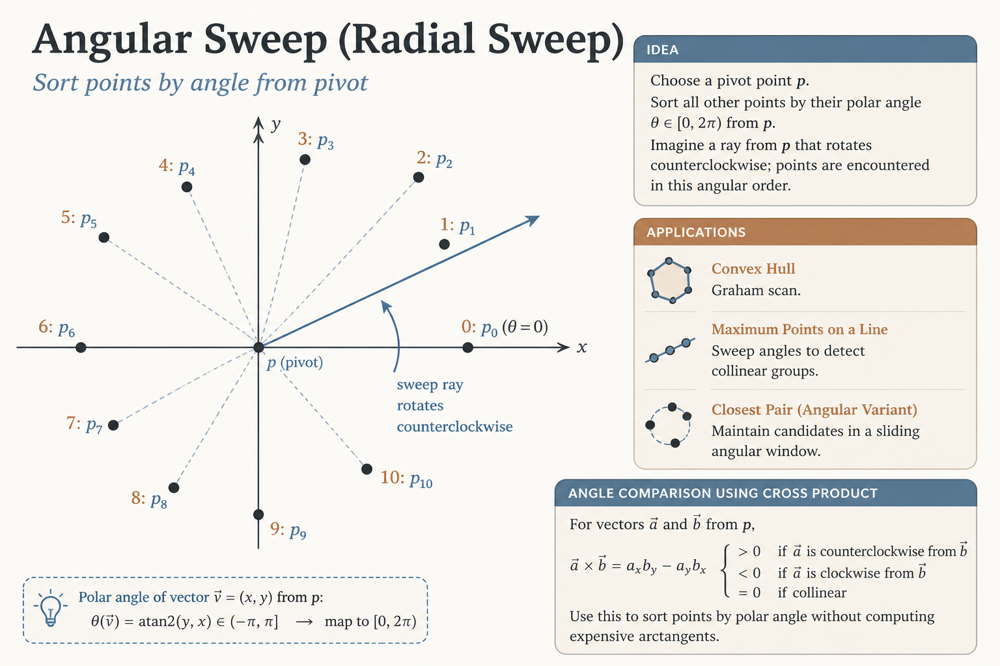
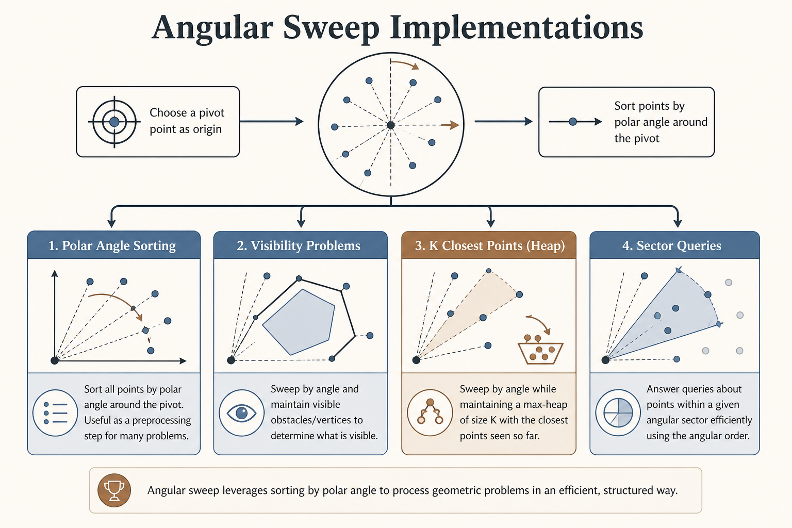

# 🌀 Angular Sweep (Radial Sweep)

### *Angular Sweep (Radial Sweep)*

  
  

---

## 🎯 At a Glance

| | |
|:---|:---|
| **Difficulty** | Hard |
| **Problems** | 6 |

> **How to use this page:** Start with the visual overview, scan **At a Glance**, then work through theory → walkthroughs → code.

---

## 🧭 Navigation

| ⬅️ Previous | 📂 Current | ➡️ Next |
|:------------|:----------:|--------:|
| [← 03. Line Segment Intersection](../03_line_segment_intersection/README.md) | **04. Angular Sweep** | [05. Rectangle Problems →](../05_rectangle_problems/README.md) |

---

## 📐 Mathematical Foundation
### 1️⃣ Angular Sweep Definition

**Linear sweep:** Line moves in one direction (left to right)  
**Angular sweep:** Ray rotates around a point (0° to 360°)

**Applications:**

- Visibility problems

- Closest pair from a point

- Angular sorting

- Sector queries

---

### 2️⃣ Polar Angle Computation

**Angle of vector $(x, y)$ from origin:**

$$\theta = \text{atan2}(y, x)$$

**Range:** $[-\pi, \pi]$ or $[0, 2\pi]$

**Properties:**

- atan2 handles all quadrants correctly

- atan2(0, 0) is undefined

- Use cross product for comparison without computing actual angle

---

### 3️⃣ Angle Comparison without atan2

**Compare angles** of vectors $\vec{a}$ and $\vec{b}$ using cross product:

$$\vec{a} \times \vec{b} = a_x b_y - a_y b_x$$

- $> 0$: $\vec{b}$ is counter-clockwise from $\vec{a}$

- $< 0$: $\vec{b}$ is clockwise from $\vec{a}$

- $= 0$: Collinear

**Advantage:** Avoids floating point errors from trigonometric functions.

---

### 4️⃣ Visibility Polygon

**Problem:** Given point $p$ and obstacles, find visible region.

**Algorithm:**

1. Sort all obstacle vertices by angle from $p$

2. Rotate ray from $p$ through all angles

3. Track closest intersection with obstacles

4. Build visibility polygon from visible vertices

**Time:** $O(n \log n)$ where $n$ = total vertices

---

### 5️⃣ K Closest Points

**Problem:** Find $k$ points closest to origin (or any point).

**Angular Sweep Approach:**

1. For each angle $\theta$, ray intersects points at various distances

2. Use sweep to maintain closest $k$ points

3. Can be optimized with proper data structures

**Simpler:** Use heap or quickselect: $O(n)$ average

**Actual heap solution:** $O(n \log k)$

---

### 6️⃣ Sector Query

**Problem:** Count points in sector defined by angles $[\theta_1, \theta_2]$ and radii $[r_1, r_2]$.

**Algorithm:**

1. Sort points by angle

2. Binary search for angular range

3. Filter by radius

**Time:** $O(n \log n)$ preprocessing, $O(\log n + k)$ query

---

## 📊 Visual Overview

  

---

## 💻 Code Implementations

---

## 🏆 LeetCode Problems

### 🟡 Medium Problems
| # | Problem | Difficulty | Solution Pattern |
|---|---------|------------|------------------|
| 973 | [K Closest Points to Origin](https://leetcode.com/problems/k-closest-points-to-origin/) | Medium | Heap / Quickselect |
| 1610 | [Maximum Visible Points](https://leetcode.com/problems/maximum-number-of-visible-points/) | Medium | Angular sweep + sliding window |
| 2280 | [Minimum Lines to Represent Line Chart](https://leetcode.com/problems/minimum-lines-to-represent-a-line-chart/) | Medium | Cross product collinearity |
| 1762 | [Buildings With Ocean View](https://leetcode.com/problems/buildings-with-an-ocean-view/) | Medium | Right-to-left sweep |

---

### 🔴 Hard Problems
| # | Problem | Difficulty | Solution Pattern |
|---|---------|------------|------------------|
| 2127 | [Maximum Employees to Be Invited](https://leetcode.com/problems/maximum-employees-to-be-invited-to-a-meeting/) | Hard | Cycle detection + radial structure |
| 2327 | [Number of People Aware of Secret](https://leetcode.com/problems/number-of-people-aware-of-a-secret/) | Hard | Time sweep with window |

---

## 📊 Complexity Summary

| Operation | Time | Space | Notes |
|-----------|:----:|:-----:|-------|
| Polar angle computation | O(1) | O(1) | atan2 function |
| Angular sorting | O(n log n) | O(n) | Sort by angle |
| Cross product comparison | O(1) | O(1) | Avoids trig functions |
| K closest points (heap) | O(n log k) | O(k) | Maintain k smallest |
| K closest (quickselect) | O(n) avg | O(1) | Randomized |
| Visibility polygon | O(n log n) | O(n) | Sweep all angles |
| Sector query | O(log n + k) | O(n) | After preprocessing |

---

## 💡 Key Insights

1. **atan2 vs cross product:** Cross product avoids floating point errors

2. **Circular sweep:** Duplicate points at +360° for wraparound

3. **Sliding window:** For angular ranges, use circular window

4. **Quickselect:** $O(n)$ average for k-closest without full sort

5. **Collinearity:** Use cross product, not slope division

6. **Visibility:** Angular sweep from viewpoint, track obstructions

---

## 📚 References & Learning Resources

### 📖 Core Concepts
| Resource | Description | Link |
|----------|-------------|------|
| **Angular Sweep** | GeeksforGeeks | [Angular sweep](https://www.geeksforgeeks.org/angular-sweep/) |
| **Polar Sorting** | CP-Algorithms | [Geometry](https://cp-algorithms.com/geometry/) |

### 📝 Practice
| Platform | Focus | Link |
|----------|-------|------|
| **LeetCode** | Geometry tag | [Problems](https://leetcode.com/tag/geometry/) |

---
