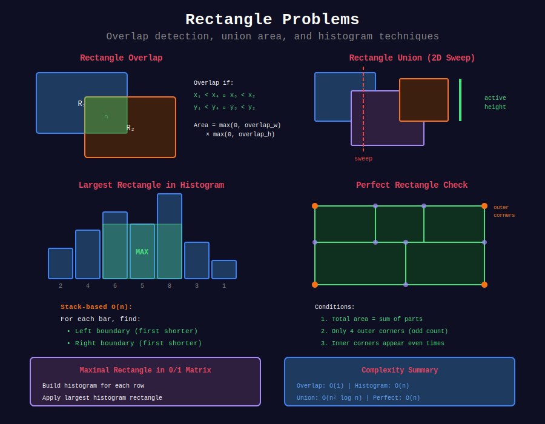

<div align="center">

# ▭ Rectangle Problems

<p>
  
  
</p>

</div>

---

## 📊 Visual Overview

<div align="center">
  
</div>

---

## 🧭 Navigation

| ⬅️ Previous | 📂 Current | ➡️ Next |
|:------------|:----------:|--------:|
| [← 04. Angular Sweep](../04_angular_sweep/README.md) | **05. Rectangle Problems** | [06. Closest Pair →](../06_closest_pair/README.md) |

---

## 📐 Mathematical Foundations

### 1️⃣ Rectangle Representation

**Axis-aligned rectangle:** $R = [x_1, x_2] \times [y_1, y_2]$

**Properties:**
- Area: $(x_2 - x_1) \times (y_2 - y_1)$
- Perimeter: $2 \times ((x_2 - x_1) + (y_2 - y_1))$
- Diagonal: $\sqrt{(x_2 - x_1)^2 + (y_2 - y_1)^2}$

---

### 2️⃣ Rectangle Overlap Test

**Rectangles $R_1 = [x_1, x_2] \times [y_1, y_2]$ and $R_2 = [x_3, x_4] \times [y_3, y_4]$ overlap iff:**

$$x_1 < x_4 \land x_3 < x_2 \land y_1 < y_4 \land y_3 < y_2$$

**Overlap area:**

$$A = \max(0, \min(x_2, x_4) - \max(x_1, x_3)) \times \max(0, \min(y_2, y_4) - \max(y_1, y_3))$$

---

### 3️⃣ Rectangle Union Area

**Problem:** Given $n$ rectangles, find total area covered (with overlaps counted once).

**Naive:** Inclusion-exclusion: $O(2^n)$

**Sweep Line:** $O(n^2 \log n)$ with merge intervals  
**Optimal:** $O(n \log n)$ with segment tree

**Algorithm:**
1. Sweep vertical line left to right
2. Maintain active y-intervals at each x-position
3. Calculate area contribution: $\text{width} \times \text{active\_height}$

---

### 4️⃣ Maximum Rectangle in Histogram

**Problem:** Find largest rectangle in histogram.

**Stack-based sweep:** $O(n)$ time

**Key Idea:** For each bar, find:
- Left boundary: first bar shorter than current
- Right boundary: first bar shorter than current

**Area with bar $i$ as minimum:**

$$\text{area}_i = \text{height}[i] \times (\text{right}_i - \text{left}_i - 1)$$

---

### 5️⃣ Perfect Rectangle

**Problem:** Check if $n$ rectangles form perfect large rectangle (no gaps/overlaps).

**Conditions:**
1. Total area = sum of individual areas
2. Only 4 corners appear odd number of times (outer corners)
3. All other points appear even number of times (internal corners)

**Time:** $O(n)$ with hash set

---

## 💻 Code Implementations

```python
from typing import List, Tuple
from collections import defaultdict

# ==================== BASIC RECTANGLE OPERATIONS ====================

def rectangle_overlap(rec1: List[int], rec2: List[int]) -> bool:
    """
    LeetCode 836: Rectangle Overlap
    
    Time: O(1), Space: O(1)
    """
    x1, y1, x2, y2 = rec1
    x3, y3, x4, y4 = rec2
    
    # Check if NOT overlapping, then negate
    return not (x2 <= x3 or x4 <= x1 or y2 <= y3 or y4 <= y1)


def compute_area(ax1: int, ay1: int, ax2: int, ay2: int,
                 bx1: int, by1: int, bx2: int, by2: int) -> int:
    """
    LeetCode 223: Rectangle Area
    
    Time: O(1), Space: O(1)
    """
    # Area of both rectangles
    area1 = (ax2 - ax1) * (ay2 - ay1)
    area2 = (bx2 - bx1) * (by2 - by1)
    
    # Overlap area
    overlap_width = max(0, min(ax2, bx2) - max(ax1, bx1))
    overlap_height = max(0, min(ay2, by2) - max(ay1, by1))
    overlap_area = overlap_width * overlap_height
    
    return area1 + area2 - overlap_area


def min_area_rect(points: List[List[int]]) -> int:
    """
    LeetCode 939: Minimum Area Rectangle
    
    Time: O(n²), Space: O(n)
    """
    point_set = set(map(tuple, points))
    min_area = float('inf')
    
    # Try all pairs of diagonal corners
    for i in range(len(points)):
        x1, y1 = points[i]
        for j in range(i + 1, len(points)):
            x2, y2 = points[j]
            
            # Skip if not diagonal
            if x1 == x2 or y1 == y2:
                continue
            
            # Check if other two corners exist
            if (x1, y2) in point_set and (x2, y1) in point_set:
                area = abs(x1 - x2) * abs(y1 - y2)
                min_area = min(min_area, area)
    
    return min_area if min_area != float('inf') else 0


def min_area_rect_ii(points: List[List[int]]) -> float:
    """
    LeetCode 963: Minimum Area Rectangle II (any orientation)
    
    Time: O(n² log n), Space: O(n²)
    """
    n = len(points)
    if n < 4:
        return 0.0
    
    # For each pair of points, they could be diagonal of rectangle
    # Store center and dimensions
    rectangles = defaultdict(list)
    
    for i in range(n):
        for j in range(i + 1, n):
            x1, y1 = points[i]
            x2, y2 = points[j]
            
            # Center of potential rectangle
            cx = (x1 + x2) / 2
            cy = (y1 + y2) / 2
            
            # Distance (diagonal length squared)
            d2 = (x1 - x2) ** 2 + (y1 - y2) ** 2
            
            rectangles[(cx, cy, d2)].append((x1, y1, x2, y2))
    
    min_area = float('inf')
    
    for key, diagonals in rectangles.items():
        if len(diagonals) < 2:
            continue
        
        # Try all pairs of diagonals with same center and length
        for k in range(len(diagonals)):
            for l in range(k + 1, len(diagonals)):
                x1, y1, x2, y2 = diagonals[k]
                x3, y3, x4, y4 = diagonals[l]
                
                # Check if perpendicular (dot product = 0)
                dot = (x2 - x1) * (x4 - x3) + (y2 - y1) * (y4 - y3)
                if abs(dot) < 1e-6:  # Perpendicular
                    # Calculate area
                    side1 = math.sqrt((x1 - x3) ** 2 + (y1 - y3) ** 2)
                    side2 = math.sqrt((x1 - x4) ** 2 + (y1 - y4) ** 2)
                    area = side1 * side2
                    min_area = min(min_area, area)
    
    return min_area if min_area != float('inf') else 0.0


# ==================== HISTOGRAM PROBLEMS ====================

def largest_rectangle_area(heights: List[int]) -> int:
    """
    LeetCode 84: Largest Rectangle in Histogram
    
    Time: O(n), Space: O(n)
    """
    stack = []  # Stack of indices
    max_area = 0
    heights = heights + [0]  # Sentinel
    
    for i, h in enumerate(heights):
        while stack and heights[stack[-1]] > h:
            height = heights[stack.pop()]
            width = i if not stack else i - stack[-1] - 1
            max_area = max(max_area, height * width)
        stack.append(i)
    
    return max_area


def maximal_rectangle(matrix: List[List[str]]) -> int:
    """
    LeetCode 85: Maximal Rectangle
    
    Time: O(m * n), Space: O(n)
    """
    if not matrix or not matrix[0]:
        return 0
    
    n = len(matrix[0])
    heights = [0] * n
    max_area = 0
    
    for row in matrix:
        # Update heights
        for i in range(n):
            if row[i] == '1':
                heights[i] += 1
            else:
                heights[i] = 0
        
        # Find max rectangle in current histogram
        max_area = max(max_area, largest_rectangle_area(heights))
    
    return max_area


def maximal_square(matrix: List[List[str]]) -> int:
    """
    LeetCode 221: Maximal Square
    
    Time: O(m * n), Space: O(n)
    """
    if not matrix or not matrix[0]:
        return 0
    
    m, n = len(matrix), len(matrix[0])
    dp = [0] * n
    max_side = 0
    prev = 0
    
    for i in range(m):
        for j in range(n):
            temp = dp[j]
            if matrix[i][j] == '1':
                if j == 0:
                    dp[j] = 1
                else:
                    dp[j] = min(dp[j], dp[j-1], prev) + 1
                max_side = max(max_side, dp[j])
            else:
                dp[j] = 0
            prev = temp
    
    return max_side * max_side


# ==================== PERFECT RECTANGLE ====================

def is_rectangle_cover(rectangles: List[List[int]]) -> bool:
    """
    LeetCode 391: Perfect Rectangle
    
    Time: O(n), Space: O(n)
    """
    area = 0
    corners = set()
    
    # Track corners and total area
    for x1, y1, x2, y2 in rectangles:
        area += (x2 - x1) * (y2 - y1)
        
        # Add/remove corners from set
        for corner in [(x1, y1), (x1, y2), (x2, y1), (x2, y2)]:
            if corner in corners:
                corners.remove(corner)
            else:
                corners.add(corner)
    
    # Should have exactly 4 corners (outer corners)
    if len(corners) != 4:
        return False
    
    # Check if total area matches bounding rectangle
    x1 = min(x for x, y in corners)
    y1 = min(y for x, y in corners)
    x2 = max(x for x, y in corners)
    y2 = max(y for x, y in corners)
    
    expected_area = (x2 - x1) * (y2 - y1)
    
    return area == expected_area


# ==================== RECTANGLE UNION ====================

def rectangle_area_ii(rectangles: List[List[int]]) -> int:
    """
    LeetCode 850: Rectangle Area II
    (Covered in coordinate compression, included for completeness)
    
    Time: O(n² log n), Space: O(n)
    """
    MOD = 10**9 + 7
    
    # Collect x-coordinates
    xs = sorted(set([x for x1, _, x2, _ in rectangles for x in (x1, x2)]))
    
    # Create y-events
    events = []
    for x1, y1, x2, y2 in rectangles:
        events.append((y1, x1, x2, 1))
        events.append((y2, x1, x2, -1))
    
    events.sort()
    
    def merge_intervals(intervals):
        if not intervals:
            return 0
        intervals.sort()
        total = 0
        start, end = intervals[0]
        for s, e in intervals[1:]:
            if s <= end:
                end = max(end, e)
            else:
                total += end - start
                start, end = s, e
        total += end - start
        return total
    
    area = 0
    prev_y = 0
    active = []
    
    i = 0
    while i < len(events):
        curr_y = events[i][0]
        
        if active and curr_y > prev_y:
            width = merge_intervals(active[:])
            height = curr_y - prev_y
            area = (area + width * height) % MOD
        
        while i < len(events) and events[i][0] == curr_y:
            _, x1, x2, delta = events[i]
            if delta == 1:
                active.append((x1, x2))
            else:
                active.remove((x1, x2))
            i += 1
        
        prev_y = curr_y
    
    return area


# ==================== MISC RECTANGLE PROBLEMS ====================

def count_corners_rectangles(grid: List[List[int]]) -> int:
    """
    LeetCode 750: Number Of Corner Rectangles
    
    Time: O(m * n²), Space: O(n²)
    """
    count = 0
    m, n = len(grid), len(grid[0])
    
    # For each pair of rows
    for i in range(m):
        for j in range(i + 1, m):
            # Count shared 1's in these two rows
            shared = 0
            for k in range(n):
                if grid[i][k] == 1 and grid[j][k] == 1:
                    shared += 1
            
            # Number of rectangles with these two rows
            count += shared * (shared - 1) // 2
    
    return count


def pond_sizes(land: List[List[int]]) -> List[int]:
    """
    CTCI 16.19: Pond Sizes (related to rectangle flood fill)
    
    Time: O(m * n), Space: O(m * n)
    """
    if not land:
        return []
    
    m, n = len(land), len(land[0])
    visited = [[False] * n for _ in range(m)]
    pond_sizes = []
    
    def dfs(i, j):
        if (i < 0 or i >= m or j < 0 or j >= n or 
            visited[i][j] or land[i][j] != 0):
            return 0
        
        visited[i][j] = True
        size = 1
        
        # Check all 8 directions
        for di in [-1, 0, 1]:
            for dj in [-1, 0, 1]:
                if di == 0 and dj == 0:
                    continue
                size += dfs(i + di, j + dj)
        
        return size
    
    for i in range(m):
        for j in range(n):
            if land[i][j] == 0 and not visited[i][j]:
                size = dfs(i, j)
                pond_sizes.append(size)
    
    return sorted(pond_sizes)


import math

def projection_area(grid: List[List[int]]) -> int:
    """
    LeetCode 883: Projection Area of 3D Shapes
    
    Time: O(n²), Space: O(1)
    """
    n = len(grid)
    
    # Top view: count non-zero cells
    top = sum(1 for row in grid for val in row if val > 0)
    
    # Front view: max in each row
    front = sum(max(row) for row in grid)
    
    # Side view: max in each column
    side = sum(max(grid[i][j] for i in range(n)) for j in range(n))
    
    return top + front + side
```

---

## 🎯 LeetCode Problems

### 🟢 Easy Problems

| # | Problem | Difficulty | Solution Pattern |
|---|---------|------------|------------------|
| 836 | [Rectangle Overlap](https://leetcode.com/problems/rectangle-overlap/) | Easy | Overlap test |
| 883 | [Projection Area of 3D Shapes](https://leetcode.com/problems/projection-area-of-3d-shapes/) | Easy | Max projections |

---

### 🟡 Medium Problems

| # | Problem | Difficulty | Solution Pattern |
|---|---------|------------|------------------|
| 223 | [Rectangle Area](https://leetcode.com/problems/rectangle-area/) | Medium | Overlap calculation |
| 939 | [Minimum Area Rectangle](https://leetcode.com/problems/minimum-area-rectangle/) | Medium | Diagonal pairs |
| 963 | [Minimum Area Rectangle II](https://leetcode.com/problems/minimum-area-rectangle-ii/) | Medium | Any orientation |
| 221 | [Maximal Square](https://leetcode.com/problems/maximal-square/) | Medium | DP on histogram |
| 750 | [Number Of Corner Rectangles](https://leetcode.com/problems/number-of-corner-rectangles/) | Medium | Row pairs |

---

### 🔴 Hard Problems

| # | Problem | Difficulty | Solution Pattern |
|---|---------|------------|------------------|
| 84 | [Largest Rectangle in Histogram](https://leetcode.com/problems/largest-rectangle-in-histogram/) | Hard | Monotonic stack |
| 85 | [Maximal Rectangle](https://leetcode.com/problems/maximal-rectangle/) | Hard | Histogram per row |
| 391 | [Perfect Rectangle](https://leetcode.com/problems/perfect-rectangle/) | Hard | Corner tracking |
| 850 | [Rectangle Area II](https://leetcode.com/problems/rectangle-area-ii/) | Hard | 2D sweep + compression |

---

## 📊 Complexity Summary

| Problem | Time | Space | Technique |
|---------|:----:|:-----:|-----------|
| Rectangle overlap | O(1) | O(1) | Condition check |
| Rectangle area | O(1) | O(1) | Overlap subtraction |
| Min area rect | O(n²) | O(n) | Diagonal pairs |
| Histogram max rect | O(n) | O(n) | Monotonic stack |
| Maximal rectangle | O(mn) | O(n) | Histogram per row |
| Perfect rectangle | O(n) | O(n) | Corner tracking |
| Rectangle union | O(n² log n) | O(n) | 2D sweep |

---

## 💡 Key Insights

1. **Overlap test:** Check projection on both axes
2. **Stack technique:** Optimal for histogram problems
3. **2D to 1D:** Reduce matrix problems to histogram
4. **Corner tracking:** XOR-like behavior for perfect rectangle
5. **Diagonal pairs:** For finding rectangles from points
6. **Sweep line:** Efficient for union/intersection of many rectangles

---

## 🧭 Navigation

| ⬅️ Previous | 📂 Current | ➡️ Next |
|:------------|:----------:|--------:|
| [← 04. Angular Sweep](../04_angular_sweep/README.md) | **05. Rectangle Problems** | [06. Closest Pair →](../06_closest_pair/README.md) |

