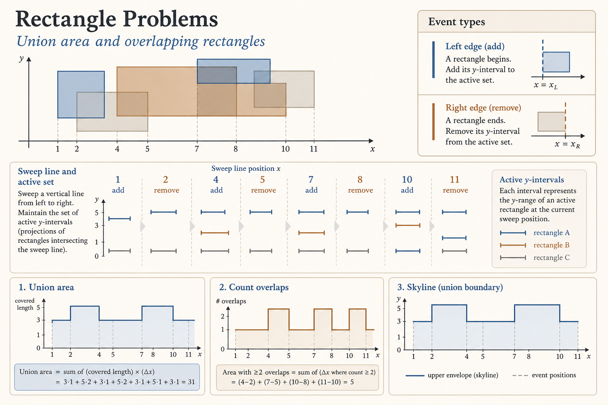
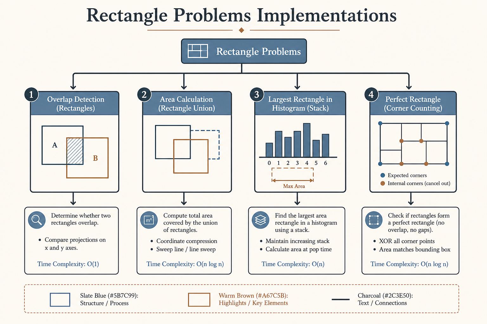

# ▭ Rectangle Problems

### *Rectangle Problems*

  
  

---

## 🎯 At a Glance

| | |
|:---|:---|
| **Difficulty** | Medium to Hard |
| **Problems** | 10 |

{: .highlight }
> **How to use this page:** Start with the visual overview, scan **At a Glance**, then work through theory → walkthroughs → code.

---

## 🧭 Navigation

| ⬅️ Previous | 📂 Current | ➡️ Next |
|:------------|:----------:|--------:|
| [← 04. Angular Sweep](../04_angular_sweep/README.md) | **05. Rectangle Problems** | [06. Closest Pair →](../06_closest_pair/README.md) |

---

## 📐 Mathematical Foundation
### 1️⃣ Rectangle Representation

**Axis-aligned rectangle:** $R = [x_1, x_2] \times [y_1, y_2]$

**Properties:**

- Area: $(x_2 - x_1) \times (y_2 - y_1)$

- Perimeter: $2 \times ((x_2 - x_1) + (y_2 - y_1))$

- Diagonal: $\sqrt{(x_2 - x_1)^2 + (y_2 - y_1)^2}$

---

### 2️⃣ Rectangle Overlap Test

**Rectangles $R_1 = [x_1, x_2] \times [y_1, y_2]$ and $R_2 = [x_3, x_4] \times [y_3, y_4]$ overlap iff:**

$$x_1 < x_4 \land x_3 < x_2 \land y_1 < y_4 \land y_3 < y_2$$

**Overlap area:**

$$A = \max(0, \min(x_2, x_4) - \max(x_1, x_3)) \times \max(0, \min(y_2, y_4) - \max(y_1, y_3))$$

---

### 3️⃣ Rectangle Union Area

**Problem:** Given $n$ rectangles, find total area covered (with overlaps counted once).

**Naive:** Inclusion-exclusion: $O(2^n)$

**Sweep Line:** $O(n^2 \log n)$ with merge intervals  
**Optimal:** $O(n \log n)$ with segment tree

**Algorithm:**

1. Sweep vertical line left to right

2. Maintain active y-intervals at each x-position

3. Calculate area contribution: $\text{width} \times \text{active\_height}$

---

### 4️⃣ Maximum Rectangle in Histogram

**Problem:** Find largest rectangle in histogram.

**Stack-based sweep:** $O(n)$ time

**Key Idea:** For each bar, find:

- Left boundary: first bar shorter than current

- Right boundary: first bar shorter than current

**Area with bar $i$ as minimum:**

$$\text{area}_i = \text{height}[i] \times (\text{right}_i - \text{left}_i - 1)$$

---

### 5️⃣ Perfect Rectangle

**Problem:** Check if $n$ rectangles form perfect large rectangle (no gaps/overlaps).

**Conditions:**

1. Total area = sum of individual areas

2. Only 4 corners appear odd number of times (outer corners)

3. All other points appear even number of times (internal corners)

**Time:** $O(n)$ with hash set

---

## 📊 Visual Overview

  

---

## 💻 Code Implementations

---

## 🏆 LeetCode Problems

### 🟢 Easy Problems

| # | Problem | Difficulty | Solution Pattern |
|---|---------|------------|------------------|
| 836 | [Rectangle Overlap](https://leetcode.com/problems/rectangle-overlap/) | Easy | Overlap test |
| 883 | [Projection Area of 3D Shapes](https://leetcode.com/problems/projection-area-of-3d-shapes/) | Easy | Max projections |

---

### 🟡 Medium Problems

| # | Problem | Difficulty | Solution Pattern |
|---|---------|------------|------------------|
| 223 | [Rectangle Area](https://leetcode.com/problems/rectangle-area/) | Medium | Overlap calculation |
| 939 | [Minimum Area Rectangle](https://leetcode.com/problems/minimum-area-rectangle/) | Medium | Diagonal pairs |
| 963 | [Minimum Area Rectangle II](https://leetcode.com/problems/minimum-area-rectangle-ii/) | Medium | Any orientation |
| 221 | [Maximal Square](https://leetcode.com/problems/maximal-square/) | Medium | DP on histogram |
| 750 | [Number Of Corner Rectangles](https://leetcode.com/problems/number-of-corner-rectangles/) | Medium | Row pairs |

---

### 🔴 Hard Problems

| # | Problem | Difficulty | Solution Pattern |
|---|---------|------------|------------------|
| 84 | [Largest Rectangle in Histogram](https://leetcode.com/problems/largest-rectangle-in-histogram/) | Hard | Monotonic stack |
| 85 | [Maximal Rectangle](https://leetcode.com/problems/maximal-rectangle/) | Hard | Histogram per row |
| 391 | [Perfect Rectangle](https://leetcode.com/problems/perfect-rectangle/) | Hard | Corner tracking |
| 850 | [Rectangle Area II](https://leetcode.com/problems/rectangle-area-ii/) | Hard | 2D sweep + compression |

---

## 📊 Complexity Summary

| Problem | Time | Space | Technique |
|---------|:----:|:-----:|-----------|
| Rectangle overlap | O(1) | O(1) | Condition check |
| Rectangle area | O(1) | O(1) | Overlap subtraction |
| Min area rect | O(n²) | O(n) | Diagonal pairs |
| Histogram max rect | O(n) | O(n) | Monotonic stack |
| Maximal rectangle | O(mn) | O(n) | Histogram per row |
| Perfect rectangle | O(n) | O(n) | Corner tracking |
| Rectangle union | O(n² log n) | O(n) | 2D sweep |

---

## 💡 Key Insights

1. **Overlap test:** Check projection on both axes

2. **Stack technique:** Optimal for histogram problems

3. **2D to 1D:** Reduce matrix problems to histogram

4. **Corner tracking:** XOR-like behavior for perfect rectangle

5. **Diagonal pairs:** For finding rectangles from points

6. **Sweep line:** Efficient for union/intersection of many rectangles

---

## 📚 References & Learning Resources

### 📖 Core Concepts

| Resource | Description | Link |
|----------|-------------|------|
| **Rectangle Union** | GeeksforGeeks | [Rectangle area](https://www.geeksforgeeks.org/find-total-coverage-of-all-rectangles-in-a-2d-plane/) |
| **Histogram** | LeetCode discuss | [Largest rectangle](https://leetcode.com/problems/largest-rectangle-in-histogram/) |

### 📝 Practice

| Platform | Focus | Link |
|----------|-------|------|
| **LeetCode** | Geometry tag | [Problems](https://leetcode.com/tag/geometry/) |

---
