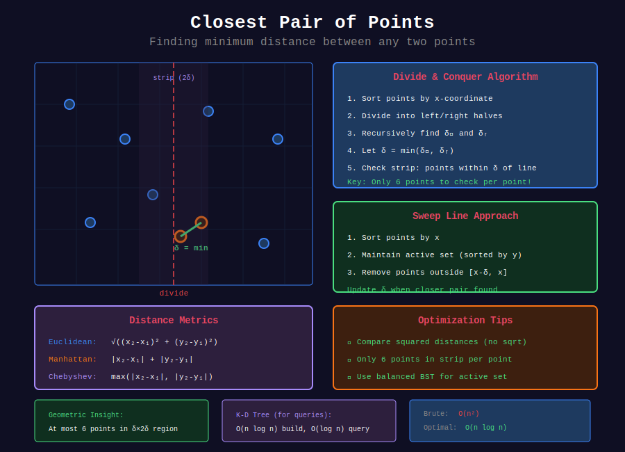

<div align="center">

# 🎯 Closest Pair of Points

<p>
  
  
</p>

</div>

---

## 📊 Visual Overview

<div align="center">
  
</div>

---

## 🧭 Navigation

| ⬅️ Previous | 📂 Current | ➡️ Next |
|:------------|:----------:|--------:|
| [← 05. Rectangle Problems](../05_rectangle_problems/README.md) | **06. Closest Pair** | [Sweep Line →](../README.md) |

---

## 📐 Mathematical Foundations

### 1️⃣ Closest Pair Problem

**Given:** $n$ points in 2D plane  
**Find:** Pair with minimum Euclidean distance

**Naive:** Check all pairs: $O(n^2)$

**Divide & Conquer:** $O(n \log n)$  
**Sweep Line:** $O(n \log n)$

---

### 2️⃣ Divide and Conquer Algorithm

**Algorithm:**

1. Sort points by x-coordinate: $O(n \log n)$

2. Divide into left and right halves

3. Recursively find closest pairs in each half

4. Combine: check pairs across the dividing line

**Key optimization:** Only check points within distance $\delta$ of dividing line.

**Recurrence:**

$$T(n) = 2T(n/2) + O(n) = O(n \log n)$$

---

### 3️⃣ Sweep Line Approach

**Algorithm:**

1. Sort points by x-coordinate

2. Sweep left to right, maintaining active points within distance $\delta$

3. For each point, check only points in "active window"

4. Update $\delta$ when closer pair found

**Active window:** Points with $x \in [x_{\text{current}} - \delta, x_{\text{current}}]$

**Key insight:** At most 6 points need to be checked per point (geometry constraint).

**Time:** $O(n \log n)$

---

### 4️⃣ Geometric Insight

**Theorem:** In strip of width $2\delta$ around dividing line, each point needs to check at most 6 points.

**Proof:**

- Divide strip into squares of side $\delta/2$

- Each square contains at most 1 point (otherwise distance < $\delta$)

- Current point can only interact with points in adjacent 8 squares

- But only 6 are to the right/above ∎

---

### 5️⃣ K Nearest Neighbors

**Extension:** Find $k$ nearest neighbors for each point.

**Algorithm:**

- Maintain k-d tree or sweep line with heap

- For each point, find k nearest

**Time:** $O(n \log n)$ with proper data structures

---

### 6️⃣ Distance Metrics

**Euclidean:**

$$d(p, q) = \sqrt{(p_x - q_x)^2 + (p_y - q_y)^2}$$

**Manhattan:**

$$d(p, q) = |p_x - q_x| + |p_y - q_y|$$

**Chebyshev:**

$$d(p, q) = \max(|p_x - q_x|, |p_y - q_y|)$$

**Note:** For finding closest, can compare squared distances (avoid sqrt).

---

## 💻 Code Implementations

```python
from typing import List, Tuple
import math
from collections import defaultdict
import heapq

# ==================== BASIC DISTANCE FUNCTIONS ====================

def euclidean_distance(p1: Tuple[float, float], 
                       p2: Tuple[float, float]) -> float:
    """
    Euclidean distance between two points.
    
    Time: O(1)
    """
    return math.sqrt((p1[0] - p2[0]) ** 2 + (p1[1] - p2[1]) ** 2)

def manhattan_distance(p1: Tuple[float, float], 
                       p2: Tuple[float, float]) -> float:
    """
    Manhattan (L1) distance.
    
    Time: O(1)
    """
    return abs(p1[0] - p2[0]) + abs(p1[1] - p2[1])

def chebyshev_distance(p1: Tuple[float, float], 
                       p2: Tuple[float, float]) -> float:
    """
    Chebyshev (L∞) distance.
    
    Time: O(1)
    """
    return max(abs(p1[0] - p2[0]), abs(p1[1] - p2[1]))

# ==================== BRUTE FORCE ====================

def closest_pair_brute(points: List[Tuple[float, float]]) -> float:
    """
    Find minimum distance between any two points (brute force).
    
    Time: O(n²), Space: O(1)
    """
    n = len(points)
    if n < 2:
        return float('inf')
    
    min_dist = float('inf')
    
    for i in range(n):
        for j in range(i + 1, n):
            dist = euclidean_distance(points[i], points[j])
            min_dist = min(min_dist, dist)
    
    return min_dist

# ==================== DIVIDE AND CONQUER ====================

def closest_pair_divide_conquer(points: List[Tuple[float, float]]) -> float:
    """
    Find minimum distance using divide and conquer.
    
    Time: O(n log n), Space: O(n)
    """
    def dist(p1, p2):
        return math.sqrt((p1[0] - p2[0]) ** 2 + (p1[1] - p2[1]) ** 2)
    
    def strip_closest(strip, d):
        """Find closest pair in strip of width 2d."""
        min_dist = d
        strip.sort(key=lambda p: p[1])  # Sort by y
        
        for i in range(len(strip)):
            j = i + 1
            while j < len(strip) and (strip[j][1] - strip[i][1]) < min_dist:
                min_dist = min(min_dist, dist(strip[i], strip[j]))
                j += 1
        
        return min_dist
    
    def closest_util(px, py):
        """Recursive helper. px sorted by x, py sorted by y."""
        n = len(px)
        
        # Base case: brute force for small n
        if n <= 3:
            min_dist = float('inf')
            for i in range(n):
                for j in range(i + 1, n):
                    min_dist = min(min_dist, dist(px[i], px[j]))
            return min_dist
        
        # Divide
        mid = n // 2
        midpoint = px[mid]
        
        pyl = [p for p in py if p[0] <= midpoint[0]]
        pyr = [p for p in py if p[0] > midpoint[0]]
        
        # Conquer
        dl = closest_util(px[:mid], pyl)
        dr = closest_util(px[mid:], pyr)
        
        d = min(dl, dr)
        
        # Find points in strip
        strip = [p for p in py if abs(p[0] - midpoint[0]) < d]
        
        return min(d, strip_closest(strip, d))
    
    px = sorted(points, key=lambda p: p[0])
    py = sorted(points, key=lambda p: p[1])
    
    return closest_util(px, py)

# ==================== SWEEP LINE ====================

def closest_pair_sweep(points: List[Tuple[float, float]]) -> float:
    """
    Find minimum distance using sweep line.
    
    Time: O(n log n), Space: O(n)
    """
    from sortedcontainers import SortedList
    
    # Sort by x-coordinate
    points = sorted(points)
    
    min_dist = float('inf')
    active = SortedList(key=lambda p: p[1])  # Sorted by y
    
    left = 0
    
    for point in points:
        x, y = point
        
        # Remove points outside window
        while left < len(points) and points[left][0] < x - min_dist:
            active.remove(points[left])
            left += 1
        
        # Find points in y-range [y - min_dist, y + min_dist]
        idx = active.bisect_left((x, y - min_dist))
        
        # Check nearby points
        while idx < len(active):
            py = active[idx][1]
            if py > y + min_dist:
                break
            
            px = active[idx][0]
            dist = math.sqrt((x - px) ** 2 + (y - py) ** 2)
            min_dist = min(min_dist, dist)
            idx += 1
        
        active.add(point)
    
    return min_dist

# ==================== LEETCODE PROBLEMS ====================

def k_closest(points: List[List[int]], k: int) -> List[List[int]]:
    """
    LeetCode 973: K Closest Points to Origin
    
    Time: O(n log k), Space: O(k)
    """
    heap = []
    
    for x, y in points:
        dist = -(x * x + y * y)  # Negative for max heap
        
        if len(heap) < k:
            heapq.heappush(heap, (dist, [x, y]))
        elif dist > heap[0][0]:
            heapq.heapreplace(heap, (dist, [x, y]))
    
    return [point for _, point in heap]

def valid_square(p1: List[int], p2: List[int], 
                 p3: List[int], p4: List[int]) -> bool:
    """
    LeetCode 593: Valid Square
    
    Time: O(1), Space: O(1)
    """
    def dist_sq(a, b):
        return (a[0] - b[0]) ** 2 + (a[1] - b[1]) ** 2
    
    points = [p1, p2, p3, p4]
    dists = []
    
    for i in range(4):
        for j in range(i + 1, 4):
            dists.append(dist_sq(points[i], points[j]))
    
    dists.sort()
    
    # 4 equal sides + 2 equal diagonals (sqrt(2) * side)
    return (dists[0] > 0 and 
            dists[0] == dists[1] == dists[2] == dists[3] and
            dists[4] == dists[5] and 
            dists[4] == 2 * dists[0])

def min_time_to_visit_all_points(points: List[List[int]]) -> int:
    """
    LeetCode 1266: Minimum Time Visiting All Points
    (Uses Chebyshev distance)
    
    Time: O(n), Space: O(1)
    """
    time = 0
    
    for i in range(1, len(points)):
        dx = abs(points[i][0] - points[i-1][0])
        dy = abs(points[i][1] - points[i-1][1])
        time += max(dx, dy)  # Chebyshev distance
    
    return time

def number_of_boomerangs(points: List[List[int]]) -> int:
    """
    LeetCode 447: Number of Boomerangs
    Find triplets where i is equidistant from j and k.
    
    Time: O(n²), Space: O(n)
    """
    count = 0
    
    for i in range(len(points)):
        dist_map = defaultdict(int)
        
        for j in range(len(points)):
            if i == j:
                continue
            
            dx = points[i][0] - points[j][0]
            dy = points[i][1] - points[j][1]
            dist = dx * dx + dy * dy  # Squared distance
            
            dist_map[dist] += 1
        
        # For each distance with n points, choose 2: n * (n-1)
        for n in dist_map.values():
            count += n * (n - 1)
    
    return count

def mirror_reflection(p: int, q: int) -> int:
    """
    LeetCode 858: Mirror Reflection
    (Geometric/distance problem)
    
    Time: O(log(min(p,q))), Space: O(1)
    """
    from math import gcd
    
    g = gcd(p, q)
    p, q = p // g, q // g
    
    if p % 2 == 0:
        return 2
    if q % 2 == 0:
        return 0
    return 1

def isReflected(points: List[List[int]]) -> bool:
    """
    LeetCode 356: Line Reflection
    Check if points symmetric across vertical line.
    
    Time: O(n log n), Space: O(n)
    """
    if not points:
        return True
    
    min_x = min(p[0] for p in points)
    max_x = max(p[0] for p in points)
    line_x = (min_x + max_x) / 2
    
    point_set = set(map(tuple, points))
    
    for x, y in points:
        reflected_x = 2 * line_x - x
        if (reflected_x, y) not in point_set:
            return False
    
    return True

def find_closest_to_k(arr: List[int], k: int, x: int) -> List[int]:
    """
    LeetCode 658: Find K Closest Elements (1D version)
    
    Time: O(log n + k), Space: O(1)
    """
    # Binary search for starting position
    left, right = 0, len(arr) - k
    
    while left < right:
        mid = (left + right) // 2
        
        # Compare distances from x
        if x - arr[mid] > arr[mid + k] - x:
            left = mid + 1
        else:
            right = mid
    
    return arr[left:left + k]

# ==================== ADVANCED: K-D TREE ====================

class KDNode:
    """Node in K-D tree."""
    def __init__(self, point, left=None, right=None):
        self.point = point
        self.left = left
        self.right = right

def build_kd_tree(points: List[Tuple[float, float]], 
                  depth: int = 0) -> KDNode:
    """
    Build K-D tree for 2D points.
    
    Time: O(n log n), Space: O(n)
    """
    if not points:
        return None
    
    k = 2  # 2D points
    axis = depth % k
    
    # Sort by current axis
    points.sort(key=lambda p: p[axis])
    
    median = len(points) // 2
    
    return KDNode(
        point=points[median],
        left=build_kd_tree(points[:median], depth + 1),
        right=build_kd_tree(points[median + 1:], depth + 1)
    )

def nearest_neighbor(root: KDNode, 
                     target: Tuple[float, float], 
                     depth: int = 0) -> Tuple[float, float]:
    """
    Find nearest neighbor using K-D tree.
    
    Time: O(log n) average, O(n) worst
    """
    if root is None:
        return None
    
    k = 2
    axis = depth % k
    
    # Recursively search appropriate subtree
    if target[axis] < root.point[axis]:
        next_branch = root.left
        opposite_branch = root.right
    else:
        next_branch = root.right
        opposite_branch = root.left
    
    best = nearest_neighbor(next_branch, target, depth + 1)
    
    if best is None:
        best = root.point
    
    # Update best if current is closer
    if euclidean_distance(target, root.point) < euclidean_distance(target, best):
        best = root.point
    
    # Check if we need to search opposite branch
    if abs(target[axis] - root.point[axis]) < euclidean_distance(target, best):
        opposite_best = nearest_neighbor(opposite_branch, target, depth + 1)
        if opposite_best and euclidean_distance(target, opposite_best) < euclidean_distance(target, best):
            best = opposite_best
    
    return best

```

---

## 🎯 LeetCode Problems

### 🟢 Easy Problems

| # | Problem | Difficulty | Solution Pattern |
|---|---------|------------|------------------|
| 1266 | [Minimum Time Visiting All Points](https://leetcode.com/problems/minimum-time-visiting-all-points/) | Easy | Chebyshev distance |
| 858 | [Mirror Reflection](https://leetcode.com/problems/mirror-reflection/) | Easy | GCD + geometry |

---

### 🟡 Medium Problems

| # | Problem | Difficulty | Solution Pattern |
|---|---------|------------|------------------|
| 973 | [K Closest Points to Origin](https://leetcode.com/problems/k-closest-points-to-origin/) | Medium | Heap / Quickselect |
| 447 | [Number of Boomerangs](https://leetcode.com/problems/number-of-boomerangs/) | Medium | Distance map |
| 593 | [Valid Square](https://leetcode.com/problems/valid-square/) | Medium | Distance check |
| 356 | [Line Reflection](https://leetcode.com/problems/line-reflection/) | Medium | Symmetry |
| 658 | [Find K Closest Elements](https://leetcode.com/problems/find-k-closest-elements/) | Medium | Binary search |

---

## 📊 Complexity Summary

| Algorithm | Time | Space | Notes |
|-----------|:----:|:-----:|-------|
| Brute force | O(n²) | O(1) | Check all pairs |
| Divide & conquer | O(n log n) | O(n) | Optimal |
| Sweep line | O(n log n) | O(n) | With sorted set |
| K-D tree build | O(n log n) | O(n) | Preprocessing |
| K-D tree query | O(log n) avg | O(log n) | Nearest neighbor |
| K closest (heap) | O(n log k) | O(k) | Priority queue |
| K closest (quickselect) | O(n) avg | O(1) | In-place |

---

## 💡 Key Insights

1. **Avoid sqrt:** Compare squared distances when possible

2. **Geometric constraint:** At most 6 points to check in strip

3. **Active window:** Sweep line maintains points within δ distance

4. **K-D tree:** Efficient for multiple queries, $O(\log n)$ per query

5. **Distance metrics:** Euclidean, Manhattan, Chebyshev for different problems

6. **Divide & conquer:** Optimal $O(n \log n)$ for closest pair

---

## 🧭 Navigation

| ⬅️ Previous | 📂 Current | ➡️ Next |
|:------------|:----------:|--------:|
| [← 05. Rectangle Problems](../05_rectangle_problems/README.md) | **06. Closest Pair** | [Sweep Line →](../README.md) |

