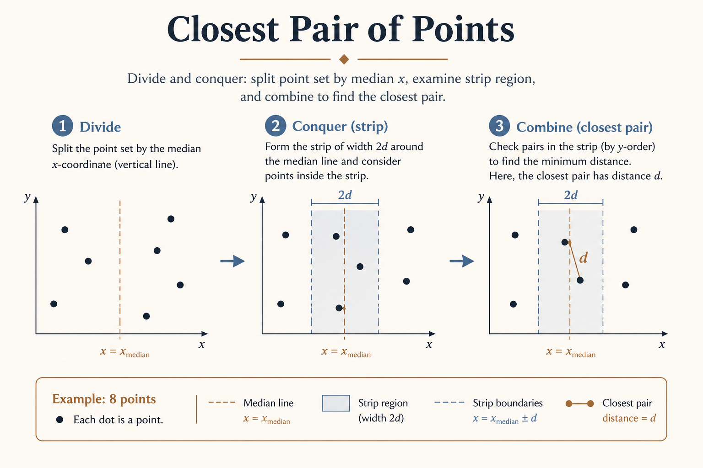
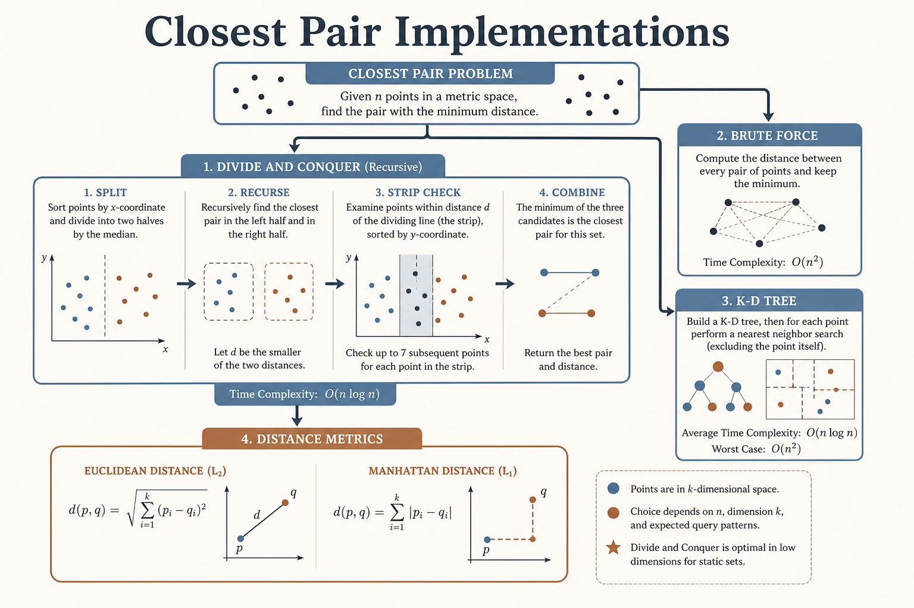

# 🎯 Closest Pair of Points

### *Closest Pair of Points*

  
  

---

## 🎯 At a Glance

| | |
|:---|:---|
| **Difficulty** | Hard |
| **Problems** | 7 |

{: .highlight }
> **How to use this page:** Start with the visual overview, scan **At a Glance**, then work through theory → walkthroughs → code.

---

## 🧭 Navigation

| ⬅️ Previous | 📂 Current | ➡️ Next |
|:------------|:----------:|--------:|
| [← 05. Rectangle Problems](../05_rectangle_problems/README.md) | **06. Closest Pair** | [Sweep Line →](../README.md) |

---

## 📐 Mathematical Foundation
### 1️⃣ Closest Pair Problem

**Given:** $n$ points in 2D plane  
**Find:** Pair with minimum Euclidean distance

**Naive:** Check all pairs: $O(n^2)$

**Divide & Conquer:** $O(n \log n)$  
**Sweep Line:** $O(n \log n)$

---

### 2️⃣ Divide and Conquer Algorithm

**Algorithm:**

1. Sort points by x-coordinate: $O(n \log n)$

2. Divide into left and right halves

3. Recursively find closest pairs in each half

4. Combine: check pairs across the dividing line

**Key optimization:** Only check points within distance $\delta$ of dividing line.

**Recurrence:**

$$T(n) = 2T(n/2) + O(n) = O(n \log n)$$

---

### 3️⃣ Sweep Line Approach

**Algorithm:**

1. Sort points by x-coordinate

2. Sweep left to right, maintaining active points within distance $\delta$

3. For each point, check only points in "active window"

4. Update $\delta$ when closer pair found

**Active window:** Points with $x \in [x_{\text{current}} - \delta, x_{\text{current}}]$

**Key insight:** At most 6 points need to be checked per point (geometry constraint).

**Time:** $O(n \log n)$

---

### 4️⃣ Geometric Insight

**Theorem:** In strip of width $2\delta$ around dividing line, each point needs to check at most 6 points.

**Proof:**

- Divide strip into squares of side $\delta/2$

- Each square contains at most 1 point (otherwise distance < $\delta$)

- Current point can only interact with points in adjacent 8 squares

- But only 6 are to the right/above ∎

---

### 5️⃣ K Nearest Neighbors

**Extension:** Find $k$ nearest neighbors for each point.

**Algorithm:**

- Maintain k-d tree or sweep line with heap

- For each point, find k nearest

**Time:** $O(n \log n)$ with proper data structures

---

### 6️⃣ Distance Metrics

**Euclidean:**

$$d(p, q) = \sqrt{(p_x - q_x)^2 + (p_y - q_y)^2}$$

**Manhattan:**

$$d(p, q) = |p_x - q_x| + |p_y - q_y|$$

**Chebyshev:**

$$d(p, q) = \max(|p_x - q_x|, |p_y - q_y|)$$

**Note:** For finding closest, can compare squared distances (avoid sqrt).

---

## 📊 Visual Overview

  

---

## 💻 Code Implementations

---

## 🏆 LeetCode Problems

### 🟢 Easy Problems

| # | Problem | Difficulty | Solution Pattern |
|---|---------|------------|------------------|
| 1266 | [Minimum Time Visiting All Points](https://leetcode.com/problems/minimum-time-visiting-all-points/) | Easy | Chebyshev distance |
| 858 | [Mirror Reflection](https://leetcode.com/problems/mirror-reflection/) | Easy | GCD + geometry |

---

### 🟡 Medium Problems

| # | Problem | Difficulty | Solution Pattern |
|---|---------|------------|------------------|
| 973 | [K Closest Points to Origin](https://leetcode.com/problems/k-closest-points-to-origin/) | Medium | Heap / Quickselect |
| 447 | [Number of Boomerangs](https://leetcode.com/problems/number-of-boomerangs/) | Medium | Distance map |
| 593 | [Valid Square](https://leetcode.com/problems/valid-square/) | Medium | Distance check |
| 356 | [Line Reflection](https://leetcode.com/problems/line-reflection/) | Medium | Symmetry |
| 658 | [Find K Closest Elements](https://leetcode.com/problems/find-k-closest-elements/) | Medium | Binary search |

---

## 📊 Complexity Summary

| Algorithm | Time | Space | Notes |
|-----------|:----:|:-----:|-------|
| Brute force | O(n²) | O(1) | Check all pairs |
| Divide & conquer | O(n log n) | O(n) | Optimal |
| Sweep line | O(n log n) | O(n) | With sorted set |
| K-D tree build | O(n log n) | O(n) | Preprocessing |
| K-D tree query | O(log n) avg | O(log n) | Nearest neighbor |
| K closest (heap) | O(n log k) | O(k) | Priority queue |
| K closest (quickselect) | O(n) avg | O(1) | In-place |

---

## 💡 Key Insights

1. **Avoid sqrt:** Compare squared distances when possible

2. **Geometric constraint:** At most 6 points to check in strip

3. **Active window:** Sweep line maintains points within δ distance

4. **K-D tree:** Efficient for multiple queries, $O(\log n)$ per query

5. **Distance metrics:** Euclidean, Manhattan, Chebyshev for different problems

6. **Divide & conquer:** Optimal $O(n \log n)$ for closest pair

---

## 📚 References & Learning Resources

### 📖 Core Concepts

| Resource | Description | Link |
|----------|-------------|------|
| **Closest Pair** | CP-Algorithms | [Closest pair](https://cp-algorithms.com/geometry/closest-pair.html) |
| **Divide & Conquer** | GeeksforGeeks | [Closest pair](https://www.geeksforgeeks.org/closest-pair-of-points-onlogn-approach/) |

### 📝 Practice

| Platform | Focus | Link |
|----------|-------|------|
| **LeetCode** | Geometry tag | [Problems](https://leetcode.com/tag/geometry/) |

---
