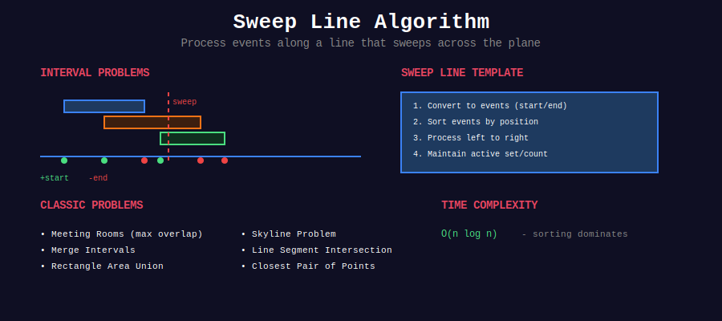

<div align="center">

# 📏 Sweep Line Algorithm



<p>
  
  
  
</p>

**Process events by sweeping through coordinates**

[⬅️ Previous: Tree Algorithms](../25_tree_algorithms/README.md) | [🏠 Home](../README.md) | [Next: Advanced Trees ➡️](../27_advanced_trees/README.md)

</div>

---

## 📋 Overview

Sweep line processes **events sorted by coordinates**. Imagine a vertical line sweeping left to right, processing start/end points of intervals.

```
Events: S=Start, E=End
        S1  S2    E1  S3  E2    E3
Time    |---|-----|---|---|-----|
        1   2     3   4   5     6
```

---

## 📂 Subtopics

<table>
<tr>
<td width="33%">

### [01. Interval Sweep](./01_interval_sweep/)
- Meeting rooms
- Overlapping intervals
- Maximum overlap
- Range updates

</td>
<td width="33%">

### [02. Coordinate Compression](./02_coordinate_compression/)
- Rectangle area
- Skyline problem
- 2D sweep problems

</td>
<td width="33%">

### [03. Line Segment Intersection](./03_line_segment_intersection/)
- Bentley-Ottmann
- Orientation tests
- Convex hull

</td>
</tr>
<tr>
<td width="33%">

### [04. Angular Sweep](./04_angular_sweep/)
- Radial sorting
- Visibility problems
- K closest points

</td>
<td width="33%">

### [05. Rectangle Problems](./05_rectangle_problems/)
- Histogram rectangles
- Perfect rectangle
- Area calculations

</td>
<td width="33%">

### [06. Closest Pair](./06_closest_pair/)
- Divide & conquer
- K-D trees
- Distance metrics

</td>
</tr>
</table>

---

## 🏆 Must-Do Problems

### 🟢 Easy
| Problem | Link |
|---------|------|
| Meeting Rooms | [LeetCode 252](https://leetcode.com/problems/meeting-rooms/) |

### 🟡 Medium
| Problem | Link |
|---------|------|
| Meeting Rooms II | [LeetCode 253](https://leetcode.com/problems/meeting-rooms-ii/) |
| Merge Intervals | [LeetCode 56](https://leetcode.com/problems/merge-intervals/) |
| Insert Interval | [LeetCode 57](https://leetcode.com/problems/insert-interval/) |
| Car Pooling | [LeetCode 1094](https://leetcode.com/problems/car-pooling/) |
| My Calendar I | [LeetCode 729](https://leetcode.com/problems/my-calendar-i/) |
| My Calendar II | [LeetCode 731](https://leetcode.com/problems/my-calendar-ii/) |
| Corporate Flight Bookings | [LeetCode 1109](https://leetcode.com/problems/corporate-flight-bookings/) |

### 🔴 Hard
| Problem | Link |
|---------|------|
| The Skyline Problem | [LeetCode 218](https://leetcode.com/problems/the-skyline-problem/) |
| My Calendar III | [LeetCode 732](https://leetcode.com/problems/my-calendar-iii/) |
| Rectangle Area II | [LeetCode 850](https://leetcode.com/problems/rectangle-area-ii/) |
| Employee Free Time | [LeetCode 759](https://leetcode.com/problems/employee-free-time/) |
| Largest Rectangle in Histogram | [LeetCode 84](https://leetcode.com/problems/largest-rectangle-in-histogram/) |
| Maximal Rectangle | [LeetCode 85](https://leetcode.com/problems/maximal-rectangle/) |
| Perfect Rectangle | [LeetCode 391](https://leetcode.com/problems/perfect-rectangle/) |
| Erect the Fence | [LeetCode 587](https://leetcode.com/problems/erect-the-fence/) |

---

<div align="center">

[⬅️ Previous: Tree Algorithms](../25_tree_algorithms/README.md) | [🏠 Home](../README.md) | [Next: Advanced Trees ➡️](../27_advanced_trees/README.md)

</div>
