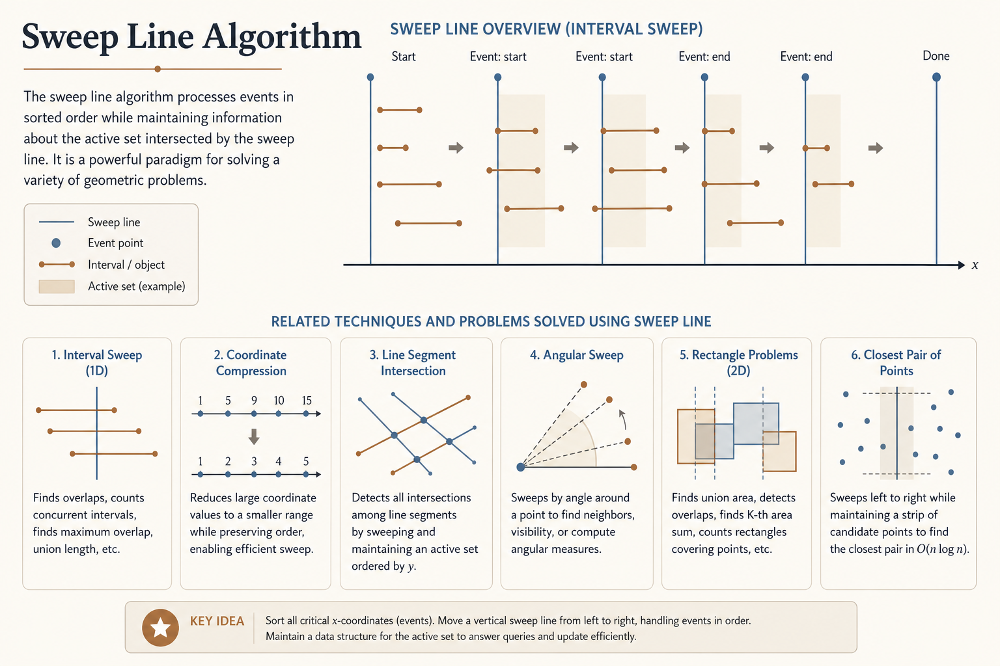
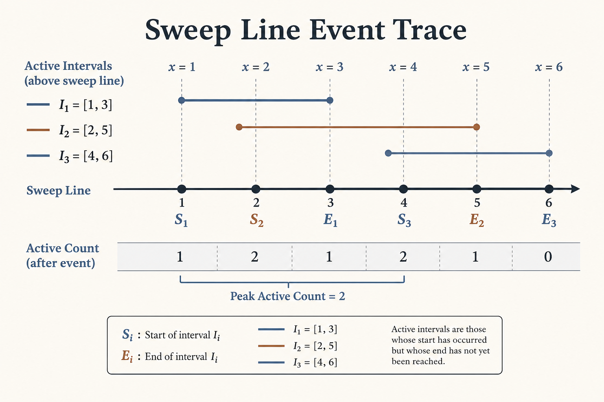

# 📏 Sweep Line Algorithm

### *Process events by sweeping through coordinates*

  
  
  

**Process events by sweeping through coordinates**

[⬅️ Previous: Tree Algorithms](../25_tree_algorithms/README.md) | [🏠 Home](../README.md) | [Next: Advanced Trees ➡️](../27_advanced_trees/README.md)

---

## 🎯 At a Glance

| | |
|:---|:---|
| **In one line** | Process events by sweeping through coordinates |
| **Difficulty** | Medium to Hard |
| **Subtopics** | 6 |
| **Problems** | 45+ |

{: .highlight }
> **How to use this page:** Scan **At a Glance**, then work through theory → visuals → code.

---

## 📊 Visual Overview

*Sweep Line Overview*

---

## 📂 Subtopics

<table>
<tr>
<td width="33%">

### [01. Interval Sweep](./01_interval_sweep/)

- Meeting rooms

- Overlapping intervals

- Maximum overlap

- Range updates

</td>
<td width="33%">

### [02. Coordinate Compression](./02_coordinate_compression/)

- Rectangle area

- Skyline problem

- 2D sweep problems

</td>
<td width="33%">

### [03. Line Segment Intersection](./03_line_segment_intersection/)

- Bentley-Ottmann

- Orientation tests

- Convex hull

</td>
</tr>
<tr>
<td width="33%">

### [04. Angular Sweep](./04_angular_sweep/)

- Radial sorting

- Visibility problems

- K closest points

</td>
<td width="33%">

### [05. Rectangle Problems](./05_rectangle_problems/)

- Histogram rectangles

- Perfect rectangle

- Area calculations

</td>
<td width="33%">

### [06. Closest Pair](./06_closest_pair/)

- Divide & conquer

- K-D trees

- Distance metrics

</td>
</tr>
</table>

---

## 📋 Overview

Sweep line processes **events sorted by coordinates**. Imagine a vertical line sweeping left to right, processing start/end points of intervals.

---

## 🏆 LeetCode Problems

### 🟢 Easy

| # | Problem | Pattern | Time | Space |
|:-:|---------|---------|:----:|:-----:|
| 252 | [Meeting Rooms](https://leetcode.com/problems/meeting-rooms/) | Interval sweep | O(n log n) | O(n) |

### 🟡 Medium

| # | Problem | Pattern | Time | Space |
|:-:|---------|---------|:----:|:-----:|
| 253 | [Meeting Rooms II](https://leetcode.com/problems/meeting-rooms-ii/) | Min heap / sweep | O(n log n) | O(n) |
| 56 | [Merge Intervals](https://leetcode.com/problems/merge-intervals/) | Sort + merge | O(n log n) | O(n) |
| 57 | [Insert Interval](https://leetcode.com/problems/insert-interval/) | Interval merge | O(n) | O(n) |
| 1094 | [Car Pooling](https://leetcode.com/problems/car-pooling/) | Difference array | O(n log n) | O(n) |
| 729 | [My Calendar I](https://leetcode.com/problems/my-calendar-i/) | Interval overlap | O(n) | O(n) |
| 731 | [My Calendar II](https://leetcode.com/problems/my-calendar-ii/) | Overlap count | O(n²) | O(n) |
| 1109 | [Corporate Flight Bookings](https://leetcode.com/problems/corporate-flight-bookings/) | Prefix diff | O(n) | O(n) |

### 🔴 Hard

| # | Problem | Pattern | Time | Space |
|:-:|---------|---------|:----:|:-----:|
| 218 | [The Skyline Problem](https://leetcode.com/problems/the-skyline-problem/) | Coordinate compression | O(n log n) | O(n) |
| 732 | [My Calendar III](https://leetcode.com/problems/my-calendar-iii/) | Sweep + counter | O(n log n) | O(n) |
| 850 | [Rectangle Area II](https://leetcode.com/problems/rectangle-area-ii/) | 2D sweep | O(n² log n) | O(n) |
| 759 | [Employee Free Time](https://leetcode.com/problems/employee-free-time/) | Merge intervals | O(n log n) | O(n) |
| 84 | [Largest Rectangle in Histogram](https://leetcode.com/problems/largest-rectangle-in-histogram/) | Monotonic stack | O(n) | O(n) |
| 85 | [Maximal Rectangle](https://leetcode.com/problems/maximal-rectangle/) | Stack + histogram | O(mn) | O(n) |
| 391 | [Perfect Rectangle](https://leetcode.com/problems/perfect-rectangle/) | Corner counting | O(n) | O(n) |
| 587 | [Erect the Fence](https://leetcode.com/problems/erect-the-fence/) | Convex hull | O(n log n) | O(n) |

---

## 📚 References & Learning Resources

### 📖 Core Concepts

| Resource | Description | Link |
|----------|-------------|------|
| **Sweep Line** | GeeksforGeeks | [Line sweep](https://www.geeksforgeeks.org/sweep-line-algorithm/) |
| **Computational Geometry** | CP-Algorithms | [Geometry](https://cp-algorithms.com/geometry/) |

### 📝 Practice

| Platform | Focus | Link |
|----------|-------|------|
| **LeetCode** | Geometry tag | [Problems](https://leetcode.com/tag/geometry/) |

---

[⬅️ Previous: Tree Algorithms](../25_tree_algorithms/README.md) | [🏠 Home](../README.md) | [Next: Advanced Trees ➡️](../27_advanced_trees/README.md)

