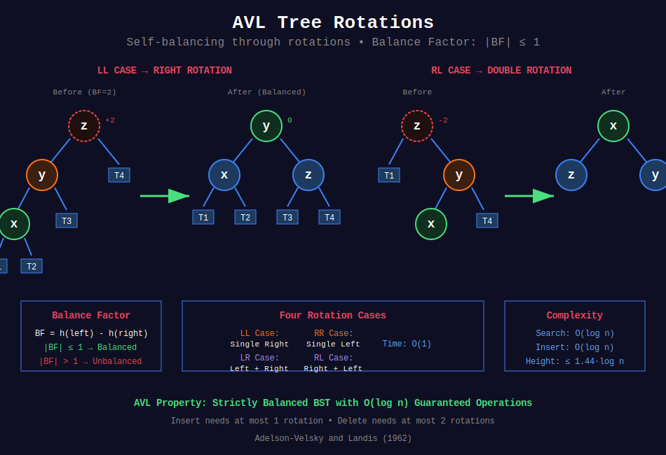

<div align="center">

# ⚖️ AVL Trees

<p>
  
  
</p>

</div>

---

## 🧭 Navigation

| ⬅️ Previous | 📂 Current | ➡️ Next |
|:------------|:----------:|--------:|
| [← Advanced Trees](../README.md) | **01. AVL Trees** | [02. Red-Black Trees →](../02_red_black_trees/README.md) |

---

## 📊 Visual Overview

<div align="center">

</div>

---

## 📐 Mathematical Foundations

### 1️⃣ AVL Tree Definition

**AVL Tree:** Self-balancing BST where height difference between left and right subtrees ≤ 1.

**Balance Factor:**

$$BF(node) = height(left) - height(right)$$

**AVL Property:** $|BF(node)| \leq 1$ for all nodes.

**Named after:** Adelson-Velsky and Landis (1962)

---

### 2️⃣ Height Bound Theorem

**Theorem:** AVL tree with $n$ nodes has height $h = O(\log n)$.

**Proof:**
Let $N(h)$ = minimum nodes in AVL tree of height $h$.

**Recurrence:**

$$N(h) = N(h-1) + N(h-2) + 1$$

Similar to Fibonacci: $N(h) \geq F_{h+2} - 1$

By Fibonacci growth: $F_k \approx \frac{\phi^k}{\sqrt{5}}$ where $\phi = \frac{1+\sqrt{5}}{2} \approx 1.618$

Therefore: $h \leq 1.44 \log_2(n+2)$ ∎

---

### 3️⃣ Rotation Operations

**Single Right Rotation (LL case):**

```
      z                y
     / \              / \
    y   T4    =>     x   z
   / \              / \ / \
  x  T3            T1 T2 T3 T4
 / \
T1 T2
```

**Single Left Rotation (RR case):** Mirror of right rotation

**Left-Right Rotation (LR case):**
1. Left rotate on left child
2. Right rotate on root

**Right-Left Rotation (RL case):**
1. Right rotate on right child  
2. Left rotate on root

**Time:** $O(1)$ per rotation

---

### 4️⃣ Balance Factor Update

After rotation, update heights:

$$height(node) = 1 + \max(height(left), height(right))$$

**Propagation:** May need to update ancestors up to root: $O(\log n)$

---

### 5️⃣ Operation Complexities

| Operation | Time | Rotations |
|-----------|:----:|:---------:|
| Search | O(log n) | 0 |
| Insert | O(log n) | ≤ 1 |
| Delete | O(log n) | ≤ 2 |
| Min/Max | O(log n) | 0 |

**Space:** $O(n)$ for tree storage

---

### 6️⃣ Comparison with Other BSTs

| Tree | Height | Insert | Delete | Complexity |
|------|:------:|:------:|:------:|:----------:|
| **AVL** | $1.44 \log n$ | 1 rotation | 2 rotations | Strict |
| **Red-Black** | $2 \log n$ | 2 rotations | 3 rotations | Moderate |
| **Splay** | Amortized $\log n$ | Many | Many | Simple |

**AVL advantage:** Faster lookups (stricter balance)  
**AVL disadvantage:** More rotations on insert/delete

---

## 💻 Code Implementations

```python
from typing import Optional, List, Tuple

# ==================== AVL TREE NODE ====================

class AVLNode:
    """Node in AVL Tree."""
    
    def __init__(self, val: int):
        self.val = val
        self.left: Optional[AVLNode] = None
        self.right: Optional[AVLNode] = None
        self.height: int = 1


class AVLTree:
    """
    AVL Tree implementation with insert, delete, and search.
    
    All operations: O(log n)
    """
    
    def __init__(self):
        self.root: Optional[AVLNode] = None
    
    def height(self, node: Optional[AVLNode]) -> int:
        """Get height of node."""
        return node.height if node else 0
    
    def balance_factor(self, node: AVLNode) -> int:
        """Calculate balance factor."""
        if not node:
            return 0
        return self.height(node.left) - self.height(node.right)
    
    def update_height(self, node: AVLNode) -> None:
        """Update height of node."""
        if node:
            node.height = 1 + max(self.height(node.left), 
                                   self.height(node.right))
    
    # ==================== ROTATIONS ====================
    
    def rotate_right(self, z: AVLNode) -> AVLNode:
        """
        Right rotation (LL case).
        
        Time: O(1)
        """
        y = z.left
        T3 = y.right
        
        # Perform rotation
        y.right = z
        z.left = T3
        
        # Update heights
        self.update_height(z)
        self.update_height(y)
        
        return y
    
    def rotate_left(self, z: AVLNode) -> AVLNode:
        """
        Left rotation (RR case).
        
        Time: O(1)
        """
        y = z.right
        T2 = y.left
        
        # Perform rotation
        y.left = z
        z.right = T2
        
        # Update heights
        self.update_height(z)
        self.update_height(y)
        
        return y
    
    # ==================== REBALANCE ====================
    
    def rebalance(self, node: AVLNode) -> AVLNode:
        """
        Rebalance node if needed.
        
        Time: O(1)
        """
        # Update height
        self.update_height(node)
        
        # Get balance factor
        bf = self.balance_factor(node)
        
        # Left-heavy (LL or LR case)
        if bf > 1:
            # LR case: left rotate on left child first
            if self.balance_factor(node.left) < 0:
                node.left = self.rotate_left(node.left)
            # LL case: right rotate
            return self.rotate_right(node)
        
        # Right-heavy (RR or RL case)
        if bf < -1:
            # RL case: right rotate on right child first
            if self.balance_factor(node.right) > 0:
                node.right = self.rotate_right(node.right)
            # RR case: left rotate
            return self.rotate_left(node)
        
        return node
    
    # ==================== INSERT ====================
    
    def insert(self, val: int) -> None:
        """
        Insert value into AVL tree.
        
        Time: O(log n), Space: O(log n) for recursion
        """
        self.root = self._insert(self.root, val)
    
    def _insert(self, node: Optional[AVLNode], val: int) -> AVLNode:
        """Helper for insert."""
        # Standard BST insert
        if not node:
            return AVLNode(val)
        
        if val < node.val:
            node.left = self._insert(node.left, val)
        elif val > node.val:
            node.right = self._insert(node.right, val)
        else:
            # Duplicate values not allowed
            return node
        
        # Rebalance
        return self.rebalance(node)
    
    # ==================== DELETE ====================
    
    def delete(self, val: int) -> None:
        """
        Delete value from AVL tree.
        
        Time: O(log n), Space: O(log n)
        """
        self.root = self._delete(self.root, val)
    
    def _delete(self, node: Optional[AVLNode], val: int) -> Optional[AVLNode]:
        """Helper for delete."""
        if not node:
            return None
        
        # Standard BST delete
        if val < node.val:
            node.left = self._delete(node.left, val)
        elif val > node.val:
            node.right = self._delete(node.right, val)
        else:
            # Node to delete found
            if not node.left:
                return node.right
            elif not node.right:
                return node.left
            else:
                # Two children: replace with inorder successor
                successor = self._min_node(node.right)
                node.val = successor.val
                node.right = self._delete(node.right, successor.val)
        
        # Rebalance
        return self.rebalance(node)
    
    def _min_node(self, node: AVLNode) -> AVLNode:
        """Find minimum node in subtree."""
        while node.left:
            node = node.left
        return node
    
    # ==================== SEARCH ====================
    
    def search(self, val: int) -> bool:
        """
        Search for value in tree.
        
        Time: O(log n), Space: O(1)
        """
        return self._search(self.root, val)
    
    def _search(self, node: Optional[AVLNode], val: int) -> bool:
        """Helper for search."""
        if not node:
            return False
        
        if val == node.val:
            return True
        elif val < node.val:
            return self._search(node.left, val)
        else:
            return self._search(node.right, val)
    
    # ==================== TRAVERSALS ====================
    
    def inorder(self) -> List[int]:
        """Inorder traversal (sorted order)."""
        result = []
        self._inorder(self.root, result)
        return result
    
    def _inorder(self, node: Optional[AVLNode], result: List[int]) -> None:
        """Helper for inorder."""
        if node:
            self._inorder(node.left, result)
            result.append(node.val)
            self._inorder(node.right, result)
    
    def level_order(self) -> List[List[int]]:
        """Level order traversal."""
        if not self.root:
            return []
        
        from collections import deque
        result = []
        queue = deque([self.root])
        
        while queue:
            level = []
            for _ in range(len(queue)):
                node = queue.popleft()
                level.append(node.val)
                if node.left:
                    queue.append(node.left)
                if node.right:
                    queue.append(node.right)
            result.append(level)
        
        return result


# ==================== LEETCODE PROBLEMS ====================

def balance_bst(root: Optional[AVLNode]) -> Optional[AVLNode]:
    """
    LeetCode 1382: Balance a Binary Search Tree
    
    Time: O(n), Space: O(n)
    """
    # Get inorder traversal (sorted)
    def inorder(node):
        if not node:
            return []
        return inorder(node.left) + [node.val] + inorder(node.right)
    
    # Build balanced BST from sorted array
    def build_balanced(arr, left, right):
        if left > right:
            return None
        
        mid = (left + right) // 2
        node = AVLNode(arr[mid])
        node.left = build_balanced(arr, left, mid - 1)
        node.right = build_balanced(arr, mid + 1, right)
        
        # Update height
        node.height = 1 + max(
            node.left.height if node.left else 0,
            node.right.height if node.right else 0
        )
        
        return node
    
    values = inorder(root)
    return build_balanced(values, 0, len(values) - 1)


def sorted_array_to_bst(nums: List[int]) -> Optional[AVLNode]:
    """
    LeetCode 108: Convert Sorted Array to Binary Search Tree
    
    Time: O(n), Space: O(log n)
    """
    def build(left, right):
        if left > right:
            return None
        
        mid = (left + right) // 2
        node = AVLNode(nums[mid])
        node.left = build(left, mid - 1)
        node.right = build(mid + 1, right)
        
        return node
    
    return build(0, len(nums) - 1)


def sorted_list_to_bst(head: Optional['ListNode']) -> Optional[AVLNode]:
    """
    LeetCode 109: Convert Sorted List to Binary Search Tree
    
    Time: O(n), Space: O(log n)
    """
    # Convert list to array first
    arr = []
    curr = head
    while curr:
        arr.append(curr.val)
        curr = curr.next
    
    return sorted_array_to_bst(arr)


def is_balanced(root: Optional[AVLNode]) -> bool:
    """
    LeetCode 110: Balanced Binary Tree
    Check if binary tree is height-balanced.
    
    Time: O(n), Space: O(h)
    """
    def check_height(node):
        if not node:
            return 0
        
        left_height = check_height(node.left)
        if left_height == -1:
            return -1
        
        right_height = check_height(node.right)
        if right_height == -1:
            return -1
        
        if abs(left_height - right_height) > 1:
            return -1
        
        return 1 + max(left_height, right_height)
    
    return check_height(root) != -1


def trim_bst(root: Optional[AVLNode], low: int, high: int) -> Optional[AVLNode]:
    """
    LeetCode 669: Trim a Binary Search Tree
    
    Time: O(n), Space: O(h)
    """
    if not root:
        return None
    
    if root.val < low:
        return trim_bst(root.right, low, high)
    if root.val > high:
        return trim_bst(root.left, low, high)
    
    root.left = trim_bst(root.left, low, high)
    root.right = trim_bst(root.right, low, high)
    
    return root


# ==================== ADVANCED OPERATIONS ====================

def merge_two_bsts(root1: Optional[AVLNode], 
                   root2: Optional[AVLNode]) -> Optional[AVLNode]:
    """
    Merge two BSTs into balanced AVL tree.
    
    Time: O(m + n), Space: O(m + n)
    """
    def inorder(node):
        if not node:
            return []
        return inorder(node.left) + [node.val] + inorder(node.right)
    
    def merge_sorted(arr1, arr2):
        result = []
        i, j = 0, 0
        while i < len(arr1) and j < len(arr2):
            if arr1[i] < arr2[j]:
                result.append(arr1[i])
                i += 1
            else:
                result.append(arr2[j])
                j += 1
        result.extend(arr1[i:])
        result.extend(arr2[j:])
        return result
    
    # Get sorted arrays
    arr1 = inorder(root1)
    arr2 = inorder(root2)
    
    # Merge and build balanced tree
    merged = merge_sorted(arr1, arr2)
    return sorted_array_to_bst(merged)


def range_sum_bst(root: Optional[AVLNode], low: int, high: int) -> int:
    """
    LeetCode 938: Range Sum of BST
    
    Time: O(n), Space: O(h)
    """
    if not root:
        return 0
    
    total = 0
    
    # Current node in range
    if low <= root.val <= high:
        total += root.val
    
    # Recurse left if possible
    if root.val > low:
        total += range_sum_bst(root.left, low, high)
    
    # Recurse right if possible
    if root.val < high:
        total += range_sum_bst(root.right, low, high)
    
    return total
```

---

## 🎯 LeetCode Problems

### 🟡 Medium Problems

| # | Problem | Difficulty | Solution Pattern |
|---|---------|------------|------------------|
| 1382 | [Balance a Binary Search Tree](https://leetcode.com/problems/balance-a-binary-search-tree/) | Medium | Inorder + build balanced |
| 108 | [Convert Sorted Array to BST](https://leetcode.com/problems/convert-sorted-array-to-binary-search-tree/) | Medium | Recursive build |
| 109 | [Convert Sorted List to BST](https://leetcode.com/problems/convert-sorted-list-to-binary-search-tree/) | Medium | List to array + build |
| 110 | [Balanced Binary Tree](https://leetcode.com/problems/balanced-binary-tree/) | Medium | Height check |
| 669 | [Trim a Binary Search Tree](https://leetcode.com/problems/trim-a-binary-search-tree/) | Medium | Recursive trim |
| 938 | [Range Sum of BST](https://leetcode.com/problems/range-sum-of-bst/) | Medium | Range traversal |

---

### 🔴 Hard Problems

| # | Problem | Difficulty | Solution Pattern |
|---|---------|------------|------------------|
| 1305 | [All Elements in Two BSTs](https://leetcode.com/problems/all-elements-in-two-binary-search-trees/) | Medium | Merge sorted arrays |
| - | Merge Two BSTs | Hard | Inorder + merge + balance |

---

## 📊 Complexity Summary

| Operation | Time | Space | Rotations |
|-----------|:----:|:-----:|:---------:|
| Insert | O(log n) | O(log n) | ≤ 1 |
| Delete | O(log n) | O(log n) | ≤ 2 |
| Search | O(log n) | O(1) | 0 |
| Min/Max | O(log n) | O(1) | 0 |
| Inorder | O(n) | O(n) | 0 |
| Build from sorted | O(n) | O(n) | 0 |

---

## 💡 Key Insights

1. **Strict balance:** Height difference ≤ 1 ensures O(log n) operations
2. **Rotation types:** 4 cases (LL, RR, LR, RL) with 1-2 rotations each
3. **Height bound:** $h \leq 1.44 \log n$ (tighter than Red-Black)
4. **Insert rotations:** At most 1 rotation needed
5. **Delete rotations:** At most 2 rotations (but may propagate up)
6. **Optimal for lookups:** Faster than Red-Black due to stricter balance

---

## 🧭 Navigation

| ⬅️ Previous | 📂 Current | ➡️ Next |
|:------------|:----------:|--------:|
| [← Advanced Trees](../README.md) | **01. AVL Trees** | [02. Red-Black Trees →](../02_red_black_trees/README.md) |

