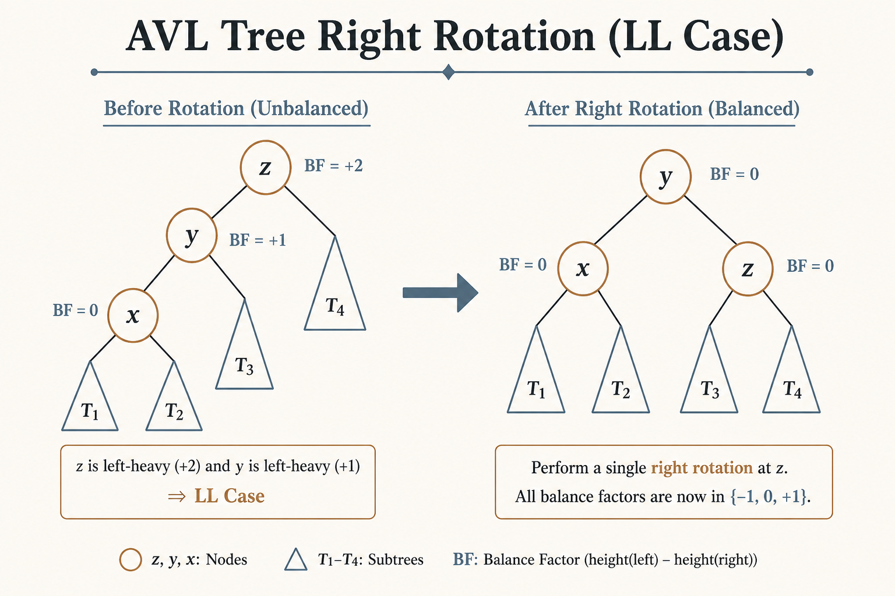
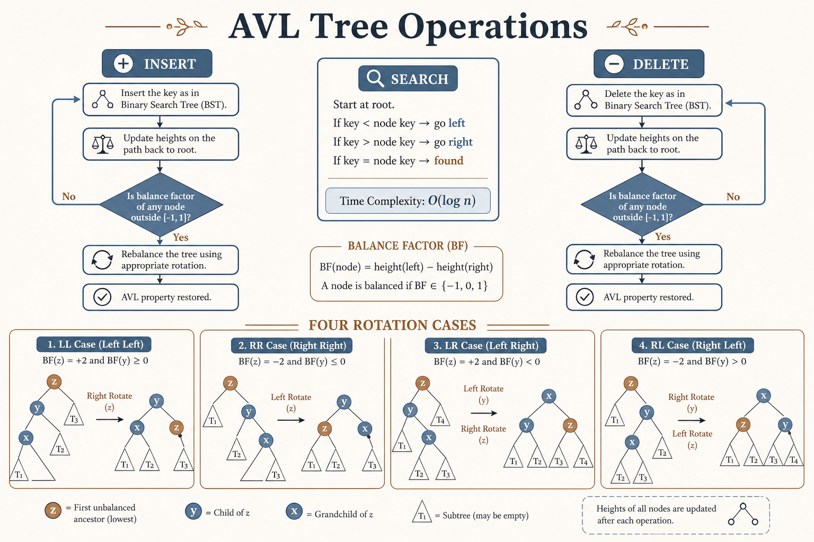

# ⚖️ AVL Trees

### *AVL Trees*

  
  

---

## 📊 Visual Overview

---

## 🎯 At a Glance

| | |
|:---|:---|
| **Difficulty** | Hard |
| **Problems** | 8 |

> **How to use this page:** Start with the visual overview, scan **At a Glance**, then work through theory → walkthroughs → code.

---

## 🧭 Navigation

| ⬅️ Previous | 📂 Current | ➡️ Next |
|:------------|:----------:|--------:|
| [← Advanced Trees](../README.md) | **01. AVL Trees** | [02. Red-Black Trees →](../02_red_black_trees/README.md) |

---

## 📐 Mathematical Foundation
### 1️⃣ AVL Tree Definition

**AVL Tree:** Self-balancing BST where height difference between left and right subtrees ≤ 1.

**Balance Factor:**

$$BF(node) = height(left) - height(right)$$

**AVL Property:** $|BF(node)| \leq 1$ for all nodes.

**Named after:** Adelson-Velsky and Landis (1962)

---

### 2️⃣ Height Bound Theorem

**Theorem:** AVL tree with $n$ nodes has height $h = O(\log n)$.

**Proof:**
Let $N(h)$ = minimum nodes in AVL tree of height $h$.

**Recurrence:**

$$N(h) = N(h-1) + N(h-2) + 1$$

Similar to Fibonacci: $N(h) \geq F_{h+2} - 1$

By Fibonacci growth: $F_k \approx \frac{\phi^k}{\sqrt{5}}$ where $\phi = \frac{1+\sqrt{5}}{2} \approx 1.618$

Therefore: $h \leq 1.44 \log_2(n+2)$ ∎

---

### 3️⃣ Rotation Operations

**Single Right Rotation (LL case):**

**Single Left Rotation (RR case):** Mirror of right rotation

**Left-Right Rotation (LR case):**

1. Left rotate on left child

2. Right rotate on root

**Right-Left Rotation (RL case):**

1. Right rotate on right child  

2. Left rotate on root

**Time:** $O(1)$ per rotation

---

### 4️⃣ Balance Factor Update

After rotation, update heights:

$$height(node) = 1 + \max(height(left), height(right))$$

**Propagation:** May need to update ancestors up to root: $O(\log n)$

---

### 5️⃣ Operation Complexities

| Operation | Time | Rotations |
|-----------|:----:|:---------:|
| Search | O(log n) | 0 |
| Insert | O(log n) | ≤ 1 |
| Delete | O(log n) | ≤ 2 |
| Min/Max | O(log n) | 0 |

**Space:** $O(n)$ for tree storage

---

### 6️⃣ Comparison with Other BSTs

| Tree | Height | Insert | Delete | Complexity |
|------|:------:|:------:|:------:|:----------:|
| **AVL** | $1.44 \log n$ | 1 rotation | 2 rotations | Strict |
| **Red-Black** | $2 \log n$ | 2 rotations | 3 rotations | Moderate |
| **Splay** | Amortized $\log n$ | Many | Many | Simple |

**AVL advantage:** Faster lookups (stricter balance)  
**AVL disadvantage:** More rotations on insert/delete

---

## 💻 Code Implementations

---

## 🏆 LeetCode Problems

### 🟡 Medium Problems

| # | Problem | Difficulty | Solution Pattern |
|---|---------|------------|------------------|
| 1382 | [Balance a Binary Search Tree](https://leetcode.com/problems/balance-a-binary-search-tree/) | Medium | Inorder + build balanced |
| 108 | [Convert Sorted Array to BST](https://leetcode.com/problems/convert-sorted-array-to-binary-search-tree/) | Medium | Recursive build |
| 109 | [Convert Sorted List to BST](https://leetcode.com/problems/convert-sorted-list-to-binary-search-tree/) | Medium | List to array + build |
| 110 | [Balanced Binary Tree](https://leetcode.com/problems/balanced-binary-tree/) | Medium | Height check |
| 669 | [Trim a Binary Search Tree](https://leetcode.com/problems/trim-a-binary-search-tree/) | Medium | Recursive trim |
| 938 | [Range Sum of BST](https://leetcode.com/problems/range-sum-of-bst/) | Medium | Range traversal |

---

### 🔴 Hard Problems

| # | Problem | Difficulty | Solution Pattern |
|---|---------|------------|------------------|
| 1305 | [All Elements in Two BSTs](https://leetcode.com/problems/all-elements-in-two-binary-search-trees/) | Medium | Merge sorted arrays |
| - | Merge Two BSTs | Hard | Inorder + merge + balance |

---

## 📊 Complexity Summary

| Operation | Time | Space | Rotations |
|-----------|:----:|:-----:|:---------:|
| Insert | O(log n) | O(log n) | ≤ 1 |
| Delete | O(log n) | O(log n) | ≤ 2 |
| Search | O(log n) | O(1) | 0 |
| Min/Max | O(log n) | O(1) | 0 |
| Inorder | O(n) | O(n) | 0 |
| Build from sorted | O(n) | O(n) | 0 |

---

## 💡 Key Insights

1. **Strict balance:** Height difference ≤ 1 ensures O(log n) operations

2. **Rotation types:** 4 cases (LL, RR, LR, RL) with 1-2 rotations each

3. **Height bound:** $h \leq 1.44 \log n$ (tighter than Red-Black)

4. **Insert rotations:** At most 1 rotation needed

5. **Delete rotations:** At most 2 rotations (but may propagate up)

6. **Optimal for lookups:** Faster than Red-Black due to stricter balance

---

## 📚 References & Learning Resources

### 📖 Core Concepts

| Resource | Description | Link |
|----------|-------------|------|
| **AVL Trees** | GeeksforGeeks | [AVL](https://www.geeksforgeeks.org/avl-tree-set-1-insertion/) |
| **Tree Rotations** | Wikipedia | [Rotations](https://en.wikipedia.org/wiki/Tree_rotation) |

### 📝 Practice

| Platform | Focus | Link |
|----------|-------|------|
| **LeetCode** | Tree tag | [Problems](https://leetcode.com/tag/tree/) |

---
