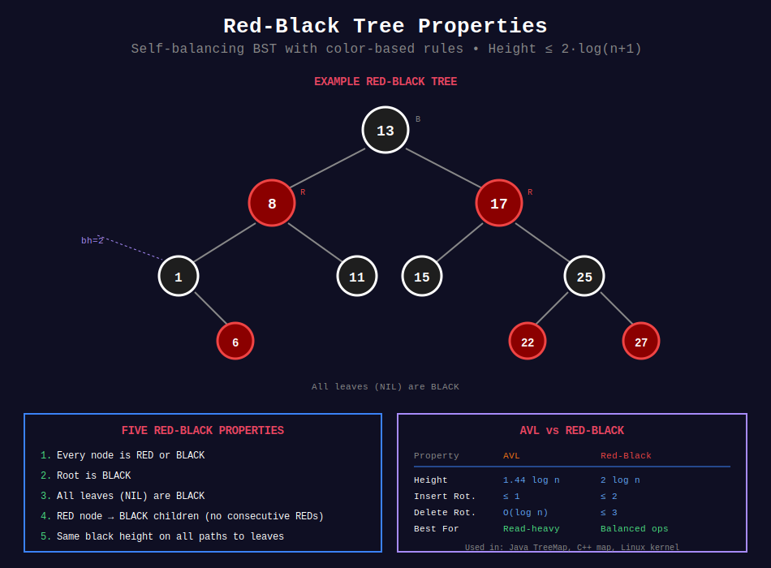

<div align="center">

# 🔴⚫ Red-Black Trees

<p>
  
  
</p>

</div>

---

## 🧭 Navigation

| ⬅️ Previous | 📂 Current | ➡️ Next |
|:------------|:----------:|--------:|
| [← 01. AVL Trees](../01_avl_trees/README.md) | **02. Red-Black Trees** | [03. Fenwick Tree →](../03_fenwick_tree/README.md) |

---

## 📊 Visual Overview

<div align="center">

</div>

---

## 📐 Mathematical Foundations

### 1️⃣ Red-Black Tree Properties

**Definition:** Self-balancing BST with color property (RED or BLACK).

**Five Properties:**
1. Every node is either RED or BLACK
2. Root is BLACK
3. All leaves (NIL) are BLACK
4. RED node has BLACK children (no consecutive REDs)
5. All paths from node to descendant leaves have same number of BLACK nodes

**Black Height:** Number of BLACK nodes on path to leaf (excluding node itself).

---

### 2️⃣ Height Bound Theorem

**Theorem:** Red-Black tree with $n$ nodes has height $h \leq 2\log_2(n+1)$.

**Proof:**
Let $bh(x)$ = black height of node $x$.

**Lemma:** Subtree rooted at $x$ contains at least $2^{bh(x)} - 1$ internal nodes.

Proof by induction:
- Base: $bh(x) = 0 \implies$ leaf $\implies 0 = 2^0 - 1$ ✓
- Step: Each child has black height $\geq bh(x) - 1$
  - By induction: $\geq 2^{bh(x)-1} - 1$ nodes
  - Total: $2(2^{bh(x)-1} - 1) + 1 = 2^{bh(x)} - 1$ ✓

For root with black height $bh$:
- $n \geq 2^{bh} - 1$
- By property 4: $bh \geq h/2$
- Therefore: $n \geq 2^{h/2} - 1$
- Solving: $h \leq 2\log_2(n+1)$ ∎

---

### 3️⃣ Rotation & Recoloring

**Operations to maintain properties:**
1. **Rotation:** Change structure (like AVL)
2. **Recoloring:** Change node colors

**Time:** $O(1)$ per operation

---

### 4️⃣ Insert Cases

**After standard BST insert (new node is RED):**

**Case 1:** Uncle is RED
- Recolor parent, uncle, grandparent
- Continue with grandparent

**Case 2:** Uncle is BLACK, node is "inside"
- Rotate to convert to Case 3

**Case 3:** Uncle is BLACK, node is "outside"  
- Rotate grandparent + recolor

**Max operations:** $O(\log n)$ recolorings, $O(1)$ rotations

---

### 5️⃣ Delete Cases

**More complex than insert (6 cases):**
- Deleting BLACK node requires rebalancing
- May need up to $O(\log n)$ rotations

**Practical:** Java TreeMap/TreeSet use Red-Black trees

---

### 6️⃣ AVL vs Red-Black Comparison

| Property | AVL | Red-Black |
|----------|:---:|:---------:|
| **Height** | $1.44 \log n$ | $2 \log n$ |
| **Insert rotations** | ≤ 1 | ≤ 2 |
| **Delete rotations** | $O(\log n)$ | ≤ 3 |
| **Lookup speed** | Faster | Slower |
| **Insert/Delete speed** | Slower | Faster |
| **Use case** | Read-heavy | Balanced ops |

---

## 💻 Code Implementations

```python
from typing import Optional, List
from enum import Enum

# ==================== RED-BLACK TREE ====================

class Color(Enum):
    RED = 0
    BLACK = 1


class RBNode:
    """Node in Red-Black Tree."""
    
    def __init__(self, val: int, color: Color = Color.RED):
        self.val = val
        self.color = color
        self.left: Optional[RBNode] = None
        self.right: Optional[RBNode] = None
        self.parent: Optional[RBNode] = None


class RedBlackTree:
    """
    Red-Black Tree implementation.
    
    All operations: O(log n)
    """
    
    def __init__(self):
        # NIL sentinel node
        self.NIL = RBNode(0, Color.BLACK)
        self.root = self.NIL
    
    # ==================== ROTATIONS ====================
    
    def rotate_left(self, x: RBNode) -> None:
        """Left rotation around x."""
        y = x.right
        x.right = y.left
        
        if y.left != self.NIL:
            y.left.parent = x
        
        y.parent = x.parent
        
        if x.parent == self.NIL:
            self.root = y
        elif x == x.parent.left:
            x.parent.left = y
        else:
            x.parent.right = y
        
        y.left = x
        x.parent = y
    
    def rotate_right(self, y: RBNode) -> None:
        """Right rotation around y."""
        x = y.left
        y.left = x.right
        
        if x.right != self.NIL:
            x.right.parent = y
        
        x.parent = y.parent
        
        if y.parent == self.NIL:
            self.root = x
        elif y == y.parent.right:
            y.parent.right = x
        else:
            y.parent.left = x
        
        x.right = y
        y.parent = x
    
    # ==================== INSERT ====================
    
    def insert(self, val: int) -> None:
        """
        Insert value into Red-Black tree.
        
        Time: O(log n), Space: O(1)
        """
        # Create new RED node
        node = RBNode(val, Color.RED)
        node.left = self.NIL
        node.right = self.NIL
        
        # Standard BST insert
        parent = self.NIL
        current = self.root
        
        while current != self.NIL:
            parent = current
            if node.val < current.val:
                current = current.left
            else:
                current = current.right
        
        node.parent = parent
        
        if parent == self.NIL:
            self.root = node
        elif node.val < parent.val:
            parent.left = node
        else:
            parent.right = node
        
        # Fix Red-Black properties
        self._insert_fixup(node)
    
    def _insert_fixup(self, node: RBNode) -> None:
        """Fix Red-Black properties after insert."""
        while node.parent.color == Color.RED:
            if node.parent == node.parent.parent.left:
                uncle = node.parent.parent.right
                
                if uncle.color == Color.RED:
                    # Case 1: Uncle is RED
                    node.parent.color = Color.BLACK
                    uncle.color = Color.BLACK
                    node.parent.parent.color = Color.RED
                    node = node.parent.parent
                else:
                    if node == node.parent.right:
                        # Case 2: Node is right child
                        node = node.parent
                        self.rotate_left(node)
                    
                    # Case 3: Node is left child
                    node.parent.color = Color.BLACK
                    node.parent.parent.color = Color.RED
                    self.rotate_right(node.parent.parent)
            else:
                # Mirror cases
                uncle = node.parent.parent.left
                
                if uncle.color == Color.RED:
                    node.parent.color = Color.BLACK
                    uncle.color = Color.BLACK
                    node.parent.parent.color = Color.RED
                    node = node.parent.parent
                else:
                    if node == node.parent.left:
                        node = node.parent
                        self.rotate_right(node)
                    
                    node.parent.color = Color.BLACK
                    node.parent.parent.color = Color.RED
                    self.rotate_left(node.parent.parent)
        
        self.root.color = Color.BLACK
    
    # ==================== SEARCH ====================
    
    def search(self, val: int) -> bool:
        """
        Search for value.
        
        Time: O(log n), Space: O(1)
        """
        current = self.root
        
        while current != self.NIL:
            if val == current.val:
                return True
            elif val < current.val:
                current = current.left
            else:
                current = current.right
        
        return False
    
    # ==================== TRAVERSAL ====================
    
    def inorder(self) -> List[int]:
        """Inorder traversal."""
        result = []
        self._inorder(self.root, result)
        return result
    
    def _inorder(self, node: RBNode, result: List[int]) -> None:
        """Helper for inorder."""
        if node != self.NIL:
            self._inorder(node.left, result)
            result.append(node.val)
            self._inorder(node.right, result)
    
    def get_black_height(self, node: Optional[RBNode] = None) -> int:
        """Calculate black height of node."""
        if node is None:
            node = self.root
        
        if node == self.NIL:
            return 0
        
        left_bh = self.get_black_height(node.left)
        
        if node.color == Color.BLACK:
            return left_bh + 1
        else:
            return left_bh


# ==================== PYTHON TREEMAP SIMULATION ====================

from sortedcontainers import SortedDict

class TreeMap:
    """
    TreeMap using Red-Black tree (sortedcontainers).
    
    Python doesn't have built-in TreeMap, but sortedcontainers provides similar functionality.
    """
    
    def __init__(self):
        self.tree = SortedDict()
    
    def put(self, key: int, value: any) -> None:
        """Put key-value pair. Time: O(log n)"""
        self.tree[key] = value
    
    def get(self, key: int) -> Optional[any]:
        """Get value by key. Time: O(log n)"""
        return self.tree.get(key)
    
    def remove(self, key: int) -> None:
        """Remove key. Time: O(log n)"""
        if key in self.tree:
            del self.tree[key]
    
    def floor_key(self, key: int) -> Optional[int]:
        """Largest key ≤ given key. Time: O(log n)"""
        idx = self.tree.bisect_right(key)
        return self.tree.keys()[idx - 1] if idx > 0 else None
    
    def ceiling_key(self, key: int) -> Optional[int]:
        """Smallest key ≥ given key. Time: O(log n)"""
        idx = self.tree.bisect_left(key)
        return self.tree.keys()[idx] if idx < len(self.tree) else None
    
    def range_query(self, low: int, high: int) -> List[Tuple[int, any]]:
        """Get all key-value pairs in range [low, high]. Time: O(k + log n)"""
        result = []
        for key in self.tree.irange(low, high):
            result.append((key, self.tree[key]))
        return result


# ==================== LEETCODE PROBLEMS ====================

def count_smaller(nums: List[int]) -> List[int]:
    """
    LeetCode 315: Count of Smaller Numbers After Self
    Using TreeMap/SortedList.
    
    Time: O(n log n), Space: O(n)
    """
    from sortedcontainers import SortedList
    
    result = []
    sorted_list = SortedList()
    
    # Process from right to left
    for num in reversed(nums):
        # Count elements smaller than num
        count = sorted_list.bisect_left(num)
        result.append(count)
        sorted_list.add(num)
    
    return result[::-1]


def reverse_pairs(nums: List[int]) -> int:
    """
    LeetCode 493: Reverse Pairs
    Count pairs where nums[i] > 2 * nums[j] and i < j.
    
    Time: O(n log n), Space: O(n)
    """
    from sortedcontainers import SortedList
    
    count = 0
    sorted_list = SortedList()
    
    for num in reversed(nums):
        # Count how many nums[j] satisfy: num > 2 * nums[j]
        # i.e., nums[j] < num / 2
        count += sorted_list.bisect_left(num / 2)
        sorted_list.add(num)
    
    return count


def my_calendar():
    """
    LeetCode 729: My Calendar I (using TreeMap).
    
    Time: O(n log n) total for n bookings
    """
    from sortedcontainers import SortedDict
    
    class MyCalendar:
        def __init__(self):
            self.calendar = SortedDict()
        
        def book(self, start: int, end: int) -> bool:
            # Find overlapping intervals
            idx = self.calendar.bisect_right(start)
            
            # Check previous interval
            if idx > 0:
                prev_start = self.calendar.keys()[idx - 1]
                if self.calendar[prev_start] > start:
                    return False
            
            # Check next interval
            if idx < len(self.calendar):
                next_start = self.calendar.keys()[idx]
                if end > next_start:
                    return False
            
            self.calendar[start] = end
            return True
    
    return MyCalendar


def contains_nearby_almost_duplicate(nums: List[int], k: int, t: int) -> bool:
    """
    LeetCode 220: Contains Duplicate III
    
    Time: O(n log k), Space: O(k)
    """
    from sortedcontainers import SortedList
    
    window = SortedList()
    
    for i, num in enumerate(nums):
        # Remove elements outside window
        if i > k:
            window.remove(nums[i - k - 1])
        
        # Check for nearby almost duplicate
        pos = window.bisect_left(num - t)
        
        if pos < len(window) and window[pos] <= num + t:
            return True
        
        window.add(num)
    
    return False
```

---

## 🎯 LeetCode Problems

### 🟡 Medium Problems

| # | Problem | Difficulty | Solution Pattern |
|---|---------|------------|------------------|
| 729 | [My Calendar I](https://leetcode.com/problems/my-calendar-i/) | Medium | TreeMap range query |
| 731 | [My Calendar II](https://leetcode.com/problems/my-calendar-ii/) | Medium | TreeMap with counts |
| 220 | [Contains Duplicate III](https://leetcode.com/problems/contains-duplicate-iii/) | Medium | Sliding window + TreeSet |

---

### 🔴 Hard Problems

| # | Problem | Difficulty | Solution Pattern |
|---|---------|------------|------------------|
| 315 | [Count of Smaller Numbers After Self](https://leetcode.com/problems/count-of-smaller-numbers-after-self/) | Hard | TreeMap / BIT |
| 493 | [Reverse Pairs](https://leetcode.com/problems/reverse-pairs/) | Hard | TreeMap / Merge sort |
| 732 | [My Calendar III](https://leetcode.com/problems/my-calendar-iii/) | Hard | TreeMap sweep line |
| 327 | [Count of Range Sum](https://leetcode.com/problems/count-of-range-sum/) | Hard | TreeMap / Merge sort |

---

## 📊 Complexity Summary

| Operation | Time | Space | Rotations |
|-----------|:----:|:-----:|:---------:|
| Insert | O(log n) | O(1) | ≤ 2 |
| Delete | O(log n) | O(1) | ≤ 3 |
| Search | O(log n) | O(1) | 0 |
| Range query | O(k + log n) | O(1) | 0 |

---

## 💡 Key Insights

1. **Looser balance:** Height ≤ 2 log n (vs AVL's 1.44 log n)
2. **Faster mutations:** Fewer rotations on insert/delete
3. **Industry standard:** Used in Java TreeMap, C++ map, Linux kernel
4. **Amortized performance:** Better for mixed read/write workloads
5. **Black height:** Key invariant for proof of height bound
6. **Color flips:** Often cheaper than rotations

---

## 🧭 Navigation

| ⬅️ Previous | 📂 Current | ➡️ Next |
|:------------|:----------:|--------:|
| [← 01. AVL Trees](../01_avl_trees/README.md) | **02. Red-Black Trees** | [03. Fenwick Tree →](../03_fenwick_tree/README.md) |

