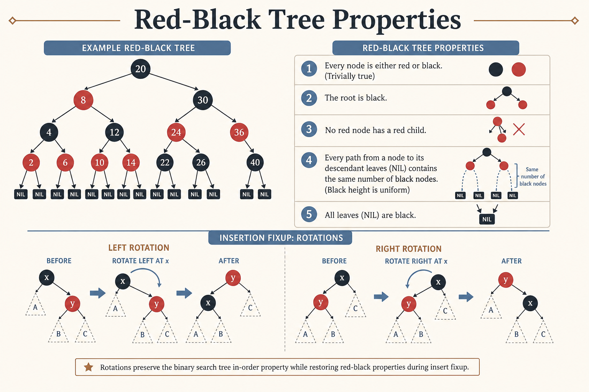
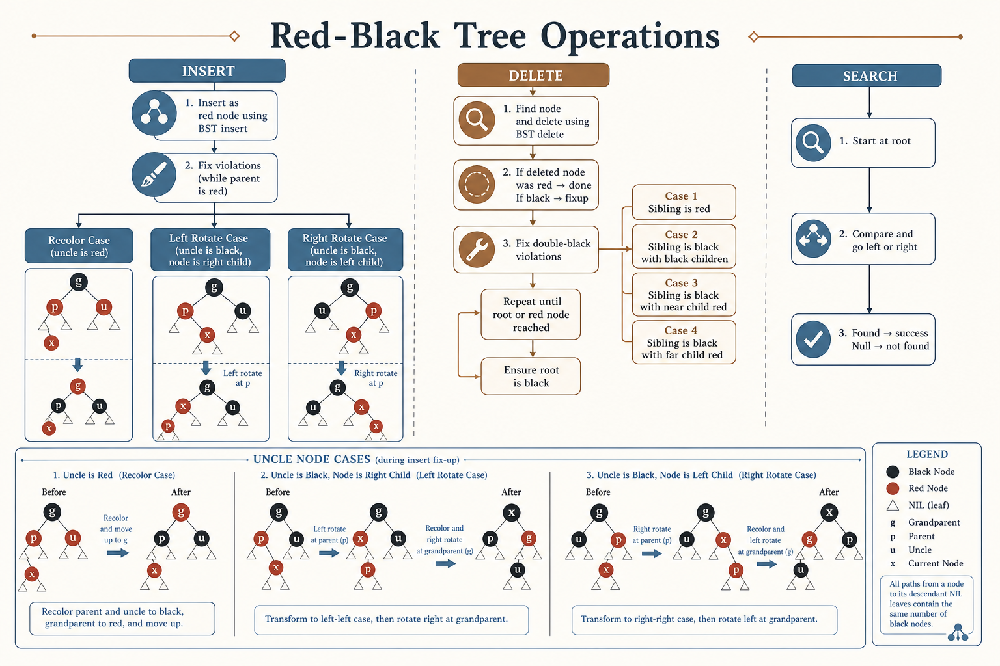

# 🔴⚫ Red-Black Trees

### *Red-Black Trees*

  
  

---

## 📊 Visual Overview

---

## 🎯 At a Glance

| | |
|:---|:---|
| **Difficulty** | Hard |
| **Problems** | 7 |

> **How to use this page:** Start with the visual overview, scan **At a Glance**, then work through theory → walkthroughs → code.

---

## 🧭 Navigation

| ⬅️ Previous | 📂 Current | ➡️ Next |
|:------------|:----------:|--------:|
| [← 01. AVL Trees](../01_avl_trees/README.md) | **02. Red-Black Trees** | [03. Fenwick Tree →](../03_fenwick_tree/README.md) |

---

## 📐 Mathematical Foundation
### 1️⃣ Red-Black Tree Properties

**Definition:** Self-balancing BST with color property (RED or BLACK).

**Five Properties:**

1. Every node is either RED or BLACK

2. Root is BLACK

3. All leaves (NIL) are BLACK

4. RED node has BLACK children (no consecutive REDs)

5. All paths from node to descendant leaves have same number of BLACK nodes

**Black Height:** Number of BLACK nodes on path to leaf (excluding node itself).

---

### 2️⃣ Height Bound Theorem

**Theorem:** Red-Black tree with $n$ nodes has height $h \leq 2\log_2(n+1)$.

**Proof:**
Let $bh(x)$ = black height of node $x$.

**Lemma:** Subtree rooted at $x$ contains at least $2^{bh(x)} - 1$ internal nodes.

Proof by induction:

- Base: $bh(x) = 0 \implies$ leaf $\implies 0 = 2^0 - 1$ ✓

- Step: Each child has black height $\geq bh(x) - 1$
  - By induction: $\geq 2^{bh(x)-1} - 1$ nodes
  - Total: $2(2^{bh(x)-1} - 1) + 1 = 2^{bh(x)} - 1$ ✓

For root with black height $bh$:

- $n \geq 2^{bh} - 1$

- By property 4: $bh \geq h/2$

- Therefore: $n \geq 2^{h/2} - 1$

- Solving: $h \leq 2\log_2(n+1)$ ∎

---

### 3️⃣ Rotation & Recoloring

**Operations to maintain properties:**

1. **Rotation:** Change structure (like AVL)

2. **Recoloring:** Change node colors

**Time:** $O(1)$ per operation

---

### 4️⃣ Insert Cases

**After standard BST insert (new node is RED):**

**Case 1:** Uncle is RED

- Recolor parent, uncle, grandparent

- Continue with grandparent

**Case 2:** Uncle is BLACK, node is "inside"

- Rotate to convert to Case 3

**Case 3:** Uncle is BLACK, node is "outside"  

- Rotate grandparent + recolor

**Max operations:** $O(\log n)$ recolorings, $O(1)$ rotations

---

### 5️⃣ Delete Cases

**More complex than insert (6 cases):**

- Deleting BLACK node requires rebalancing

- May need up to $O(\log n)$ rotations

**Practical:** Java TreeMap/TreeSet use Red-Black trees

---

### 6️⃣ AVL vs Red-Black Comparison

| Property | AVL | Red-Black |
|----------|:---:|:---------:|
| **Height** | $1.44 \log n$ | $2 \log n$ |
| **Insert rotations** | ≤ 1 | ≤ 2 |
| **Delete rotations** | $O(\log n)$ | ≤ 3 |
| **Lookup speed** | Faster | Slower |
| **Insert/Delete speed** | Slower | Faster |
| **Use case** | Read-heavy | Balanced ops |

---

## 💻 Code Implementations

---

## 🏆 LeetCode Problems

### 🟡 Medium Problems

| # | Problem | Difficulty | Solution Pattern |
|---|---------|------------|------------------|
| 729 | [My Calendar I](https://leetcode.com/problems/my-calendar-i/) | Medium | TreeMap range query |
| 731 | [My Calendar II](https://leetcode.com/problems/my-calendar-ii/) | Medium | TreeMap with counts |
| 220 | [Contains Duplicate III](https://leetcode.com/problems/contains-duplicate-iii/) | Medium | Sliding window + TreeSet |

---

### 🔴 Hard Problems

| # | Problem | Difficulty | Solution Pattern |
|---|---------|------------|------------------|
| 315 | [Count of Smaller Numbers After Self](https://leetcode.com/problems/count-of-smaller-numbers-after-self/) | Hard | TreeMap / BIT |
| 493 | [Reverse Pairs](https://leetcode.com/problems/reverse-pairs/) | Hard | TreeMap / Merge sort |
| 732 | [My Calendar III](https://leetcode.com/problems/my-calendar-iii/) | Hard | TreeMap sweep line |
| 327 | [Count of Range Sum](https://leetcode.com/problems/count-of-range-sum/) | Hard | TreeMap / Merge sort |

---

## 📊 Complexity Summary

| Operation | Time | Space | Rotations |
|-----------|:----:|:-----:|:---------:|
| Insert | O(log n) | O(1) | ≤ 2 |
| Delete | O(log n) | O(1) | ≤ 3 |
| Search | O(log n) | O(1) | 0 |
| Range query | O(k + log n) | O(1) | 0 |

---

## 💡 Key Insights

1. **Looser balance:** Height ≤ 2 log n (vs AVL's 1.44 log n)

2. **Faster mutations:** Fewer rotations on insert/delete

3. **Industry standard:** Used in Java TreeMap, C++ map, Linux kernel

4. **Amortized performance:** Better for mixed read/write workloads

5. **Black height:** Key invariant for proof of height bound

6. **Color flips:** Often cheaper than rotations

---

## 📚 References & Learning Resources

### 📖 Core Concepts

| Resource | Description | Link |
|----------|-------------|------|
| **Red-Black Trees** | Wikipedia | [RBT](https://en.wikipedia.org/wiki/Red%E2%80%93black_tree) |
| **Tree Rotations** | GeeksforGeeks | [Rotations](https://www.geeksforgeeks.org/introduction-to-red-black-tree/) |

### 📝 Practice

| Platform | Focus | Link |
|----------|-------|------|
| **LeetCode** | Tree tag | [Problems](https://leetcode.com/tag/tree/) |

---
