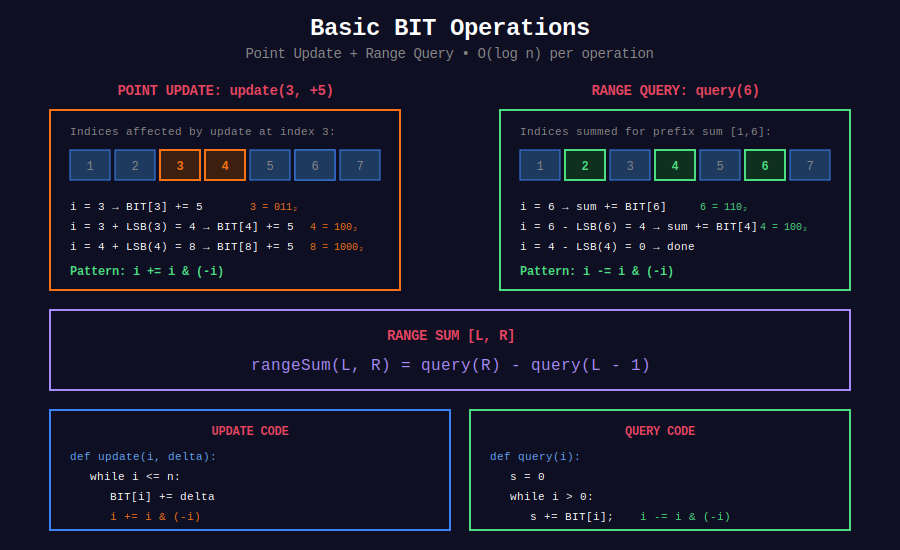

<div align="center">

# 🔢 Basic BIT Operations

<p>
  
  
</p>

</div>

---

## 🧭 Navigation

| ⬅️ Previous | 📂 Current | ➡️ Next |
|:------------|:----------:|--------:|
| [← Fenwick Tree](../README.md) | **01. Basic BIT** | [02. Inversion Counting →](../02_inversion_counting/README.md) |

---

## 📊 Visual Overview

<div align="center">

</div>

---

## 📐 Core Concepts

### Point Update + Range Query

**Most common BIT usage:**
- Update single element: `O(log n)`
- Query prefix sum: `O(log n)`
- Query range sum: Two prefix sums

### Range Update + Point Query

**Using difference array:**
- Update range: `O(log n)`
- Query point: `O(log n)`

---

## 💻 Problems & Solutions

### 1. Range Sum Query - Mutable (LeetCode 307)

**Problem:** Support update and range sum queries.

```python
class NumArray:
    """
    LeetCode 307: Range Sum Query - Mutable
    
    Time: O(log n) per operation
    """
    
    def __init__(self, nums: List[int]):
        self.n = len(nums)
        self.nums = [0] + nums  # 1-indexed
        self.tree = [0] * (self.n + 1)
        
        # Build BIT in O(n)
        for i in range(1, self.n + 1):
            self.tree[i] += self.nums[i]
            j = i + (i & -i)
            if j <= self.n:
                self.tree[j] += self.tree[i]
    
    def update(self, index: int, val: int) -> None:
        """Update nums[index] to val."""
        delta = val - self.nums[index + 1]
        self.nums[index + 1] = val
        
        i = index + 1
        while i <= self.n:
            self.tree[i] += delta
            i += i & (-i)
    
    def sumRange(self, left: int, right: int) -> int:
        """Sum of range [left, right]."""
        def prefix_sum(i):
            total = 0
            while i > 0:
                total += self.tree[i]
                i -= i & (-i)
            return total
        
        return prefix_sum(right + 1) - prefix_sum(left)
```

---

### 2. Range Addition (LeetCode 370)

**Problem:** Efficiently handle multiple range additions.

```python
def get_modified_array(length: int, updates: List[List[int]]) -> List[int]:
    """
    LeetCode 370: Range Addition
    Using difference array technique.
    
    Time: O(n + m) where m = updates
    """
    result = [0] * length
    
    # Apply range updates using difference array
    for start, end, inc in updates:
        result[start] += inc
        if end + 1 < length:
            result[end + 1] -= inc
    
    # Compute prefix sum to get actual values
    for i in range(1, length):
        result[i] += result[i - 1]
    
    return result
```

---

### 3. Range Sum Query - Immutable (LeetCode 303)

**Problem:** Prefix sum (BIT overkill but good practice).

```python
class NumArrayImmutable:
    """
    LeetCode 303: Range Sum Query - Immutable
    Simple prefix sum (BIT not needed).
    
    Time: O(1) query
    """
    
    def __init__(self, nums: List[int]):
        self.prefix = [0]
        for num in nums:
            self.prefix.append(self.prefix[-1] + num)
    
    def sumRange(self, left: int, right: int) -> int:
        return self.prefix[right + 1] - self.prefix[left]
```

---

### 4. Design Stack With Increment Operation (LeetCode 1381)

**Problem:** Stack with efficient range increment.

```python
class CustomStack:
    """
    LeetCode 1381: Design a Stack With Increment Operation
    Using lazy increment technique.
    
    Time: O(1) for all operations
    """
    
    def __init__(self, maxSize: int):
        self.stack = []
        self.max_size = maxSize
        self.inc = []  # Lazy increment for each position
    
    def push(self, x: int) -> None:
        if len(self.stack) < self.max_size:
            self.stack.append(x)
            self.inc.append(0)
    
    def pop(self) -> int:
        if not self.stack:
            return -1
        
        val = self.stack.pop()
        increment = self.inc.pop()
        
        # Propagate increment to element below
        if self.inc:
            self.inc[-1] += increment
        
        return val + increment
    
    def increment(self, k: int, val: int) -> None:
        """Increment bottom k elements by val."""
        if self.inc:
            idx = min(k, len(self.inc)) - 1
            self.inc[idx] += val
```

---

### 5. Process Restricted Friend Requests (LeetCode 2076)

**Problem:** Track friendships with restrictions.

```python
def friendRequests(n: int, restrictions: List[List[int]], 
                   requests: List[List[int]]) -> List[bool]:
    """
    LeetCode 2076: Process Restricted Friend Requests
    Using Union-Find (related concept).
    
    Time: O(m * r) where m = requests, r = restrictions
    """
    parent = list(range(n))
    
    def find(x):
        if parent[x] != x:
            parent[x] = find(parent[x])
        return parent[x]
    
    result = []
    
    for u, v in requests:
        pu, pv = find(u), find(v)
        
        if pu == pv:
            result.append(True)
            continue
        
        # Check if union violates any restriction
        valid = True
        for x, y in restrictions:
            px, py = find(x), find(y)
            if (px == pu and py == pv) or (px == pv and py == pu):
                valid = False
                break
        
        if valid:
            parent[pu] = pv
        
        result.append(valid)
    
    return result
```

---

### 6. Number of Subsequences (Custom)

**Problem:** Count subsequences with sum in range.

```python
def count_subsequences_in_range(nums: List[int], min_sum: int, max_sum: int) -> int:
    """
    Count subsequences with sum in [min_sum, max_sum].
    Using DP with BIT optimization.
    
    Time: O(n * max_sum * log(max_sum))
    """
    MOD = 10**9 + 7
    
    # dp[sum] = number of subsequences with this sum
    dp = {0: 1}
    
    for num in nums:
        new_dp = dp.copy()
        for s in dp:
            new_sum = s + num
            if new_sum <= max_sum:
                new_dp[new_sum] = (new_dp.get(new_sum, 0) + dp[s]) % MOD
        dp = new_dp
    
    # Count sums in range
    result = 0
    for s in dp:
        if min_sum <= s <= max_sum:
            result = (result + dp[s]) % MOD
    
    return result
```

---

## 📊 Problem Summary

| Problem | Difficulty | Key Technique |
|---------|:----------:|---------------|
| Range Sum Query - Mutable | Medium | Point update + range query |
| Range Addition | Medium | Difference array |
| Range Sum Query - Immutable | Easy | Prefix sum |
| Stack With Increment | Medium | Lazy propagation |
| Friend Requests | Hard | Union-Find + validation |
| Subsequences in Range | Hard | DP + BIT |

---

## 💡 Key Patterns

1. **Point Update + Range Query:** Standard BIT
2. **Range Update + Point Query:** Difference array + BIT
3. **Lazy Updates:** Defer computation until needed
4. **Coordinate Compression:** Map large values to small indices
5. **Multiple BITs:** Track different properties simultaneously

---

## 🧭 Navigation

| ⬅️ Previous | 📂 Current | ➡️ Next |
|:------------|:----------:|--------:|
| [← Fenwick Tree](../README.md) | **01. Basic BIT** | [02. Inversion Counting →](../02_inversion_counting/README.md) |

