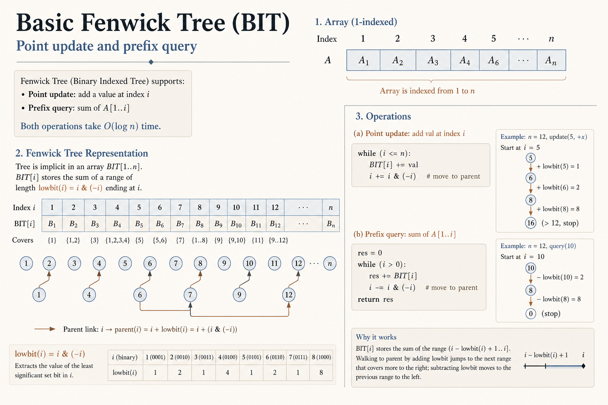
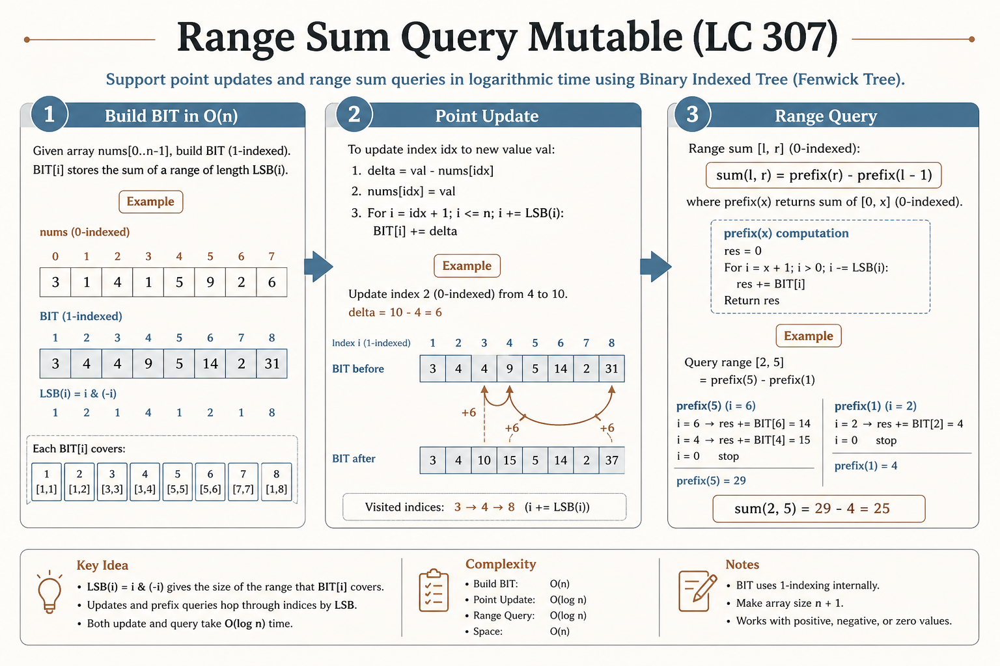
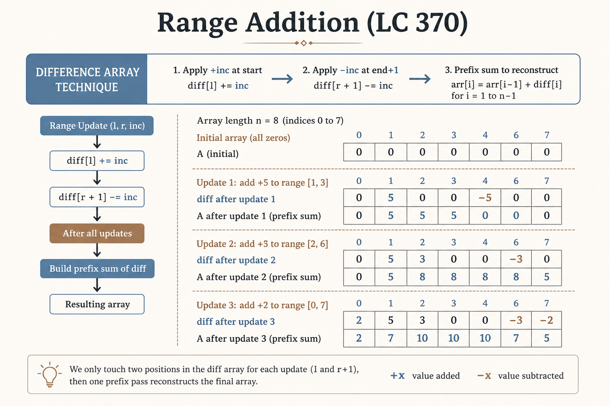
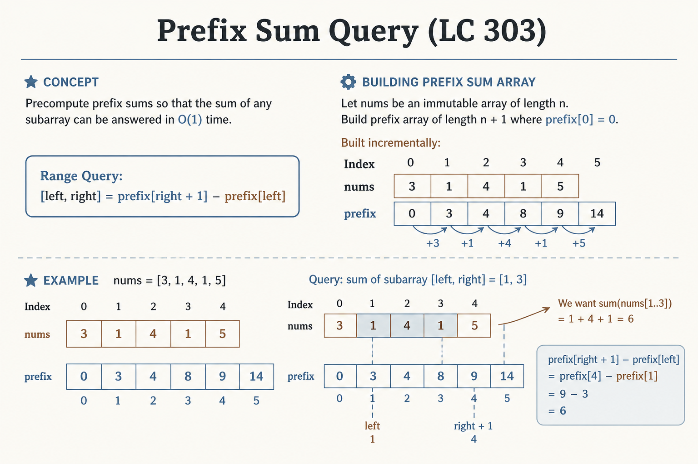
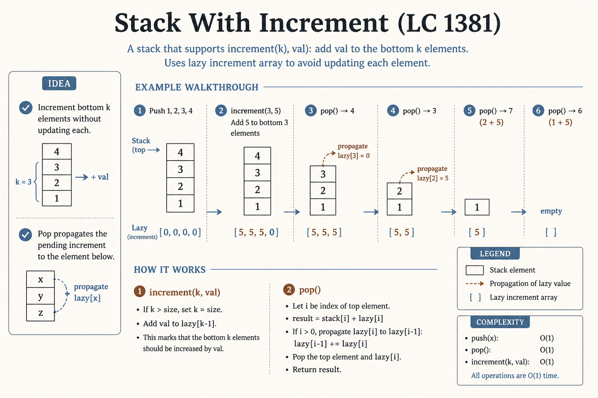
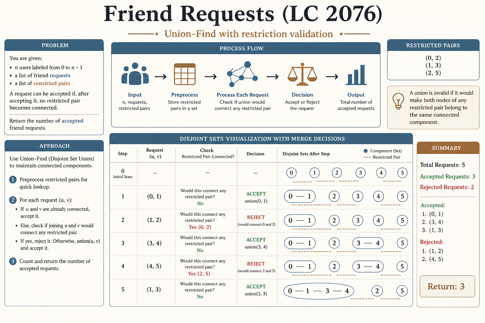
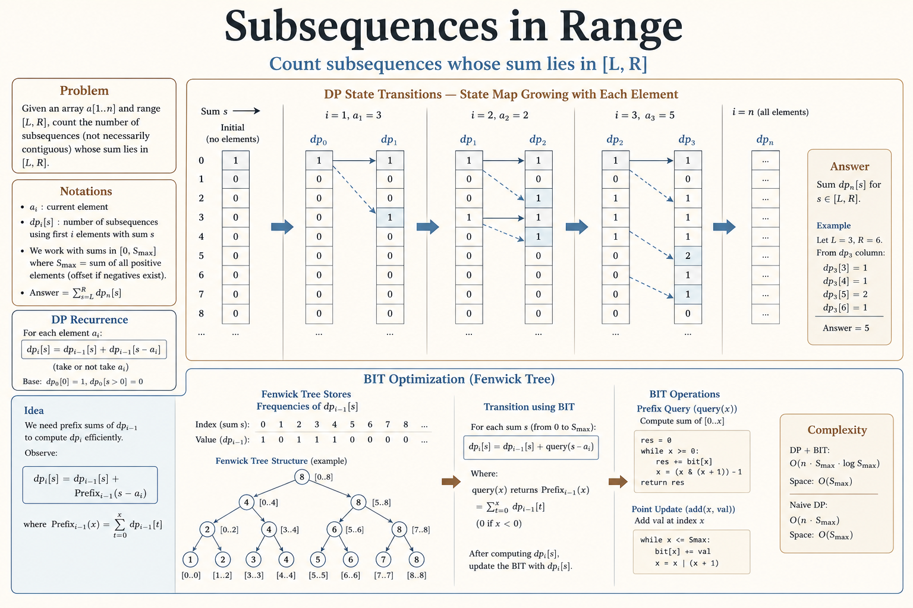

# 🔢 Basic BIT Operations

### *Basic BIT Operations*

  
  

---

## 📊 Visual Overview

---

## 🎯 At a Glance

| | |
|:---|:---|
| **Difficulty** | Medium |
| **Problems** | 6 |

> **How to use this page:** Start with the visual overview, scan **At a Glance**, then work through theory → walkthroughs → code.

---

## 🧭 Navigation

| ⬅️ Previous | 📂 Current | ➡️ Next |
|:------------|:----------:|--------:|
| [← Fenwick Tree](../README.md) | **01. Basic BIT** | [02. Inversion Counting →](../02_inversion_counting/README.md) |

---

## 📐 Core Concepts

### Point Update + Range Query

**Most common BIT usage:**

- Update single element: `O(log n)`
- Query prefix sum: `O(log n)`
- Query range sum: Two prefix sums

### Range Update + Point Query

**Using difference array:**

- Update range: `O(log n)`
- Query point: `O(log n)`

---

## 💻 Problems & Solutions

### 1. Range Sum Query - Mutable (LeetCode 307)

**Problem:** Support update and range sum queries.

---

### 2. Range Addition (LeetCode 370)

**Problem:** Efficiently handle multiple range additions.

---

### 3. Range Sum Query - Immutable (LeetCode 303)

**Problem:** Prefix sum (BIT overkill but good practice).

---

### 4. Design Stack With Increment Operation (LeetCode 1381)

**Problem:** Stack with efficient range increment.

---

### 5. Process Restricted Friend Requests (LeetCode 2076)

**Problem:** Track friendships with restrictions.

---

### 6. Number of Subsequences (Custom)

**Problem:** Count subsequences with sum in range.

---

## 📊 Problem Summary

| Problem | Difficulty | Key Technique |
|---------|:----------:|---------------|
| Range Sum Query - Mutable | Medium | Point update + range query |
| Range Addition | Medium | Difference array |
| Range Sum Query - Immutable | Easy | Prefix sum |
| Stack With Increment | Medium | Lazy propagation |
| Friend Requests | Hard | Union-Find + validation |
| Subsequences in Range | Hard | DP + BIT |

---

## 💡 Key Patterns

1. **Point Update + Range Query:** Standard BIT

2. **Range Update + Point Query:** Difference array + BIT

3. **Lazy Updates:** Defer computation until needed

4. **Coordinate Compression:** Map large values to small indices

5. **Multiple BITs:** Track different properties simultaneously

---
