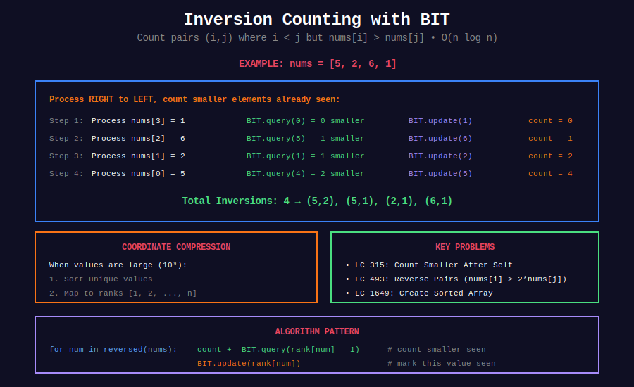

<div align="center">

# 🔄 Inversion Counting with BIT

<p>
  
  
</p>

</div>

---

## 🧭 Navigation

| ⬅️ Previous | 📂 Current | ➡️ Next |
|:------------|:----------:|--------:|
| [← 01. Basic BIT](../01_basic_bit/README.md) | **02. Inversion Counting** | [03. 2D BIT →](../03_2d_bit/README.md) |

---

## 📊 Visual Overview

<div align="center">

</div>

---

## 📐 Core Concept

**Inversion:** Pair $(i, j)$ where $i < j$ but $nums[i] > nums[j]$.

**BIT Approach:**
1. Process elements left to right
2. For each element, count how many larger/smaller elements seen
3. Use coordinate compression for large values

**Time:** $O(n \log n)$

---

## 💻 Key Problems

### 1. Count of Smaller Numbers After Self (LeetCode 315)

```python
def countSmaller(nums: List[int]) -> List[int]:
    """
    LeetCode 315: Count of Smaller Numbers After Self
    
    Time: O(n log n), Space: O(n)
    """
    # Coordinate compression
    sorted_nums = sorted(set(nums))
    rank = {v: i + 1 for i, v in enumerate(sorted_nums)}
    
    class BIT:
        def __init__(self, n):
            self.n = n
            self.tree = [0] * (n + 1)
        
        def update(self, i):
            while i <= self.n:
                self.tree[i] += 1
                i += i & (-i)
        
        def query(self, i):
            total = 0
            while i > 0:
                total += self.tree[i]
                i -= i & (-i)
            return total
    
    n = len(sorted_nums)
    bit = BIT(n)
    result = []
    
    # Process from right to left
    for num in reversed(nums):
        r = rank[num]
        count = bit.query(r - 1)  # Count smaller
        result.append(count)
        bit.update(r)
    
    return result[::-1]

```

### 2. Reverse Pairs (LeetCode 493)

```python
def reversePairs(nums: List[int]) -> int:
    """
    LeetCode 493: Reverse Pairs
    Count pairs where nums[i] > 2 * nums[j] and i < j.
    
    Time: O(n log n)
    """
    # Coordinate compression
    all_nums = sorted(set(nums + [2 * x for x in nums]))
    rank = {v: i + 1 for i, v in enumerate(all_nums)}
    
    class BIT:
        def __init__(self, n):
            self.n = n
            self.tree = [0] * (n + 1)
        
        def update(self, i):
            while i <= self.n:
                self.tree[i] += 1
                i += i & (-i)
        
        def query(self, i):
            total = 0
            while i > 0:
                total += self.tree[i]
                i -= i & (-i)
            return total
    
    n = len(all_nums)
    bit = BIT(n)
    count = 0
    
    for num in reversed(nums):
        # Count elements < num / 2
        threshold = rank.get(2 * num, 0)
        if threshold > 0:
            count += bit.query(threshold - 1)
        
        bit.update(rank[num])
    
    return count

```

### 3. Create Sorted Array (LeetCode 1649)

```python
def createSortedArray(instructions: List[int]) -> int:
    """
    LeetCode 1649: Create Sorted Array through Instructions
    
    Time: O(n log m), Space: O(m)
    """
    MOD = 10**9 + 7
    max_val = max(instructions)
    
    class BIT:
        def __init__(self, n):
            self.n = n
            self.tree = [0] * (n + 1)
        
        def update(self, i):
            while i <= self.n:
                self.tree[i] += 1
                i += i & (-i)
        
        def query(self, i):
            total = 0
            while i > 0:
                total += self.tree[i]
                i -= i & (-i)
            return total
    
    bit = BIT(max_val)
    cost = 0
    
    for i, num in enumerate(instructions):
        less = bit.query(num - 1)
        greater = i - bit.query(num)
        cost = (cost + min(less, greater)) % MOD
        bit.update(num)
    
    return cost

```

---

## 📋 All Problems

| # | Problem | Difficulty | Key Technique |
|---|---------|:----------:|---------------|
| 315 | Count of Smaller After Self | Hard | Right-to-left scan |
| 493 | Reverse Pairs | Hard | Threshold query |
| 1649 | Create Sorted Array | Hard | Min cost calculation |
| 327 | Count of Range Sum | Hard | Prefix sums + BIT |
| 2179 | Count Good Triplets | Hard | Two BITs |
| 2426 | Pairs Satisfying Inequality | Hard | Transform + BIT |
| - | Global Inversion Count | Hard | Standard inversion |
| - | Local Inversion Count | Hard | Adjacent pairs |

---

## 🧭 Navigation

| ⬅️ Previous | 📂 Current | ➡️ Next |
|:------------|:----------:|--------:|
| [← 01. Basic BIT](../01_basic_bit/README.md) | **02. Inversion Counting** | [03. 2D BIT →](../03_2d_bit/README.md) |

