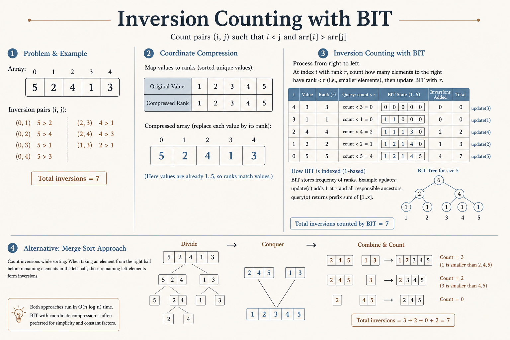
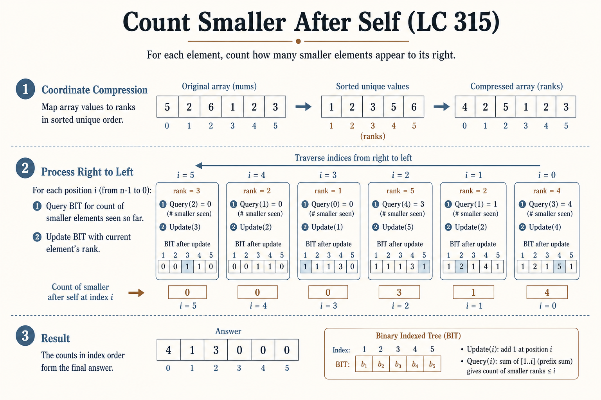
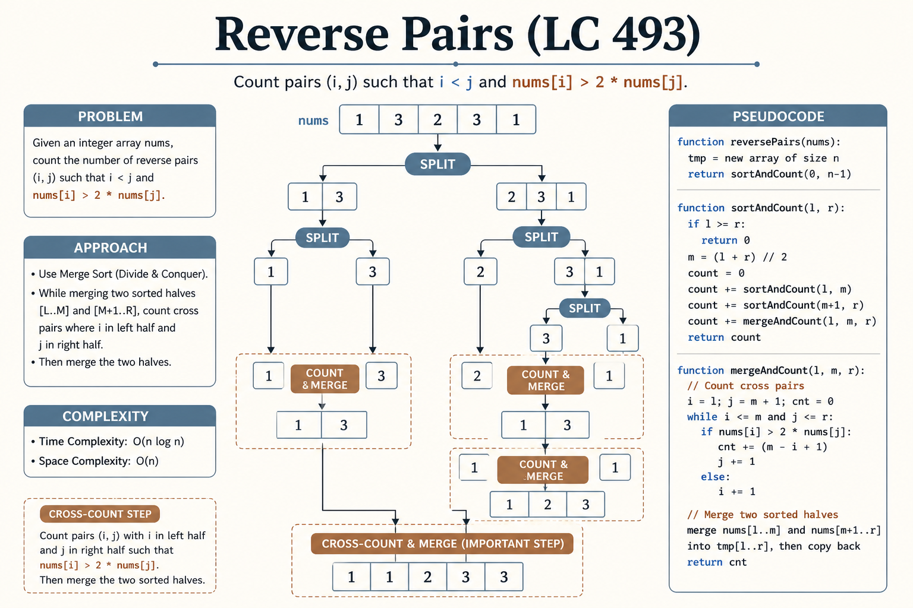
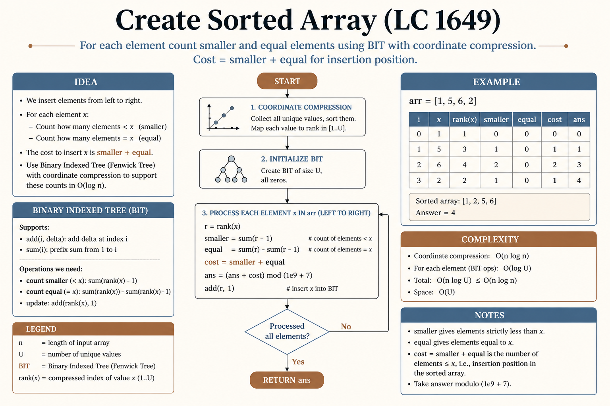

# 🔄 Inversion Counting with BIT

### *Inversion Counting with BIT*

  
  

---

## 📊 Visual Overview

---

## 🎯 At a Glance

| | |
|:---|:---|
| **Difficulty** | Hard |
| **Problems** | 8 |

> **How to use this page:** Start with the visual overview, scan **At a Glance**, then work through theory → walkthroughs → code.

---

## 🧭 Navigation

| ⬅️ Previous | 📂 Current | ➡️ Next |
|:------------|:----------:|--------:|
| [← 01. Basic BIT](../01_basic_bit/README.md) | **02. Inversion Counting** | [03. 2D BIT →](../03_2d_bit/README.md) |

---

## 📐 Core Concept

**Inversion:** Pair $(i, j)$ where $i < j$ but $nums[i] > nums[j]$.

**BIT Approach:**

1. Process elements left to right

2. For each element, count how many larger/smaller elements seen

3. Use coordinate compression for large values

**Time:** $O(n \log n)$

---

## 💻 Key Problems

### 1. Count of Smaller Numbers After Self (LeetCode 315)

### 2. Reverse Pairs (LeetCode 493)

### 3. Create Sorted Array (LeetCode 1649)

---

## 📋 All Problems

| # | Problem | Difficulty | Key Technique |
|---|---------|:----------:|---------------|
| 315 | Count of Smaller After Self | Hard | Right-to-left scan |
| 493 | Reverse Pairs | Hard | Threshold query |
| 1649 | Create Sorted Array | Hard | Min cost calculation |
| 327 | Count of Range Sum | Hard | Prefix sums + BIT |
| 2179 | Count Good Triplets | Hard | Two BITs |
| 2426 | Pairs Satisfying Inequality | Hard | Transform + BIT |
| - | Global Inversion Count | Hard | Standard inversion |
| - | Local Inversion Count | Hard | Adjacent pairs |

---
