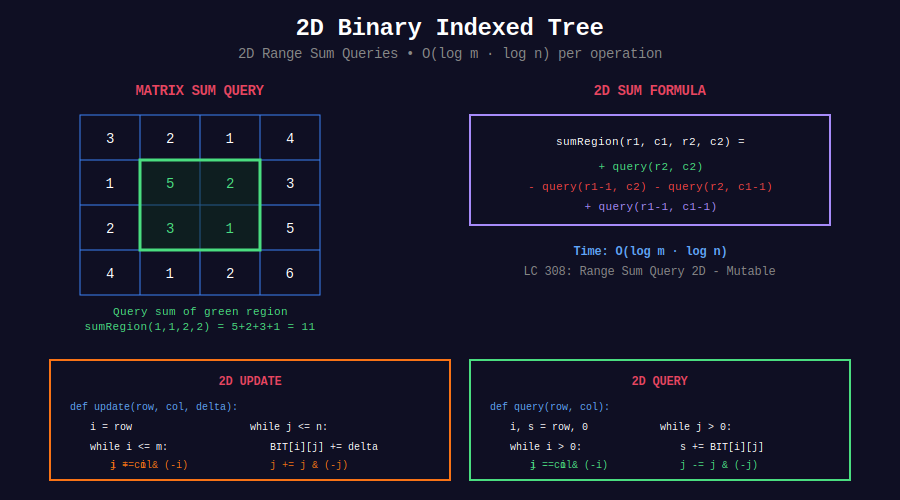

<div align="center">

# 📊 2D Binary Indexed Tree

<p>
  
  
</p>

</div>

---

## 🧭 Navigation

| ⬅️ Previous | 📂 Current | ➡️ Next |
|:------------|:----------:|--------:|
| [← 02. Inversion Counting](../02_inversion_counting/README.md) | **03. 2D BIT** | [04. Order Statistics →](../04_order_statistics/README.md) |

---

## 📊 Visual Overview

<div align="center">

</div>

---

## 📐 Core Concept

**2D BIT:** Extend 1D BIT to 2D matrices.

**Operations:**
- Update `(row, col)`: $O(\log m \cdot \log n)$
- Query rectangle: $O(\log m \cdot \log n)$

---

## 💻 Implementation

```python
class NumMatrix:
    """
    LeetCode 308: Range Sum Query 2D - Mutable
    
    Time: O(log m * log n) per operation
    """
    
    def __init__(self, matrix: List[List[int]]):
        if not matrix or not matrix[0]:
            return
        
        self.matrix = matrix
        self.m = len(matrix)
        self.n = len(matrix[0])
        self.tree = [[0] * (self.n + 1) for _ in range(self.m + 1)]
        
        for i in range(self.m):
            for j in range(self.n):
                self._update(i + 1, j + 1, matrix[i][j])
    
    def _update(self, row: int, col: int, delta: int) -> None:
        i = row
        while i <= self.m:
            j = col
            while j <= self.n:
                self.tree[i][j] += delta
                j += j & (-j)
            i += i & (-i)
    
    def update(self, row: int, col: int, val: int) -> None:
        delta = val - self.matrix[row][col]
        self.matrix[row][col] = val
        self._update(row + 1, col + 1, delta)
    
    def _query(self, row: int, col: int) -> int:
        total = 0
        i = row
        while i > 0:
            j = col
            while j > 0:
                total += self.tree[i][j]
                j -= j & (-j)
            i -= i & (-i)
        return total
    
    def sumRegion(self, r1: int, c1: int, r2: int, c2: int) -> int:
        return (self._query(r2 + 1, c2 + 1) - 
                self._query(r1, c2 + 1) -
                self._query(r2 + 1, c1) + 
                self._query(r1, c1))

```

---

## 📋 Problems

| # | Problem | Difficulty |
|---|---------|:----------:|
| 308 | Range Sum Query 2D - Mutable | Hard |
| 2250 | Count Rectangles Containing Point | Medium |
| - | 2D Inversion Count | Hard |
| - | Count Islands Dynamic | Hard |
| - | Matrix Rain Water | Hard |

---

## 🧭 Navigation

| ⬅️ Previous | 📂 Current | ➡️ Next |
|:------------|:----------:|--------:|
| [← 02. Inversion Counting](../02_inversion_counting/README.md) | **03. 2D BIT** | [04. Order Statistics →](../04_order_statistics/README.md) |

