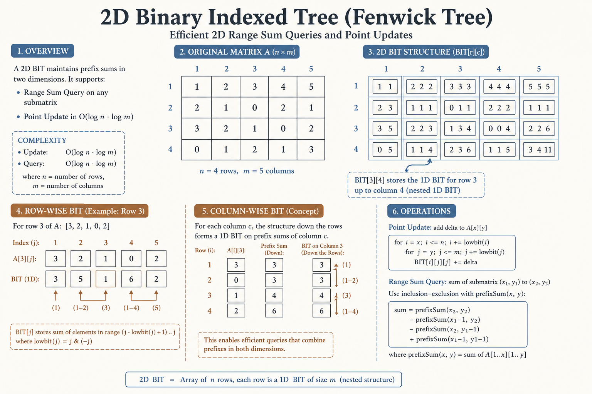
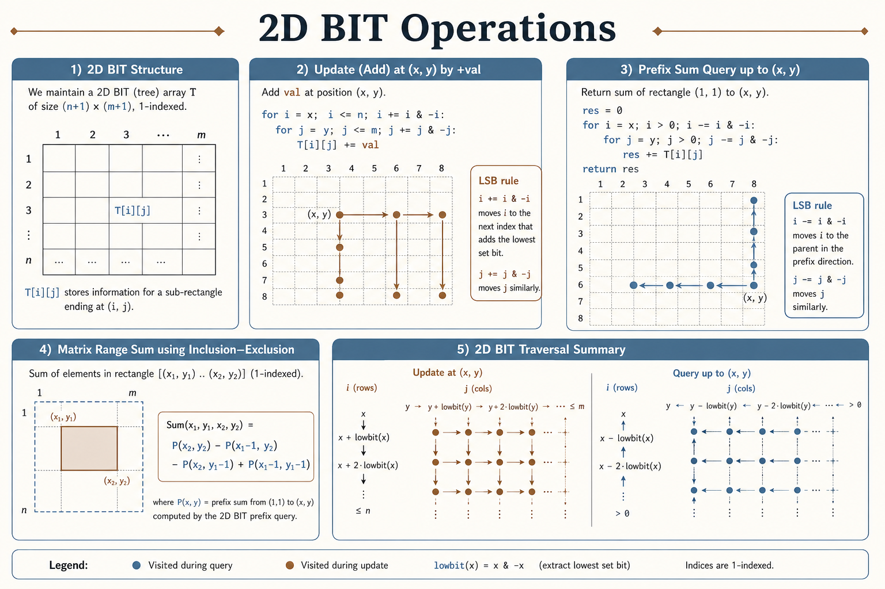

# 📊 2D Binary Indexed Tree

### *Binary Indexed Tree*

  
  

---

## 📊 Visual Overview

---

## 🎯 At a Glance

| | |
|:---|:---|
| **Difficulty** | Hard |
| **Problems** | 5 |

> **How to use this page:** Start with the visual overview, scan **At a Glance**, then work through theory → walkthroughs → code.

---

## 🧭 Navigation

| ⬅️ Previous | 📂 Current | ➡️ Next |
|:------------|:----------:|--------:|
| [← 02. Inversion Counting](../02_inversion_counting/README.md) | **03. 2D BIT** | [04. Order Statistics →](../04_order_statistics/README.md) |

---

## 📐 Core Concept

**2D BIT:** Extend 1D BIT to 2D matrices.

**Operations:**

- Update `(row, col)`: $O(\log m \cdot \log n)$

- Query rectangle: $O(\log m \cdot \log n)$

---

## 💻 Implementation

---

## 📋 Problems

| # | Problem | Difficulty |
|---|---------|:----------:|
| 308 | Range Sum Query 2D - Mutable | Hard |
| 2250 | Count Rectangles Containing Point | Medium |
| - | 2D Inversion Count | Hard |
| - | Count Islands Dynamic | Hard |
| - | Matrix Rain Water | Hard |

---
