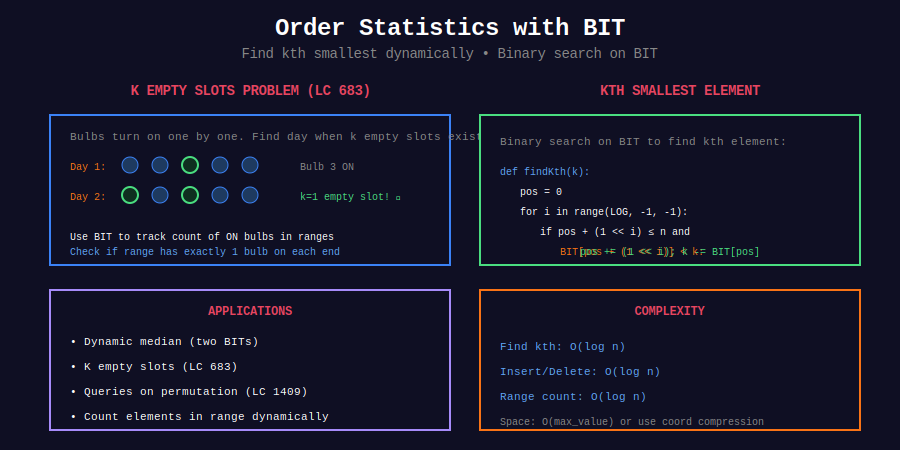

<div align="center">

# 📈 Order Statistics with BIT

<p>
  
  
</p>

</div>

---

## 🧭 Navigation

| ⬅️ Previous | 📂 Current | ➡️ Next |
|:------------|:----------:|--------:|
| [← 03. 2D BIT](../03_2d_bit/README.md) | **04. Order Statistics** | [05. DP with BIT →](../05_dp_with_bit/README.md) |

---

## 📊 Visual Overview

<div align="center">

</div>

---

## 📐 Core Concept

**Order Statistics:** Find k-th smallest/largest element dynamically.

**BIT Approach:** Binary search on BIT to find k-th element.

---

## 💻 Key Problem

### K Empty Slots (LeetCode 683)

```python
def kEmptySlots(bulbs: List[int], k: int) -> int:
    """
    LeetCode 683: K Empty Slots
    
    Time: O(n log n)
    """
    n = len(bulbs)
    
    class BIT:
        def __init__(self, n):
            self.n = n
            self.tree = [0] * (n + 1)
        
        def update(self, i):
            while i <= self.n:
                self.tree[i] += 1
                i += i & (-i)
        
        def query(self, i):
            total = 0
            while i > 0:
                total += self.tree[i]
                i -= i & (-i)
            return total
    
    bit = BIT(n)
    
    for day, pos in enumerate(bulbs, 1):
        bit.update(pos)
        
        # Check left neighbor
        if pos - k - 1 >= 1:
            if bit.query(pos - 1) - bit.query(pos - k - 2) == 1:
                return day
        
        # Check right neighbor
        if pos + k + 1 <= n:
            if bit.query(pos + k + 1) - bit.query(pos) == 1:
                return day
    
    return -1
```

---

## 📋 Problems

| # | Problem | Difficulty |
|---|---------|:----------:|
| 683 | K Empty Slots | Hard |
| 1409 | Queries on Permutation | Medium |
| - | Kth Smallest in Stream | Hard |
| - | Dynamic Median | Hard |
| - | Count Elements in Range | Hard |

---

## 🧭 Navigation

| ⬅️ Previous | 📂 Current | ➡️ Next |
|:------------|:----------:|--------:|
| [← 03. 2D BIT](../03_2d_bit/README.md) | **04. Order Statistics** | [05. DP with BIT →](../05_dp_with_bit/README.md) |

