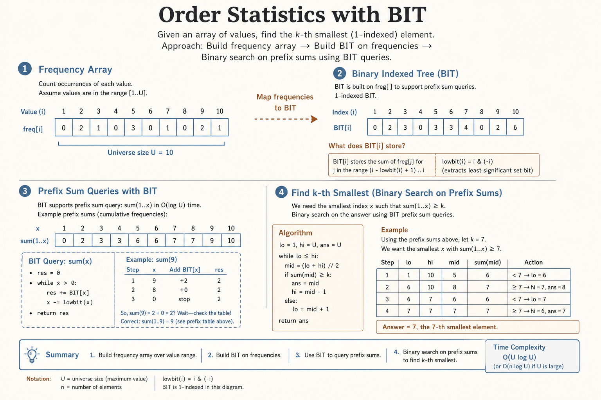
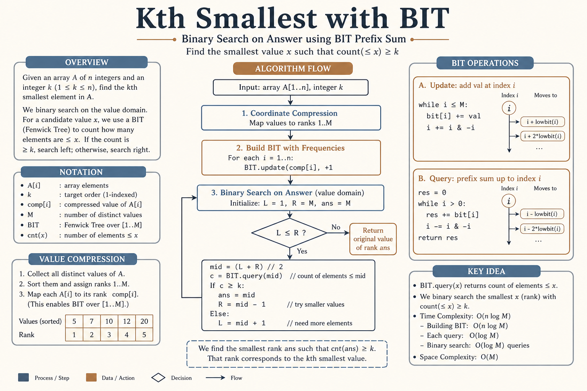

# 📈 Order Statistics with BIT

### *Order Statistics with BIT*

  
  

---

## 📊 Visual Overview

---

## 🎯 At a Glance

| | |
|:---|:---|
| **Difficulty** | Hard |
| **Problems** | 5 |

{: .highlight }
> **How to use this page:** Start with the visual overview, scan **At a Glance**, then work through theory → walkthroughs → code.

---

## 🧭 Navigation

| ⬅️ Previous | 📂 Current | ➡️ Next |
|:------------|:----------:|--------:|
| [← 03. 2D BIT](../03_2d_bit/README.md) | **04. Order Statistics** | [05. DP with BIT →](../05_dp_with_bit/README.md) |

---

## 📐 Core Concept

**Order Statistics:** Find k-th smallest/largest element dynamically.

**BIT Approach:** Binary search on BIT to find k-th element.

---

## 💻 Key Problem

### K Empty Slots (LeetCode 683)

---

## 📋 Problems

| # | Problem | Difficulty |
|---|---------|:----------:|
| 683 | K Empty Slots | Hard |
| 1409 | Queries on Permutation | Medium |
| - | Kth Smallest in Stream | Hard |
| - | Dynamic Median | Hard |
| - | Count Elements in Range | Hard |

---
