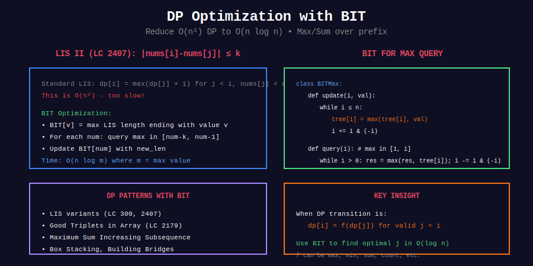

<div align="center">

# 🎯 Dynamic Programming with BIT

<p>
  
  
</p>

</div>

---

## 🧭 Navigation

| ⬅️ Previous | 📂 Current | ➡️ Next |
|:------------|:----------:|--------:|
| [← 04. Order Statistics](../04_order_statistics/README.md) | **05. DP with BIT** | [Fenwick Tree →](../README.md) |

---

## 📊 Visual Overview

<div align="center">

</div>

---

## 📐 Core Concept

**DP + BIT:** Use BIT to optimize DP state transitions from $O(n^2)$ to $O(n \log n)$.

**Common Pattern:** `dp[i] = max/min(dp[j] + cost)` for valid `j < i`.

---

## 💻 Key Problem

### Longest Increasing Subsequence II (LeetCode 2407)

```python
def lengthOfLIS(nums: List[int], k: int) -> int:
    """
    LeetCode 2407: LIS II with constraint |nums[i] - nums[j]| <= k
    
    Time: O(n log m), Space: O(m)
    """
    max_val = max(nums)
    
    class BITMax:
        def __init__(self, n):
            self.n = n
            self.tree = [0] * (n + 1)
        
        def update(self, i, val):
            while i <= self.n:
                self.tree[i] = max(self.tree[i], val)
                i += i & (-i)
        
        def query(self, i):
            res = 0
            while i > 0:
                res = max(res, self.tree[i])
                i -= i & (-i)
            return res
        
        def range_max(self, l, r):
            # Query max in range [l, r]
            # For BIT, need different approach or segment tree
            return self.query(r)
    
    bit = BITMax(max_val)
    result = 0
    
    for num in nums:
        # Query max LIS ending with value in [num-k, num-1]
        max_len = 0
        if num > 1:
            max_len = bit.query(min(num - 1, num + k - 1))
        
        new_len = max_len + 1
        bit.update(num, new_len)
        result = max(result, new_len)
    
    return result
```

---

## 📋 Problems

| # | Problem | Difficulty |
|---|---------|:----------:|
| 2407 | LIS II | Hard |
| 2179 | Good Triplets in Array | Hard |
| - | LIS with Weight | Hard |
| - | Maximum Sum IS | Hard |
| - | Box Stacking | Hard |
| - | Building Bridges | Hard |

---

## 🧭 Navigation

| ⬅️ Previous | 📂 Current | ➡️ Next |
|:------------|:----------:|--------:|
| [← 04. Order Statistics](../04_order_statistics/README.md) | **05. DP with BIT** | [Fenwick Tree →](../README.md) |

