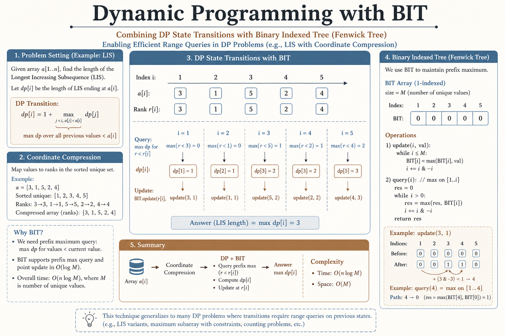
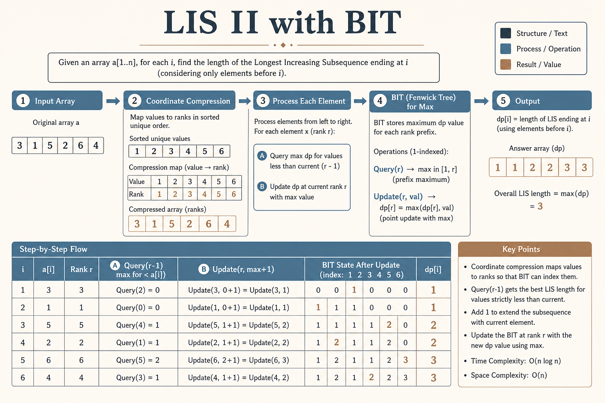

# 🎯 Dynamic Programming with BIT

### *Dynamic Programming with BIT*

  
  

---

## 📊 Visual Overview

---

## 🎯 At a Glance

| | |
|:---|:---|
| **Difficulty** | Hard |
| **Problems** | 6 |

{: .highlight }
> **How to use this page:** Start with the visual overview, scan **At a Glance**, then work through theory → walkthroughs → code.

---

## 🧭 Navigation

| ⬅️ Previous | 📂 Current | ➡️ Next |
|:------------|:----------:|--------:|
| [← 04. Order Statistics](../04_order_statistics/README.md) | **05. DP with BIT** | [Fenwick Tree →](../README.md) |

---

## 📐 Core Concept

**DP + BIT:** Use BIT to optimize DP state transitions from $O(n^2)$ to $O(n \log n)$.

**Common Pattern:** `dp[i] = max/min(dp[j] + cost)` for valid `j < i`.

---

## 💻 Key Problem

### Longest Increasing Subsequence II (LeetCode 2407)

---

## 📋 Problems

| # | Problem | Difficulty |
|---|---------|:----------:|
| 2407 | LIS II | Hard |
| 2179 | Good Triplets in Array | Hard |
| - | LIS with Weight | Hard |
| - | Maximum Sum IS | Hard |
| - | Box Stacking | Hard |
| - | Building Bridges | Hard |

---
