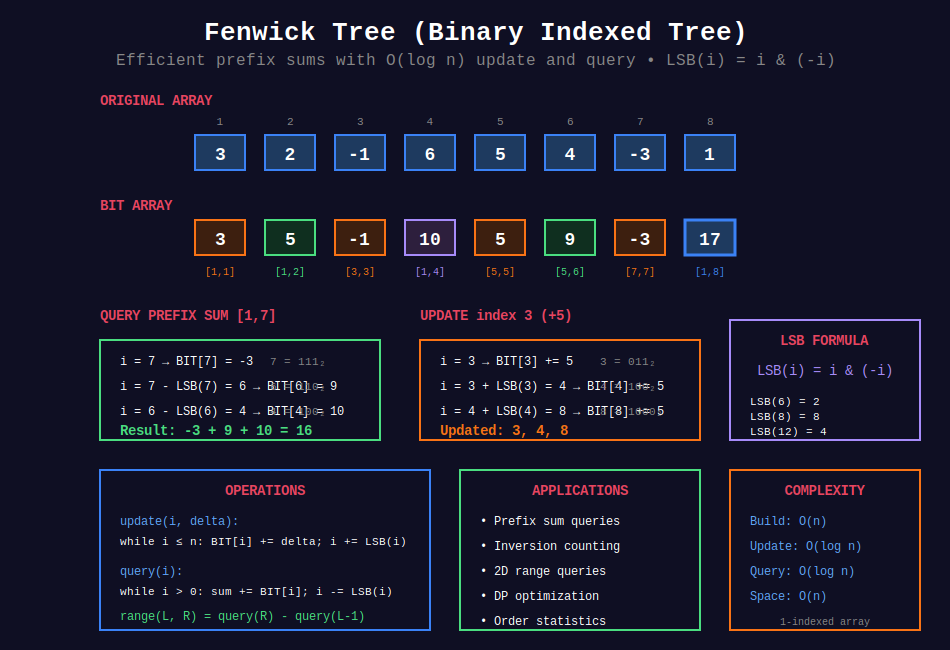

<div align="center">

# 🌲 Fenwick Tree (Binary Indexed Tree)

<p>
  
  
  
</p>

</div>

---

## 🧭 Navigation

| ⬅️ Previous | 📂 Current | ➡️ Next |
|:------------|:----------:|--------:|
| [← 02. Red-Black Trees](../02_red_black_trees/README.md) | **03. Fenwick Tree** | [04. Splay Trees →](../04_splay_trees/README.md) |

---

## 📂 Subtopics

<table>
<tr>
<td width="33%">

### [01. Basic BIT](./01_basic_bit/)

- Point update

- Range query

- Range update

</td>
<td width="33%">

### [02. Inversion Counting](./02_inversion_counting/)

- Count inversions

- Reverse pairs

- Coordinate compression

</td>
<td width="33%">

### [03. 2D BIT](./03_2d_bit/)

- 2D updates

- 2D range queries

- Matrix operations

</td>
</tr>
<tr>
<td width="33%">

### [04. Order Statistics](./04_order_statistics/)

- Kth smallest

- K empty slots

- Dynamic ranking

</td>
<td width="33%">

### [05. DP with BIT](./05_dp_with_bit/)

- LIS variants

- DP optimization

- State compression

</td>
<td width="33%">

</td>
</tr>
</table>

---

## 📊 Visual Overview

<div align="center">

</div>

---

## 📋 Overview

**Fenwick Tree (Binary Indexed Tree)** is a data structure that efficiently supports:

- **Point updates:** Modify single element in O(log n)

- **Prefix queries:** Compute prefix sum in O(log n)

- **Range queries:** Sum of any range in O(log n)

**Invented by:** Peter Fenwick (1994)

**Key Advantage:** Simpler than Segment Tree for sum queries, uses less memory.

---

## 🎯 Quick Reference

### Core Operations

| Operation | Time | Description |
|-----------|:----:|-------------|
| **Build** | O(n) | Construct from array |
| **Update** | O(log n) | Modify single element |
| **Query** | O(log n) | Prefix or range sum |
| **Space** | O(n) | Linear memory |

### LSB Formula

**Least Significant Bit:** `LSB(i) = i & (-i)`

This isolates the rightmost set bit, determining which range each index stores.

---

## 📐 Mathematical Foundations

### 1️⃣ Fenwick Tree Definition

**Binary Indexed Tree (BIT):** Data structure for efficient prefix sum queries and point updates.

**Index $i$ stores:** Sum from $(i - \text{LSB}(i) + 1)$ to $i$

where $\text{LSB}(i)$ = least significant bit = $i \& (-i)$

### 2️⃣ LSB (Least Significant Bit)

**Formula:** $\text{LSB}(i) = i \& (-i)$

**Examples:**

- $\text{LSB}(12) = 12 \& (-12) = 1100\_2 \& 0100\_2 = 0100\_2 = 4$

- $\text{LSB}(10) = 10 \& (-10) = 1010\_2 \& 0110\_2 = 0010\_2 = 2$

- $\text{LSB}(8) = 8 \& (-8) = 1000\_2 \& 1000\_2 = 1000\_2 = 8$

**Why it works:** Two's complement: $-i = \sim i + 1$

### 3️⃣ Operations

**Update:** Add $\delta$ to index $i$

```
while i <= n:
    BIT[i] += delta
    i += LSB(i)  # Move to parent

```

**Query:** Get prefix sum $[1, i]$

```
sum = 0
while i > 0:
    sum += BIT[i]
    i -= LSB(i)  # Move to next range
return sum

```

**Range Query:** $\text{sum}(L, R) = \text{query}(R) - \text{query}(L-1)$

---

## 💻 Quick Code Reference

**Basic Fenwick Tree:**

```python
class FenwickTree:
    def __init__(self, n):
        self.n = n
        self.tree = [0] * (n + 1)  # 1-indexed
    
    def update(self, i, delta):
        """Add delta to index i."""
        while i <= self.n:
            self.tree[i] += delta
            i += i & (-i)  # Add LSB
    
    def query(self, i):
        """Return prefix sum [1, i]."""
        s = 0
        while i > 0:
            s += self.tree[i]
            i -= i & (-i)  # Remove LSB
        return s
    
    def range_query(self, left, right):
        """Return sum in range [left, right]."""
        return self.query(right) - self.query(left - 1)

```

---

## 🗂️ Topics Covered

This section contains **30+ problems** organized into **5 categories**:

1. **[Basic BIT](./01_basic_bit/)** - Point update, range query, stack increment (6 problems)

2. **[Inversion Counting](./02_inversion_counting/)** - Count smaller, reverse pairs, create sorted array (8 problems)

3. **[2D BIT](./03_2d_bit/)** - 2D range sum, matrix updates, rectangle queries (5 problems)

4. **[Order Statistics](./04_order_statistics/)** - Kth smallest, K empty slots, dynamic median (5 problems)

5. **[DP with BIT](./05_dp_with_bit/)** - LIS II, good triplets, DP optimization (6 problems)

---

## 📊 Complexity Summary

| Operation | Time | Space |
|-----------|:----:|:-----:|
| Build | O(n) | O(n) |
| Update | O(log n) | O(1) |
| Query | O(log n) | O(1) |
| Range query | O(log n) | O(1) |
| 2D Update | O(log² n) | O(1) |
| 2D Query | O(log² n) | O(1) |

---

## 💡 Key Insights

1. **LSB magic:** $i \& (-i)$ isolates least significant bit

2. **Logarithmic operations:** At most $\log n$ steps for update/query

3. **1-indexed:** Fenwick tree is naturally 1-indexed (0 has no parent)

4. **Range query:** Difference of two prefix sums

5. **Coordinate compression:** Map large values to small indices

6. **Simpler than Segment Tree:** For sum queries, BIT is easier

7. **Not for range updates:** Use difference array or segment tree with lazy propagation

---

## 🧭 Navigation

| ⬅️ Previous | 📂 Current | ➡️ Next |
|:------------|:----------:|--------:|
| [← 02. Red-Black Trees](../02_red_black_trees/README.md) | **03. Fenwick Tree** | [04. Splay Trees →](../04_splay_trees/README.md) |
