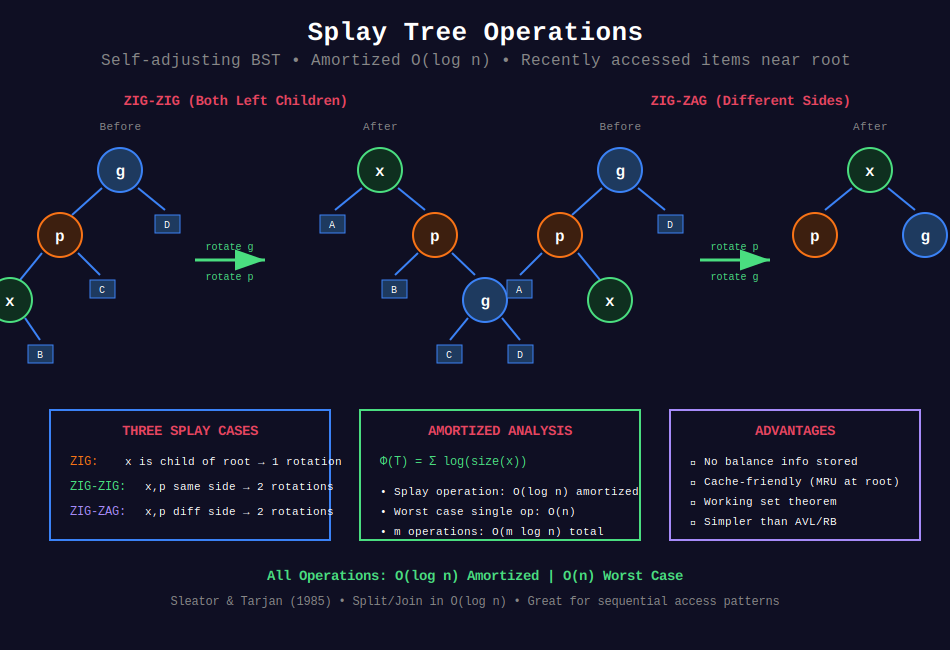

<div align="center">

# 🔄 Splay Trees

<p>
  
  
</p>

</div>

---

## 🧭 Navigation

| ⬅️ Previous | 📂 Current | ➡️ Next |
|:------------|:----------:|--------:|
| [← 03. Fenwick Tree](../03_fenwick_tree/README.md) | **04. Splay Trees** | [05. B-Trees →](../05_b_trees/README.md) |

---

## 📊 Visual Overview

<div align="center">

</div>

---

## 📐 Mathematical Foundations

### 1️⃣ Splay Tree Definition

**Splay Tree:** Self-adjusting BST where recently accessed elements are quick to access again.

**Key Operation:** **Splaying** - Move accessed node to root through rotations.

**No explicit balance factor** - relies on splaying for balance.

**Invented by:** Daniel Sleator and Robert Tarjan (1985)

---

### 2️⃣ Amortized Analysis

**Theorem:** All operations have $O(\log n)$ amortized time.

**Potential function:** $\Phi(T) = \sum_{x \in T} \log(size(x))$

where $size(x)$ = number of nodes in subtree rooted at $x$.

**Amortized cost** = Actual cost + $\Delta\Phi$

**Result:** Splay operation costs $O(\log n)$ amortized.

---

### 3️⃣ Splay Operations

**Three cases (accessing node $x$ with parent $p$ and grandparent $g$):**

**Zig (x is root's child):**

- Single rotation

- Only happens at end

**Zig-Zig (x and p are both left or both right children):**

```
      g           x
     /           / \
    p      =>   A   p
   /               / \
  x               B   g
 / \                 / \
A   B               C   D

```
- Rotate p, then rotate x

**Zig-Zag (x is left child, p is right child or vice versa):**

```
    g           x
   /           / \
  p      =>   p   g
   \         / \ / \
    x       A B C  D
   / \
  B   C

```
- Rotate x twice (like AVL LR/RL)

**Key:** Zig-zig differs from naive "rotate to root"

---

### 4️⃣ Why Zig-Zig?

**Zig-zig reduces depth faster** than double rotation.

After zig-zig:

- $x$ moves up 2 levels

- Many nodes in $x$'s original path move to other subtrees

- Better amortized performance

---

### 5️⃣ Operations

| Operation | Amortized Time | Worst Case |
|-----------|:--------------:|:----------:|
| Access | O(log n) | O(n) |
| Insert | O(log n) | O(n) |
| Delete | O(log n) | O(n) |
| Split | O(log n) | O(n) |
| Join | O(log n) | O(n) |

**Note:** Worst case can be $O(n)$, but amortized is $O(\log n)$.

---

### 6️⃣ Advantages

1. **No balance information:** Simpler than AVL/Red-Black

2. **Cache-friendly:** Recently accessed nodes near root

3. **Working set theorem:** Frequently accessed items are fast

4. **Static optimality conjecture:** Competitive with optimal static tree (unproven)

---

## 💻 Code Implementations

```python
from typing import Optional, Tuple

# ==================== SPLAY TREE ====================

class SplayNode:
    """Node in Splay Tree."""
    
    def __init__(self, key: int):
        self.key = key
        self.left: Optional[SplayNode] = None
        self.right: Optional[SplayNode] = None
        self.parent: Optional[SplayNode] = None

class SplayTree:
    """
    Splay Tree implementation.
    
    All operations: O(log n) amortized
    """
    
    def __init__(self):
        self.root: Optional[SplayNode] = None
    
    # ==================== ROTATIONS ====================
    
    def rotate_right(self, x: SplayNode) -> None:
        """Right rotation at x."""
        y = x.left
        if not y:
            return
        
        x.left = y.right
        if y.right:
            y.right.parent = x
        
        y.parent = x.parent
        if not x.parent:
            self.root = y
        elif x == x.parent.right:
            x.parent.right = y
        else:
            x.parent.left = y
        
        y.right = x
        x.parent = y
    
    def rotate_left(self, x: SplayNode) -> None:
        """Left rotation at x."""
        y = x.right
        if not y:
            return
        
        x.right = y.left
        if y.left:
            y.left.parent = x
        
        y.parent = x.parent
        if not x.parent:
            self.root = y
        elif x == x.parent.left:
            x.parent.left = y
        else:
            x.parent.right = y
        
        y.left = x
        x.parent = y
    
    # ==================== SPLAY OPERATION ====================
    
    def splay(self, x: SplayNode) -> None:
        """
        Splay node x to root.
        
        Time: O(log n) amortized
        """
        while x.parent:
            p = x.parent
            g = p.parent
            
            if not g:
                # Zig: x is child of root
                if x == p.left:
                    self.rotate_right(p)
                else:
                    self.rotate_left(p)
            elif (x == p.left) == (p == g.left):
                # Zig-Zig: x and p are both left or both right
                if x == p.left:
                    self.rotate_right(g)
                    self.rotate_right(p)
                else:
                    self.rotate_left(g)
                    self.rotate_left(p)
            else:
                # Zig-Zag: x is left and p is right, or vice versa
                if x == p.left:
                    self.rotate_right(p)
                    self.rotate_left(g)
                else:
                    self.rotate_left(p)
                    self.rotate_right(g)
    
    # ==================== SEARCH ====================
    
    def search(self, key: int) -> bool:
        """
        Search for key (splays if found).
        
        Time: O(log n) amortized
        """
        node = self._search_node(key)
        if node:
            self.splay(node)
            return node.key == key
        return False
    
    def _search_node(self, key: int) -> Optional[SplayNode]:
        """Helper: find node with key or last accessed node."""
        current = self.root
        last = None
        
        while current:
            last = current
            if key == current.key:
                return current
            elif key < current.key:
                current = current.left
            else:
                current = current.right
        
        if last:
            self.splay(last)
        return last
    
    # ==================== INSERT ====================
    
    def insert(self, key: int) -> None:
        """
        Insert key into tree.
        
        Time: O(log n) amortized
        """
        if not self.root:
            self.root = SplayNode(key)
            return
        
        # Find insertion point
        node = self._search_node(key)
        
        if node and node.key == key:
            # Key already exists, just splay
            return
        
        # Create new node
        new_node = SplayNode(key)
        
        if key < node.key:
            new_node.right = node
            new_node.left = node.left
            if node.left:
                node.left.parent = new_node
            node.left = None
            node.parent = new_node
        else:
            new_node.left = node
            new_node.right = node.right
            if node.right:
                node.right.parent = new_node
            node.right = None
            node.parent = new_node
        
        self.root = new_node
    
    # ==================== DELETE ====================
    
    def delete(self, key: int) -> bool:
        """
        Delete key from tree.
        
        Time: O(log n) amortized
        """
        node = self._search_node(key)
        
        if not node or node.key != key:
            return False
        
        # Splay node to root
        self.splay(node)
        
        # Now node is root, delete it
        if not node.left:
            self.root = node.right
            if self.root:
                self.root.parent = None
        elif not node.right:
            self.root = node.left
            if self.root:
                self.root.parent = None
        else:
            # Two children: find max in left subtree
            left_tree = node.left
            left_tree.parent = None
            
            # Find max in left subtree
            max_node = left_tree
            while max_node.right:
                max_node = max_node.right
            
            # Splay max to root of left subtree
            self.root = left_tree
            self.splay(max_node)
            
            # Attach right subtree
            max_node.right = node.right
            if node.right:
                node.right.parent = max_node
            
            self.root = max_node
        
        return True
    
    # ==================== ADVANCED OPERATIONS ====================
    
    def split(self, key: int) -> Tuple[Optional['SplayTree'], Optional['SplayTree']]:
        """
        Split tree into two: keys < key and keys >= key.
        
        Time: O(log n) amortized
        """
        if not self.root:
            return None, None
        
        # Search for key (or closest)
        node = self._search_node(key)
        
        if node.key < key:
            # All keys in tree are < key
            right_tree = SplayTree()
            right_tree.root = node.right
            if node.right:
                node.right.parent = None
                node.right = None
            
            left_tree = SplayTree()
            left_tree.root = self.root
            
            return left_tree, right_tree
        else:
            # Node.key >= key
            left_tree = SplayTree()
            left_tree.root = node.left
            if node.left:
                node.left.parent = None
                node.left = None
            
            right_tree = SplayTree()
            right_tree.root = self.root
            
            return left_tree, right_tree
    
    def join(self, other: 'SplayTree') -> None:
        """
        Join two trees (all keys in self < all keys in other).
        
        Time: O(log n) amortized
        """
        if not self.root:
            self.root = other.root
            return
        
        if not other.root:
            return
        
        # Find max in self
        max_node = self.root
        while max_node.right:
            max_node = max_node.right
        
        # Splay max to root
        self.splay(max_node)
        
        # Attach other as right subtree
        self.root.right = other.root
        other.root.parent = self.root
    
    # ==================== UTILITY ====================
    
    def inorder(self) -> list:
        """Inorder traversal."""
        result = []
        self._inorder(self.root, result)
        return result
    
    def _inorder(self, node: Optional[SplayNode], result: list) -> None:
        if node:
            self._inorder(node.left, result)
            result.append(node.key)
            self._inorder(node.right, result)

# ==================== LEETCODE APPLICATIONS ====================

class LRUCache:
    """
    LeetCode 146: LRU Cache
    Can be implemented with Splay Tree (though hash + doubly linked list is simpler).
    
    Splay tree automatically brings recently accessed items to top!
    """
    
    def __init__(self, capacity: int):
        self.capacity = capacity
        self.tree = SplayTree()
        self.cache = {}  # key -> (value, timestamp)
        self.time = 0
    
    def get(self, key: int) -> int:
        if key not in self.cache:
            return -1
        
        value, _ = self.cache[key]
        self.time += 1
        self.cache[key] = (value, self.time)
        self.tree.search(self.time)  # Splay to root
        return value
    
    def put(self, key: int, value: int) -> None:
        self.time += 1
        
        if key in self.cache:
            self.cache[key] = (value, self.time)
            self.tree.search(self.time)
        else:
            if len(self.cache) >= self.capacity:
                # Remove LRU item (find min timestamp in tree)
                # In practice, maintain separate structure for this
                pass
            
            self.cache[key] = (value, self.time)
            self.tree.insert(self.time)

def contains_nearby_duplicate(nums: list, k: int) -> bool:
    """
    LeetCode 219: Contains Duplicate II
    Using Splay Tree for window.
    
    Time: O(n log k) amortized
    """
    tree = SplayTree()
    
    for i, num in enumerate(nums):
        if tree.search(num):
            return True
        
        tree.insert(num)
        
        if i >= k:
            tree.delete(nums[i - k])
    
    return False

```

---

## 🎯 LeetCode Problems

### 🟡 Medium Problems

| # | Problem | Difficulty | Solution Pattern |
|---|---------|------------|------------------|
| 146 | [LRU Cache](https://leetcode.com/problems/lru-cache/) | Medium | Splay tree (or hash + list) |
| 219 | [Contains Duplicate II](https://leetcode.com/problems/contains-duplicate-ii/) | Medium | Sliding window |
| 1804 | [Implement Trie II](https://leetcode.com/problems/implement-trie-ii-prefix-tree/) | Medium | Self-adjusting |

---

### 🔴 Hard Problems

| # | Problem | Difficulty | Solution Pattern |
|---|---------|------------|------------------|
| 460 | [LFU Cache](https://leetcode.com/problems/lfu-cache/) | Hard | Frequency tracking |
| 2158 | [Amount of New Area Painted Each Day](https://leetcode.com/problems/amount-of-new-area-painted-each-day/) | Hard | Interval tree |
| - | Range Module | Hard | Split/Join operations |

---

## 📊 Complexity Summary

| Operation | Amortized | Worst Case | Notes |
|-----------|:---------:|:----------:|-------|
| Splay | O(log n) | O(n) | Move to root |
| Search | O(log n) | O(n) | Includes splay |
| Insert | O(log n) | O(n) | Includes splay |
| Delete | O(log n) | O(n) | Includes splay |
| Split | O(log n) | O(n) | One splay |
| Join | O(log n) | O(n) | One splay |

---

## 💡 Key Insights

1. **Self-adjusting:** No explicit balance factor stored

2. **Zig-zig crucial:** Different from simple "rotate to root"

3. **Cache-friendly:** Recent items stay near root

4. **Amortized guarantees:** Individual ops can be $O(n)$, but average is $O(\log n)$

5. **Working set property:** $k$ distinct accesses among $n$ items cost $O(k \log n)$

6. **Simpler than AVL/RB:** Less bookkeeping, easier to implement

7. **Good for sequential access:** Recently accessed items are fast

---

## 🧭 Navigation

| ⬅️ Previous | 📂 Current | ➡️ Next |
|:------------|:----------:|--------:|
| [← 03. Fenwick Tree](../03_fenwick_tree/README.md) | **04. Splay Trees** | [05. B-Trees →](../05_b_trees/README.md) |

