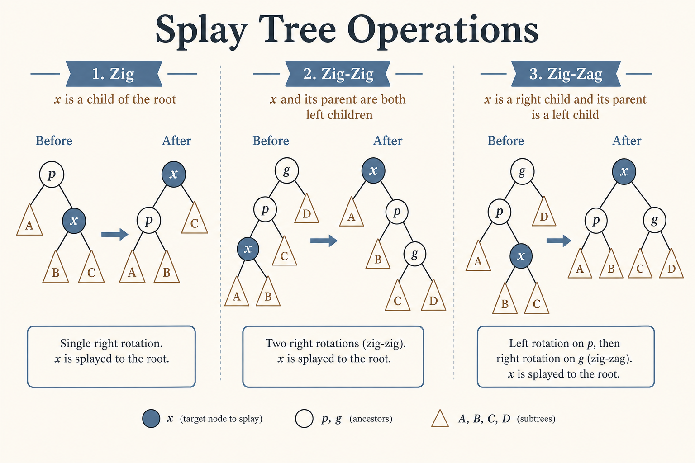
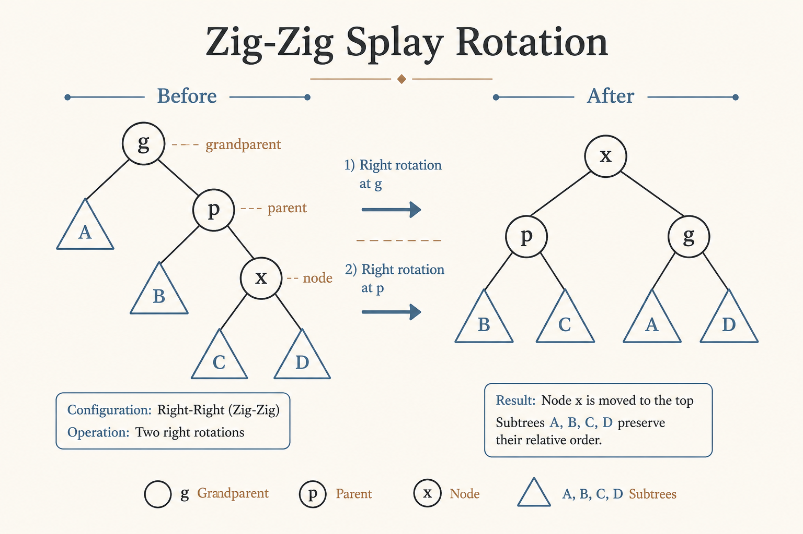
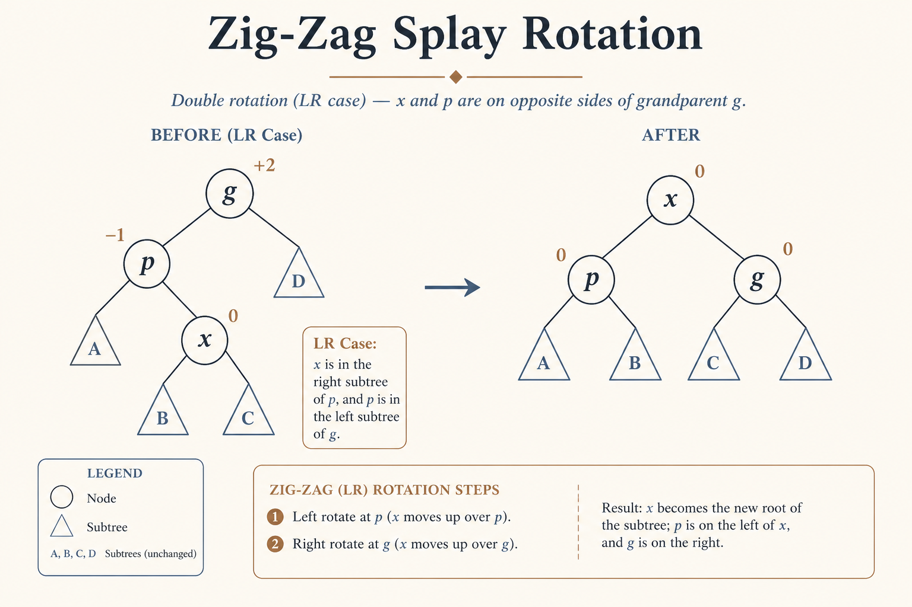
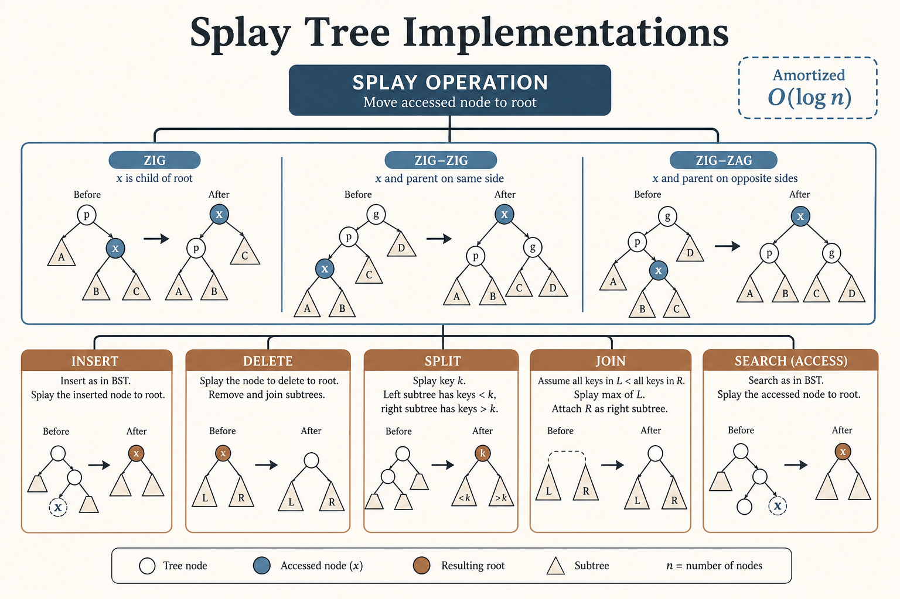

# 🔄 Splay Trees

### *Splay Trees*

  
  

---

## 📊 Visual Overview

---

## 🎯 At a Glance

| | |
|:---|:---|
| **Difficulty** | Hard |
| **Problems** | 6 |

{: .highlight }
> **How to use this page:** Start with the visual overview, scan **At a Glance**, then work through theory → walkthroughs → code.

---

## 🧭 Navigation

| ⬅️ Previous | 📂 Current | ➡️ Next |
|:------------|:----------:|--------:|
| [← 03. Fenwick Tree](../03_fenwick_tree/README.md) | **04. Splay Trees** | [05. B-Trees →](../05_b_trees/README.md) |

---

## 📐 Mathematical Foundation
### 1️⃣ Splay Tree Definition

**Splay Tree:** Self-adjusting BST where recently accessed elements are quick to access again.

**Key Operation:** **Splaying** - Move accessed node to root through rotations.

**No explicit balance factor** - relies on splaying for balance.

**Invented by:** Daniel Sleator and Robert Tarjan (1985)

---

### 2️⃣ Amortized Analysis

**Theorem:** All operations have $O(\log n)$ amortized time.

**Potential function:** $\Phi(T) = \sum_{x \in T} \log(size(x))$

where $size(x)$ = number of nodes in subtree rooted at $x$.

**Amortized cost** = Actual cost + $\Delta\Phi$

**Result:** Splay operation costs $O(\log n)$ amortized.

---

### 3️⃣ Splay Operations

**Three cases (accessing node $x$ with parent $p$ and grandparent $g$):**

**Zig (x is root's child):**

- Single rotation

- Only happens at end

**Zig-Zig (x and p are both left or both right children):**

- Rotate p, then rotate x

**Zig-Zag (x is left child, p is right child or vice versa):**

- Rotate x twice (like AVL LR/RL)

**Key:** Zig-zig differs from naive "rotate to root"

---

### 4️⃣ Why Zig-Zig?

**Zig-zig reduces depth faster** than double rotation.

After zig-zig:

- $x$ moves up 2 levels

- Many nodes in $x$'s original path move to other subtrees

- Better amortized performance

---

### 5️⃣ Operations

| Operation | Amortized Time | Worst Case |
|-----------|:--------------:|:----------:|
| Access | O(log n) | O(n) |
| Insert | O(log n) | O(n) |
| Delete | O(log n) | O(n) |
| Split | O(log n) | O(n) |
| Join | O(log n) | O(n) |

**Note:** Worst case can be $O(n)$, but amortized is $O(\log n)$.

---

### 6️⃣ Advantages

1. **No balance information:** Simpler than AVL/Red-Black

2. **Cache-friendly:** Recently accessed nodes near root

3. **Working set theorem:** Frequently accessed items are fast

4. **Static optimality conjecture:** Competitive with optimal static tree (unproven)

---

## 💻 Code Implementations

---

## 🏆 LeetCode Problems

### 🟡 Medium Problems

| # | Problem | Difficulty | Solution Pattern |
|---|---------|------------|------------------|
| 146 | [LRU Cache](https://leetcode.com/problems/lru-cache/) | Medium | Splay tree (or hash + list) |
| 219 | [Contains Duplicate II](https://leetcode.com/problems/contains-duplicate-ii/) | Medium | Sliding window |
| 1804 | [Implement Trie II](https://leetcode.com/problems/implement-trie-ii-prefix-tree/) | Medium | Self-adjusting |

---

### 🔴 Hard Problems

| # | Problem | Difficulty | Solution Pattern |
|---|---------|------------|------------------|
| 460 | [LFU Cache](https://leetcode.com/problems/lfu-cache/) | Hard | Frequency tracking |
| 2158 | [Amount of New Area Painted Each Day](https://leetcode.com/problems/amount-of-new-area-painted-each-day/) | Hard | Interval tree |
| - | Range Module | Hard | Split/Join operations |

---

## 📊 Complexity Summary

| Operation | Amortized | Worst Case | Notes |
|-----------|:---------:|:----------:|-------|
| Splay | O(log n) | O(n) | Move to root |
| Search | O(log n) | O(n) | Includes splay |
| Insert | O(log n) | O(n) | Includes splay |
| Delete | O(log n) | O(n) | Includes splay |
| Split | O(log n) | O(n) | One splay |
| Join | O(log n) | O(n) | One splay |

---

## 💡 Key Insights

1. **Self-adjusting:** No explicit balance factor stored

2. **Zig-zig crucial:** Different from simple "rotate to root"

3. **Cache-friendly:** Recent items stay near root

4. **Amortized guarantees:** Individual ops can be $O(n)$, but average is $O(\log n)$

5. **Working set property:** $k$ distinct accesses among $n$ items cost $O(k \log n)$

6. **Simpler than AVL/RB:** Less bookkeeping, easier to implement

7. **Good for sequential access:** Recently accessed items are fast

---

## 📚 References & Learning Resources

### 📖 Core Concepts

| Resource | Description | Link |
|----------|-------------|------|
| **Splay Trees** | Wikipedia | [Splay tree](https://en.wikipedia.org/wiki/Splay_tree) |
| **Amortized Analysis** | GeeksforGeeks | [Splay](https://www.geeksforgeeks.org/splay-tree-set-1-insert/) |

### 📝 Practice

| Platform | Focus | Link |
|----------|-------|------|
| **LeetCode** | Tree tag | [Problems](https://leetcode.com/tag/tree/) |

---
