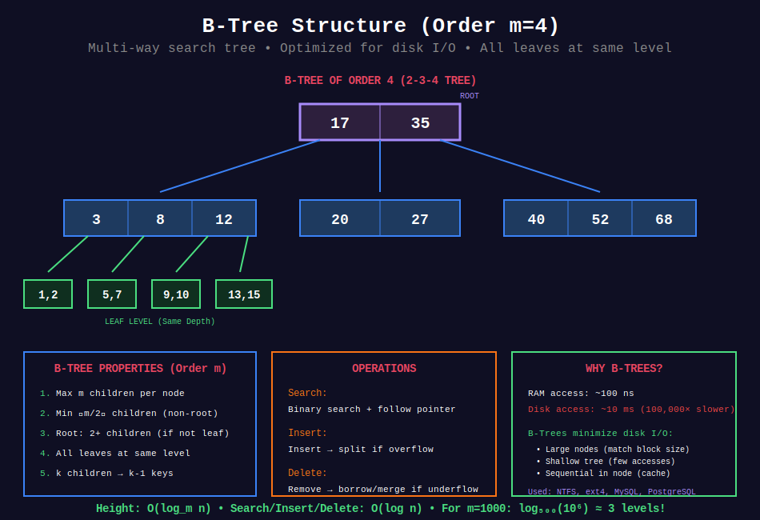

<div align="center">

# 📚 B-Trees

<p>
  
  
</p>

</div>

---

## 🧭 Navigation

| ⬅️ Previous | 📂 Current | ➡️ Next |
|:------------|:----------:|--------:|
| [← 04. Splay Trees](../04_splay_trees/README.md) | **05. B-Trees** | [06. Treap →](../06_treap/README.md) |

---

## 📊 Visual Overview

<div align="center">

</div>

---

## 📐 Mathematical Foundations

### 1️⃣ B-Tree Definition

**B-Tree of order $m$:** Self-balancing multi-way search tree optimized for disk I/O.

**Properties:**

1. Every node has at most $m$ children

2. Every non-leaf, non-root node has at least $\lceil m/2 \rceil$ children

3. Root has at least 2 children (if not leaf)

4. All leaves at same level

5. Non-leaf with $k$ children contains $k-1$ keys

**Typical:** $m = 1000$ or more (large branching factor)

---

### 2️⃣ Node Structure

**Internal node with $k$ children:**

$$[P_0, K_1, P_1, K_2, P_2, \ldots, K_{k-1}, P_{k-1}]$$

where:

- $K_i$ = keys (sorted)

- $P_i$ = pointers to children

- All keys in subtree $P_i$ are between $K_i$ and $K_{i+1}$

**Height bound:** $h \leq \log_{\lceil m/2 \rceil}(n)$

---

### 3️⃣ Why B-Trees?

**Disk access is expensive:**

- RAM access: ~100 ns

- Disk access: ~10 ms (100,000× slower!)

**B-Tree minimizes disk I/O:**

- Large nodes (match disk block size)

- Shallow tree (fewer disk accesses)

- Sequential within node (cache-friendly)

**Used in:**

- Filesystems (NTFS, ext4, HFS+)

- Databases (MySQL, PostgreSQL, SQLite)

---

### 4️⃣ Search Operation

**Algorithm:**

```
1. Start at root

2. Binary search within node for key or range

3. If found, return

4. Otherwise, follow appropriate child pointer

5. Repeat until found or reach leaf

```

**Time:** $O(\log_m n)$ disk accesses, $O(m \log m)$ comparisons per node

**Total:** $O(\log n)$ with $m = O(\log n)$

---

### 5️⃣ Insert Operation

**Algorithm:**

1. Search for insertion point (leaf)

2. Insert key into leaf

3. If leaf overflows ($> m-1$ keys):
   - **Split** leaf into two nodes
   - Move median key up to parent
   - Recursively split parent if needed

**Split propagates** up to root (creates new root if needed)

**Time:** $O(\log n)$

---

### 6️⃣ Delete Operation

**More complex than insert:**

**Cases:**

1. **Key in leaf:** Simply remove

2. **Key in internal node:** Replace with predecessor/successor, delete from leaf

3. **Underflow** (< $\lceil m/2 \rceil - 1$ keys):
   - **Borrow** from sibling (rotation)
   - **Merge** with sibling (combine nodes)

**Time:** $O(\log n)$

---

### 7️⃣ B+ Tree Variant

**B+ Tree:** All data in leaves, internal nodes only store keys.

**Advantages:**

- Better for range queries (scan leaves)

- Higher fanout (more keys per internal node)

- Used in most databases

**Structure:**

- Leaves linked (sequential access)

- Internal nodes are pure index

---

## 💻 Code Implementations

```python
from typing import List, Optional, Tuple
from bisect import bisect_left, bisect_right

# ==================== B-TREE NODE ====================

class BTreeNode:
    """Node in B-Tree."""
    
    def __init__(self, leaf: bool = False):
        self.keys: List[int] = []
        self.children: List[BTreeNode] = []
        self.leaf = leaf
    
    def is_full(self, t: int) -> bool:
        """Check if node is full (2t-1 keys)."""
        return len(self.keys) >= 2 * t - 1

class BTree:
    """
    B-Tree implementation.
    
    Order: 2t (minimum degree)
    - Each node has at most 2t-1 keys
    - Each node has at least t-1 keys (except root)
    
    All operations: O(log n)
    """
    
    def __init__(self, t: int = 3):
        """
        Initialize B-Tree with minimum degree t.
        
        t = 2: 2-3-4 tree
        t = 3: nodes have 2-5 keys
        """
        self.root = BTreeNode(leaf=True)
        self.t = t  # Minimum degree
    
    # ==================== SEARCH ====================
    
    def search(self, key: int) -> bool:
        """
        Search for key in B-Tree.
        
        Time: O(t log_t n) = O(log n)
        """
        return self._search(self.root, key) is not None
    
    def _search(self, node: BTreeNode, key: int) -> Optional[BTreeNode]:
        """Helper for search."""
        # Binary search in current node
        i = bisect_left(node.keys, key)
        
        # Check if key found
        if i < len(node.keys) and node.keys[i] == key:
            return node
        
        # If leaf, key not in tree
        if node.leaf:
            return None
        
        # Recurse to appropriate child
        return self._search(node.children[i], key)
    
    # ==================== INSERT ====================
    
    def insert(self, key: int) -> None:
        """
        Insert key into B-Tree.
        
        Time: O(t log_t n) = O(log n)
        """
        root = self.root
        
        # If root is full, split it
        if root.is_full(self.t):
            new_root = BTreeNode(leaf=False)
            new_root.children.append(self.root)
            self._split_child(new_root, 0)
            self.root = new_root
        
        self._insert_non_full(self.root, key)
    
    def _insert_non_full(self, node: BTreeNode, key: int) -> None:
        """Insert into node that is not full."""
        i = len(node.keys) - 1
        
        if node.leaf:
            # Insert into sorted position
            node.keys.append(None)
            while i >= 0 and key < node.keys[i]:
                node.keys[i + 1] = node.keys[i]
                i -= 1
            node.keys[i + 1] = key
        else:
            # Find child to insert into
            while i >= 0 and key < node.keys[i]:
                i -= 1
            i += 1
            
            # Split child if full
            if node.children[i].is_full(self.t):
                self._split_child(node, i)
                if key > node.keys[i]:
                    i += 1
            
            self._insert_non_full(node.children[i], key)
    
    def _split_child(self, parent: BTreeNode, i: int) -> None:
        """
        Split full child at index i of parent.
        
        Time: O(t)
        """
        t = self.t
        full_child = parent.children[i]
        new_child = BTreeNode(leaf=full_child.leaf)
        
        # New child gets second half of keys
        mid_index = t - 1
        new_child.keys = full_child.keys[mid_index + 1:]
        full_child.keys = full_child.keys[:mid_index]
        
        # If not leaf, split children too
        if not full_child.leaf:
            new_child.children = full_child.children[mid_index + 1:]
            full_child.children = full_child.children[:mid_index + 1]
        
        # Move middle key up to parent
        parent.keys.insert(i, full_child.keys[mid_index])
        parent.children.insert(i + 1, new_child)
    
    # ==================== RANGE QUERY ====================
    
    def range_query(self, low: int, high: int) -> List[int]:
        """
        Find all keys in range [low, high].
        
        Time: O(log n + k) where k = result size
        """
        result = []
        self._range_query(self.root, low, high, result)
        return result
    
    def _range_query(self, node: BTreeNode, low: int, high: int, 
                     result: List[int]) -> None:
        """Helper for range query."""
        # Find starting position
        i = bisect_left(node.keys, low)
        
        while i < len(node.keys) and node.keys[i] <= high:
            # Recurse left child
            if not node.leaf and i < len(node.children):
                self._range_query(node.children[i], low, high, result)
            
            # Add current key if in range
            if low <= node.keys[i] <= high:
                result.append(node.keys[i])
            
            i += 1
        
        # Recurse rightmost child
        if not node.leaf and i < len(node.children):
            self._range_query(node.children[i], low, high, result)
    
    # ==================== UTILITY ====================
    
    def inorder(self) -> List[int]:
        """Inorder traversal."""
        result = []
        self._inorder(self.root, result)
        return result
    
    def _inorder(self, node: BTreeNode, result: List[int]) -> None:
        """Helper for inorder."""
        i = 0
        for i in range(len(node.keys)):
            if not node.leaf:
                self._inorder(node.children[i], result)
            result.append(node.keys[i])
        
        if not node.leaf:
            self._inorder(node.children[i + 1], result)

# ==================== B+ TREE (SIMPLIFIED) ====================

class BPlusTreeNode:
    """Node in B+ Tree."""
    
    def __init__(self, leaf: bool = False):
        self.keys: List[int] = []
        self.children: List[BPlusTreeNode] = []
        self.values: List[any] = []  # Only in leaf nodes
        self.next_leaf: Optional[BPlusTreeNode] = None  # Link leaves
        self.leaf = leaf

class BPlusTree:
    """
    Simplified B+ Tree (all data in leaves).
    
    Better for range queries and sequential access.
    """
    
    def __init__(self, t: int = 3):
        self.root = BPlusTreeNode(leaf=True)
        self.t = t
        self.leftmost_leaf = self.root
    
    def range_query(self, low: int, high: int) -> List[Tuple[int, any]]:
        """
        Efficient range query using leaf links.
        
        Time: O(log n + k)
        """
        # Find starting leaf
        leaf = self._find_leaf(low)
        result = []
        
        # Scan leaves sequentially
        while leaf:
            for i, key in enumerate(leaf.keys):
                if low <= key <= high:
                    result.append((key, leaf.values[i]))
                elif key > high:
                    return result
            leaf = leaf.next_leaf
        
        return result
    
    def _find_leaf(self, key: int) -> BPlusTreeNode:
        """Find leaf that should contain key."""
        node = self.root
        
        while not node.leaf:
            i = bisect_right(node.keys, key)
            if i == len(node.keys):
                node = node.children[-1]
            else:
                node = node.children[i]
        
        return node

# ==================== APPLICATIONS ====================

class DatabaseIndex:
    """
    Simulate database index using B+ Tree.
    """
    
    def __init__(self):
        self.index = BPlusTree(t=100)  # Large branching factor
    
    def insert_record(self, key: int, record: dict) -> None:
        """Insert record with key."""
        # In real implementation, would insert into B+ tree
        pass
    
    def find_record(self, key: int) -> Optional[dict]:
        """Find record by key."""
        # Search B+ tree
        pass
    
    def range_scan(self, start_key: int, end_key: int) -> List[dict]:
        """Efficient range scan using leaf links."""
        return self.index.range_query(start_key, end_key)

def my_calendar_btree():
    """
    LeetCode 729: My Calendar I using B-Tree
    (Efficient for many bookings)
    """
    class MyCalendar:
        def __init__(self):
            self.tree = BTree(t=50)
            self.intervals = []
        
        def book(self, start: int, end: int) -> bool:
            # Check for overlap
            overlapping = self.tree.range_query(start, end - 1)
            if overlapping:
                for interval_start in overlapping:
                    # Check actual intervals
                    for s, e in self.intervals:
                        if s == interval_start and s < end and start < e:
                            return False
            
            self.tree.insert(start)
            self.intervals.append((start, end))
            return True
    
    return MyCalendar

```

---

## 🎯 LeetCode Problems

### 🟡 Medium Problems

| # | Problem | Difficulty | Solution Pattern |
|---|---------|------------|------------------|
| 729 | [My Calendar I](https://leetcode.com/problems/my-calendar-i/) | Medium | B-Tree for intervals |
| 855 | [Exam Room](https://leetcode.com/problems/exam-room/) | Medium | Ordered set |

---

### 🔴 Hard Problems

| # | Problem | Difficulty | Solution Pattern |
|---|---------|------------|------------------|
| 732 | [My Calendar III](https://leetcode.com/problems/my-calendar-iii/) | Hard | B-Tree sweep line |
| 715 | [Range Module](https://leetcode.com/problems/range-module/) | Hard | B-Tree intervals |
| - | Database Index | Hard | B+ Tree structure |

---

## 📊 Complexity Summary

| Operation | Time | Disk I/O | Notes |
|-----------|:----:|:--------:|-------|
| Search | O(log n) | O(log_t n) | t = branching factor |
| Insert | O(log n) | O(log_t n) | May split nodes |
| Delete | O(log n) | O(log_t n) | May merge nodes |
| Range query | O(log n + k) | O(log_t n + k/t) | k = result size |
| Sequential scan | O(n) | O(n/t) | B+ tree excels |

**Space:** $O(n)$

---

## 💡 Key Insights

1. **Disk-optimized:** Designed for minimizing disk I/O

2. **Large nodes:** Match disk block size (typically 4KB-8KB)

3. **Shallow tree:** $\log_{100}(1000000) \approx 3$ levels for million keys!

4. **All leaves at same level:** Guaranteed balanced

5. **Good locality:** Keys within node are sequential

6. **B+ tree for DB:** All data in leaves, internal nodes pure index

7. **Range queries:** B+ tree excels with leaf links

---

## 🧭 Navigation

| ⬅️ Previous | 📂 Current | ➡️ Next |
|:------------|:----------:|--------:|
| [← 04. Splay Trees](../04_splay_trees/README.md) | **05. B-Trees** | [06. Treap →](../06_treap/README.md) |

