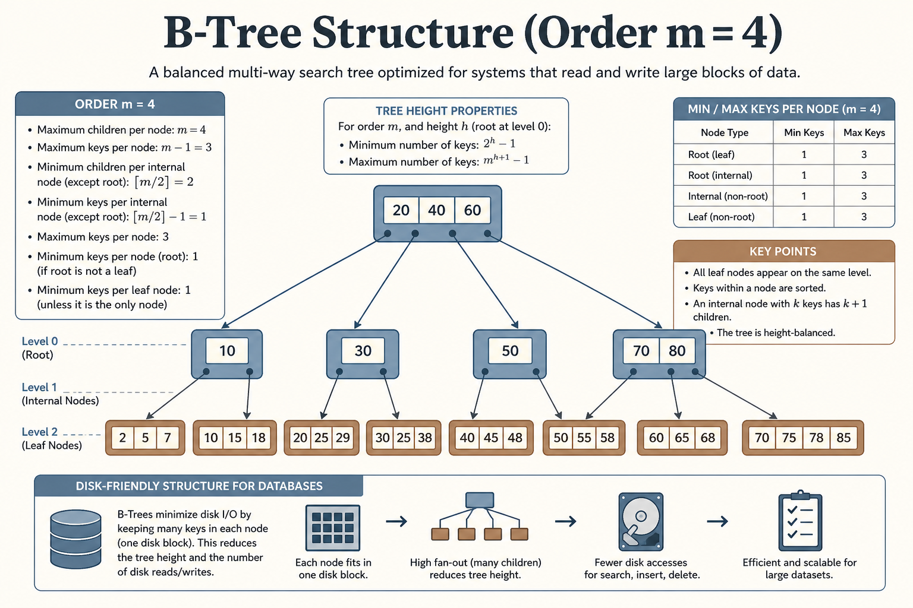
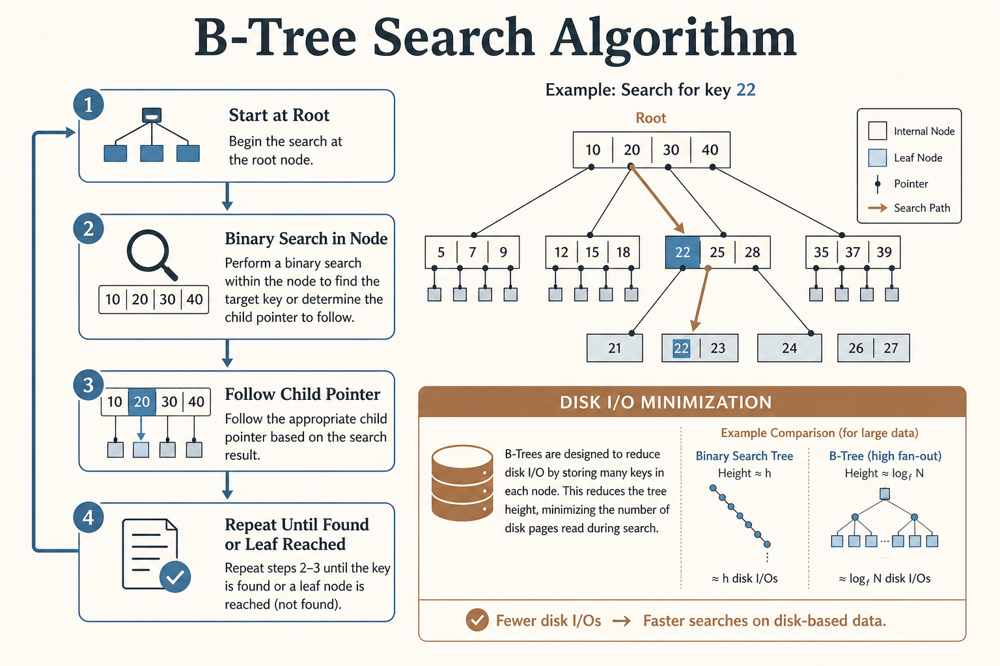
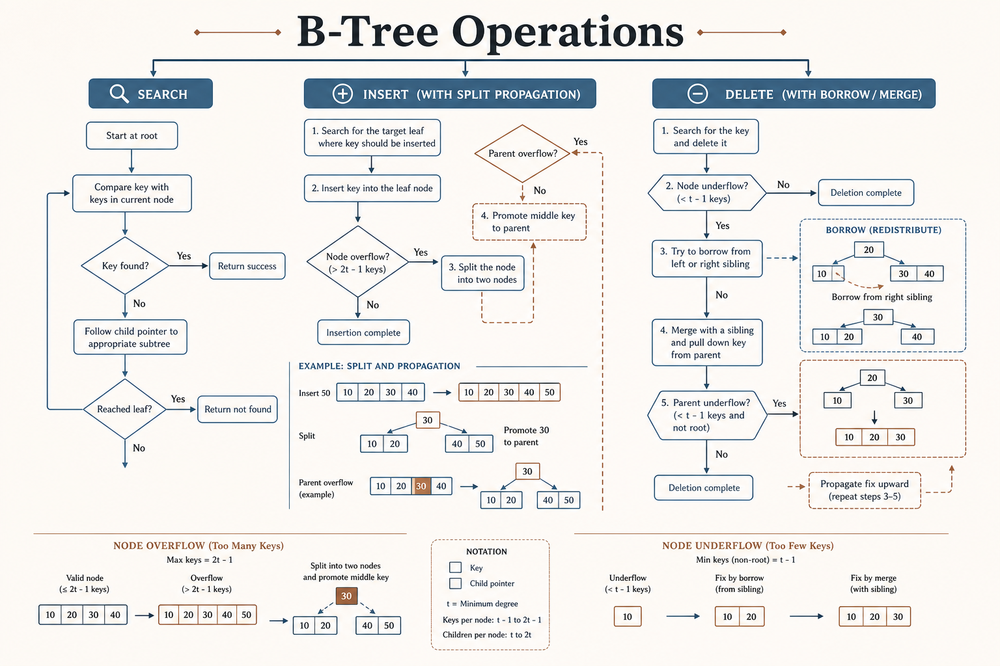

# 📚 B-Trees

### *B-Trees*

  
  

---

## 📊 Visual Overview

---

## 🎯 At a Glance

| | |
|:---|:---|
| **Difficulty** | Hard |
| **Problems** | 5 |

> **How to use this page:** Start with the visual overview, scan **At a Glance**, then work through theory → walkthroughs → code.

---

## 🧭 Navigation

| ⬅️ Previous | 📂 Current | ➡️ Next |
|:------------|:----------:|--------:|
| [← 04. Splay Trees](../04_splay_trees/README.md) | **05. B-Trees** | [06. Treap →](../06_treap/README.md) |

---

## 📐 Mathematical Foundation
### 1️⃣ B-Tree Definition

**B-Tree of order $m$:** Self-balancing multi-way search tree optimized for disk I/O.

**Properties:**

1. Every node has at most $m$ children

2. Every non-leaf, non-root node has at least $\lceil m/2 \rceil$ children

3. Root has at least 2 children (if not leaf)

4. All leaves at same level

5. Non-leaf with $k$ children contains $k-1$ keys

**Typical:** $m = 1000$ or more (large branching factor)

---

### 2️⃣ Node Structure

**Internal node with $k$ children:**

$$[P_0, K_1, P_1, K_2, P_2, \ldots, K_{k-1}, P_{k-1}]$$

where:

- $K_i$ = keys (sorted)

- $P_i$ = pointers to children

- All keys in subtree $P_i$ are between $K_i$ and $K_{i+1}$

**Height bound:** $h \leq \log_{\lceil m/2 \rceil}(n)$

---

### 3️⃣ Why B-Trees?

**Disk access is expensive:**

- RAM access: ~100 ns

- Disk access: ~10 ms (100,000× slower!)

**B-Tree minimizes disk I/O:**

- Large nodes (match disk block size)

- Shallow tree (fewer disk accesses)

- Sequential within node (cache-friendly)

**Used in:**

- Filesystems (NTFS, ext4, HFS+)

- Databases (MySQL, PostgreSQL, SQLite)

---

### 4️⃣ Search Operation

**Algorithm:**

**Time:** $O(\log_m n)$ disk accesses, $O(m \log m)$ comparisons per node

**Total:** $O(\log n)$ with $m = O(\log n)$

---

### 5️⃣ Insert Operation

**Algorithm:**

1. Search for insertion point (leaf)

2. Insert key into leaf

3. If leaf overflows ($> m-1$ keys):
   - **Split** leaf into two nodes
   - Move median key up to parent
   - Recursively split parent if needed

**Split propagates** up to root (creates new root if needed)

**Time:** $O(\log n)$

---

### 6️⃣ Delete Operation

**More complex than insert:**

**Cases:**

1. **Key in leaf:** Simply remove

2. **Key in internal node:** Replace with predecessor/successor, delete from leaf

3. **Underflow** (< $\lceil m/2 \rceil - 1$ keys):
   - **Borrow** from sibling (rotation)
   - **Merge** with sibling (combine nodes)

**Time:** $O(\log n)$

---

### 7️⃣ B+ Tree Variant

**B+ Tree:** All data in leaves, internal nodes only store keys.

**Advantages:**

- Better for range queries (scan leaves)

- Higher fanout (more keys per internal node)

- Used in most databases

**Structure:**

- Leaves linked (sequential access)

- Internal nodes are pure index

---

## 💻 Code Implementations

---

## 🏆 LeetCode Problems

### 🟡 Medium Problems

| # | Problem | Difficulty | Solution Pattern |
|---|---------|------------|------------------|
| 729 | [My Calendar I](https://leetcode.com/problems/my-calendar-i/) | Medium | B-Tree for intervals |
| 855 | [Exam Room](https://leetcode.com/problems/exam-room/) | Medium | Ordered set |

---

### 🔴 Hard Problems

| # | Problem | Difficulty | Solution Pattern |
|---|---------|------------|------------------|
| 732 | [My Calendar III](https://leetcode.com/problems/my-calendar-iii/) | Hard | B-Tree sweep line |
| 715 | [Range Module](https://leetcode.com/problems/range-module/) | Hard | B-Tree intervals |
| - | Database Index | Hard | B+ Tree structure |

---

## 📊 Complexity Summary

| Operation | Time | Disk I/O | Notes |
|-----------|:----:|:--------:|-------|
| Search | O(log n) | O(log_t n) | t = branching factor |
| Insert | O(log n) | O(log_t n) | May split nodes |
| Delete | O(log n) | O(log_t n) | May merge nodes |
| Range query | O(log n + k) | O(log_t n + k/t) | k = result size |
| Sequential scan | O(n) | O(n/t) | B+ tree excels |

**Space:** $O(n)$

---

## 💡 Key Insights

1. **Disk-optimized:** Designed for minimizing disk I/O

2. **Large nodes:** Match disk block size (typically 4KB-8KB)

3. **Shallow tree:** $\log_{100}(1000000) \approx 3$ levels for million keys!

4. **All leaves at same level:** Guaranteed balanced

5. **Good locality:** Keys within node are sequential

6. **B+ tree for DB:** All data in leaves, internal nodes pure index

7. **Range queries:** B+ tree excels with leaf links

---

## 📚 References & Learning Resources

### 📖 Core Concepts

| Resource | Description | Link |
|----------|-------------|------|
| **B-Trees** | Wikipedia | [B-tree](https://en.wikipedia.org/wiki/B-tree) |
| **B+ Trees** | GeeksforGeeks | [B+ tree](https://www.geeksforgeeks.org/introduction-of-b-tree/) |

### 📝 Practice

| Platform | Focus | Link |
|----------|-------|------|
| **LeetCode** | Tree tag | [Problems](https://leetcode.com/tag/tree/) |

---
