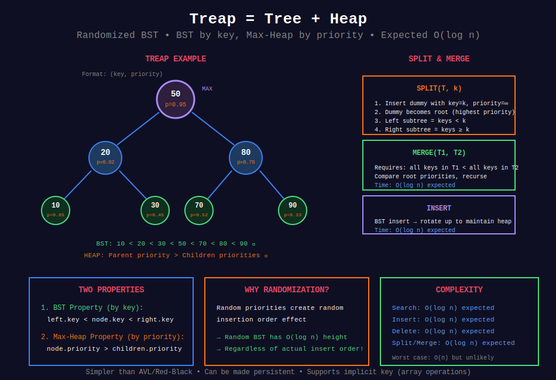

<div align="center">

# 🎲 Treap (Tree + Heap)

<p>
  
  
</p>

</div>

---

## 🧭 Navigation

| ⬅️ Previous | 📂 Current | ➡️ Next |
|:------------|:----------:|--------:|
| [← 05. B-Trees](../05_b_trees/README.md) | **06. Treap** | [07. Segment Tree Advanced →](../07_segment_tree_advanced/README.md) |

---

## 📊 Visual Overview

<div align="center">

</div>

---

## 📐 Mathematical Foundations

### 1️⃣ Treap Definition

**Treap = Tree + Heap:** Randomized BST that maintains both BST and heap properties.

**Two properties:**
1. **BST property:** Left child < parent < right child (by key)
2. **Heap property:** Parent has higher priority than children (by random priority)

**Each node:** `(key, priority)` where priority is random

**Expected height:** $O(\log n)$

---

### 2️⃣ Randomization Theorem

**Theorem:** With random priorities, treap has expected height $O(\log n)$.

**Intuition:**
- Random priorities create random insertion order

- Random BST has expected height $O(\log n)$

- Treap simulates random BST regardless of actual insertion order!

**Proof sketch:**
Expected depth of node $x$ = number of ancestors
= number of nodes inserted before $x$ that are also ancestors
≈ $O(\log n)$ by random BST analysis ∎

---

### 3️⃣ Rotations

**Treap maintains heap property through rotations:**

**Right rotation:**

```
    y (py)          x (px)
   / \      =>     / \
  x   C           A   y
 / \                 / \
A   B               B   C

```

If `px > py`, rotate right to make `x` parent of `y`.

**Left rotation:** Mirror of right rotation

**Time:** $O(1)$ per rotation

---

### 4️⃣ Operations

| Operation | Expected Time | Worst Case |
|-----------|:-------------:|:----------:|
| Search | O(log n) | O(n) |
| Insert | O(log n) | O(n) |
| Delete | O(log n) | O(n) |
| Split | O(log n) | O(n) |
| Merge | O(log n) | O(n) |

**Note:** Worst case unlikely with good random number generator.

---

### 5️⃣ Split Operation

**Split(T, k):** Split treap into two: keys < k and keys ≥ k.

**Algorithm:**
1. Insert dummy node with key = k, priority = ∞
2. Dummy becomes root (highest priority)
3. Left subtree = keys < k, right subtree = keys ≥ k
4. Return (left, right)

**Time:** $O(\log n)$ expected

---

### 6️⃣ Merge Operation

**Merge(T1, T2):** Combine two treaps (all keys in T1 < all keys in T2).

**Algorithm:**
1. Compare priorities of roots
2. Higher priority becomes root
3. Recursively merge appropriate subtrees

**Time:** $O(\log n)$ expected

---

## 💻 Code Implementations

```python
from typing import Optional, Tuple
import random

# ==================== TREAP NODE ====================

class TreapNode:
    """Node in Treap."""
    
    def __init__(self, key: int):
        self.key = key
        self.priority = random.random()  # Random priority
        self.left: Optional[TreapNode] = None
        self.right: Optional[TreapNode] = None

class Treap:
    """
    Treap (Tree + Heap) implementation.
    
    Expected O(log n) for all operations.
    """
    
    def __init__(self):
        self.root: Optional[TreapNode] = None
    
    # ==================== ROTATIONS ====================
    
    def rotate_right(self, y: TreapNode) -> TreapNode:
        """Right rotation."""
        x = y.left
        y.left = x.right
        x.right = y
        return x
    
    def rotate_left(self, x: TreapNode) -> TreapNode:
        """Left rotation."""
        y = x.right
        x.right = y.left
        y.left = x
        return y
    
    # ==================== INSERT ====================
    
    def insert(self, key: int) -> None:
        """
        Insert key into treap.
        
        Time: O(log n) expected
        """
        self.root = self._insert(self.root, key)
    
    def _insert(self, node: Optional[TreapNode], key: int) -> TreapNode:
        """Helper for insert."""
        if not node:
            return TreapNode(key)
        
        # Standard BST insert
        if key < node.key:
            node.left = self._insert(node.left, key)
            # Maintain heap property
            if node.left.priority > node.priority:
                node = self.rotate_right(node)
        elif key > node.key:
            node.right = self._insert(node.right, key)
            # Maintain heap property
            if node.right.priority > node.priority:
                node = self.rotate_left(node)
        
        return node
    
    # ==================== DELETE ====================
    
    def delete(self, key: int) -> None:
        """
        Delete key from treap.
        
        Time: O(log n) expected
        """
        self.root = self._delete(self.root, key)
    
    def _delete(self, node: Optional[TreapNode], key: int) -> Optional[TreapNode]:
        """Helper for delete."""
        if not node:
            return None
        
        if key < node.key:
            node.left = self._delete(node.left, key)
        elif key > node.key:
            node.right = self._delete(node.right, key)
        else:
            # Node to delete found
            # Rotate down until it becomes leaf
            if not node.left:
                return node.right
            elif not node.right:
                return node.left
            else:
                # Rotate child with higher priority up
                if node.left.priority > node.right.priority:
                    node = self.rotate_right(node)
                    node.right = self._delete(node.right, key)
                else:
                    node = self.rotate_left(node)
                    node.left = self._delete(node.left, key)
        
        return node
    
    # ==================== SEARCH ====================
    
    def search(self, key: int) -> bool:
        """
        Search for key.
        
        Time: O(log n) expected
        """
        return self._search(self.root, key)
    
    def _search(self, node: Optional[TreapNode], key: int) -> bool:
        """Helper for search."""
        if not node:
            return False
        
        if key == node.key:
            return True
        elif key < node.key:
            return self._search(node.left, key)
        else:
            return self._search(node.right, key)
    
    # ==================== SPLIT ====================
    
    def split(self, key: int) -> Tuple['Treap', 'Treap']:
        """
        Split treap into two: keys < key and keys >= key.
        
        Time: O(log n) expected
        """
        # Insert sentinel with infinite priority
        sentinel = TreapNode(key)
        sentinel.priority = float('inf')
        
        self.root = self._insert_node(self.root, sentinel)
        
        # Now sentinel is root
        left_treap = Treap()
        left_treap.root = sentinel.left
        
        right_treap = Treap()
        right_treap.root = sentinel.right
        
        return left_treap, right_treap
    
    def _insert_node(self, node: Optional[TreapNode], 
                     new_node: TreapNode) -> TreapNode:
        """Insert specific node (for split operation)."""
        if not node:
            return new_node
        
        if new_node.key < node.key:
            node.left = self._insert_node(node.left, new_node)
            if node.left.priority > node.priority:
                node = self.rotate_right(node)
        else:
            node.right = self._insert_node(node.right, new_node)
            if node.right.priority > node.priority:
                node = self.rotate_left(node)
        
        return node
    
    # ==================== MERGE ====================
    
    @staticmethod
    def merge(t1: 'Treap', t2: 'Treap') -> 'Treap':
        """
        Merge two treaps (all keys in t1 < all keys in t2).
        
        Time: O(log n) expected
        """
        result = Treap()
        result.root = Treap._merge_nodes(t1.root, t2.root)
        return result
    
    @staticmethod
    def _merge_nodes(left: Optional[TreapNode], 
                     right: Optional[TreapNode]) -> Optional[TreapNode]:
        """Helper for merge."""
        if not left:
            return right
        if not right:
            return left
        
        # Higher priority becomes root
        if left.priority > right.priority:
            left.right = Treap._merge_nodes(left.right, right)
            return left
        else:
            right.left = Treap._merge_nodes(left, right.left)
            return right
    
    # ==================== UTILITY ====================
    
    def inorder(self) -> list:
        """Inorder traversal."""
        result = []
        self._inorder(self.root, result)
        return result
    
    def _inorder(self, node: Optional[TreapNode], result: list) -> None:
        if node:
            self._inorder(node.left, result)
            result.append(node.key)
            self._inorder(node.right, result)

# ==================== IMPLICIT TREAP ====================

class ImplicitTreap:
    """
    Implicit Treap for array operations.
    Supports efficient insert/delete at any position.
    """
    
    class Node:
        def __init__(self, value: int):
            self.value = value
            self.priority = random.random()
            self.size = 1  # Size of subtree
            self.left: Optional[ImplicitTreap.Node] = None
            self.right: Optional[ImplicitTreap.Node] = None
    
    def __init__(self):
        self.root: Optional[ImplicitTreap.Node] = None
    
    def _get_size(self, node: Optional[Node]) -> int:
        """Get size of subtree."""
        return node.size if node else 0
    
    def _update_size(self, node: Node) -> None:
        """Update size of node."""
        if node:
            node.size = 1 + self._get_size(node.left) + self._get_size(node.right)
    
    def _split(self, node: Optional[Node], pos: int) -> Tuple[Optional[Node], Optional[Node]]:
        """Split by position."""
        if not node:
            return None, None
        
        left_size = self._get_size(node.left)
        
        if pos <= left_size:
            left, node.left = self._split(node.left, pos)
            self._update_size(node)
            return left, node
        else:
            node.right, right = self._split(node.right, pos - left_size - 1)
            self._update_size(node)
            return node, right
    
    def _merge(self, left: Optional[Node], right: Optional[Node]) -> Optional[Node]:
        """Merge two treaps."""
        if not left:
            return right
        if not right:
            return left
        
        if left.priority > right.priority:
            left.right = self._merge(left.right, right)
            self._update_size(left)
            return left
        else:
            right.left = self._merge(left, right.left)
            self._update_size(right)
            return right
    
    def insert(self, pos: int, value: int) -> None:
        """Insert value at position."""
        left, right = self._split(self.root, pos)
        new_node = self.Node(value)
        self.root = self._merge(self._merge(left, new_node), right)
    
    def delete(self, pos: int) -> None:
        """Delete element at position."""
        left, right = self._split(self.root, pos)
        _, right = self._split(right, 1)
        self.root = self._merge(left, right)
    
    def get(self, pos: int) -> int:
        """Get element at position."""
        def _get(node: Optional[ImplicitTreap.Node], pos: int) -> int:
            left_size = self._get_size(node.left)
            if pos == left_size:
                return node.value
            elif pos < left_size:
                return _get(node.left, pos)
            else:
                return _get(node.right, pos - left_size - 1)
        
        return _get(self.root, pos)

# ==================== LEETCODE PROBLEMS ====================

def kth_smallest_in_bst(root: TreapNode, k: int) -> int:
    """
    LeetCode 230: Kth Smallest Element in a BST
    Treap naturally supports this with size maintenance.
    
    Time: O(log n) expected
    """
    def kth(node: Optional[TreapNode], k: int) -> int:
        if not node:
            return -1
        
        left_size = get_size(node.left)
        
        if k == left_size + 1:
            return node.key
        elif k <= left_size:
            return kth(node.left, k)
        else:
            return kth(node.right, k - left_size - 1)
    
    def get_size(node: Optional[TreapNode]) -> int:
        # Would need to maintain size in actual implementation
        return 0
    
    return kth(root, k)

```

---

## 🎯 LeetCode Problems

### 🟡 Medium Problems

| # | Problem | Difficulty | Solution Pattern |
|---|---------|------------|------------------|
| 230 | [Kth Smallest in BST](https://leetcode.com/problems/kth-smallest-element-in-a-bst/) | Medium | Treap with size |
| 220 | [Contains Duplicate III](https://leetcode.com/problems/contains-duplicate-iii/) | Medium | Treap sliding window |
| 729 | [My Calendar I](https://leetcode.com/problems/my-calendar-i/) | Medium | Treap intervals |

---

### 🔴 Hard Problems

| # | Problem | Difficulty | Solution Pattern |
|---|---------|------------|------------------|
| 715 | [Range Module](https://leetcode.com/problems/range-module/) | Hard | Treap split/merge |
| 683 | [K Empty Slots](https://leetcode.com/problems/k-empty-slots/) | Hard | Treap sliding window |
| - | Dynamic Array | Hard | Implicit treap |

---

## 📊 Complexity Summary

| Operation | Expected | Worst Case | Notes |
|-----------|:--------:|:----------:|-------|
| Insert | O(log n) | O(n) | Randomized |
| Delete | O(log n) | O(n) | Randomized |
| Search | O(log n) | O(n) | BST search |
| Split | O(log n) | O(n) | Key operation |
| Merge | O(log n) | O(n) | Key operation |

**Space:** $O(n)$

---

## 💡 Key Insights

1. **Simplicity:** Easier to implement than AVL/Red-Black
2. **Randomization:** Random priorities ensure expected O(log n) height
3. **No rebalancing logic:** Rotations driven by heap property
4. **Persistent:** Can make persistent version easily
5. **Split/Merge:** Powerful operations not in standard BST
6. **Implicit treap:** Supports array operations with split/merge
7. **Good in practice:** Despite worst-case O(n), performs well

---

## 🧭 Navigation

| ⬅️ Previous | 📂 Current | ➡️ Next |
|:------------|:----------:|--------:|
| [← 05. B-Trees](../05_b_trees/README.md) | **06. Treap** | [07. Segment Tree Advanced →](../07_segment_tree_advanced/README.md) |

