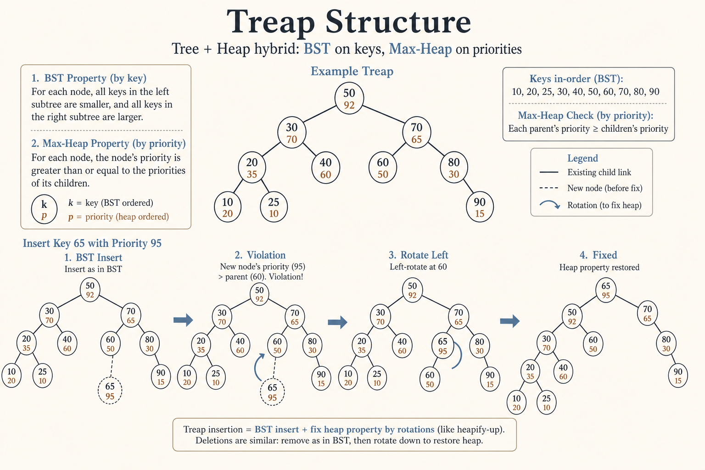
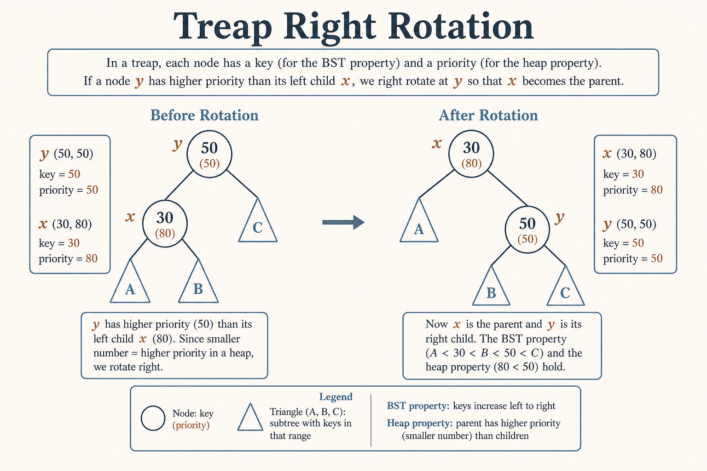
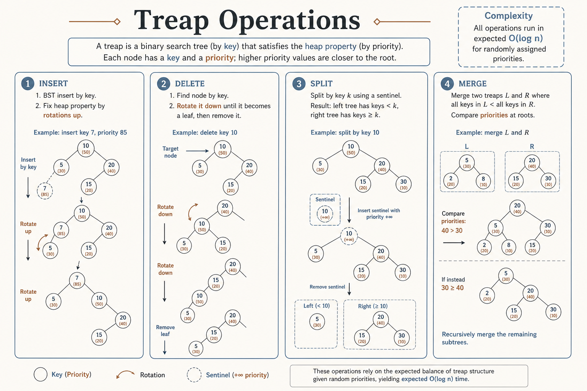

# 🎲 Treap (Tree + Heap)

### *Treap (Tree + Heap)*

  
  

---

## 📊 Visual Overview

---

## 🎯 At a Glance

| | |
|:---|:---|
| **Difficulty** | Hard |
| **Problems** | 6 |

> **How to use this page:** Start with the visual overview, scan **At a Glance**, then work through theory → walkthroughs → code.

---

## 🧭 Navigation

| ⬅️ Previous | 📂 Current | ➡️ Next |
|:------------|:----------:|--------:|
| [← 05. B-Trees](../05_b_trees/README.md) | **06. Treap** | [07. Segment Tree Advanced →](../07_segment_tree_advanced/README.md) |

---

## 📐 Mathematical Foundation
### 1️⃣ Treap Definition

**Treap = Tree + Heap:** Randomized BST that maintains both BST and heap properties.

**Two properties:**

1. **BST property:** Left child < parent < right child (by key)

2. **Heap property:** Parent has higher priority than children (by random priority)

**Each node:** `(key, priority)` where priority is random

**Expected height:** $O(\log n)$

---

### 2️⃣ Randomization Theorem

**Theorem:** With random priorities, treap has expected height $O(\log n)$.

**Intuition:**

- Random priorities create random insertion order

- Random BST has expected height $O(\log n)$

- Treap simulates random BST regardless of actual insertion order!

**Proof sketch:**
Expected depth of node $x$ = number of ancestors
= number of nodes inserted before $x$ that are also ancestors
≈ $O(\log n)$ by random BST analysis ∎

---

### 3️⃣ Rotations

**Treap maintains heap property through rotations:**

**Right rotation:**

If `px > py`, rotate right to make `x` parent of `y`.

**Left rotation:** Mirror of right rotation

**Time:** $O(1)$ per rotation

---

### 4️⃣ Operations

| Operation | Expected Time | Worst Case |
|-----------|:-------------:|:----------:|
| Search | O(log n) | O(n) |
| Insert | O(log n) | O(n) |
| Delete | O(log n) | O(n) |
| Split | O(log n) | O(n) |
| Merge | O(log n) | O(n) |

**Note:** Worst case unlikely with good random number generator.

---

### 5️⃣ Split Operation

**Split(T, k):** Split treap into two: keys < k and keys ≥ k.

**Algorithm:**

1. Insert dummy node with key = k, priority = ∞

2. Dummy becomes root (highest priority)

3. Left subtree = keys < k, right subtree = keys ≥ k

4. Return (left, right)

**Time:** $O(\log n)$ expected

---

### 6️⃣ Merge Operation

**Merge(T1, T2):** Combine two treaps (all keys in T1 < all keys in T2).

**Algorithm:**

1. Compare priorities of roots

2. Higher priority becomes root

3. Recursively merge appropriate subtrees

**Time:** $O(\log n)$ expected

---

## 💻 Code Implementations

---

## 🏆 LeetCode Problems

### 🟡 Medium Problems

| # | Problem | Difficulty | Solution Pattern |
|---|---------|------------|------------------|
| 230 | [Kth Smallest in BST](https://leetcode.com/problems/kth-smallest-element-in-a-bst/) | Medium | Treap with size |
| 220 | [Contains Duplicate III](https://leetcode.com/problems/contains-duplicate-iii/) | Medium | Treap sliding window |
| 729 | [My Calendar I](https://leetcode.com/problems/my-calendar-i/) | Medium | Treap intervals |

---

### 🔴 Hard Problems

| # | Problem | Difficulty | Solution Pattern |
|---|---------|------------|------------------|
| 715 | [Range Module](https://leetcode.com/problems/range-module/) | Hard | Treap split/merge |
| 683 | [K Empty Slots](https://leetcode.com/problems/k-empty-slots/) | Hard | Treap sliding window |
| - | Dynamic Array | Hard | Implicit treap |

---

## 📊 Complexity Summary

| Operation | Expected | Worst Case | Notes |
|-----------|:--------:|:----------:|-------|
| Insert | O(log n) | O(n) | Randomized |
| Delete | O(log n) | O(n) | Randomized |
| Search | O(log n) | O(n) | BST search |
| Split | O(log n) | O(n) | Key operation |
| Merge | O(log n) | O(n) | Key operation |

**Space:** $O(n)$

---

## 💡 Key Insights

1. **Simplicity:** Easier to implement than AVL/Red-Black

2. **Randomization:** Random priorities ensure expected O(log n) height

3. **No rebalancing logic:** Rotations driven by heap property

4. **Persistent:** Can make persistent version easily

5. **Split/Merge:** Powerful operations not in standard BST

6. **Implicit treap:** Supports array operations with split/merge

7. **Good in practice:** Despite worst-case O(n), performs well

---

## 📚 References & Learning Resources

### 📖 Core Concepts

| Resource | Description | Link |
|----------|-------------|------|
| **Treap** | CP-Algorithms | [Treap](https://cp-algorithms.com/data_structures/treap.html) |
| **Randomized BST** | GeeksforGeeks | [Treap](https://www.geeksforgeeks.org/treap-a-randomized-binary-search-tree/) |

### 📝 Practice

| Platform | Focus | Link |
|----------|-------|------|
| **LeetCode** | Tree tag | [Problems](https://leetcode.com/tag/tree/) |

---
