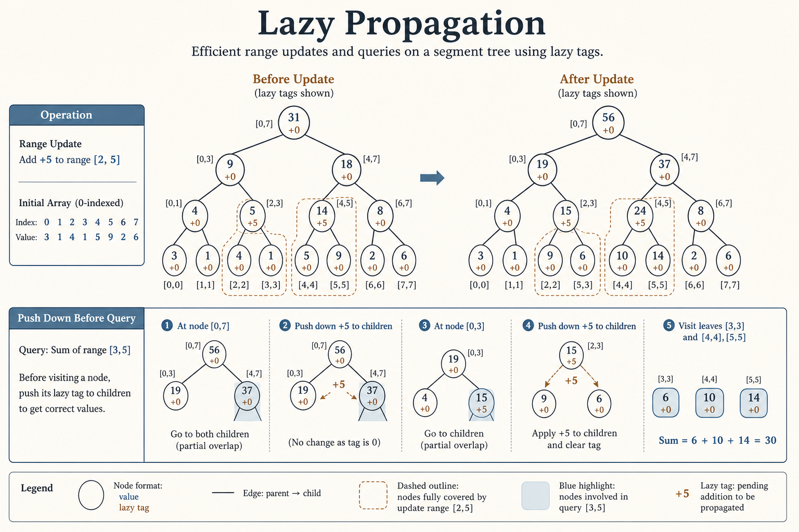
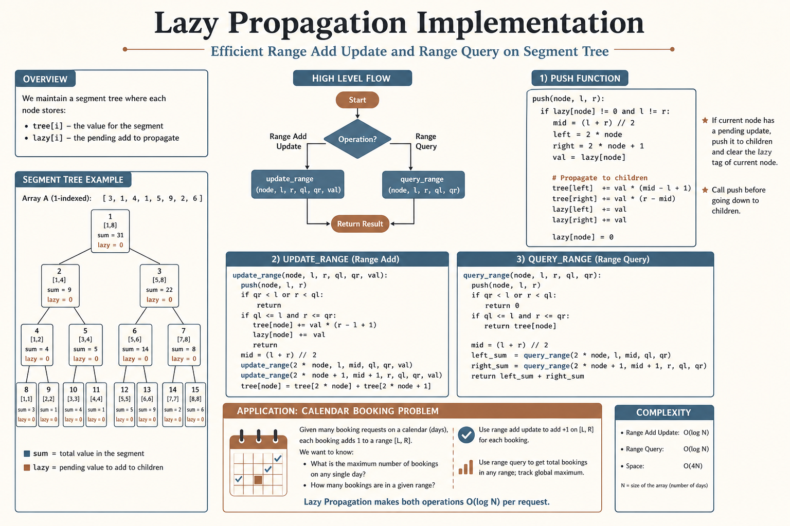

# ⏱️ Lazy Propagation

### *Lazy Propagation*

  
  

---

## 📊 Visual Overview

---

## 🎯 At a Glance

| | |
|:---|:---|
| **Difficulty** | Hard |
| **Problems** | 10 |

> **How to use this page:** Start with the visual overview, scan **At a Glance**, then work through theory → walkthroughs → code.

---

## 🧭 Navigation

| ⬅️ Previous | 📂 Current | ➡️ Next |
|:------------|:----------:|--------:|
| [← Segment Tree Advanced](../README.md) | **01. Lazy Propagation** | [02. 2D Segment Tree →](../02_2d_segment_tree/README.md) |

---

## 📐 Core Concept

**Lazy Propagation:** Defer updates until absolutely necessary.

**Key Idea:** Mark nodes with pending updates, propagate only when querying or further updating.

**Operations:** Both range update and range query in $O(\log n)$.

---

## 💻 Implementation

---

## 📋 Problems

| # | Problem | Difficulty | Technique |
|---|---------|:----------:|-----------|
| 307 | Range Sum Query - Mutable | Medium | Basic lazy |
| 370 | Range Addition | Medium | Range update |
| 732 | My Calendar III | Hard | Lazy counting |
| 715 | Range Module | Hard | Assignment lazy |
| 2569 | Handling Sum Queries | Hard | Flip operation |
| 1622 | Fancy Sequence | Hard | Multiple ops |
| - | Range Assignment | Hard | Set operation |
| - | Range Flip | Hard | Binary toggle |
| - | Range Multiply | Hard | Mult + add |
| - | Sqrt Decomposition | Hard | Block updates |

---
