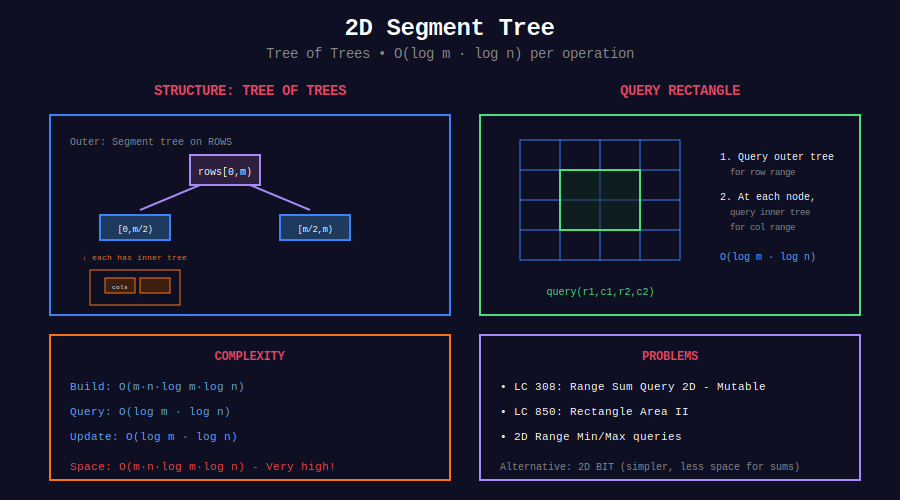

<div align="center">

# 📐 2D Segment Tree

<p>
  
  
</p>

</div>

---

## 🧭 Navigation

| ⬅️ Previous | 📂 Current | ➡️ Next |
|:------------|:----------:|--------:|
| [← 01. Lazy Propagation](../01_lazy_propagation/README.md) | **02. 2D Segment Tree** | [03. Persistent →](../03_persistent_segtree/README.md) |

---

## 📊 Visual Overview

<div align="center">

</div>

---

## 📐 Core Concept

**2D Segment Tree:** Tree of trees for 2D range queries.

**Structure:**

- Outer tree: segments of rows

- Inner trees: segments of columns

**Time:** $O(\log m \cdot \log n)$ per operation

---

## 💻 Implementation

```python
class SegmentTree2D:
    """
    2D Segment Tree for matrix range queries.
    
    Time: O(log m * log n)
    """
    
    def __init__(self, matrix: List[List[int]]):
        self.m = len(matrix)
        self.n = len(matrix[0]) if matrix else 0
        self.tree = [[0] * (4 * self.n) for _ in range(4 * self.m)]
        
        if matrix:
            self._build_x(matrix, 0, 0, self.m - 1)
    
    def _build_y(self, matrix, vx, lx, vy, ly, ry):
        if ly == ry:
            if lx == rx:
                self.tree[vx][vy] = matrix[lx][ly]
            else:
                self.tree[vx][vy] = self.tree[2*vx+1][vy] + self.tree[2*vx+2][vy]
        else:
            my = (ly + ry) // 2
            self._build_y(matrix, vx, lx, 2*vy+1, ly, my)
            self._build_y(matrix, vx, lx, 2*vy+2, my+1, ry)
            self.tree[vx][vy] = self.tree[vx][2*vy+1] + self.tree[vx][2*vy+2]
    
    def _build_x(self, matrix, vx, lx, rx):
        if lx != rx:
            mx = (lx + rx) // 2
            self._build_x(matrix, 2*vx+1, lx, mx)
            self._build_x(matrix, 2*vx+2, mx+1, rx)
        self._build_y(matrix, vx, lx, 0, 0, self.n - 1)
    
    def query(self, x1, y1, x2, y2):
        """Query sum of rectangle."""
        return self._query_x(0, 0, self.m-1, x1, x2, y1, y2)

```

---

## 📋 Problems

| # | Problem | Difficulty |
|---|---------|:----------:|
| 308 | Range Sum Query 2D - Mutable | Hard |
| 850 | Rectangle Area II | Hard |
| - | 2D Range Update | Hard |
| - | Count Points in Rectangle | Hard |
| - | Submatrix Sum Queries | Hard |
| - | 2D Max/Min Query | Hard |

---

## 🧭 Navigation

| ⬅️ Previous | 📂 Current | ➡️ Next |
|:------------|:----------:|--------:|
| [← 01. Lazy Propagation](../01_lazy_propagation/README.md) | **02. 2D Segment Tree** | [03. Persistent →](../03_persistent_segtree/README.md) |

