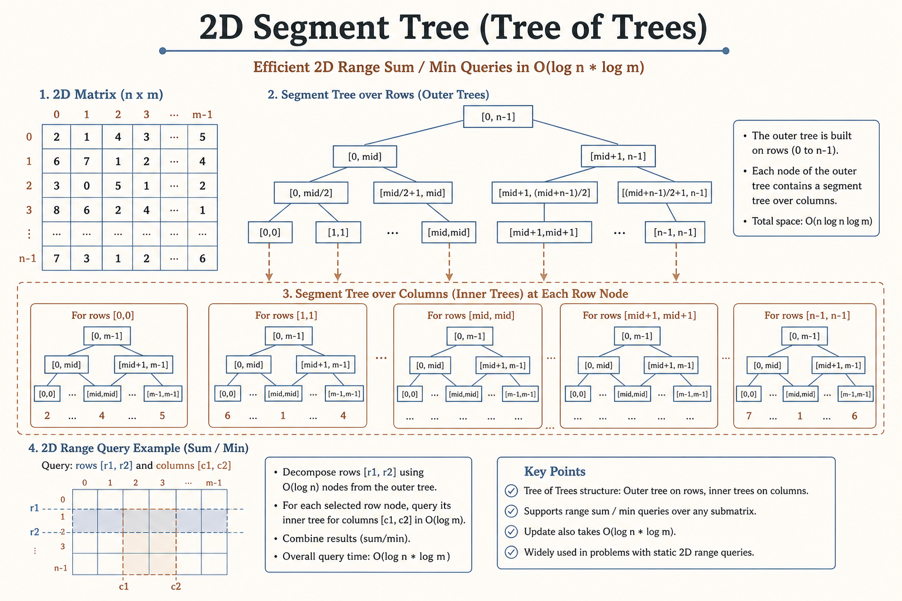
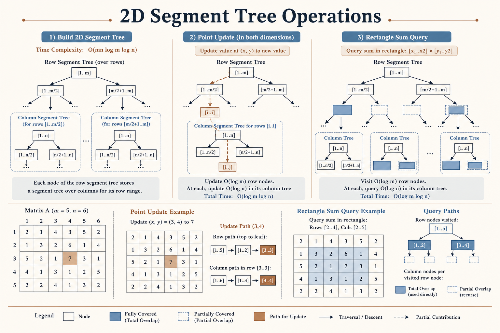

# 📐 2D Segment Tree

### *Segment Tree*

  
  

---

## 📊 Visual Overview

---

## 🎯 At a Glance

| | |
|:---|:---|
| **Difficulty** | Hard |
| **Problems** | 6 |

> **How to use this page:** Start with the visual overview, scan **At a Glance**, then work through theory → walkthroughs → code.

---

## 🧭 Navigation

| ⬅️ Previous | 📂 Current | ➡️ Next |
|:------------|:----------:|--------:|
| [← 01. Lazy Propagation](../01_lazy_propagation/README.md) | **02. 2D Segment Tree** | [03. Persistent →](../03_persistent_segtree/README.md) |

---

## 📐 Core Concept

**2D Segment Tree:** Tree of trees for 2D range queries.

**Structure:**

- Outer tree: segments of rows

- Inner trees: segments of columns

**Time:** $O(\log m \cdot \log n)$ per operation

---

## 💻 Implementation

---

## 📋 Problems

| # | Problem | Difficulty |
|---|---------|:----------:|
| 308 | Range Sum Query 2D - Mutable | Hard |
| 850 | Rectangle Area II | Hard |
| - | 2D Range Update | Hard |
| - | Count Points in Rectangle | Hard |
| - | Submatrix Sum Queries | Hard |
| - | 2D Max/Min Query | Hard |

---
