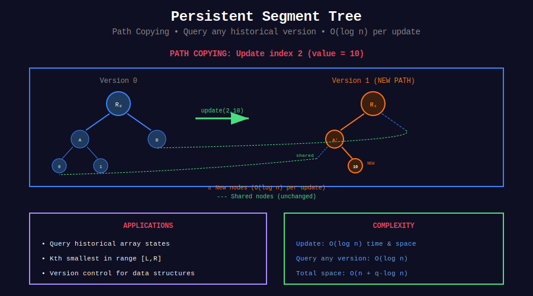

<div align="center">

# 🕰️ Persistent Segment Tree

<p>
  
  
</p>

</div>

---

## 🧭 Navigation

| ⬅️ Previous | 📂 Current | ➡️ Next |
|:------------|:----------:|--------:|
| [← 02. 2D Segment Tree](../02_2d_segment_tree/README.md) | **03. Persistent** | [04. Dynamic →](../04_dynamic_segtree/README.md) |

---

## 📊 Visual Overview

<div align="center">

</div>

---

## 📐 Core Concept

**Persistent Segment Tree:** Maintain all versions of tree.

**Key Idea:** Path copying - only create new nodes for changed paths.

**Space per version:** $O(\log n)$ new nodes

---

## 💻 Implementation

```python
class PersistentSegTreeNode:
    def __init__(self, left=None, right=None, value=0):
        self.left = left
        self.right = right
        self.value = value

class PersistentSegmentTree:
    """
    Persistent Segment Tree for historical queries.
    
    Space: O(q log n) for q updates
    """
    
    def __init__(self, n):
        self.n = n
        self.versions = []
        self.versions.append(self._build(0, n-1))
    
    def _build(self, start, end):
        if start == end:
            return PersistentSegTreeNode(value=0)
        
        mid = (start + end) // 2
        return PersistentSegTreeNode(
            self._build(start, mid),
            self._build(mid+1, end),
            0
        )
    
    def update(self, version, idx, val):
        """Create new version with update."""
        old_root = self.versions[version]
        new_root = self._update(old_root, 0, self.n-1, idx, val)
        self.versions.append(new_root)
        return len(self.versions) - 1
    
    def _update(self, node, start, end, idx, val):
        if start == end:
            return PersistentSegTreeNode(value=val)
        
        mid = (start + end) // 2
        if idx <= mid:
            new_left = self._update(node.left, start, mid, idx, val)
            return PersistentSegTreeNode(new_left, node.right)
        else:
            new_right = self._update(node.right, mid+1, end, idx, val)
            return PersistentSegTreeNode(node.left, new_right)
```

---

## 📋 Problems

| # | Problem | Difficulty |
|---|---------|:----------:|
| 327 | Count of Range Sum | Hard |
| - | Kth Smallest in Range | Hard |
| - | Version Control System | Hard |
| - | Time Travel Queries | Hard |
| - | Range Unique Count | Hard |
| - | Historical Max/Min | Hard |

---

## 🧭 Navigation

| ⬅️ Previous | 📂 Current | ➡️ Next |
|:------------|:----------:|--------:|
| [← 02. 2D Segment Tree](../02_2d_segment_tree/README.md) | **03. Persistent** | [04. Dynamic →](../04_dynamic_segtree/README.md) |

