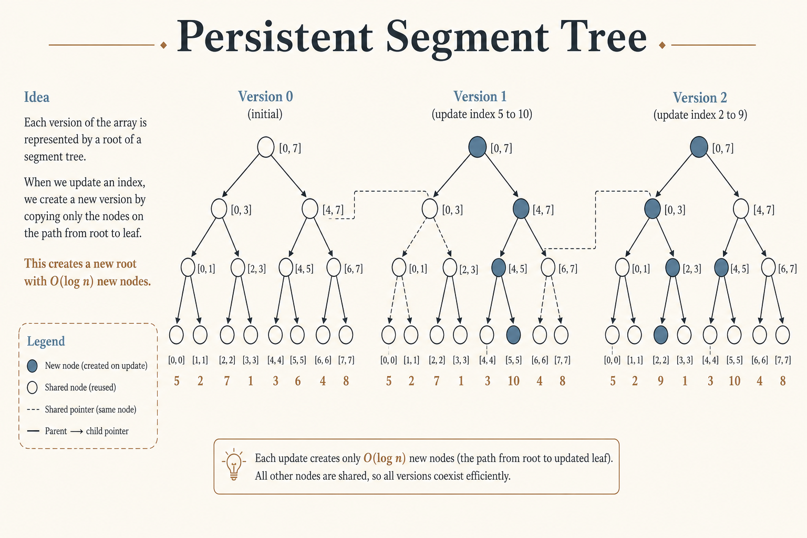
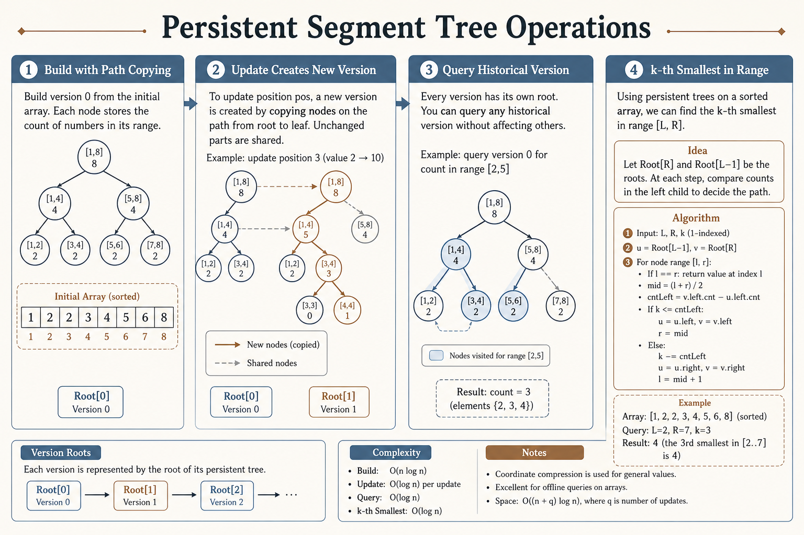

# 🕰️ Persistent Segment Tree

### *Persistent Segment Tree*

  
  

---

## 📊 Visual Overview

---

## 🎯 At a Glance

| | |
|:---|:---|
| **Difficulty** | Hard |
| **Problems** | 6 |

{: .highlight }
> **How to use this page:** Start with the visual overview, scan **At a Glance**, then work through theory → walkthroughs → code.

---

## 🧭 Navigation

| ⬅️ Previous | 📂 Current | ➡️ Next |
|:------------|:----------:|--------:|
| [← 02. 2D Segment Tree](../02_2d_segment_tree/README.md) | **03. Persistent** | [04. Dynamic →](../04_dynamic_segtree/README.md) |

---

## 📐 Core Concept

**Persistent Segment Tree:** Maintain all versions of tree.

**Key Idea:** Path copying - only create new nodes for changed paths.

**Space per version:** $O(\log n)$ new nodes

---

## 💻 Implementation

---

## 📋 Problems

| # | Problem | Difficulty |
|---|---------|:----------:|
| 327 | Count of Range Sum | Hard |
| - | Kth Smallest in Range | Hard |
| - | Version Control System | Hard |
| - | Time Travel Queries | Hard |
| - | Range Unique Count | Hard |
| - | Historical Max/Min | Hard |

---
