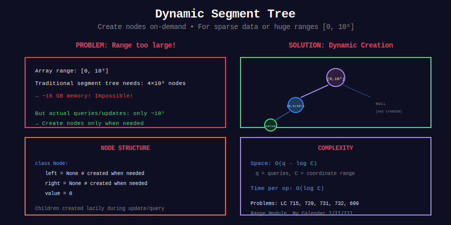

<div align="center">

# 🌟 Dynamic Segment Tree

<p>
  
  
</p>

</div>

---

## 🧭 Navigation

| ⬅️ Previous | 📂 Current | ➡️ Next |
|:------------|:----------:|--------:|
| [← 03. Persistent](../03_persistent_segtree/README.md) | **04. Dynamic** | [05. Range Queries →](../05_range_queries/README.md) |

---

## 📊 Visual Overview

<div align="center">

</div>

---

## 📐 Core Concept

**Dynamic Segment Tree:** Create nodes on-demand for sparse data.

**Use case:** Coordinate range up to $10^9$ but few actual values.

**Space:** $O(q \log C)$ where $q$ = operations, $C$ = coordinate range

---

## 💻 Implementation

```python
class DynamicSegTreeNode:
    def __init__(self):
        self.left = None
        self.right = None
        self.value = 0

class DynamicSegmentTree:
    """
    Dynamic (Sparse) Segment Tree.
    
    Space: O(q log C) for q operations
    """
    
    def __init__(self, min_val=0, max_val=10**9):
        self.root = DynamicSegTreeNode()
        self.min_val = min_val
        self.max_val = max_val
    
    def update(self, idx, val):
        self._update(self.root, self.min_val, self.max_val, idx, val)
    
    def _update(self, node, start, end, idx, val):
        if start == end:
            node.value += val
            return
        
        mid = (start + end) // 2
        if idx <= mid:
            if not node.left:
                node.left = DynamicSegTreeNode()
            self._update(node.left, start, mid, idx, val)
        else:
            if not node.right:
                node.right = DynamicSegTreeNode()
            self._update(node.right, mid+1, end, idx, val)
        
        left_val = node.left.value if node.left else 0
        right_val = node.right.value if node.right else 0
        node.value = left_val + right_val
```

---

## 📋 Problems

| # | Problem | Difficulty |
|---|---------|:----------:|
| 715 | Range Module | Hard |
| 729 | My Calendar I | Medium |
| 731 | My Calendar II | Medium |
| 732 | My Calendar III | Hard |
| 699 | Falling Squares | Hard |
| - | Large Coordinate Range | Hard |
| - | Sparse Updates | Hard |
| - | Coordinate Compression | Hard |

---

## 🧭 Navigation

| ⬅️ Previous | 📂 Current | ➡️ Next |
|:------------|:----------:|--------:|
| [← 03. Persistent](../03_persistent_segtree/README.md) | **04. Dynamic** | [05. Range Queries →](../05_range_queries/README.md) |

