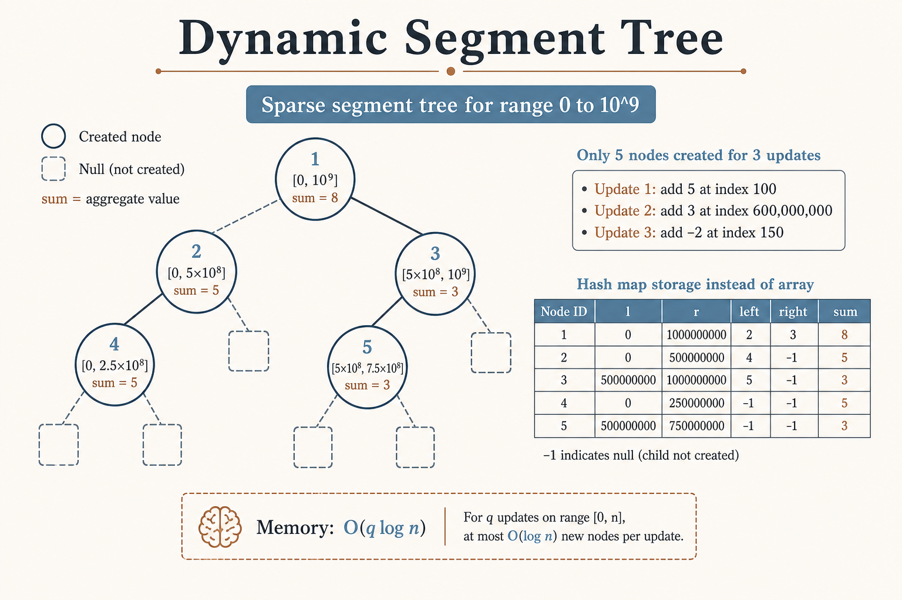
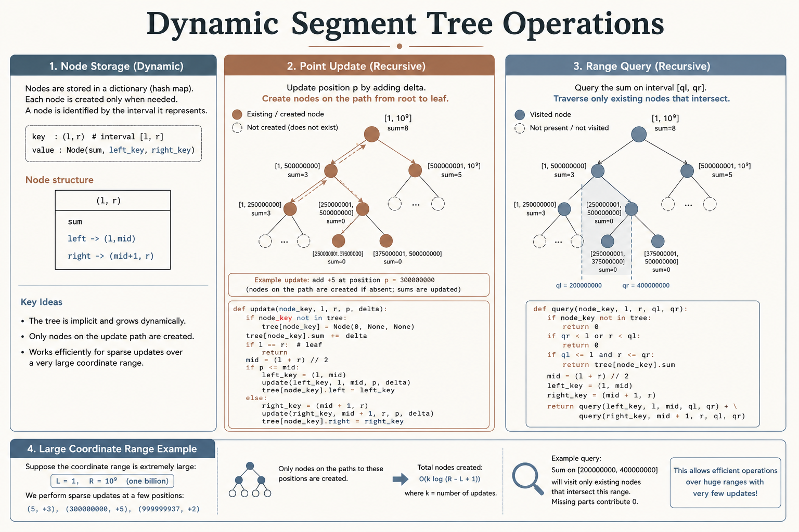

# 🌟 Dynamic Segment Tree

### *Dynamic Segment Tree*

  
  

---

## 📊 Visual Overview

---

## 🎯 At a Glance

| | |
|:---|:---|
| **Difficulty** | Hard |
| **Problems** | 8 |

> **How to use this page:** Start with the visual overview, scan **At a Glance**, then work through theory → walkthroughs → code.

---

## 🧭 Navigation

| ⬅️ Previous | 📂 Current | ➡️ Next |
|:------------|:----------:|--------:|
| [← 03. Persistent](../03_persistent_segtree/README.md) | **04. Dynamic** | [05. Range Queries →](../05_range_queries/README.md) |

---

## 📐 Core Concept

**Dynamic Segment Tree:** Create nodes on-demand for sparse data.

**Use case:** Coordinate range up to $10^9$ but few actual values.

**Space:** $O(q \log C)$ where $q$ = operations, $C$ = coordinate range

---

## 💻 Implementation

---

## 📋 Problems

| # | Problem | Difficulty |
|---|---------|:----------:|
| 715 | Range Module | Hard |
| 729 | My Calendar I | Medium |
| 731 | My Calendar II | Medium |
| 732 | My Calendar III | Hard |
| 699 | Falling Squares | Hard |
| - | Large Coordinate Range | Hard |
| - | Sparse Updates | Hard |
| - | Coordinate Compression | Hard |

---
